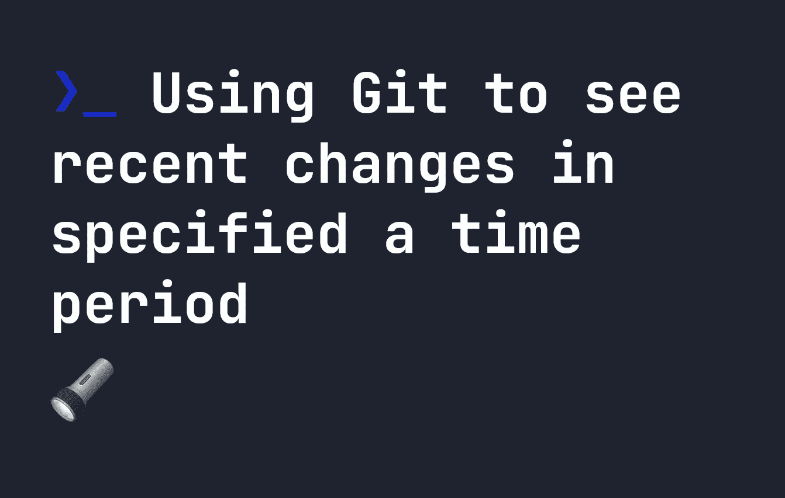

# 使用 Git 查看指定时间段内的最新变化

> 原文：<https://levelup.gitconnected.com/using-git-to-see-recent-changes-in-specified-a-time-period-5bd918aeac17>



你有没有经历过长假，想要查看你的团队从两周前开始的更新？或者甚至可能就在上周。当然，您可以通过 PRs 进行搜索，但可能有更简单的解决方案。Git 已经内置了检查这一点的功能。

如果您想查看最近两周的变化，您可以使用`git log`。例如，要查看存储库最近两周的更改，请在终端中运行以下命令:

```
git log --since='2 weeks ago'
```

类似地，如果您只想查看一周的变化，您应该写:

```
git log --since='2 weeks ago'
```

`--since`变量的日期可以像`2 weeks ago`、`1 year ago`、`2 months ago`或`5 days ago`一样给出——所以你有很大的灵活性来显示变化。也可以使用 ISO 时间戳，比如`2022-03-03T14:32:12-01:00`

**注意**:你也可以使用`git whatchanged`，它做的事情和`git log`完全一样，但是因为历史原因被保留了下来。`git whatchanged`和`git log`的唯一区别是`git whatchanged`默认显示一个变更中的所有文件。

建议使用`git log`来代替，因为仍然可以通过输入`git log --since='2 weeks ago' --stat`来显示使用该命令的所有文件

# 其他 git 日志选项

除了能够给你一个简单的界面来查看更改之外，`git log`还有一些有用的特性，可以给你收到的日志添加更多的信息。以下是我最喜欢的一些:

*   `--max-count`或`-n`——限制 git 提交的最大数量——可以像`git log --since='2 weeks ago' --max-count=5`一样使用
*   `--author`或`--committer` -显示特定作者的提交，即`git log --since='2 weeks ago' --author="joe"`
*   `--merges`或`--no-merges` -要么只显示合并，要么隐藏所有合并。
*   `--grep` -通过日志项目限制日志，因此`git log --since='2 weeks ago' --grep="feat-ui"`将只显示‘feat-ui’的变化。
*   `--stat` -列出特定变更中的所有文件。
*   `-p` -逐文件显示文件变化。