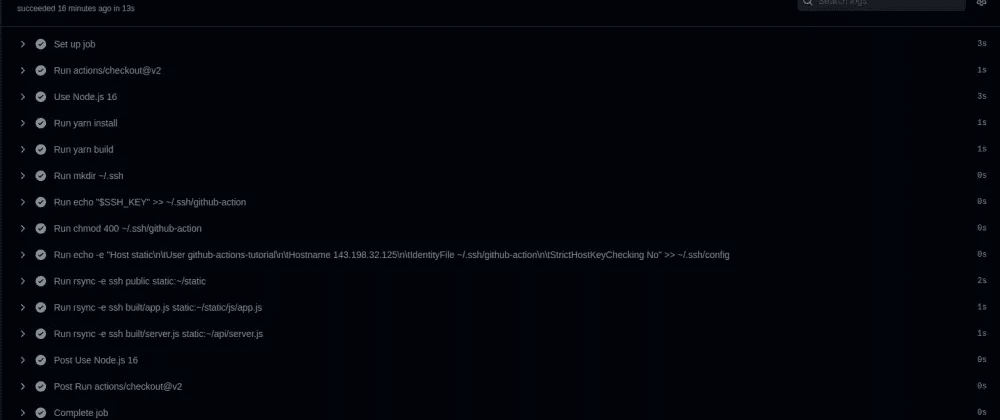

# 使用 Github 操作在 15 秒内通过 SSH 部署 React 应用程序和 Express API

> 原文：<https://levelup.gitconnected.com/using-github-actions-to-deploy-a-react-app-and-express-api-over-ssh-in-15-seconds-6c7d9fb6bca3>



15 秒内 0-100 英里/小时

# 动机

我一直在寻求改进我正在从事的几个项目的部署过程，并开始朝着我喜欢的部署方法进行构建。

我最大的要求是**简单**和**速度**。我过去使用过 [Docker](https://www.docker.com/) 、 [Kubernetes](https://kubernetes.io/) 、 [Docker Swarm](https://docs.docker.com/engine/swarm/) 以及其他各种部署方法。我认识到这些工具有它们的优点，但是我发现对于中小型项目来说，它们比它们值得维护的工作量要大。

一天结束时，我需要做的就是构建代码，并将构建的文件复制到服务器。在开始这个项目之前，我告诉自己要在一分钟之内完成，但是我很高兴地告诉大家，Github Actions 的启动速度比 Travis CI 快得多，部署 React 前端和 express.js 后端只需要 **15 秒。**

我已经提供了如何重新创建整个项目的完整说明，但是如果你只是对工作流部分感兴趣，请跳到[我的工作流](https://devtails.xyz/using-github-actions-to-deploy-a-react-app-and-express-api-over-ssh-in-15-seconds#my-workflow)部分。

# 创建一个简单的应用程序来演示

在我演示工作流之前，我们需要部署一些东西。下面是如何构建简单应用程序的说明。你们中的大多数人可能已经习惯了由 [Create React App](https://reactjs.org/docs/create-a-new-react-app.html) 提供的模板，但是在这里，我提供了一些关于如何构建应用程序的自以为是的备选方案。同样的原则应该可以转移到任何现有的设置。

# 创建基本的 React 应用程序

```
mkdir github-actions-tutorial
cd github-actions-tutorial
yarn init
yarn add react react-dom
yarn add --dev [@types/react](http://twitter.com/types/react) [@types/react-dom](http://twitter.com/types/react-dom)
mkdir -p client/src
```

## 创建 index.tsx

```
// client/src/index.tsx
import React from "react";
import ReactDom from "react-dom";
import { App } from "./App";ReactDom.render(<App />, document.getElementById("root"));
```

## 创建 App.tsx

```
// client/src/App.tsx
import React, { useEffect, useState } from "react";export const App: React.FC = () => {
  return (
    <>
      <div>Hello Github Actions!</div>
    </>
  );
};
```

# 使用 esbuild 构建 React 应用程序

现在我们有了一个简单的 React 应用程序，我们将使用 [esbuild](https://esbuild.github.io/) 输出一个缩小的生产版本。

## 安装 esbuild

```
yarn add --dev esbuild
```

## 将客户端:构建脚本添加到 package.json

```
// package.json
{
  "name": "github-actions-tutorial",
  "version": "1.0.0",
  "main": "index.js",
  "repository": "[git@github.com](mailto:git@github.com):adamjberg/github-actions-tutorial.git",
  "author": "Adam Berg <[adam@xyzdigital.com](mailto:adam@xyzdigital.com)>",
  "license": "MIT",
  "scripts": {
    "client:build": "esbuild client/src/index.tsx --bundle --minify --outfile=built/app.js",
  },
  "dependencies": {
    "react": "^17.0.2",
    "react-dom": "^17.0.2"
  },
  "devDependencies": {
    "[@types/react](http://twitter.com/types/react)": "^17.0.37",
    "[@types/react-dom](http://twitter.com/types/react-dom)": "^17.0.11",
    "esbuild": "^0.14.1"
  }
}
```

您可以通过运行`yarn client:build`来测试这是否正常工作，您应该会在文件夹树中看到一个带有缩小输出的`built/app.js`文件。

你可能也习惯有一个`yarn start`脚本，但是为了本教程的目的，我们将跳过它，直接在“产品”中测试。

## 创建`public/index.html`

```
<html><head>
  <script src="/js/app.js" defer async></script>
</head><body>
  <div id="root"></div>
</body></html>
```

当客户端点击`http://github-actions-tutorial.devtails.xyz` URL 时，这个文件将由 nginx 静态文件服务器提供服务。

# 准备服务器

我假设读者对如何注册域名和在某个托管平台上创建服务器有所了解。我已经有了一个名为[的域名`devtails.xyz`和一个名为](https://namecheap.pxf.io/GjgG5V)的[数字海洋](https://m.do.co/c/4d01489e4069)的域名。

在下面的例子中，我已经将`github-actions-tutorial.devtails.xyz`映射到我的数字海洋 IP: `143.198.32.125`

只要您能够 ssh 到您的服务器，不管您的主机平台如何，以下说明就足够了。

## SSH 进入服务器

```
ssh root@143.198.32.125
```

## 创建 github-操作-教程用户

```
useradd -s /bin/bash -d /home/github-actions-tutorial -m github-actions-tutorial
```

为了防止我们的 Github 操作获得对我们服务器的 root 访问权限，我们将创建一个名为`github-actions-tutorial`的子用户

## 安装 nginx

```
apt-get install nginx
```

## 创建虚拟主机文件

```
# /etc/nginx/sites-available
server {
  listen 80;
  server_name github-actions-tutorial.devtails.xyz;location / {
    root /home/github-actions-tutorial/static;
  }
}
```

这告诉 nginx 将对`github-actions-tutorial.devtails.xyz`子域的请求路由到我们的`github-actions-tutorial`用户下的`static`文件夹。

## 在`github-actions-tutorial`用户上创建`static`文件夹

```
su github-actions-tutorial
mkdir static
```

这允许我们避免让 Github 操作 ssh 进入服务器来创建这个文件夹。该文件夹将存放`js/app.js`和`index.html`。之前设置的虚拟主机文件告诉 nginx 提供来自`static`文件夹的文件。

# 创建基本的 Express REST API

## 安装快速

```
yarn add express
yarn add [@types/express](http://twitter.com/types/express)
```

## 创建`server/src/server.tsx`

```
// server/src/server.tsx
import express from "express";const app = express();app.get("/api/message", (_, res) => {
  return res.json({
    data: "Hello from the server!",
  });
});app.listen(8080);
```

这创建了一个带有单个`/api/message`路由的基本 REST API，我们将使用它来证明它正在正确运行。

## 向 package.json 添加服务器:构建脚本

```
"server:build": "esbuild server/src/server.ts --bundle --minify --outfile=built/server.js --platform=node"
```

我们将重用 esbuild 包来为我们的服务器代码构建一个包。有关这种方法的更多详情，请参见[这篇文章](https://devtails.xyz/bundling-your-node-js-express-app-with-esbuild)。

将它添加到`client:build`脚本的正下方。然后您可以使用`yarn server:build`运行它以确认工作正常。它应该输出一个捆绑文件到`built/server.js`。

## 添加运行客户端和服务器构建的构建脚本

```
"build": "yarn client:build && yarn server:build"
```

# 准备运行 API 的服务器

为了让我们的服务器做好部署准备，需要应用一些一次性配置。

## 切换到 github-动作-教程用户

```
su github-actions-tutorial
```

## 安装 NVM

```
curl -o- [https://raw.githubusercontent.com/nvm-sh/nvm/v0.39.0/install.sh](https://raw.githubusercontent.com/nvm-sh/nvm/v0.39.0/install.sh) | bash
```

## 安装节点

```
nvm install 16
```

## 安装 [pm2](https://pm2.keymetrics.io/)

```
npm i -g pm2
```

## 更新虚拟主机文件以路由到 API

再次 ssh 到`root`用户并更新`/etc/nginx/sites-available/github-actions-tutorial.devtails.xyz`文件

```
# /etc/nginx/sites-available/github-actions-tutorial.devtails.xyz
upstream github-actions-tutorial-api {
  server localhost:8080;
}server {
  listen 80;
  server_name github-actions-tutorial.devtails.xyz;location /api {
    proxy_pass [http://localhost:8080](http://localhost:8080);
  }location / {
    root /home/github-actions-tutorial/static;
  }
}
```

这告诉 nginx 将任何以`/api`开头的 URL 路由到我们添加的 express 应用程序。

## 启动 pm2 流程

在最后一步`- run: ssh github-actions-tutorial "pm2 reload all"`可以运行之前，您必须首先用 pm2 手动启动您的服务器。

在第一次运行 Github 动作后，它应该已经将构建好的`server.js`文件复制到了`~/api/server.js`。然后，您可以使用`pm2 start api/server.js`开始这个过程。

现在它正在运行，`pm2 reload all`命令将重新加载这个服务器进程，这样它就可以获取服务器代码中的更改。

# 我的工作流程

唷，所有的设置都完成了，我们现在可以看看我们的`Deploy`工作流做了什么。

下面我将一节一节地分解它

# 定义工作流名称和触发器

```
name: Deployon:
  push:
    branches: [ main ]
```

这将创建一个名为“Deploy”的工作流，每当对`main`分支进行推送时都会运行该工作流。

# 定义构建和部署作业

```
jobs:
  build-and-deploy:
    runs-on: ubuntu-latest
```

这创建了一个名为`build-and-deploy`的作业，它将运行最新的 ubuntu 发行版。

```
env:
  SSH_KEY: ${{secrets.SSH_KEY}}
```

这给环境增加了一个 Github 秘密。我们将在后面的步骤中使用它来允许我们与指定的服务器进行同步。

```
steps:
  - uses: actions/checkout@v2
```

这将检查当前提交的代码。

```
- name: Use Node.js 16
  uses: actions/setup-node@v2
  with:
    node-version: 16
    cache: 'yarn'
```

这将安装节点 16，并指定工作流应该为 yarn 缓存文件。这个缓存确保了如果没有添加或删除包，`yarn install`不必做任何事情。这节省了大量时间。

```
- run: yarn install
- run: yarn build
```

这些行运行安装和构建，最终输出我们想要部署的所有文件。

```
- run: mkdir ~/.ssh
- run: 'echo "$SSH_KEY" >> ~/.ssh/github-action'
- run: chmod 400 ~/.ssh/github-action
- run: echo -e "Host static\n\tUser github-actions-tutorial\n\tHostname 143.198.32.125\n\tIdentityFile ~/.ssh/github-action\n\tStrictHostKeyChecking No" >> ~/.ssh/config
```

这是最复杂的部分。这里发生的事情是我们正在将`SSH_KEY`秘密添加到`~/.ssh/github-action`文件中。最后一行创建一个类似如下的`~/.ssh/config`文件:

```
Host static
  User github-actions-tutorial
  IdentityFile ~/.ssh/github-action
  StrictHostKeyChecking No
```

设置完成后，rsync 命令看起来非常简单:

```
- run: rsync -e ssh public static:~/static
- run: rsync -e ssh built/app.js static:~/static/js/app.js
- run: rsync -e ssh built/server.js static:~/api/server.js
```

`-e ssh`指定在 ssh 上使用 rsync。我们从`public`文件夹中复制所有文件。然后我们将`built/app.js`复制到`~/static/js/app.js`。最后我们将`built/server.js`复制到`~/api/server.js`。

```
- run: ssh github-actions-tutorial "pm2 reload all"
```

最后一行代码使用 pm2(我们之前安装的)来重新加载服务器进程。

# 结论

虽然我可以通过在我的本地机器上运行它来获得更快的部署，但是让它作为 Github 动作运行为我的开源项目提供了很大的好处。为了部署贡献者的更改，我可以简单地将他们的拉请求合并到主分支中，而不必将直接的服务器访问权交给其他任何人。

还有很多可以整理或改进的地方，但是本着黑客马拉松的精神，我现在称之为“完成”。我现在有了一个基线，我预计使用 Github Actions 构建和部署一个应用程序需要多长时间。

## 工作流 Yaml 文件

```
name: Deployon:
  push:
    branches: [ main ]jobs:
  build-and-deploy:runs-on: ubuntu-latestenv:
      SSH_KEY: ${{secrets.SSH_KEY}}steps:
    - uses: actions/checkout@v2
    - name: Use Node.js 16
      uses: actions/setup-node@v2
      with:
        node-version: 16
        cache: 'yarn'
    - run: yarn install
    - run: yarn build
    - run: mkdir ~/.ssh
    - run: 'echo "$SSH_KEY" >> ~/.ssh/github-action'
    - run: chmod 400 ~/.ssh/github-action
    - run: echo -e "Host github-actions-tutorial\n\tUser github-actions-tutorial\n\tHostname 143.198.32.125\n\tIdentityFile ~/.ssh/github-action\n\tStrictHostKeyChecking No" >> ~/.ssh/config
    - run: rsync -e ssh public github-actions-tutorial:~/static
    - run: rsync -e ssh built/app.js github-actions-tutorial:~/static/js/app.js
    - run: rsync -e ssh built/server.js github-actions-tutorial:~/api/server.js
    - run: ssh github-actions-tutorial "pm2 reload all"
```

# 其他资源/信息

本教程的完整代码可以在 [Github](https://github.com/adamjberg/github-actions-tutorial) 上找到

engram 是一个开源项目，在那里我第一次原型化了这种风格的部署。目前部署需要 3-4 分钟，这就是为什么我将切换到更接近这里提供的工作流。

*最初发布于 2021 年 12 月 7 日*[*https://devtails . XYZ*](https://devtails.xyz/using-github-actions-to-deploy-a-react-app-and-express-api-over-ssh-in-15-seconds)*。*