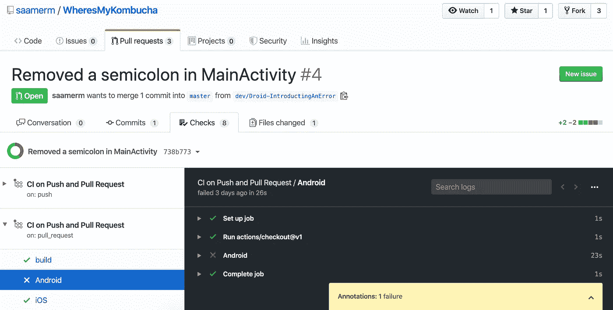
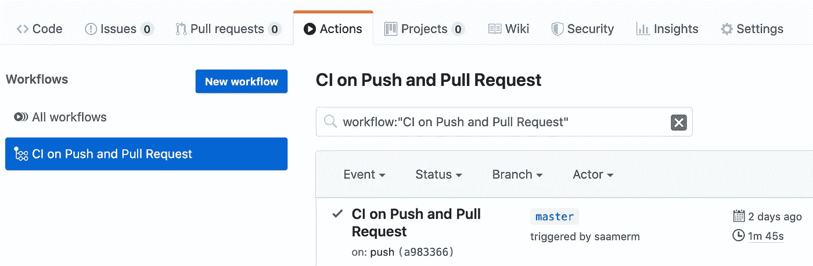
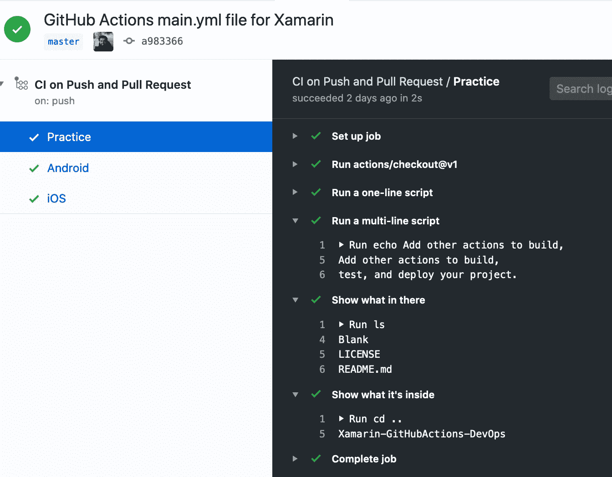
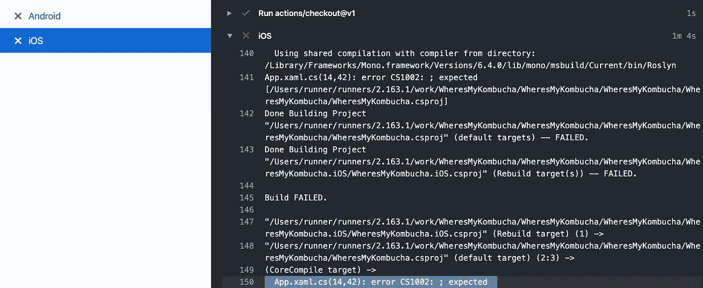

# 在 iOS 和 Android Xamarin 应用程序中使用 GitHub 操作

> 原文：<https://levelup.gitconnected.com/using-github-actions-with-ios-and-android-xamarin-apps-693a93b48a61>

## 使用 DEVOPS 自动化您的工作流程

## 从为每个推送或合并请求创建自动化构建开始

[DevOps](https://theagileadmin.com/what-is-devops/) 是每个软件架构师的必备之物，GitHub 的 CI/CD`[Actions](https://github.com/features/actions)`只是让每个人都能访问 DevOps 的又一步。自从我有机会看到 CI/CD 对移动团队效率的巨大影响，我就知道它对每个团队项目来说都是显而易见的！

## 介绍

本文将教你如何最简单地使用 GitHub 操作:运行 GitHub 操作来对你的应用程序进行健全性测试——确保 iOS 和 Android 应用程序在每次提交或合并请求时构建，确保提交中没有引入会破坏构建的错误。

MainActivity 中缺少分号的合并请求无法通过 Android 检查

***第一个原型*** *是一家新兴的移动 App 设计开发咨询小企业，专注于 Xamarin 表单和原生 App。在* [*我们的网站*](https://thefirstprototype.com/mobile-app-development-detroit-ios-android.html) *，和* [*支持*](http://twitter.com/prototypemakers) *我们在* [*社交媒体*](http://instagram.com/prototypemakers) *上报名，在*[*iOS*](https://apps.apple.com/app/numberbomb/id1560372045)*&*[*Android*](https://play.google.com/store/apps/details?id=com.tfp.numberbomb)上了解我们精彩的新数字炸弹游戏

## 你需要什么

你需要 Github 上 [a 库](https://github.com/saamerm/Xamarin-GitHubActions-DevOps)中的任何 Xamarin 解决方案。对，可以是 Xamarin。原生或 Xamarin。表单，存储库可以是公共的，也可以是私有的。你不需要 Jenkins、Azure DevOps、CircleCI、Bit-rise 或任何其他听起来花哨的东西，因为 GitHub Actions [拥有你需要的一切](https://help.github.com/en/actions/automating-your-workflow-with-github-actions/software-installed-on-github-hosted-runners)。

## 这有多简单？

你花的时间不会超过 60 秒:

1.  转到存储库的主文件夹，点击`Create new file`按钮
2.  将文件命名为`.github/workflows/main.yml`并添加这个[代码片段](https://github.com/saamerm/Xamarin-GitHubActions-DevOps/blob/master/.github/workflows/main.yml)
3.  将`Blank`替换为您正在使用的名称，然后点击`Commit new file`

main.yml 文件的内容

提交文件后，您的操作应该立即开始。

如果您拥有那个存储库，您只能看到`Actions`选项卡，但是如果回购是公开的，您可以在`Pull requests`中看到`[Checks](https://github.com/saamerm/WheresMyKombucha/pull/4/checks)`选项卡。

## 这里发生了什么事？

名为“推和拉请求上的 CI”的操作/工作流在每个推和合并请求上运行，由 3 个作业组成。`Practice`作业不是必需的，它包含多个步骤，其输出日志将帮助您理解和创建令人惊叹的工作流。

“练习”作业的输出日志

另外两个作业首先`cd`(更改目录)到有解决方案的文件夹，然后恢复所有的 nuget 包。然后，它执行“全部重建”,只有在所有依赖项目都已构建的情况下，该操作才会通过。所以，如果共享的项目(核心/表单)被破坏，两个 iOS 系统的检查都将失败。

失败作业的日志可以方便地指出修复方法

为了测试它，我成功地创建了多个合并请求来添加自动化的工作流，包括[这个](https://github.com/davidortinau/TheLittleThingsPlayground/pull/20)。

## 特别感谢

我花了几个月的时间试图让 GitHub Actions 与 Xamarin 一起工作，直到我放弃，告诉自己葡萄是酸的，我只是太雄心勃勃了。但是，唉，我想通了！在这次旅程中，我接触到了并从中获得了灵感:

*   [马丁·伍德沃德](https://twitter.com/martinwoodward/)的[圣诞树行动](https://twitter.com/martinwoodward/status/1206983885608886280) —他的行动将他家中的物联网与他回购上的“星星”按钮联系起来
*   Frank A. Krueger 的 [FuGet Gallery 动作](https://github.com/praeclarum/FuGetGallery/actions?query=workflow%3ABuild)——每当有人创建一个合并请求时，他的动作都会运行一个健全性测试
*   [爱德华·托马斯](https://twitter.com/ethomson)的 [GitHub 行动日](https://edwardthomson.com/blog/github_actions_1_cicd_triggers.html)
*   [丹尼尔·考瑟](https://twitter.com/danielcauser)的[构建一次到处发布](https://causerexception.com/2019/11/03/build-once-release-everywhere-apk/)

请在评论里或者 [@saamerm](http://twitter.com/saamerm) 告诉我你的想法和你的构建。也请给[加点爱，这个 Xamarin 用一些喜欢形成增强请求](https://t.co/WB3b7kjntU?amp=1)。

如果你是一个更注重视觉的人，这里有一个快速视频教程:

演练设置构件的整个过程