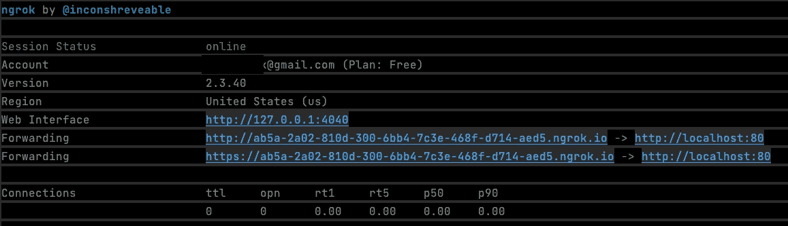
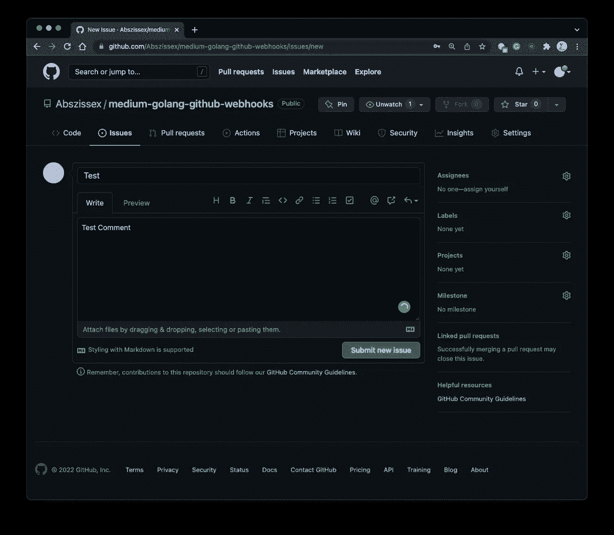

# 使用 Golang 监听和解析 GitHub Webhooks

> 原文：<https://levelup.gitconnected.com/using-golang-to-listen-to-and-parsing-github-webhooks-1e072686b55f>

设置本地 Golang web 服务器和响应 GitHub webhooks 的分步指南。


Andrey Metelev 在 [Unsplash](https://unsplash.com/) 上拍摄的照片

## 要求

*   [Go 安装完毕](https://go.dev/dl/)
*   [ngrok 已安装](/exposing-your-local-web-server-to-the-public-internet-using-ngrok-85f32652a87b)(或类似的东西)
*   GitHub 帐户和演示库(可以是私有的或公共的)

## 你将学到什么

*   在存储库中创建 GitHub webhooks
*   创建一个小型本地 Go web 服务器，监听 GitHub 事件并解析它们
*   使您的本地 web 服务器对公共 internet 可用
*   将 webhooks 从 GitHub 发送到您的本地 web 服务器

像往常一样，我准备了一个 [GitHub 库](https://github.com/Abszissex/medium-golang-github-webhooks)供您查看完成的代码库，并遵循本文中描述的步骤。

[](https://github.com/Abszissex/medium-golang-github-webhooks) [## GitHub-abszisex/medium-golang-GitHub-web hooks

### 此时您不能执行该操作。您已使用另一个标签页或窗口登录。您已在另一个选项卡中注销，或者…

github.com](https://github.com/Abszissex/medium-golang-github-webhooks) 

## 设置

源代码方面，我们的设置只包含三个文件。

```
|- go.mod
|- go.sum
|- main.go
```

*   包含我们想要包含的必要 Go 模块的版本和名称
*   `go.sum`，这将在安装我们的 Go 模块并确保安装了正确的版本时自动生成。
*   `main.go`，我们实际的商业逻辑。

**必需模块(go.mod)**

对于我们的演示，我们需要安装以下 Go 模块。

*   [github.com/go-playground/webhooks/v6](https://github.com/go-playground/webhooks/)→用于将 GitHub webhook 事件解析成 Go 结构的强大助手库
*   [github.com/gofiber/fiber](github.com/gofiber/fiber/)→网络服务器框架
*   github.com/valyala/fasthttp→一个 HTTP 模块，也包含一个助手类，用于将`fasthttp`请求转换为`http`请求

**业务逻辑(main.go)**

在下面的代码片段中，您可以看到`main.go`文件的内容，我们将逐步介绍。为了更好地理解代码和解释它做什么，我在代码中添加了大的注释部分，而不是在代码片段之外解释它。出于可读性的原因，所以你可以直接从上到下阅读，我没有使用任何我通常推荐用于生产就绪代码的专用函数。

为了验证应用程序是否按预期启动，让我们通过`go run main.go`来启动它。


但是当然，我们运行在`localhost:3000`上的本地服务器还不能用于 GitHub webhooks，因为它不能从公共互联网上访问。

为了使服务器对公共互联网可用，这样 GitHub webhooks 就可以到达，请参考我的另一篇文章 [**使用 ngrok**](/exposing-your-local-web-server-to-the-public-internet-using-ngrok-85f32652a87b) 解释这一点。

[](/exposing-your-local-web-server-to-the-public-internet-using-ngrok-85f32652a87b) [## 使用 ngrok 向公共互联网公开您的本地 Web 服务器

### 关于如何使用 ngrok 将本地运行的 web 服务器暴露给公共互联网的简短介绍。

levelup.gitconnected.com](/exposing-your-local-web-server-to-the-public-internet-using-ngrok-85f32652a87b) 

如果您已经在使用 ngrok 或其他工具来公开您的本地服务器，那么您可以继续。

如果您已经使用了 ngrok，您可以通过运行`ngrok http localhost:3000`使您的服务器公开可用，这样 ngrok 将为您生成一个随机域，它会将所有对它的请求转发到您的本地服务器。

您的终端应该如下图所示:



终端中显示的[https://xxxxxxx . ngrok . io](https://xxxxxxx.ngrok.io)域是您的特定域，我们将在本教程中将其用作 GitHub webhooks 目标。

**创建 GitHub webhook**

现在服务器正在运行，是时候创建和测试 webhoook 了。

要这样做，进入你的库的**设置→ Webhooks** 部分，如下图所示，点击“添加 webhook”按钮。


在“添加 webhook”部分，我们使用自动生成的 ngrok 域的 HTTPS 版本。获得正确的 URL 路径非常重要。在上面的例子中，服务正在侦听路由`/webhook`上的 POST 请求，因此有效负载 URL 应该是[https://xxxxxx.ngrok.io/webhook](https://xxxxxx.ngrok.io/webhook)。

在下图中，我们还将内容类型设置为`application/json`并添加了一个秘密`my_secret`。我总是鼓励使用一个秘密，这样不是每个人都能够调用你的服务的 webhook 端点，但是你有适当的验证。此外，我们不会监听所有事件，但是我强烈建议只选择您真正想要监听的事件，以防止服务器上不必要的负载。因此，让我们选择“让我选择单个事件”，如下所示。


在本演示中，我们只对“问题评论”事件感兴趣。这样，如果有人对某个问题发表评论，我们的服务器就会得到通知。根据您的用例，您当然可以使用任何其他事件。


创建 webhook 后，GitHub 会自动向定义的 URL 发送一个 ping 事件。但是 GitHub 只在创建时这样做一次，而不是在你对 webhook 做任何改变的时候。

正如你在下图中看到的，服务器收到了一个 webhook，但是因为它不是被定义为`hook.parse(...)`的事件之一，所以打印了一个错误。


然而，在 GitHub 资源库的“Webhooks”概述中，您会看到 webhook 已经成功交付并得到确认。发生这种情况是因为服务器返回了`c.SendStatus(200)`，这意味着它将总是确认 webhook 请求，只要它没有因为一个未观察到的错误而中断。


**触发 GitHub webhook**

现在服务器正在运行，并向公共互联网公开，webhook 被正确定义为向本地服务器发送请求，是时候触发 webhook 了。

为此，我们将转到 GitHub 存储库的“问题”部分并创建一个新问题，如下图所示。



问题的创建还没有触发 webhook，因为我们只对评论事件感兴趣。因此，让我们用文本“Trigger webhook”创建一个新的评论，并点击“评论”按钮。


提交评论后，您应该会在运行服务器的终端上看到一些控制台输出。

在我的例子中，我以用户“Abszissex”的身份创建了“Trigger webhook”注释，如下图右侧所示。左边可以看到我的终端，服务器在那里运行，把用户和评论内容打印到终端。


## 摘要

在这篇短文中，您应该已经学会了如何设置一个 Go webserver 来监听和解析 GitHub webhook 事件，以及如何在您的 GitHub 存储库中设置它们。

## 你想联系吗？

如果你想联系我，请在 LinkedIn 上打电话给我。

另外，请随意查看我的书籍推荐📚。

[](https://mr-pascal.medium.com/my-book-recommendations-4b9f73bf961b) [## 我的书籍推荐

### 在接下来的章节中，你可以找到我对所有日常生活话题的书籍推荐，它们对我帮助很大。

mr-pascal.medium.com](https://mr-pascal.medium.com/my-book-recommendations-4b9f73bf961b) [](https://mr-pascal.medium.com/membership) [## 通过我的推荐链接加入 Medium—Pascal Zwikirsch

### 作为一个媒体会员，你的会员费的一部分会给你阅读的作家，你可以完全接触到每一个故事…

mr-pascal.medium.com](https://mr-pascal.medium.com/membership)