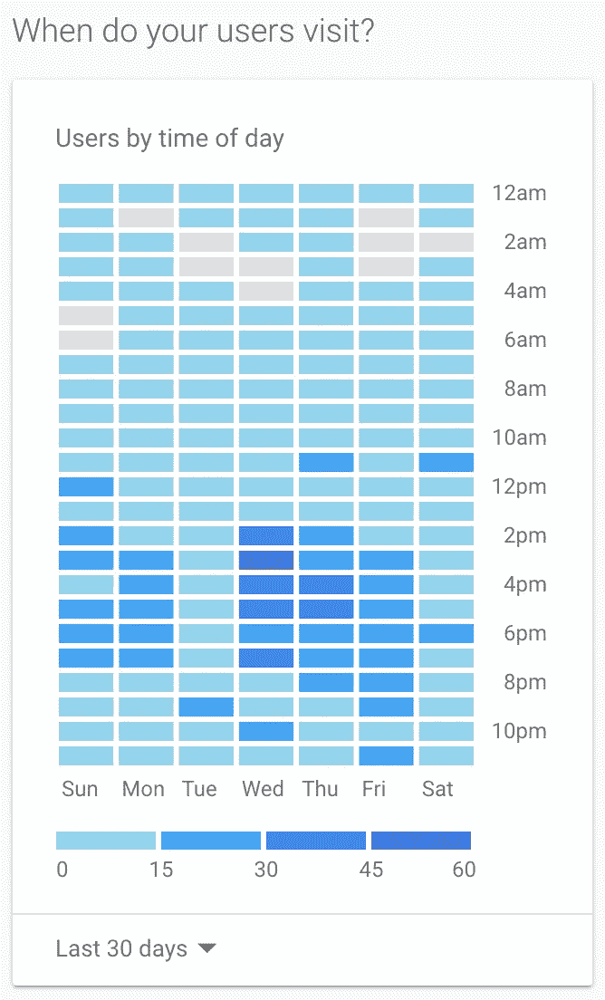

# 将 Google Analytics 与 React 结合使用

> 原文：<https://levelup.gitconnected.com/using-google-analytics-with-react-3d98d709399b>

## 如何使用 Google Analytics 在 React.js 中设置分析跟踪？


# 概观

Google Analytics 提供了一个很棒的仪表板，其中包含大量关于客户在我们的应用程序中的使用情况的见解和报告。这些信息对于监控性能、衡量增长、用户地理位置甚至用户获取洞察都至关重要！这是最好的免费网站分析工具之一。恰好它也非常容易与 React 集成。



来自我个人项目之一的真实分析数据 https://tournio.io。

# 安装和设置

要开始将 Google Analytics 与 react 项目集成，您需要首先从 npm 安装`react-ga`包。

```
npm i react-ga -S
```

`react-ga`包是连接 Google Analytics 和 React 的官方 JavaScript 模块。

接下来，您只需在应用程序中导入并初始化该模块。

在上面的例子中，你需要用你实际的谷歌分析跟踪 id 替换`trackingId`。要查找您的跟踪 id:

*   登录到[https://analytics.google.com](https://analytics.google.com/)
*   点击**管理。**
*   从**账户**栏的菜单中选择一个账户。
*   从**属性**栏的菜单中选择一个属性。
*   在**属性**下，点击**跟踪信息**，然后点击**跟踪代码**。


# 自定义事件的用法

它是一个非常有用的工具，能够监控用户如何与您的应用程序交互。例如，如果您有一个“立即注册”按钮，您可以测量该按钮被点击的次数与实际注册的用户数。为了实现这一点，我们将使用事件特性。

然后，该事件将被报告给谷歌，并在**几秒钟内可供分析。**

# 浏览量跟踪

在我个人的实现中，我还将使用`react-router`，它允许您轻松地创建一个具有完整路由功能的 React 应用程序。通过使用`history`包，你可以很容易地绑定页面变化事件来跟踪页面浏览量。

首先，安装软件包。

```
npm i history react-router-dom -S
```

接下来，我们只需要将我们的浏览器历史实例连接到路由器和我们的 Google Analytics 跟踪。

这就是全部了！有更多的特性你可以用`react-ga`和`react-router`来实现。如果您有兴趣了解关于这两个包的更多信息，请继续查看它们！

[](https://github.com/react-ga/react-ga) [## 反应遗传算法/反应遗传算法

### React 谷歌分析模块。在 GitHub 上创建一个帐户，为 react-ga/react-ga 开发做出贡献。

github.com](https://github.com/react-ga/react-ga) [](https://github.com/ReactTraining/react-router) [## 反应训练/反应路由器

### React 的声明性路由。在 GitHub 上创建一个帐户，为 ReactTraining/react-router 开发做出贡献。

github.com](https://github.com/ReactTraining/react-router) 

## 如果您有兴趣了解 React 的更多信息

[](https://medium.com/swlh/how-to-structure-your-typescript-react-redux-app-877d1eba1c1e) [## 如何构建你的 TypeScript + React + Redux 应用

### 一个简单的、声明性更强的 React + Redux 应用指南

medium.com](https://medium.com/swlh/how-to-structure-your-typescript-react-redux-app-877d1eba1c1e) 

感谢您的阅读，祝您的项目好运！如果你有任何问题，请留言或给我。

[](https://skilled.dev) [## 编写面试问题

### 一个完整的平台，在这里我会教你找到下一份工作所需的一切，以及…

技术开发](https://skilled.dev)