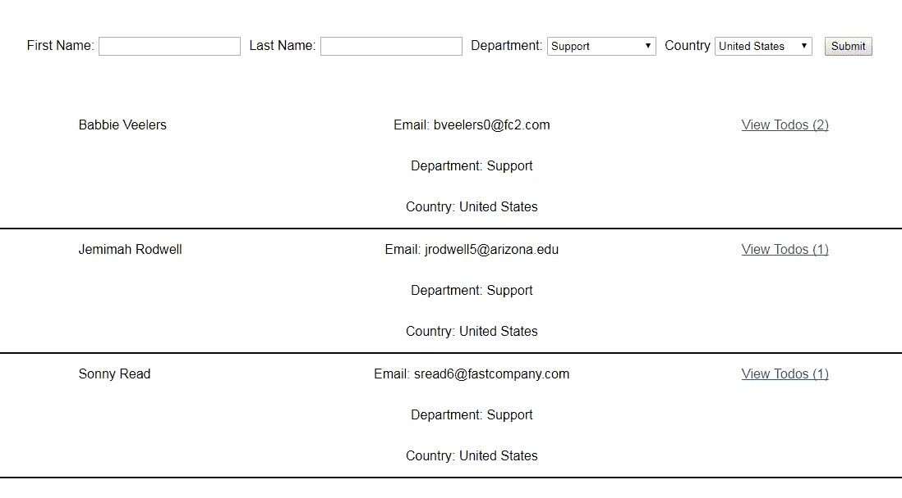
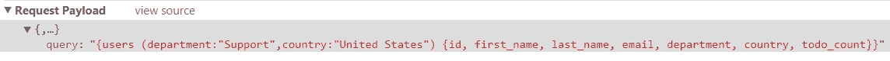
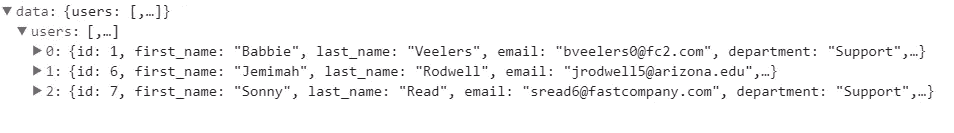
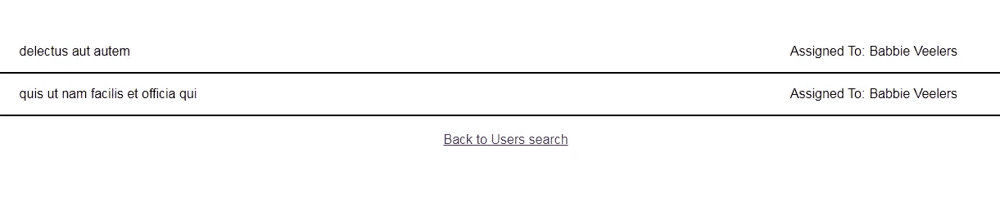

# 用节点 JS 和 React 构建 GraphQL API

> 原文：<https://levelup.gitconnected.com/using-graphql-api-with-node-js-and-react-forms-8b13f4b26361>

关于在客户端使用 React JS 在 Express JS 上构建 GraphQL API 的实践教程。


## 介绍

今年我参观了 [PyCon Ireland 2017](https://pyconie17.python.ie/) ，在那里我看到了一个关于 [GraphQL](http://graphql.org/learn/) API 的非常有趣的演示。GraphQL 是一种新的用于构建 API 的查询语言，由脸书推出。在某些情况下，它比 REST API 更方便，在某些领域应该会取代 REST。GraphQL 方法的主要优点是只需要一个由 POST 方法驱动的端点，而不是 REST 中的几个端点和 HTTP 方法。例如，假设您有一个用户列表，每个用户包含名、姓、电子邮件和其他信息，如国家、工作部门等。假设您在一种情况下只需要获得用户的主要信息(id、名字、姓氏)，在另一种情况下需要获得完整的信息。休息的时候你会做什么？创建两个端点？

或者假设您也有一个分配给每个用户的“todo”任务列表，并且您需要检索带有 todo 列表的用户。使用 GraphQL，您可以直接告诉服务器“给我只包含 id、名字和姓氏的用户列表”，如下所示:

```
{
  users {
    id
    first_name
    last_name
  }
}
```

或者“给我全部信息”:

```
{
  users {
    id
    first_name
    last_name
    email
    gender
    country
    department
  }
}
```

或者“给我分配了待办事项的用户列表。”或者我们甚至可以定义计数和汇总字段——这将在后面描述，还有许多其他的[操作](http://graphql.org/learn/schema/#the-query-and-mutation-types):

```
{
  users {
    id
    first_name
    last_name
    todo_count todos {
      id
      title
    }
  }
}
```

您还可以定义参数来实现任何类型的数据搜索或过滤。就像这样:

```
{
  users(country:"Ireland") {
    id
    first_name
    last_name
  }
}
```

此时，我开始考虑在服务器端使用 GraphQL，在客户端使用 React JS。React props 和 state concept 可以很好地与任何类型的 JSON API 一起工作，因此必须与 GraphQL 一起工作。React 还有受控的[表单](https://reactjs.org/docs/forms.html)概念，允许将表单输入映射到 React 状态，而无需任何额外的序列化。在使用新 API 查询语言构建单页面应用程序(SPA)时，使用 React JS 的不同特性是一个很好的实践。在本教程中，我们将使用:

*   [Node.js](https://nodejs.org/en/)
*   [用服务器端的](https://github.com/expressjs) [GraphQL 包](https://github.com/graphql/express-graphql)表示
*   [客户端反应 JS](https://reactjs.org/)
*   [React-Router](https://reacttraining.com/react-router/) 用于路由我们的应用程序
*   一些 [CSS](https://github.com/KilroggD/GraphQL-react/blob/master/client/src/styles/style.css) 和 [flexbox](https://css-tricks.com/snippets/css/a-guide-to-flexbox/) 使其可读

这个例子有一个**用户列表**，他们位于不同的国家，在某个组织的不同部门工作。他们每个人都有自己的 **Todo** 清单，上面列有已完成和未完成的任务。我们将创建一个包含两个主要部分的 **SPA** :

*   用于搜索和显示所有用户列表的搜索表单，按名字、姓氏、部门、国家/地区进行筛选。
*   通过用户列表中的“查看待办事项(x)”链接可以访问与所选用户 Id 相关的待办事项任务列表

你可以在这里找到工作代码[https://github.com/KilroggD/GraphQL-react](https://github.com/KilroggD/GraphQL-react)。要启动它，只需在客户端和服务器文件夹中安装 npm，然后您可以使用 **npm start** 来启动服务器或客户端或两者。

作为数据源，我们将使用带有数组的 [js 文件](https://github.com/KilroggD/GraphQL-react/tree/master/graphsrv/src/data)，但是您也可以使用一些数据库引擎或其他数据源。

在本教程中，我将一步一步地描述这个 SAP 的创建。

让我们从服务器端应用程序开始。

## 服务器端实现

服务器端代码位于此处[https://github . com/KilroggD/GraphQL-react/tree/master/graphsrv](https://github.com/KilroggD/GraphQL-react/tree/master/graphsrv)

在我们开始创建我们的服务器端应用程序之前，我们需要安装几个 npm 包——你可以在资源库中找到 *package.json* :

```
"dependencies": {
    "express": "^4.16.2",
    "express-graphql": "^0.6.11",
    "graphql": "^0.11.7",
    "lodash": "^4.17.4",
    "babel-cli": "^6.24.1",
    "babel-preset-node6": "^11.0.0",
    "babel-register": "^6.24.1",
    "nodemon": "^1.11.0"
  }
```

在这里，我们可以看到 *express* 框架、 *graphql* 扩展、 [lodash](https://lodash.com/) 库——对 JS 数组中的过滤和搜索非常有用——以及一些额外的包来运行我们的服务器，并让它理解复杂的 ES6 语法。

我们的入口点是我们的 **server.js** 文件。首先，我们导入所有必要的模块，并定义服务器监听的端口，然后创建我们的 express 应用程序。我们还导入 GraphQL **模式**文件，这将在后面描述。

```
import express from 'express';
import schema from './schema';
import graphqlHTTP from 'express-graphql';
const port = 3001;
const app = express();
```

之后，我们需要描述我们的应用程序将要做什么。首先，我们假设我们的 API 可能是公共的，或者我们的前端开发服务器可以在不同的端口上运行，所以我们需要允许[跨源](https://developer.mozilla.org/en-US/docs/Web/HTTP/CORS)请求。

```
app.use('/graphql', (req, res, next) => {
    res.header('Access-Control-Allow-Origin', '*');
    res.header('Access-Control-Allow-Headers', 'Content-Type,  Authorization, Content-Length, X-Requested-With');
    if (req.method === 'OPTIONS') {
        res.sendStatus(200);
    } else {
        next();
    }
});
```

然后我们编写四行神奇的代码来完成 GraphQL 的工作:

```
app.use('/graphql', graphqlHTTP({
    schema,
    graphiql: true
}));
```

[Graphiql](https://github.com/graphql/graphiql) 是一个强大的开发工具，它允许你在没有任何前端或客户端应用程序的情况下开发测试你的 API。换句话说，这段代码是我们唯一需要的端点。它将处理通过我们的 graphql 模式发送到[http://localhost:3001/graph QL](http://localhost:3001/graphql)的所有 POST 请求。

最后，启动服务器本身的代码:

```
const server = app.listen(port, () => {
    console.log(
        `\n\nExpress listen at [http://localhost:${port](http://localhost:${port)} \n`
    );
});
```

现在让我们定义服务器端应用程序的主要部分——*模式*。它定义了关于如何验证请求、如何从数据源获取结果、不同实体之间的关系等所有规则。因此，它基本上像我们的应用程序的数据模型一样工作。

首先，我们将导入我们的数据源文件和有用的 *lodash* 方法来过滤和聚合数据。不要为了你要使用的几个函数而导入整个 *lodash* 库(不要从 lodash 导入！)

```
import Users from './data/users';
import Todos from './data/todos';
import find from 'lodash/find';
import filter from 'lodash/filter';
import sumBy from 'lodash/sumBy';
```

之后，我们导入一些 GraphQL 类用于类型验证和创建模式对象

```
import {
    GraphQLInt,
    GraphQLBoolean,
    GraphQLString,
    GraphQLList,
    GraphQLObjectType,
    GraphQLNonNull,
    GraphQLSchema,
} from 'graphql';
```

然后我们可以为我们需要的实体定义实际的数据结构。在本例中，我们有两个实体—一个用于用户，一个用于待办事项:

```
const UserType = new GraphQLObjectType({
    name: 'User',
    description: 'Users in company',
    fields: () => ({
            id: {type: new GraphQLNonNull(GraphQLInt)},
            first_name: {type: new GraphQLNonNull(GraphQLString)},
            last_name: {type: new GraphQLNonNull(GraphQLString)},
            email: {type: GraphQLString},
            gender: {type: GraphQLString},
            department: {type: new GraphQLNonNull(GraphQLString)},
            country: {type: new GraphQLNonNull(GraphQLString)},
            todo_count: {
                type: GraphQLInt,
                resolve: (user) => {
                    return sumBy(
                       Todos, todo => todo.userId === user.id ? 1:0
                    );
                }
            },
            todos: {
                type: new GraphQLList(TodoType),
                resolve: (user, args) => {
                    return filter(
                        Todos, todo => todo.userId === user.id
                    );
                }
            }
        })
});
```

这里，对于除了 *todo_count* 和 *todos* 之外的所有字段，我们只定义了类型( *Int，String* 等)。).对于与另一个实体(todo)相关的这两种类型，我们定义了一个 resolve 函数，在第一种情况下，它将聚合 todo 的数量，在第二种情况下，它只获取与用户相关的所有 todo。然后，我们为 todos 定义了与任务分配给的用户相关的类似功能。

```
const TodoType = new GraphQLObjectType({
    name: 'Todo',
    description: 'Task for user',
    fields: () => ({
            id: {type: new GraphQLNonNull(GraphQLInt)},
            title: {type: GraphQLString},
            completed: {type: new GraphQLNonNull(GraphQLBoolean)},
            user: {
                type: UserType,
                resolve: (todo, args) => {
                    return find(Users, user => user.id === todo.userId);
                }
            }
        })
});
```

在定义了所有数据类型之后，我们可以为我们的应用程序创建一个根查询。GraphQL 中有不同类型的查询[但是对于这个例子，我们只关注一个非常简单的从数据源获取数据的查询。对于用户，我们还将实现过滤参数，对于 todos，我们将只获取与给定的 userId 相关的所有项目。下面是我们主要查询的代码:](http://graphql.org/learn/schema/#the-query-and-mutation-types)

```
const TodoQueryRootType = new GraphQLObjectType({
    name: 'TodoAppSchema',
    description: 'Root Todo App Schema',
    fields: () => ({
            users: {
                args: {
                    first_name: {type: GraphQLString},
                    last_name: {type: GraphQLString},
                    department: {type: GraphQLString},
                    country: {type: GraphQLString},
                },
                type: new GraphQLList(UserType),
                description: 'List of Users',
                resolve: (parent, args) => {
                    if (Object.keys(args).length) {
                        return filter(Users, args);
                    }
                    return Users;
                }
            },
            todos: {
                args: {
                    userId: {type: GraphQLInt},
                    completed: {type: GraphQLBoolean},
                },
                type: new GraphQLList(TodoType),
                description: 'List of Todos',
                resolve: (parent, args) => {
                    if (Object.keys(args).length) {
                        return filter(Todos, args);
                    }
                    return Todos;
                }
            }
        })
});
```

这里描述了我们的主要应用程序**模式**。它有两个字段——*用户*和*待办事项*，分别带有**用户类型**和**待办事项类型**。我们可以通过在 **args** 中定义的四个可能的参数来过滤**用户**列表。过滤器本身在 **resolve** 函数中实现(在这种情况下只是一个简单的 lodash 过滤器)。

同样的道理也适用于**待办事项**列表:我们可以通过*用户 Id* 和完成状态对其进行过滤。

最后，我们创建并导出我们的模式对象:

```
const schema = new GraphQLSchema({
    query: TodoQueryRootType,
});export default schema;
```

此时，您已经可以启动您的服务器，并通过调试工具对其进行测试。

只需在你的 Chrome 浏览器中打开[http://localhost:3001/graph QL](http://localhost:3001/graphql),并尝试本文前面提到的一些查询。

至此，服务器端已经完成，我们可以从客户端开始了。

**客户端实现**

为了简化 React JS 应用程序的创建，我使用了脸书提供的工具。我还安装了 react 路由器:

```
npm install --save react-router
```

工作代码和 package.json 文件在[客户端文件夹](https://github.com/KilroggD/GraphQL-react/tree/master/client)的存储库中。

您可以首先启动服务器，然后转到客户端文件夹并运行:

```
npm start
```

我不会在这里描述所有的源代码，只描述其中最相关的部分。

React JS 中有不同的方法来处理异步数据获取、ajax 请求和不同的 API。这篇文章很好地描述了 ajax 的最佳实践。

为了不使示例过于复杂，当我们有处理异步调用的容器组件和无状态的显示 UI 的表示组件时，我们将使用容器方法。在开始之前，我们将创建一个简单的类似服务的类，它将获取 GraphQL 数据，以避免组件中的 AJAX 调用。

**ApiService.js:**

```
class ApiService { /**
     * define base url and field schemas here
     * [@returns](http://twitter.com/returns) {ApiService}
     */
    constructor() {
        this.apiUrl = '[http://localhost:3001/graphql'](http://localhost:3001/graphql');
        this.userFields = `{id, first_name, last_name, email,                                    department, country, todo_count}`;
        this.todoFields = `{id title completed user {first_name, last_name}}`;
    } /**
     * Generic function to fetch data from server
     * [@param](http://twitter.com/param) {string} query
     * [@returns](http://twitter.com/returns) {unresolved}
     */
    async getGraphQlData(resource, params, fields) {
        const query = `{${resource} ${this.paramsToString(params)} ${fields}}`;
        const res = await fetch(this.apiUrl, {
            method: 'POST',
            mode: 'cors',
            headers: new Headers({
                'Content-Type': 'application/json',
                'Accept': 'application/json',
            }),
            body: JSON.stringify({query}),
        });
        if (res.ok) {
            const body = await res.json();
            return body.data;
        } else {
            throw new Error(res.status);
        }
    } /**
     * 
     * [@param](http://twitter.com/param) {object} params
     * [@returns](http://twitter.com/returns) {array} users list or empty list
     */
    async getUsers(params = {}) {
        const data = await this.getGraphQlData(
            'users', params, this.userFields
        );
        //return users list
        return data.users;
    } /**
     * 
     * [@param](http://twitter.com/param) {object} params
     * [@returns](http://twitter.com/returns) {array} users list or empty list
     */
    async getTodos(params = {}) {
        const data = await this.getGraphQlData(
           'todos', params, this.todoFields
        );
        //return todos list
        return data.todos;
    } /**
     * 
     * [@param](http://twitter.com/param) {object} params
     * [@returns](http://twitter.com/returns) {String} params
      converted to string for usage in graphQL
     */
    paramsToString(params) {
        let paramString = '';
        if (params.constructor === Object && Object.keys(params).length) {
            let tmp = [];
            for (let key in params) {
                let paramStr = params[key];
                if(paramStr !== '') {
                    if (typeof params[key] === 'string') {
                        paramStr = `"${paramStr}"`;
                    }
                    tmp.push(`${key}:${paramStr}`);
                }
            }
            if (tmp.length) {
                paramString = `(${tmp.join()})`;
            }
        }
        return paramString;
    }}export default new ApiService();
```

在构造函数中，我们定义了主 Url 和需要为每个实体获取的字段。主函数**async getGraphQlData(resource，params，fields)** 从给定的*资源* (users 或 todos)中获取数据，通过给定的*参数、*进行过滤，并受到给定的*字段*的限制。 **paramsToString** 是一个帮助器函数，用于将对象转换成参数字符串({userId: 1} - > '(userId:1)')。

此外，我们使用 **getUsers** 和 **getTodos** 作为代理函数，以获得更好的可读性、准确性( *getUsers* 获取用户， *getTodos* 获取 Todos)和语法优势。这两个函数都将返回从服务器检索到的对象数组，或者在请求不成功时抛出一个错误。这里使用了 javascript [获取 API](https://developer.mozilla.org/en-US/docs/Web/API/Fetch_API/Using_Fetch) 。

让我们将主应用程序声明为处理路由的主容器:

```
const App = () => {
    return <Switch>
        <Route exact path='/' component={UserListContainer}/>
        <Route path='/todos/:userId' component={TodoListContainer}/>
    </Switch>
};export default App;
```

你可以在 Medium 上的这里找到一篇关于 react 路由器[的精彩文章。](https://medium.com/@pshrmn/a-simple-react-router-v4-tutorial-7f23ff27adf)

根据浏览器 Url，我们的应用程序将呈现 **UserListContainer** 或 **TodoListContainer** 。它们都是异步组件，处理 AJAX 请求并将处理后的数据传递给它们的子组件。让我们关注一下**用户列表容器**。默认情况下，它会呈现两个子表单——用于搜索用户的用户表单和带有结果列表的用户列表。

```
render() {
        return <div className="user">
            <UserForm submitHandler={this.search} />
            <UserList users={this.state.users} />
        </div>;
    }
```

它还将一个搜索函数作为处理程序传递给我们的表单。这个异步函数从 GraphQL api 获取数据，并将结果存储在状态中:

```
async search(params) {
        try {
            const users = await ApiService.getUsers(params);
            this.setState({users});
        } catch (e) {
            console.error(`An error ${e.message} occured while searching users`);
        }
    }
```

**用户表单**是一个[控制的表单](https://reactjs.org/docs/forms.html)，它将输入值映射到表单的状态。所以我们需要做的就是将这个状态传递给处理函数:

```
handleSubmit(event) {
        event.preventDefault();
        return this.props.submitHandler(this.state);
}
```

在我们提交表单后，我们的搜索函数获取数据并将其传递到 UserList，它显示结果:



我们可以在 Chrome 开发工具中看到请求负载和收到的响应:



每个用户列表项包含一个带有 Todos 计数的链接，该链接链接到带有与该用户相关的任务的页面



该页面直接将**呈现给使用异步呈现的 TodoListContainer** ，无需等待提交任何表单。除了容器和**用户表单**之外的所有组件都是用于表示目的的无状态功能组件。

```
async componentDidMount() {
        const userId = parseInt(this.props.match.params.userId, 10);
        try {
            const todos = await ApiService.getTodos({userId});
            this.setState({todos});
        } catch (e) {
            console.error(`An error ${e.message} occured while loading tasks for user ${userId}`);
        }
    }
```

该页面还包含返回用户搜索页面的链接。请注意，在我们返回之后，搜索表单是干净的，因为在我们更改了路由及其子路由之后， **UserListContainer** 被卸载了。为了保持表单状态，我们可以实现一些 [Redux](https://github.com/reactjs/redux) 或 [Reflux](https://medium.com/front-end-hacking/react-and-reflux-usage-in-real-time-applications-based-on-websockets-part-1-introduction-12fcc7cc3590) 或自定义存储方法，或者将状态存储在根应用程序组件中(对于小应用程序是可行的，但在大项目中可能会造成混乱)。我会建议使用商店，但这是另一个不同的故事了。GraphQL 的变化以及这种构建 API 的方法的许多其他特性和好处也是如此。

感谢阅读，希望你觉得有点帮助和有用。=)

# [检出 git connected>](https://gitconnected.com)

*开发者和软件工程师社区*