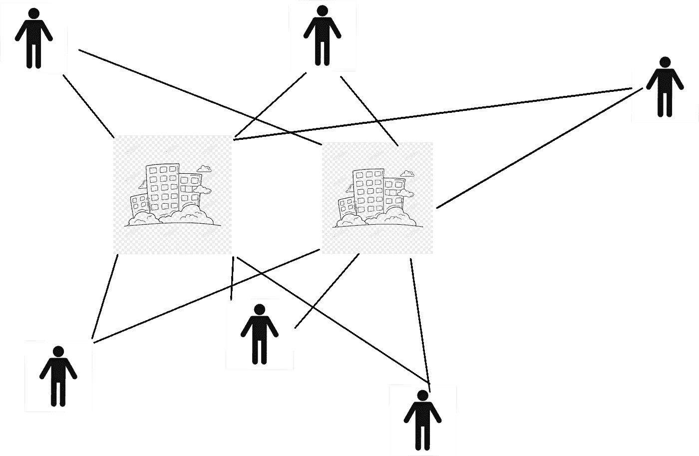
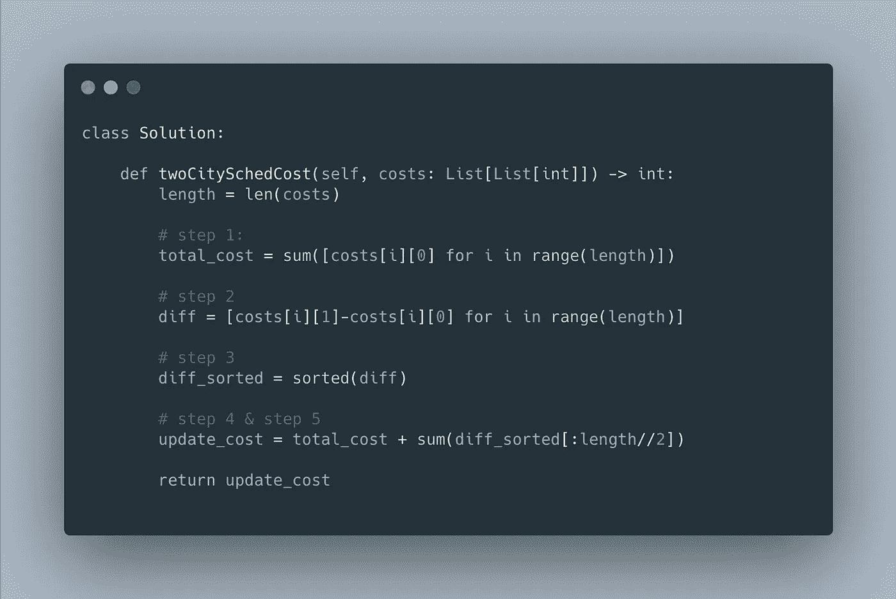

# 用贪婪算法求解双城调度问题

> 原文：<https://levelup.gitconnected.com/using-greedy-algorithm-to-solve-two-city-scheduling-problem-9f4a77d9edd3>



# 问题陈述

一家公司正计划面试人。给定阵法`costs`，将`i-th`人空运到城市`A`的费用是`costs[i][0]`，将`i-th`人空运到城市`B`的费用是`costs[i][1]`。

返回每个人飞往一个城市的最低费用，这样正好有`n`个人到达每个城市。

**例 1:**

```
**Input:** costs = [[10,20],[30,200],[400,50],[30,20]]
**Output:** 110
**Explanation:** 
The first person goes to city A for a cost of 10.
The second person goes to city A for a cost of 30.
The third person goes to city B for a cost of 50.
The fourth person goes to city B for a cost of 20.

The total minimum cost is 10 + 30 + 50 + 20 = 110 to have half the people interviewing in each city.
```

**约束:**

*   `2 * N== costs.length`
*   `2 <= costs.length <= 100`
*   `costs.length`是偶数。

# 贪婪解决方案

1.  假设所有`2N`人飞往城市`A`并计算总成本

```
tatal_cost =  10 + 30 + 400 + 30 = 470
```

现在，我们需要将`N`人交换到城市`B`。那么选择哪些人呢？

2.当我们交换从城市`A`到城市`B`的所有飞机票时，计算一个**退款数组**。

```
diff person1 = 20–10 = 10
diff person2 = 200–30 = 170
diff person3 = 50 - 400 = -350
diff person4 = 20 -30 = -10diff = [10, 170, -350, -10]
```

在这里，正退款意味着我们需要支付更多，负退款意味着我们将获得退款。

3.对退款数组进行排序

`diff_sorted = [-350,-10,10,170]`

4.为了获得最小的总成本，退款越多越好。挑选人数最少的 N 个人`diff`,将他们从城市`A`换到城市`B`

5.更改后更新总成本

```
update total cost = 470 + (-350) +(-10) = 110
```

代码来了



# 扩展问题

> 如果这个问题修改为 3 个城市呢？贪婪算法还管用吗？