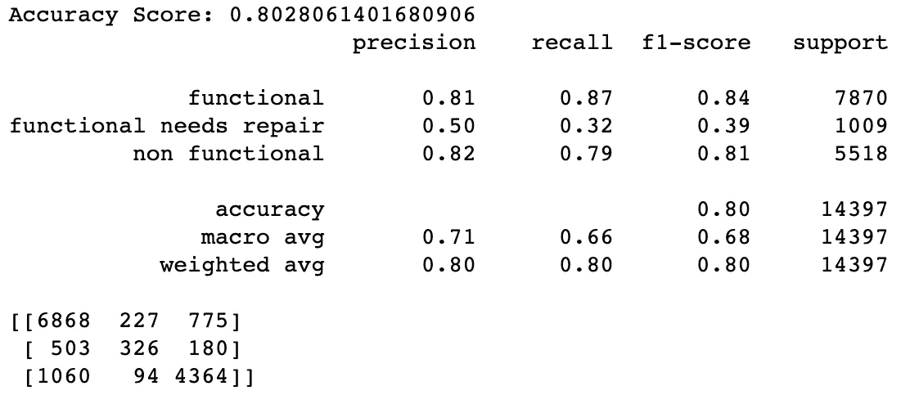
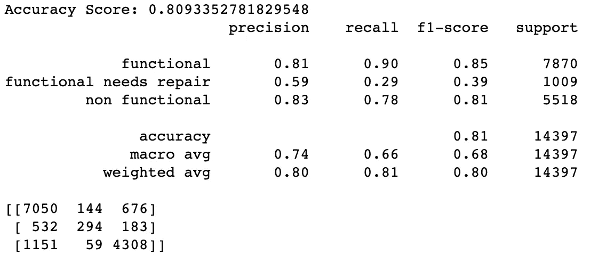

# 使用 GridSearchCV 优化您的机器学习模型

> 原文：<https://levelup.gitconnected.com/using-gridsearchcv-to-optimize-your-machine-learning-models-1ebb3b054cd7>

## 超参数调整可以帮助您获得模型的最佳性能


Jorge Salvador 在 [Unsplash](https://unsplash.com?utm_source=medium&utm_medium=referral) 上的照片

当训练你的机器学习模型时，创建一个基线，或没有任何特定调整的“香草”模型是最常见的协议。我们这样做是为了测试我们的模型在数据上的表现。因此，当我们调整超参数时，我们可以知道是否正在进行改进。但是我们如何改进我们的模型呢？

加快改进模型过程的一个方法是使用一个叫做 GridSearch 的交叉验证工具。使用 GridSearch CV，我们可以为所选参数定义一系列值。然后，我们迭代这些参数的每个组合，以查看哪个组合对我们选择的成本函数的改善最大。点击这里查看 GridSearchCV [的文档。](https://scikit-learn.org/stable/modules/generated/sklearn.model_selection.GridSearchCV.html)

例如，我在下面提供了一个随机森林的三重分类模型的代码。我将演示如何有效地使用 GridSearch 并提高我的模型的性能

> 随机森林模型的快速总结:随机森林本质上是决策树的集合。决策树被戏称为“贪婪算法”,因为它在信息增益最大的地方做出分割特征的“决定”。

## 首先，导入必要的库:

我们将依靠 sklearn 库来训练/测试拆分我们的数据 gridsearch，以及创建一个具有标准缩放和随机森林模型本身的管道。

```
from sklearn.model_selection import train_test_split, GridSearchCV
from sklearn.ensemble import RandomForestClassifier
from sklearn.pipeline import Pipeline
from sklearn.preprocessing import StandardScaler
```

现在，我们将使用“status_group”作为标签来拆分数据。这些是水井功能的状态。有三种状态标签:功能性、非功能性和功能性需要维修。

```
X = final_model_data.drop(labels=['id', 'status_group'], axis=1)
y = final_model_data.status_groupX_train, X_test, y_train, y_test = train_test_split(X, y, test_size=0.25, random_state=42)
```

然后，我创建一个管道来简化我们的流程。管道的想法是整合步骤以节省时间。在这里，我运行 StandardScaler(在相同的尺度上获得我们的数字特征)和随机森林集成分类器模型。

```
def machine_learn(model) :
    model_pipeline = Pipeline([('ss', StandardScaler()), 
                              ('model', model)])
    fitted_model = model_pipeline.fit(X_train, y_train)
    print("Accuracy Score:", fitted_model.score(X_test, y_test))
    model_preds = fitted_model.predict(X_test)
    print(classification_report(y_test, model_preds))
    print(confusion_matrix(y_test, model_preds))
```

然后，我们使用管道函数快速运行基线模型，为再现性设置 random_state，n_estimators 为 200。“n_estimators”本质上是我们的随机森林中决策树的数量。关于决策树如何运作的更多信息，请看 Chirag Sehra 的文章[。](https://chiragsehra42.medium.com/decision-trees-explained-easily-28f23241248)

```
machine_learn(RandomForestClassifier(random_state=123, n_estimators=200))
```



我们的基线模型具有 0.802 的精度。这真的很不错。注意，这可能是因为我的数据集已经被大范围清理了，但那是另一篇完整的博文！这里我们只关注如何使用 GridSearch。

现在，让我们看看是否有可能提高我们模型的准确性。我将输入大范围的值，GridSearch 将对这些值进行彻底搜索，以得出最佳的准确度分数。

这里的想法是首先从广泛的值开始，然后在每次迭代中找到最佳值。

## 网格搜索

```
newer_grid = [{'RF__max_depth': [8, 12, 16], 
         'RF__min_samples_split': [12, 16, 20], 
         'RF__criterion': ['gini', 'entropy']}]gridsearch = GridSearchCV(estimator=rf_pipeline, 
                          param_grid=newer_grid, 
                          scoring='accuracy', 
                          cv=5)gridsearch.fit(X_train, y_train)gridsearch.score(X_test, y_test)#0.7978050982843647 - accuracygridsearch.best_params_# returns: {'RF__criterion': 'entropy', 'RF__max_depth': 16, 'RF__min_samples_split': 12
```

我们的准确度分数甚至低于基线！如果您想知道这怎么可能，这是因为我已经为某些参数输入了特定的值，这些值限制了模型的操作。我们较低的精度告诉我们，我们想要的参数可能超出了我指定的范围。

因为最大深度最佳参数是最高的，让我们试着把它保留为默认值，这意味着树的深度没有限制。这可能倾向于过度拟合模型，但是我们是基于我们的测试集值进行判断的，所以我们可以忽略它。另一方面，Min_samples_split 是分割内部节点所需的最小样本数。让我们在这个参数上工作，同时将“RF_criterion”留在“熵”上。这些标准测量每个节点的杂质。“基尼系数”和“熵”之间唯一真正的区别是“熵”测量使用对数函数来计算杂质，这在计算上更加昂贵。

我仍然将 min_samples_split 的范围留得有点宽。如果我们的 best_params 在这个范围内给出一个值，那么我们就缩小我们的值。

```
newer_grid = [{ 
         'RF__min_samples_split': [8, 10, 12], 
         'RF__criterion': ['entropy']
         }] gridsearch = GridSearchCV(estimator=rf_pipeline, 
                          param_grid=newer_grid, 
                          scoring='accuracy', 
                          cv=5)gridsearch.fit(X_train, y_train)gridsearch.score(X_test, y_test)#accuracy: 0.8083628533722303gridsearch.best_params_#{'RF__criterion': 'entropy', 'RF__min_samples_split': 8}
```

但是有点进步！让我们再尝试一次迭代。因为我们的 min_samples_split 的 best_param 在我的值范围内是最低的，所以更好的值可能仍然低于这个值。我将在这一轮中输入 6、7 和 8，比上一轮缩小更多。

```
last_grid = [{ 
         'RF__min_samples_split': [6, 7, 8],
         'RF__criterion': ['entropy']
        }]gridsearch = GridSearchCV(estimator=rf_pipeline, 
                          param_grid=last_grid, 
                          scoring='accuracy', 
                          cv=5)
gridsearch.fit(X_train, y_train)gridsearch.score(X_test, y_test)#accuracy: 0.8083628533722303gridsearch.best_params_#{'RF__criterion': 'entropy', 'RF__min_samples_split': 7}
```

现在我们在非常窄的范围内有了一个“最佳”值。因此，让我们将 GridSearch 中的这些值插回到我们有 200 个评估者的模型中，并使用相同的 random_state 作为基线来计算一些汇总统计数据。

```
machine_learn(RandomForestClassifier(random_state=123, n_estimators=200,
                                min_samples_split=7, criterion='entropy'))
```



略有改善！GridSearch 并不总是突飞猛进，但任何百分比的改进都是值得的。我希望你至少能从这篇文章中学到一些东西。

如果你对我的方法或过程有任何问题，请评论！我一直在寻求学习。

-奥林