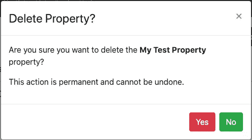

# 将 Heroku 用于静态网页内容

> 原文：<https://levelup.gitconnected.com/using-heroku-for-static-web-content-b7f5ce0712b1>

在“[从 AWS 迁移到 Heroku](/moving-away-from-aws-and-onto-heroku-d84852b9884d) 的文章中，我介绍了我想从亚马逊流行的 AWS 解决方案迁移到 [Heroku](https://www.heroku.com/) 的应用程序。随后，“ [Destination Heroku](/destination-heroku-86a5811a199c) ”文章阐述了新 Heroku 帐户的建立，并重点介绍了一个 Java API(在 Spring Boot 编写),它连接到这个新的平台即服务(PaaS)生态系统中的 ClearDB 实例。我的主要目标是找到一个解决方案，让我能够将有限的时间集中在提供业务解决方案上，而不是跟上开发运维流程。

# 快速回顾

作为一个 TL；(博士太长；没看)到原文章，我给婆婆开的小企业建了一个 Angular 客户端和一个 Java API。在 Elastic Beanstalk 和 S3 上运行应用程序一年后，我想看看是否有更好的解决方案，让我能够更加专注于编写功能和增强功能，而不必担心学习、理解和执行 AWS 生态系统中固有的类似 DevOps 的方面。

现在，随着 Java API 在 Heroku 上运行，是时候关注应用程序的客户端了。

# AWS S3 替代方案

亚马逊 AWS 简单存储服务(S3)是惊人的。那些对寻找令人兴奋的案例研究感兴趣的人，只要看看网飞或 Airbnb 提供的服务，就可以了解对象服务平台对于高要求应用程序的响应能力和可扩展性。

虽然 AMHS 的应用程序在任何层面上都比不上网飞或 Airbnb，但我最初选择了 AWS S3，因为它是定位 Angular 应用程序静态文件的正确位置。我想让客户机代码和服务器代码运行在同一个基础服务上，这证明了我的决定是正确的。

当我开始考虑静态内容时，我不确定事情在 Heroku 模型中是如何工作的。在做一些快速研究时，很明显我不是这个用例的唯一使用者。事实上，所有的结果都让我想到了同一个解决方案——简单地利用 Node.js Express 服务器为客户机托管静态文件。因此，我将在 Heroku 中为客户端运行一个应用程序，就像我运行 RESTful API 一样。

# 创建`amhs-angular`应用程序

按照“ [Destination Heroku](/destination-heroku-86a5811a199c) ”文章中相同的基本步骤，我创建了一个名为`amhs-angular`的应用程序来存放 Angular 客户端代码。


由于这将只是一个静态 web 应用程序，因此不需要为此服务配置任何附加组件。我可以使用 Heroku CLI 的以下命令执行相同的过程:

`heroku create amhs-angular`

接下来，我使用下面的命令将`amhs-angular` Heroku 项目作为远程项目添加到 AMHS Angular 客户端的 git 存储库中:

`heroku git:remote -a amhs-angular`

它的响应输出如下:

`set git remote heroku to [https://git.heroku.com/amhs-angular.git](https://git.heroku.com/amhs-angular.git)`

以下 git 命令验证了远程设置是否正确:

`$git remote -v`

# 更新 Angular 以在 Node Express 内部运行

当对静态客户端文件使用 AWS S3 时，我遵循以下步骤，以便提供一个可公开访问的 AMHS 客户端版本:

1.  使用`ng build --prod`命令建立角度分布
2.  导航到 AWS |存储| S3
3.  单击 AMHS 桶
4.  将`/dist`文件夹下的所有文件拖到 AWS 的主文件屏幕中
5.  选择所有文件并授予适当的安全级别

对于 Heroku，计划使用 Node.js Express 服务器来托管这些文件。在 AMHS Angular 客户端项目的终端中，我执行了以下命令来包含 express 服务器:

`$ npm install express --save`

接下来，我需要将`package.json`更新为`"start": "node server.js"`，还包括一个`"postinstall": "ng build --output-path dist"`来执行角度构建。

下面是`package.json`更新后的副本:

JSON

```
"scripts": {
"ng": "ng",
"start": "node server.js",
"build": "ng build --prod",
"test": "ng test",
"lint": "ng lint",
"e2e": "ng e2e",
"postinstall": "ng build --output-path dist"
},
```

我还需要包含一个`"engines"`属性，与`"scripts"`到`package.json`处于同一级别:

JSON

```
},
"engines": {
"node": "11.15.0",
"npm": "6.7.0"
}
```

接下来，需要创建一个通用的`server.js`文件(如上所述)。内容列举如下:

Java Script 语言

```
const express = require('express');
const path = require('path');
const app = express();
app.use(express.static('./dist'));
app.get('/*', function(req,res) {
res.sendFile(path.join(__dirname,'/dist/index.html'));
});
app.listen(process.env.PORT || 8080);
```

最后，我需要更新`environment.prod.ts` Angular 文件，以引用正确的回调 URL 和“Destination Heroku”文章中创建的 API:

Java Script 语言

```
api: 'https://amhs.herokuapp.com',
redirectUrl: 'https://amhs-angular.herokuapp.com/implicit/callback'
```

我还需要包含一个`"engines"`属性，与`package.json`的`"scripts"`处于同一级别:

JSON

```
},
"engines": {
"node": "11.15.0",
"npm": "6.7.0"
}
```

接下来，需要创建一个通用的`server.js`文件(如上所述)。内容列举如下:

Java Script 语言

```
const express = require('express');
const path = require('path');
const app = express();
app.use(express.static('./dist'));
app.get('/*', function(req,res) {
res.sendFile(path.join(__dirname,'/dist/index.html'));
});
app.listen(process.env.PORT || 8080);
```

最后，我需要更新`environment.prod.ts` Angular 文件，以引用正确的回调 URL 和“Destination Heroku”文章中创建的 API:

Java Script 语言

```
api: 'https://amhs.herokuapp.com',
redirectUrl: 'https://amhs-angular.herokuapp.com/implicit/callback'
```

此时，当客户端被部署时，它准备好利用 Node.js Express 服务器来托管`/dist`文件夹中的文件，当 https://amhs-angular.herokuapp.com URL 被调用时，调用`/dist/index.html`文件。

# 应用增强

除了进行上述更改，我还想为 AMHS 应用程序引入一些新特性。积压的两个项目如下:

*   引入删除属性的功能
*   允许管理员用户删除员工

必要的 API 修改已经就绪，我继续更新 Angular 客户端。属性列表现在包含每个属性的删除按钮:


删除属性是一个简单的操作，并且在执行实际删除之前包括一个确认模式:



人员视图还包括一个删除按钮:


对于工作人员，事情要复杂一些。下面说明了基本的业务规则:

1.  如果员工的销售与现有物业相关，则不应删除该员工。
2.  如果员工是任何在职员工的经理，则不应删除该员工。
3.  在这两种情况都不允许的情况下，建议将该工作人员停职。

使用此逻辑，当条件#1 不满足时，出现以下模式:


类似地，不满足条件#2 会产生如下所示的模式:


当一个职员可以被删除时，会出现如下确认模式:


在确认一切都按预期运行之后，上面的所有更改都被签入到 AMHS Angular 客户端存储库的主分支中。

# 推动 Heroku 的变革

检查了 AMHS Angular 客户端存储库中的代码并为`amhs-angular`项目设置了 Heroku 远程设置后，使用以下命令将代码部署到 Heroku:

`git push heroku`

以下命令提供了关于部署的更新:

壳

```
-----> Node.js app detected -----> Creating runtime environmentNPM_CONFIG_LOGLEVEL=error
NODE_ENV=production
NODE_MODULES_CACHE=true
NODE_VERBOSE=false-----> Installing binaries
engines.node (package.json):  11.15.0
engines.npm (package.json):   6.7.0Resolving node version 11.15.0...
Downloading and installing node 11.15.0...
npm 6.7.0 already installed with node-----> Restoring cache
- node_modules-----> Installing dependencies
Installing node modules> fsevents@1.2.12 install /tmp/build_d2400638d424ad7a3269162acc30fb7e/node_modules/fsevents> node-gyp rebuildgyp info it worked if it ends with ok
gyp info using node-gyp@3.8.0
gyp info using node@11.15.0 | linux | x64
gyp http GET [https://nodejs.org/download/release/v11.15.0/node-v11.15.0-headers.tar.gz](https://nodejs.org/download/release/v11.15.0/node-v11.15.0-headers.tar.gz)
gyp http 200 [https://nodejs.org/download/release/v11.15.0/node-v11.15.0-headers.tar.gz](https://nodejs.org/download/release/v11.15.0/node-v11.15.0-headers.tar.gz)
gyp http GET [https://nodejs.org/download/release/v11.15.0/SHASUMS256.txt](https://nodejs.org/download/release/v11.15.0/SHASUMS256.txt)
gyp http 200 [https://nodejs.org/download/release/v11.15.0/SHASUMS256.txt](https://nodejs.org/download/release/v11.15.0/SHASUMS256.txt)
gyp info spawn /usr/bin/python2
gyp info spawn args [ '/tmp/build_d2400638d424ad7a3269162acc30fb7e/.heroku/node/lib/node_modules/npm/node_modules/node-gyp/gyp/gyp_main.py',
gyp info spawn args   'binding.gyp',
gyp info spawn args   '-f',
gyp info spawn args   'make',
gyp info spawn args   '-I',
gyp info spawn args   '/tmp/build_d2400638d424ad7a3269162acc30fb7e/node_modules/fsevents/build/config.gypi'
gyp info spawn args   '-I',
gyp info spawn args   '/tmp/build_d2400638d424ad7a3269162acc30fb7e/.heroku/node/lib/node_modules/npm/node_modules/node-gyp/addon.gypi',
gyp info spawn args   '-I',
gyp info spawn args   '/app/.node-gyp/11.15.0/include/node/common.gypi',
gyp info spawn args   '-Dlibrary=shared_library',
gyp info spawn args   '-Dvisibility=default',
gyp info spawn args   '-Dnode_root_dir=/app/.node-gyp/11.15.0',
gyp info spawn args   '-Dnode_gyp_dir=/tmp/build_d2400638d424ad7a3269162acc30fb7e/.heroku/node/lib/node_modules/npm/node_modules/node-gyp',
gyp info spawn args   '-Dnode_lib_file=/app/.node-gyp/11.15.0/<(target_arch)/node.lib',
gyp info spawn args   '-Dmodule_root_dir=/tmp/build_d2400638d424ad7a3269162acc30fb7e/node_modules/fsevents',
gyp info spawn args   '-Dnode_engine=v8',
gyp info spawn args   '--depth=.',
gyp info spawn args   '--no-parallel',
gyp info spawn args   '--generator-output',
gyp info spawn args   'build',
gyp info spawn args   '-Goutput_dir=.' ]
gyp info spawn make
gyp info spawn args [ 'BUILDTYPE=Release', '-C', 'build' ]
make: Entering directory '/tmp/build_d2400638d424ad7a3269162acc30fb7e/node_modules/fsevents/build'
SOLINK_MODULE(target) Release/obj.target/.node
COPY Release/.node
make: Leaving directory '/tmp/build_d2400638d424ad7a3269162acc30fb7e/node_modules/fsevents/build'
gyp info ok> node-sass@4.14.0 install /tmp/build_d2400638d424ad7a3269162acc30fb7e/node_modules/node-sass
> node scripts/install.jsDownloading binary from [https://github.com/sass/node-sass/releases/download/v4.14.0/linux-x64-67_binding.node](https://github.com/sass/node-sass/releases/download/v4.14.0/linux-x64-67_binding.node)
Download complete
Binary saved to /tmp/build_d2400638d424ad7a3269162acc30fb7e/node_modules/node-sass/vendor/linux-x64-67/binding.node> node-sass@4.14.0 postinstall /tmp/build_d2400638d424ad7a3269162acc30fb7e/node_modules/node-sass
> node scripts/build.jsBinary found at /tmp/build_d2400638d424ad7a3269162acc30fb7e/node_modules/node-sass/vendor/linux-x64-67/binding.node
Testing binary
Binary is fine> ejs@2.7.4 postinstall /tmp/build_d2400638d424ad7a3269162acc30fb7e/node_modules/ejs
> node ./postinstall.jsThank you for installing EJS: built with the Jake JavaScript build tool (https://jakejs.com/) > core-js@2.6.11 postinstall /tmp/build_d2400638d424ad7a3269162acc30fb7e/node_modules/core-js
> node -e "try{require('./postinstall')}catch(e){}"Thank you for using core-js ( [https://github.com/zloirock/core-js](https://github.com/zloirock/core-js) ) for polyfilling JavaScript standard library!The project needs your help! Please consider supporting of core-js on Open Collective or Patreon:
> [https://opencollective.com/core-js](https://opencollective.com/core-js)
> [https://www.patreon.com/zloirock](https://www.patreon.com/zloirock)Also, the author of core-js ( [https://github.com/zloirock](https://github.com/zloirock) ) is looking for a good job -) > uws@9.14.0 install /tmp/build_d2400638d424ad7a3269162acc30fb7e/node_modules/uws
> node-gyp rebuild > build_log.txt 2>&1 || exit 0 > amhs-client@0.0.0 postinstall /tmp/build_d2400638d424ad7a3269162acc30fb7e
> ng build --output-path dist Date: 2020-04-29T14:51:08.447Z
Hash: 3d551622b66d1beb5645
Time: 16403ms
chunk {main} main.js, main.js.map (main) 238 kB [initial] [rendered]
chunk {polyfills} polyfills.js, polyfills.js.map (polyfills) 428 kB [initial] [rendered]
chunk {runtime} runtime.js, runtime.js.map (runtime) 6.22 kB [entry] [rendered]
chunk {styles} styles.js, styles.js.map (styles) 60.8 kB [initial] [rendered]
chunk {vendor} vendor.js, vendor.js.map (vendor) 4.96 MB [initial] [rendered]
added 1304 packages in 78.585s-----> Build
Running build> amhs-client@0.0.0 build /tmp/build_d2400638d424ad7a3269162acc30fb7e
> ng build --prod Date: 2020-04-29T14:52:24.535Z
Hash: 459ef7d3fda55011a399
Time: 72281ms
chunk {0} runtime.06daa30a2963fa413676.js (runtime) 1.44 kB [entry] [rendered]
chunk {1} main.478fe235ec2084c25ab2.js (main) 867 kB [initial] [rendered]
chunk {2} polyfills.aeab97ddd8f1df8ccaa1.js (polyfills) 103 kB [initial] [rendered]
chunk {3} styles.495d5a4089b8a2584a59.css (styles) 30.9 kB [initial] [rendered]-----> Caching build
- node_modules-----> Pruning devDependencies
removed 1204 packages and audited 182 packages in 18.694s
found 3 vulnerabilities (1 low, 1 moderate, 1 high)
run `npm audit fix` to fix them, or `npm audit` for details-----> Build succeeded!
-----> Discovering process types
Procfile declares types     -> (none)
Default types for buildpack -> web
-----> Compressing...
Done: 53.1M
-----> Launching...
Released v1
[https://amhs-angular.herokuapp.com/](https://amhs-angular.herokuapp.com/) deployed to Heroku
```

查看 Heroku 控制台，显示以下信息:


现在，下面的 URL 已经准备好并可用:

[https://amhs-angular.herokuapp.com](https://amhs-angular.herokuapp.com/)

使用时，将与 Okta 集成以显示 AMHS 应用程序的登录屏幕:


# 结论

将 Heroku 用于 AMHS Angular 客户端，部署从许多手动步骤减少到一个 git 命令:

`git push heroku`

事实上，使用 GitLab(存放 AMHS 源代码的地方)中的 CI/CD 功能，可以使用一个非常基本的管道来自动化这个过程，当存储库的主分支发生变化时，就会触发这个管道。

虽然我确信在 AWS S3 有一种方法可以自动完成同样的步骤，但是需要更多的时间来学习技术的各个方面，而不是专注于为我的客户提供特性和功能。

在本系列的最后一篇文章中，我将讨论以下几点:

*   详述新设计
*   事情发生了怎样的变化
*   使用 Heroku 的保障性和维修性
*   经验教训

祝你今天过得愉快！