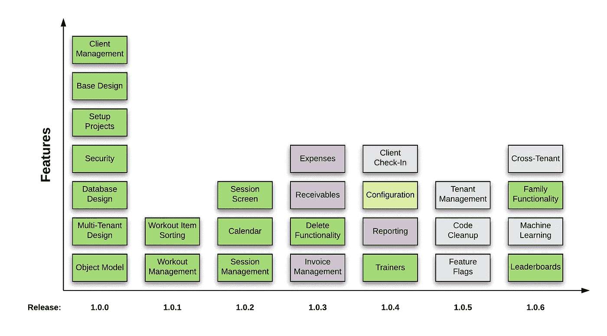
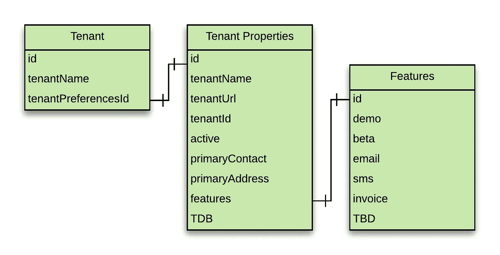
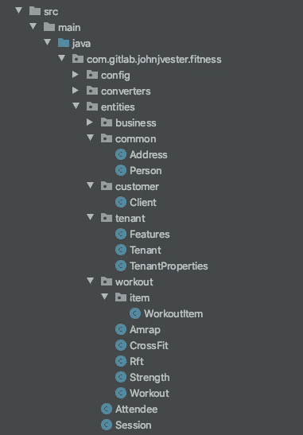

# 使用 Heroku 快速构建多租户 SaaS 创业公司(第 1 部分)

> 原文：<https://levelup.gitconnected.com/using-heroku-to-quickly-build-a-multi-tenant-saas-startup-part-1-9f0da344a7a4>

[在这个由多个部分组成的系列中，我将把一个新的应用程序转换成在 Heroku 生态系统中运行的多租户体验。本文主要关注对象模型、设计、架构和安全性。]

我的妻子妮可有一个同卵双胞胎叫丹妮儿。虽然妮可和丹耶尔一直保持着自己的个性，但她们都热衷于保持良好的身体状态和坚持日常锻炼。事实上，Danyel 决定发展她的健身热情，并开始在她位于拉斯维加斯地区的私人健身房训练其他人。在听说 Danyel 在创业过程中所做的工作(即许可证、法律文件和保险)时，我询问了她跟踪业务的计划。

长话短说，Danyel 一直专注于让她的业务运行，但并没有专注于拥有必要的技术来满足她的业务需求。由于我刚刚成功地将我岳母的应用程序从亚马逊网络服务(AWS)转换到 Heroku(见[Heroku——我的新家](/heroku-my-new-home-f8ecfbc33886))，我认为是时候从应用程序的角度来帮助 Danyel 的业务了。

经过几次视频通话和对拉斯维加斯地区的快速访问，我们确定新的健身应用程序将在初始版本中提供以下功能:

*   客户管理(管理她的客户)
*   锻炼管理(为她的顾客创造日常活动)
*   会话管理(创建由一个健身程序组成的健身程序会话，至少为一名客户)

展望未来，我后来绘制了未来功能的图表:



在向 Nicole 展示应用程序的进度时，她漫不经心地问道:“我想知道有多少其他私人教练可能对拥有一个像你为我妹妹开发的应用程序这样的应用程序感兴趣？”

Nicole 的问题激发了我去改变我的设计，创建一个不仅仅是她姐姐可以使用的系统。Nicole 的评论将我的设计从一个在 Heroku 上运行的简单应用程序转变为一个可以被多个健身教练使用的多租户应用程序，而不管他们在哪里。从那时起，我开始考虑为私人教练提供类似 Salesforce 的体验。

从技术角度来看，我想看看我能多快、多容易地构建一个 SaaS 解决方案，供多个健身教练使用。从商业角度来看，这种解决方案不仅可以让健身教练管理他们的客户、锻炼和会议，还可以成为他们业务各个方面的单一参考点，而且月租费很低。

借助 Heroku 生态系统中可用的扩展选项，应用程序和数据库可以根据需要进行扩展。来自订户的收入将为额外的 Heroku 成本提供资金，使我的个人投资成本保持在较低水平。更重要的是，Heroku 的易用性将允许我继续构建上面功能表中提到的功能，而不会被基础设施知识和决策所困扰。

我计划如何推广该解决方案？不太确定…太兴奋了以至于不能开始把我的想法付诸实施。

然而，有了这个新的设计概念，我需要弄清楚如何做三件事:

1.  设计一个像单个应用程序一样运行的多租户应用程序
2.  了解安全性的工作原理以及与单一应用程序的不同之处
3.  保护数据的安全，即使狡猾的开发者试图访问 API

# 设计多租户应用程序

根据维基百科的说法，[多租户](https://en.wikipedia.org/wiki/Multitenancy)“指的是一种软件架构，其中一个软件实例运行在一台服务器上，为多个租户服务。”在这种情况下，我正在创建一个服务于多个健身教练的软件实例。因此，每个健身教练使用该系统的成本将远远低于这些人创建和托管自己的解决方案的成本。

通过一年来使用 AWS 的经验教训以及从 AWS 到 Heroku 的转换工作，我的研究引导我在这个应用程序中使用 Heroku。我知道多租户对 Heroku 来说不是一个挑战，他们以开发人员为中心的方法非常适合我的情况。毕竟，我还在做全职工作，家里还有一个蹒跚学步的孩子。

鉴于我在 Java/Spring Boot 和 Angular 方面的经验，我决定坚持使用我了解并尊重的技术。从数据库的角度来看，MySQL 似乎也很适合这个应用程序，它在 Heroku 中运行时将使用 ClearDB 选项。

为了采用多租户设计，数据(客户、锻炼、会话等。)需要保护每个租户(健身教练)不受其他租户影响。在较高层次上，创建了一个租户对象，它包括一个租户属性对象，该对象将提供有关租户的属性，并链接到一个功能对象(其中可以启用/禁用某些功能)。



从实体的角度来看，为应用程序创建的所有对象都将包含对租户对象的 tenantId 引用。因为我使用 Spring Boot 作为 RESTful API，下面是一个客户端对象的例子:

```
@AllArgsConstructor@NoArgsConstructor@Data@Entity@Table(name = “clients”)public class Client { @Id @GeneratedValue(strategy = GenerationType.IDENTITY) private long id; @OneToOne private Tenant tenant; private boolean active; @OneToOne private Person person; @OneToOne private Address address;}
```

使用相同的模式，为初始版本创建了剩余的实体:



知道 Spring JPA 能够为数据库层创建必要的 SQL，我决定尝试一下这个选项。尽管我将`application.yml`用于我的属性文件，但我还是将下面的 application.properties 文件放到了我的 resources 文件夹中:

```
spring.jpa.properties.javax.persistence.schema-generation.scripts.action=create
spring.jpa.properties.javax.persistence.schema-generation.scripts.create-target=fitness.sql
spring.jpa.properties.javax.persistence.schema-generation.scripts.create-source=metadata
```

接下来，我启动了 Spring Boot 服务，并能够在一个名为`fitness.sql`的文件中看到健身数据库的完全填充的数据定义语言(DDL)脚本。

使用 Docker、Docker Compose 和 MySQL 基础映像，我能够在几分钟内快速启动并运行数据库。如上所述，我计划在 Heroku 中使用 ClearDB，但是我还没有准备好。对于那些不想使用 Docker 甚至不想在本地运行数据库的人来说，可以在 Heroku 中创建一个数据库实例，然后使用。要附加到远程实例的 env 文件。

此后，我删除了 application.properties 文件，并暂时关闭了我的 RESTful API。

# 选择安全提供者

过去五年来，Okta 提供的服务给我留下了深刻的印象。在多个项目中，我还没有发现 Okta 工具集不能满足项目需求的场景。然而，在这种情况下，我的多租户应用程序的最终状态是 Heroku。所以，我想利用他们推荐的安全合作伙伴。

令我惊讶的是，Heroku 实际上已经与 Okta 在应用安全方面进行了合作。事实上，将 Okta 添加到 Heroku 应用程序就像下面的 CLI 命令一样简单:

```
heroku addons:create okta
```

虽然该功能还处于测试阶段，但它会自动创建所有必需的项目，使您的 Heroku 应用程序能够与 Okta 集成。[点击这里了解更多信息](https://devcenter.heroku.com/articles/okta)。

# 安全拦截器

为了保护一个租户免受另一个租户的攻击，我想引入一个 SecurityInterceptor 来加强每个请求的安全性。这样，如果一个狡猾的用户试图在 HTTP 请求期间更改对象键，拦截器就会抛出一个错误。因此，所有非匿名请求都通过以下类传递:

```
public class SecurityInterceptor extends HandlerInterceptorAdapter { @Override public boolean preHandle(HttpServletRequest request, HttpServletResponse response, Object handler) { if (SecurityContextHolder.getContext().getAuthentication() != null && SecurityContextHolder.getContext().getAuthentication().getName() != null) { try { // Perform the necessary logic
                     processRequest(SecurityContextHolder.getContext().getAuthentication().getName()); return true; } catch (FitnessException e) { log.error(“Error code={}, message={}”, e.getCode(), e.getMessage(), e); response.setStatus(HttpServletResponse.SC_UNAUTHORIZED); return false; } } log.error(“Could not determine requester information”); response.setStatus(HttpServletResponse.SC_UNAUTHORIZED); return false; }}
```

processRequest()方法将从 authentication.name 属性(来自经过身份验证的 Okta 用户)中提取必要的信息，并尝试检索请求的租户记录。

如果请求不成功，就会抛出 FitnessException，导致向请求者返回 401(未授权)错误。但是，如果请求成功，拦截器代码将在请求上创建/放置以下对象以供将来使用:

```
@AllArgsConstructor@NoArgsConstructor@Datapublic class UserData {private Tenant tenant;private Person person;}
```

现在，在请求生命周期中，对租户/个人(应用程序的用户)的引用将在所有 HTTP 请求中使用，而不是随请求提供的值。

# 展望未来

总而言之，在这一点上，已经实施了以下设计:

*   初步设计已经完成
*   暂定发布时间表已经确定
*   多租户设计已经过验证
*   提供的担保已经选择和确定

在下一篇文章中，我将重点介绍为 1.0.0 版本安装和运行多租户客户机和服务器，这将包括以下架构和设计:

*   Angular 9.1.11(浏览器客户端)
*   Spring Boot 2.3.1 (RESTful API)
*   ClearDB/MySQL(数据库)
*   Okta(安全)
*   GitLab(源代码管理和 CI/CD)
*   Heroku(应用托管)

祝你今天过得愉快！