# 使用 Heroku 快速构建 SaaS 产品第 2 部分—集成 Twilio

> 原文：<https://levelup.gitconnected.com/using-heroku-to-quickly-build-a-saas-product-part-2-integrating-twilio-79190fabd030>

在“[使用 Heroku 快速构建多租户 SaaS 产品](/using-heroku-to-quickly-build-a-multi-tenant-saas-startup-part-1-9f0da344a7a4) t”一文中，我记录了我正在构建的一个新的 SaaS 解决方案的基础(最初是为我的嫂子构建的)——利用了 [Heroku](https://www.heroku.com) 生态系统。在那篇文章的最后，我计划写一些核心技术(Spring Boot、Angular 9、ClearDB、Okta、GitLab 和 Heroku ),因为我们正在为解决方案的 1.0.0 版本而努力。

然而，这里的事情发展得很快，我在很大程度上将开发速度和最终用户的采用归功于 Heroku 为这项服务带来的一切。正如我之前提到的，使用 Heroku 作为我的服务和 GitLab 内置 CI/CD 管道的目的地——从客户端或服务的功能分支合并到主分支的更新会自动部署到生产(Heroku)中，无需任何进一步的干预。

该项目实际上是在结束 1.0.3 版本，而不是开始 1.0.1 版本。以下是更新后的要素地图:

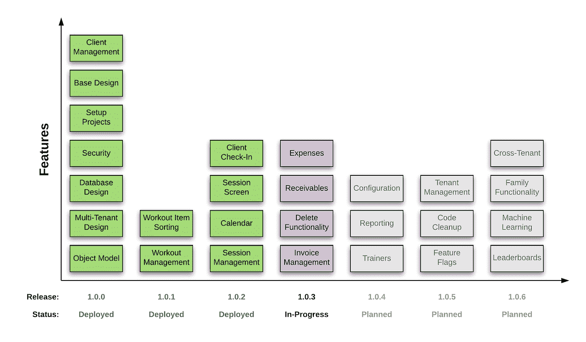

# 通过截图取得进展

自从使用 Spring JPA 创建初始模式(它没有出现任何问题)以来，我一直手动更新 fitness.sql，因为需要模型更新。使用 IntelliJ 理念和内置数据库工具(包括 yFiles)，我能够快速创建当前 MySQL/ClearDB 数据库结构的如下图表:

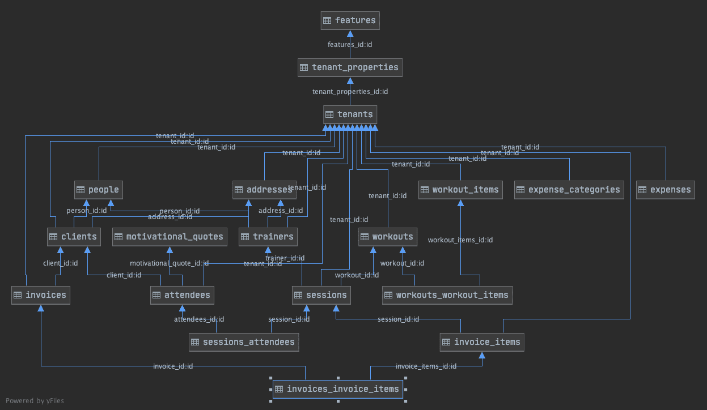

正如在上一篇文章中提到的，一切都与租户(或健身教练)的 ID 有关——这也是在服务级别采用的基本 JPA 规范中强制执行的。

这些更改以及客户端配置和健身程序配置屏幕允许引入会话屏幕:

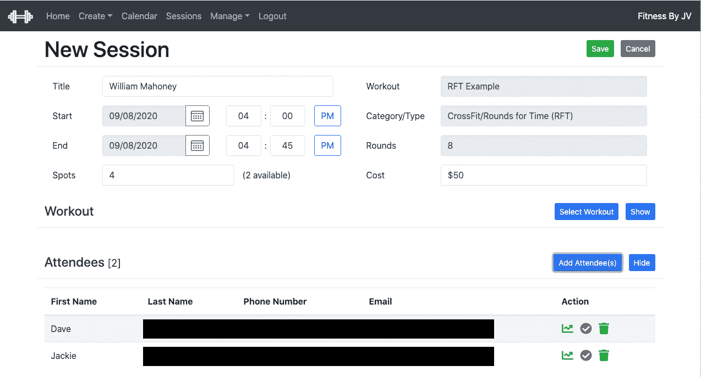

课程(是一个健身程序和至少一个客户的实例)显示在可选的日历视图中，让教练一目了然:

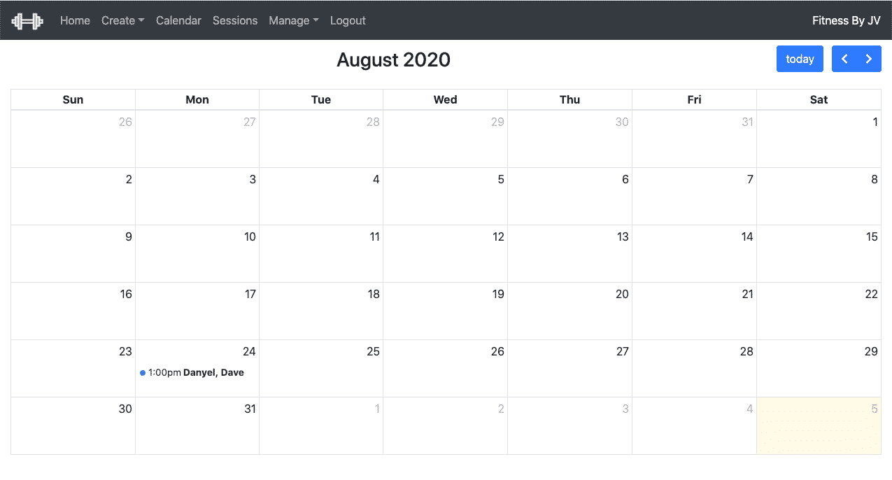

在上面的例子中，只安排了一个事件——因为屏幕截图来自我在 SaaS 解决方案生产实例中的测试帐户。

还有一个培训模式版本的会话屏幕，它主要是一个只读的适应，并整合数据以供快速参考。

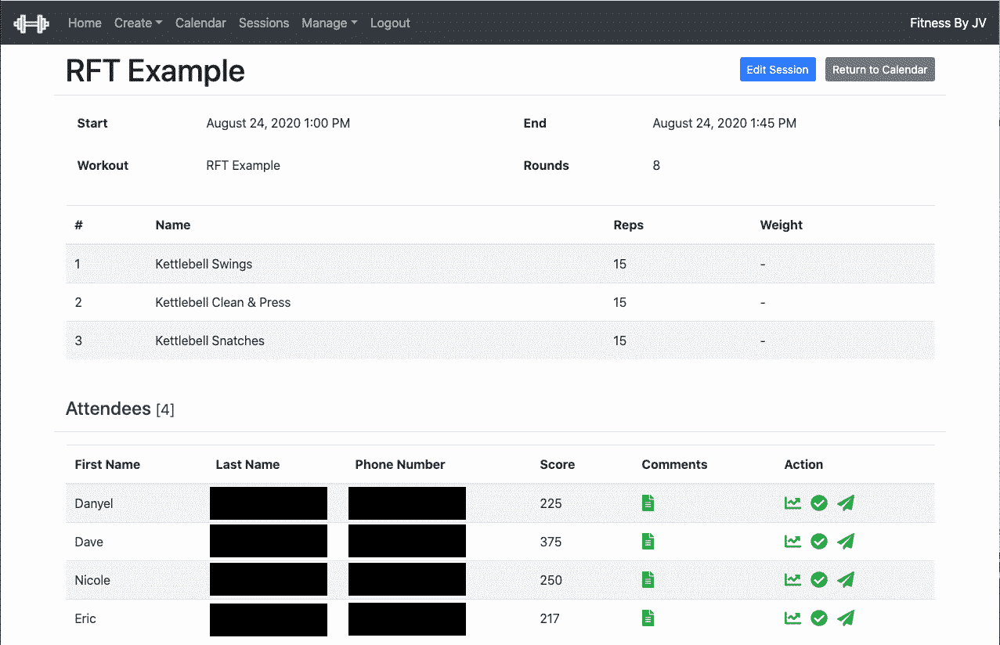

该屏幕上的图标仍处于活动状态，因此培训师不仅可以登记客户，还可以提供课程信息(分数和评论):

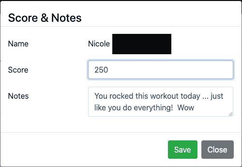

# 一路走来……人们发现了提里奥

1.0.4 版本中的一个项目被称为客户端签入。我们很快意识到拥有一个训练者与客户交流的机制是一个重要的方面，这是接下来需要处理的。

以下是该功能采用的要求:

*   在客户预定会话前 24 小时左右向客户发送提醒
*   锻炼结束后发送锻炼总结
*   为会话重新发送提醒
*   允许培训师发送广播短信(例如，“我要去度假”)
*   提供一个链接，允许客户确认/取消他们的会议(计划在未来的文章)

由于移动客户端的概念超出了当前的功能路线图，我需要找到一个适用于大多数客户端的解决方案。知道每个客户端都通过移动设备与我的嫂子通信，我决定使用 SMS(或文本消息)为应用程序提供一个轻量级客户端。

很快就选定了 Twilio——特别是因为在 Twitch 上播出节目的两位同事( [roberttables](https://www.twitch.tv/roberttables) 和 [blendedsoftware](https://www.twitch.tv/blendedsoftware) )一直在参与 Twilio 的“ [TwilioQuest](https://www.twilio.com/quest) ”令人敬畏的学习体验。事实上，如果两人的频道上还有他们玩“TwilioQuest”游戏的视频，我不会感到惊讶。

Twilio 用一个健壮的 API 提供了我需要的功能。我很快就建立了一个试用账户(仅与添加到系统中的手机号码通信)，但这足以让我验证功能。

# 为 Twilio 做准备

第一步是通过访问以下 URL 在 Twilio 中创建新帐户:

[https://www.twilio.com/try-twilio](https://www.twilio.com/try-twilio)

这将引导第一次使用的用户看到如下所示的屏幕:

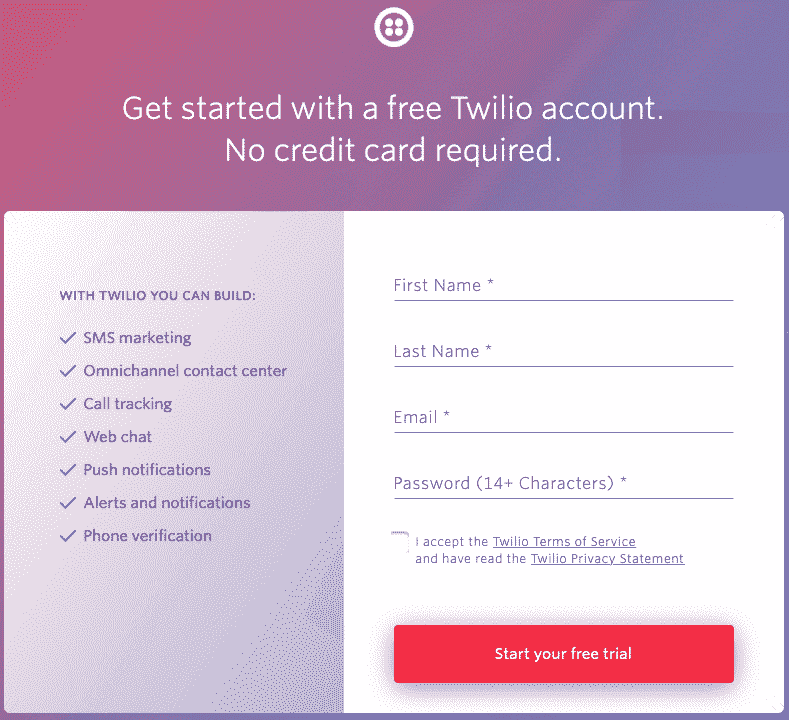

完成所有设置后，Twilio 仪表盘将如下所示:

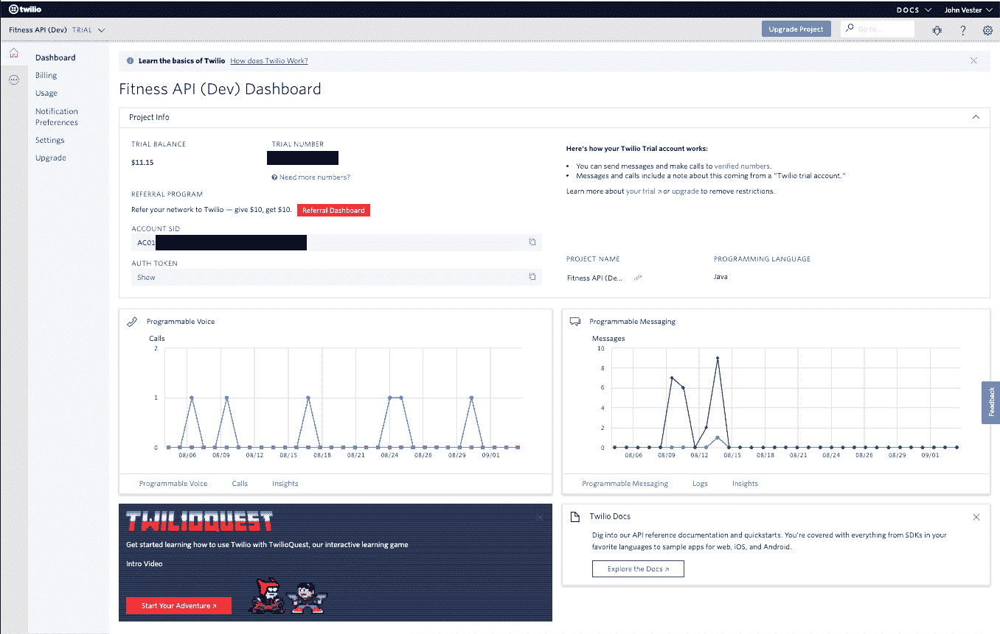

可通过此屏幕访问帐户 SSID 和身份验证令牌。

我想在 mode project 中以编程方式配置 Twilio，以便使用我的 Twilio 生产实例基于从 Heroku 传入的环境变量。下面是我在 API 中管理的属性列表:

```
jvc:
  sms:
    twilio:
      enabled: ${TWILIO_ENABLED}
      account-sid: ${TWILIO_ACCOUNT_SID}
      auth-token: ${TWILIO_AUTH_TOKEN}
      phone-number: ${TWILIO_PHONE_NUMBER}
      enable-reply: ${TWILIO_ENABLE_REPLY}
      reply-host: ${TWILIO_REPLY_HOST}
      trial: ${TWILIO_IS_TRIAL}
      trial-phone-number: ${TWILIO_TRIAL_PHONE_NUMBER}
      cron-schedule-reminder: “0 17 * * * ?”
      cron-schedule-summary: “0 27 * * * ?”
```

my API 存储库的 README.md 提供了特定于环境的值的文档详细信息:

```
${TWILIO_ENABLED} — Twilio (SMS) enabled [jvc.sms.twilio.enabled] (set to false in order to disable SMS)${TWILIO_ACCOUNT_SID} — Twilio (SMS) account SID [jvc.sms.twilio.account-sid] (leave unset to disable SMS, recommended for non-Production environments)${TWILIO_AUTH_TOKEN} — Twilio (SMS) auth token [jvc.sms.twilio.auth-token] (leave unset to disable SMS, recommended for non-Production environments)${TWILIO_PHONE_NUMBER} — Twilio (SMS) phone number to use for sending messages [jvc.sms.twilio.phone-number]${TWILIO_ENABLE_REPLY} — Twilio (SMS) enablement of reply functionality [jvc.sms.twilio.enable-reply]${TWILIO_REPLY_HOST} — Twilio (SMS) reply host URL (of Angular client) to use when reply functionality is enabled [jvc.sms.twilio.reply-host] (value should not end with a /)${TWILIO_IS_TRIAL} — Twilio (SMS) trial indicator [jvc.sms.twilio.trial] (use for non-Production instances)${TWILIO_TRIAL_PHONE_NUMBER} — Twilio (SMS) trial phone number to send to [jvc.sms.twilio.trial-phone-number] (use for non-Production instances)
```

基于 cron 的项目确定在每个环境中运行的会话提醒和会话摘要作业的计划(如果启用)。

在 Spring Boot 内部，创建了一个简单的 TwilioConfigurationProperties 类:

```
@Data
@Configuration(“twilioConfigurationProperties”)
@ConfigurationProperties(“jvc.sms.twilio”)
public class TwilioConfigurationProperties {
  private boolean enabled;
  private String accountSid;
  private String authToken;
  private String phoneNumber;
  private boolean enableReply;
  private String replyHost;
  private boolean trial;
  private String trialPhoneNumber;
  private String cronScheduleReminder;
  private String cronScheduleSummary;
}
```

设置好这些值后，我可以使用 IntelliJ IDEA 中的运行/调试对话框来传入预期的值:

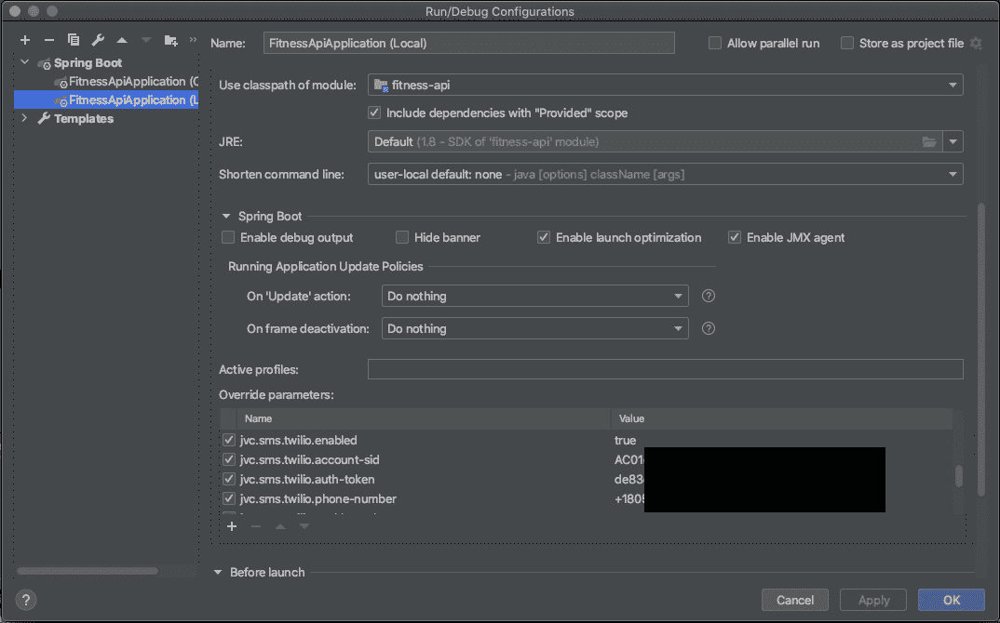

在 Heroku 中，这些值是在环境中设置的:

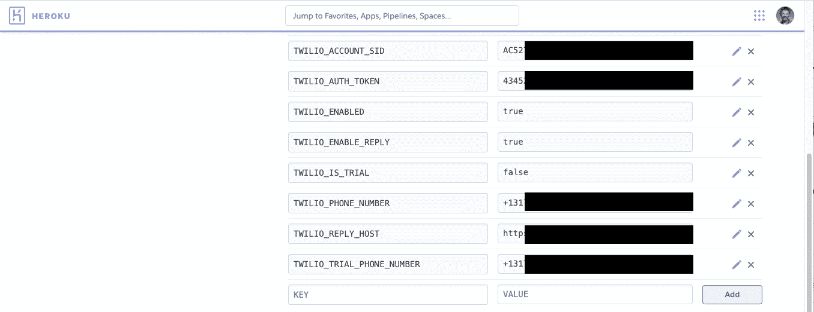

请记住，Heroku 值是不同的，因为这实际上是我正在运行的生产实例。

# 短信服务

在 SmsService 中，可以使用以下公共方法:

```
@RequiredArgsConstructor
@Slf4j
@Service
@Transactional
public class SmsService {
  @Resource(name = “requestScopeUserData”)
  private UserData userData; private final AttendeeRepository attendeeRepository;
  private final MotivationalQuoteRepository motivationalQuoteRepository;
  private final SessionRepository sessionRepository;
  private final TwilioConfigurationProperties twilioConfigurationProperties; public void sendGroupMessage(GroupSmsMessage groupSmsMessage) throws FitnessException {
    // allows a trainer to send a SMS message to a select group of customers
  } public void sendSimpleMessage(SimpleSmsMessage simpleSmsMessage) {
    // allows the system to send a single SMS message, which is used to send a message to the trainer each time a client confirms or cancels their session
  } public void resendSingleReminder(long attendeeId) {
    // allows the trainer to render the session reminder.
  } @Scheduled(cron = “${jvc.sms.twilio.cron-schedule-reminder}”)
  public void sendSmsMessages() {
    // allows the trainer to render the session reminder.
  } @Scheduled(cron = “${jvc.sms.twilio.cron-schedule-summary}”)
  public void sendSmsSummaryMessages() {
    // ran hourly, provides a workout summary (including a random fitness quote) to the customer — which can include:
    // — the score from the session
    // — any comments provided by the trainer
    // — a random fitness quote
  }
}
```

这些方法或者由计划任务调用，或者由来自 Angular 客户端的请求触发。下一节将展示一个示例，说明 Angular 客户端如何与 Spring Boot 服务进行交互，以便与 Twilio 服务进行通信。

# 示例—发送群发消息

发送群组消息是由 Angular 客户端发起的。下面显示了一个示例:

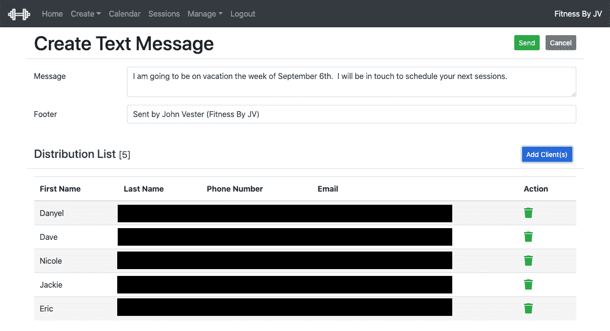

该请求被传递到 Spring Boot 的以下控制器:

```
@PostMapping(value = “/sms”)
public ResponseEntity<Void> postSession(@RequestBody GroupSmsMessage groupSmsMessage) {
  try {
    smsService.sendGroupMessage(groupSmsMessage);
    return new ResponseEntity<>(HttpStatus.CREATED);
  } catch (FitnessException e) {
    log.error(e.getMessage());
    return new ResponseEntity<>(HttpStatus.BAD_REQUEST);
  }
}
```

GroupSmsMessage 对象具有以下属性:

```
@Data
public class GroupSmsMessage {
  private String messageBody;
  private List<ClientDto> distributionList = new ArrayList<>();
}
```

控制器然后调用以下方法:

```
public void sendGroupMessage(GroupSmsMessage groupSmsMessage) throws FitnessException {
  log.info(“sendGroupMessage(groupSmsMessage={})”, groupSmsMessage); if (CollectionUtils.isEmpty(groupSmsMessage.getDistributionList())) {
    throw new FitnessException(FitnessException.ENTITIES_MISSING,
    “Could not send group SMS message to an empty distribution
     list.”);
  } if (StringUtils.isEmpty(groupSmsMessage.getMessageBody())) {
    throw new FitnessException(FitnessException.ENTITIES_MISSING,
    “Could not send group SMS message with an empty message body.”);
  } if (!smsEnabled()) {
    throw new FitnessException(FitnessException.UNAUTHORIZED,
    “sendGroupMessage() SMS is NOT enabled to run on this 
    instance”);
  } Twilio.init(twilioConfigurationProperties.getAccountSid(), 
    twilioConfigurationProperties.getAuthToken());
  log.info(“sendGroupMessage() started”);
  logSmsInformation(); int successCount = 0;
  int errorCount = 0; for (ClientDto clientDto:groupSmsMessage.getDistributionList()) {
    Message message = Message.creator(
      new PhoneNumber(twilioConfigurationProperties.isTrial() ?   
        twilioConfigurationProperties.getTrialPhoneNumber() :
        clientDto.getPersonDto().getPhoneNumber()),
        new PhoneNumber
        (twilioConfigurationProperties.getPhoneNumber()),
         groupSmsMessage.getMessageBody()).create(); if (message.getErrorCode() == null &&
      StringUtils.isEmpty(message.getErrorMessage())) {
      successCount++;
    } else { errorCount++; log.error(“Error #” + message.getErrorCode() + “(“ + 
      message.getErrorMessage() + “) occurred sending smsMessage=” + 
      groupSmsMessage.getMessageBody());
    }
 }
  log.info(“Successfully sent {} SMS messages ({} errors)”, 
    successCount, errorCount);
  log.info(“sendGroupMessage() completed”);
}
```

在上面的代码中，在检查了可能产生适应性异常的元素之后，调用了 Twilio.init()方法。此后，创建了一条消息，并且包含了在生产和非生产环境中起作用的逻辑。这基本上与不在生产环境中运行时使用提供的试用电话号码有关。其他一切都很简单，将 Angular 客户端收到的数据直接传递给目标分发列表。

# 结论

本文的目标是概述我正在构建的 SaaS 解决方案的一些客户端通信需求。此后，我提供了一个例子，说明创建一个 Twilio 实例并将解决方案集成到我的 Spring Boot 服务和 Angular 客户机中是多么容易。使用 Spring Boot 和 Angular 客户端，我能够在几个小时内快速轻松地配置好 SMS 通信。在我看来，Twilio 为我和 Heroku 一起使用的服务提供了一个极好的补充。

从成本角度来看，我的嫂子已经使用 SMS 功能两个月了，我两天前刚刚在我的生产 Twilio 帐户中增加了更多的钱。此时，总使用量正好是每月 10 美元——远远低于我预期的使用量。

在下一篇文章中，我计划讨论如何使用 Twilio 发送会话提醒，提供一种机制让客户可以确认或取消他们对该会话的出席。我最初计划将所有内容都包含在一篇文章中，但是我觉得专门为这一功能写一篇文章会更好。在以后的另一篇文章中，我计划深入研究如何将最终用户对原始(Twilio)短信的回复重定向到该客户的实际培训师。激动人心的文章策划，肯定！