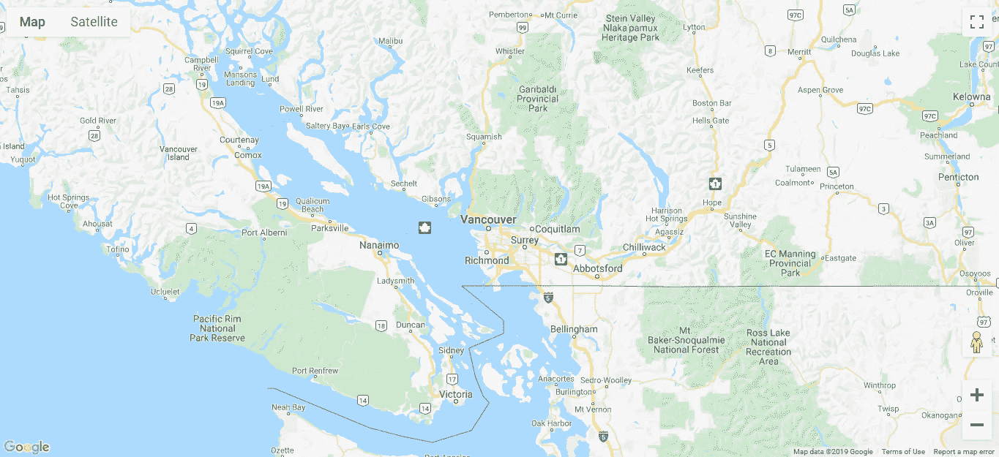

# 在 Web 应用中使用 HTML5 APIs

> 原文：<https://levelup.gitconnected.com/using-html5-apis-in-our-web-app-f23b4aa974ac>


莱昂·塞伯特在 [Unsplash](https://unsplash.com?utm_source=medium&utm_medium=referral) 上的照片

HTML5 为开发人员带来了许多令人兴奋的新功能，以增强他们的 web 应用程序。它允许开发人员从新硬件访问数据，并添加了以前没有的多媒体功能和必需的插件。一些新东西包括音频和视频 API、用于流式视频和音频的 WebRTC、从移动设备访问电池数据、定位设备的物理位置等等。

API 规范非常详细。一切都被定义到单个函数的级别，开发人员可以调用这些函数来确保 API 的存在。例如，我们可以调用电池状态 API 中的函数来获取设备的电池电量，并使用属性来访问电池电量和充电状态。该规范非常精确，它告诉开发人员如何利用 API。我们可以知道 API 如何与使用它的软件交互，以及软件应该如何处理从 API 返回的结果。还有很多 API 还没有定型，不应该用于生产。它们是实验性的，可能会有突破性的变化。

每个浏览器对新的 API 都有不同程度的支持。您必须仔细检查，看看您的 web 应用程序所需的浏览器是否能与所需的 API 一起工作。然而，在大多数情况下，对最流行的 API 的支持在最流行的浏览器中更加一致。

要检查对不同浏览器 API 的 API 支持，我们可以使用位于[https://developer.mozilla.org/en-US/](https://developer.mozilla.org/en-US/)的 Mozilla 开发者网络文档，或者使用像[www.caniuse.com](http://www.caniuse.com.)这样的网站，其中列出了所有的 API 和每个 API 的浏览器支持。我们可以在细节中看到哪些版本支持它，这样我们就可以正确地处理用法。

以下是 HTML5 API 规范中的一些 API:

*   电池状态:让我们检查设备的电池状态
*   剪贴板:允许我们将内容复制到操作系统的剪贴板
*   拖放:允许我们在应用程序周围添加拖放项目
*   Fetch:让我们比使用`XMLHttpRequest`更容易发出 HTTP 请求
*   文件:让我们安全地访问用户计算机上的文件
*   表单:添加了新的类型，我们可以用它们来进行表单验证，并以不同的方式呈现表单字段
*   地理定位:让我们定位设备的位置
*   getUserMedia/Stream:让我们从外部设备(如相机)获取音频和视频
*   索引数据库:让我们在本地存储数据库数据
*   国际化:提供国际格式和字符串比较特性
*   屏幕方向:让我们检查设备的屏幕方向
*   选择:让我们使用 CSS 选择器选择元素
*   服务器发送的事件:允许服务器将数据推送到客户端，而无需在客户端请求数据
*   用户计时:让我们获得更精确的时间戳来衡量应用程序的性能
*   振动:让我们让设备振动，如果它有这个能力的话
*   网络音频:让我们在客户端处理音频
*   网络语音:让我们将文本到语音的功能添加到我们的网络应用中
*   Web sockets:让我们在客户机和服务器之间进行实时通信
*   Web workers:让我们在用户浏览器的后台运行任务

下面我们将讨论一些最流行的 HTML5 APIs。

# 地理定位 API

地理定位 API 允许我们在用户允许的情况下获取设备的物理位置。它是一个受到良好支持的 API，在超过 90%的桌面和移动浏览器中实现。我们可以通过使用`navigator.geolocation`对象来获取设备的地理位置信息。这为我们提供了纬度(以十进制度表示)、经度(以十进制度表示)、海拔(以米表示)、设备前进的方向、设备行进的速度以及经度和纬度(以米表示)的精确度等信息。

当 JavaScript 应用程序发起对设备位置的请求时，它必须经过许多步骤才能接收数据。首先，应用程序必须向用户请求获取数据的权限。这通常通过弹出窗口或通知来完成。

一旦用户允许应用程序获取数据，就会显示一个图标，指示应用程序可以通过地理位置 API 获取数据。有几种方法可以获得数据。最准确的是使用设备的全球定位系统。这将需要更长的时间，但这是最准确的方法。如果 GPS 不可用或我们希望它更快地获得位置，那么我们使用设备的无线网络连接、您的手机或移动设备所连接的手机信号塔或设备的 IP 地址。

## 访问用户的位置

JavaScript 中的地理定位是通过`navigator.geolocation`对象的`getCurrentPosition`方法完成的。它需要三个参数。第一个是当地理位置数据被成功检索时的回调。回调函数应该有一个我们可以用来获取数据的`Position`对象。第二个参数是在获取地理位置数据失败时调用的回调函数。这个回调函数应该有一个包含错误细节的`PositionError`对象。第三个参数是一个带有地理定位选项的对象，它控制如何进行位置查找。

我们在第一个参数中传递的成功回调中的`Position`对象将有 2 个属性。它有一个`coords`属性，带有设备在地球上的坐标，其中有纬度、经度、海拔等。，这些都是我们之前描述过的属性。还有一个`timestamp`属性，让我们知道数据何时被检索。

要获取设备的位置，我们可以将以下内容放入脚本文件中:

```
navigator.geolocation.getCurrentPosition(
   (position) => {
     for (key in position.coords) {
       console.log(key, position.coords[key])
     }
   });
```

当这个脚本运行时，浏览器将请求允许启用地理定位。如果我们允许这样做，那么我们将在`position`对象中获得数据。当我们打开浏览器的 Chrome 开发者控制台并点击控制台选项卡时，我们会看到如下内容:

```
latitude 41.2833669
longitude -120.040943
altitude null
accuracy 960
altitudeAccuracy null
heading null
speed null
```

`altitude`、`heading`、`speed`是`null`，因为设备没有移动，也没有上下移动。

## 在谷歌地图中使用地理定位 API

使用谷歌地图，我们可以将我们的纬度和经度转换成地图上的位置。为此，我们使用谷歌地图 API 来添加我们的坐标。要使用谷歌地图 API，我们必须注册一个 API 密钥。对于使用率低的情况，这是免费的，但不管怎样，我们必须输入信用卡号码才能注册。我们可以通过[https://developers.google.com/maps](https://developers.google.com/maps)上的“开始”链接注册，然后按照说明进行操作。

注册后，我们输入以下代码来显示您设备位置的谷歌地图。首先，在`index.html`中，我们添加:

```
<html>
  <head>
    <title>Google Map</title>
    <link href="styles.css" rel="stylesheet" type="text/css" />
  </head>
  <body>
    <div id="map"></div>
    <script src="script.js"></script>
    <script
      async
      defer
      src="[https://maps.googleapis.com/maps/api/js?key=YOUR_API_KEY&callback=initMap](https://maps.googleapis.com/maps/api/js?key=YOUR_API_KEY&callback=initMap)"
    ></script>
  </body>
</html>
```

然后在`scripts.js`中，我们添加:

```
initMap = () => {
  navigator.geolocation.getCurrentPosition(position => {
    const map = new google.maps.Map(document.getElementById("map"), {
      center: { lat: position.coords.latitude, lng: position.coords.longitude },
      zoom: 8
    });
  });
};
```

在`styles.css`中，我们添加:

```
#map {
  height: 100%;
}html,
body {
  height: 100%;
  margin: 0;
  padding: 0;
}
```

我们所要做的就是像前面的例子一样获取地理位置数据，然后从`position`对象中我们访问回调中的位置。我们将希望显示地图的元素和`center`对象中的纬度和经度传递到 Google Map 的构造函数中。我们还传入了`zoom`属性来设置默认的缩放级别。重要的是我们有在`styles.css`中的代码，因为默认高度是 0。为了显示地图，我们必须显式地设置它。同样在`index.html`中，我们必须用你注册时获得的谷歌地图 API 密钥替换`YOUR_API_KEY`。

完成所有这些后，我们应该得到类似于:



# 从设备访问音频和视频

使用 HTML5，我们可以从连接到计算机的设备或内置在便携式设备中的相机获取音频和视频，而无需任何插件。WebRTC API 是实现这一点的方法。WebRTC 代表网络实时通信。如果你的浏览器支持 WebRTC，我们应该会得到一个`navigatior.getUserMedia()`方法，它从用户的设备中获取音频和视频。

大多数流行的浏览器都支持它，所以使用起来很安全。如果您想要使用的浏览器不支持它，我们可以添加聚合填充来增加对它的支持。`getUserMedia`对象接受几个参数。第一个是具有布尔属性`video`和`audio`的对象。例如，如果我们想同时获得视频和音频，那么就传入 `{video: true, audio: true}`。`getUserMedia`函数的第二个参数是成功获取数据时的回调函数，最后一个参数是获取数据出错时调用的回调函数。

要使用`getUserMedia`函数，我们可以编写以下代码从麦克风获取音频，并在浏览器中播放。在`index.html`中，我们添加了以下内容:

```
<html>
  <head>
    <title>Audio Playback</title>
  </head>
  <body>
    <h1>Audio Playback</h1>
    <audio id="audio"></audio>
    <script src="script.js"></script>
  </body>
</html>
```

然后在`scripts.js`中我们添加:

```
window.onload = () => {
  navigator.getUserMedia =
    navigator.getUserMedia ||
    navigator.webkitGetUserMedia ||
    navigator.mozGetUserMedia ||
    navigator.msGetUserMedia;
  if (navigator.getUserMedia) {
    const audio = document.getElementById("audio");
    navigator.getUserMedia(
      {
        video: false,
        audio: true
      },
      stream => {
        audio.srcObject = stream;
        audio.play();
      },
      error => {}
    );
  }
};
```

在运行该功能之前，我们检查我们选择的浏览器是否支持`getUserMedia`。然后在第一个参数中，我们传入`{ video: false, audio: true }`只获取音频。然后在成功回调函数中，我们获取包含从麦克风输入的音频的`stream`对象，并将其直接赋给`audio`元素的`srcObject`属性。然后我们调用 audio 元素上的`play`来播放音频。当我们加载页面时，我们应该得到一个提示，允许浏览器从麦克风接收音频。如果我们选择允许它，那么当我们对着麦克风说话或向它发送任何声音时，音频应该从麦克风播放。

HTML5 APIs 很棒。它让开发人员安全地访问硬件和文件，允许我们创建更丰富的 web 应用程序。对于我们可以用这些 API 做什么，我们仅仅触及了皮毛。这些工具太多了，我们无法一一介绍，但它们为我们的用户提供了许多难以置信的体验。