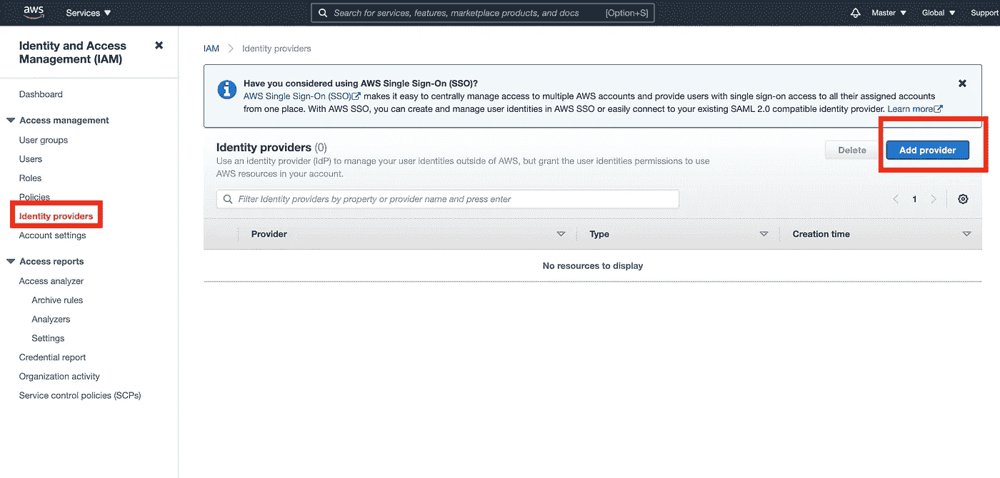
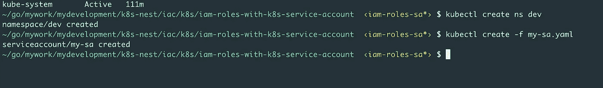

# 使用 IAM 角色允许 AWS EKS 中的 pod 读取 AWS S3 存储桶

> 原文：<https://levelup.gitconnected.com/using-iam-roles-to-allow-the-pods-in-aws-eks-to-read-the-aws-s3-bucket-be493fbdda84>

T he **AWS IAM(身份&访问管理)**服务允许 AWS 服务根据赋予其附属角色的策略进行交互。


AWS IAM

我们还可以将 **IAM 角色**与 **Kubernetes (k8s)本地服务帐户(SA)** 一起使用，这将允许在 Kubernetes 集群中运行的 pod 或 **AWS 弹性 Kubernetes 服务(EKS)** 与 AWS 服务对话。

在这篇博客中，我们将了解如何通过使用具有 Kubernetes 本地服务帐户的 IAM 角色，允许在 AWS EKS 运行的 Pod 列出 AWS S3 存储桶中的对象。

转到 AWS S3 服务，创建一个存储桶，然后向其中添加一些对象。


AWS S3 —桶创建— k8s-nest


AWS S3-添加对象


AWS S3

## 创建身份提供者:-

a) **从现有的 AWS EKS 集群中复制 OIDC (OpenID Connect)** 提供者 URL，例如，在我的例子中，这是 URL[https://oidc . eks . us-east-1 . Amazon AWS . com/id/8 b7d 06 ad 395 f 38 ce 1ee 8 ef 0 af 2922255](https://oidc.eks.us-east-1.amazonaws.com/id/8B7D06AD395F38CE1EE8EF0AF2922255)


AWS EKS — OIDC

b)转到 IAM -> **身份提供者**，单击“**添加提供者**”按钮，然后选择“ **OpenID 连接**”。



IAM —身份提供者

将复制的 OIDC 网址(来自 EKS)粘贴到'**提供商网址**选项下，点击'**获取指纹**按钮，将**sts.amazonaws.com**放在'**受众**选项下，如下图所示。根据需要添加标签，并单击末尾的“**添加提供者**”按钮添加身份提供者。


身份提供者

## 创建 IAM 策略以读取 S3 存储桶中的对象:-

转到 IAM 策略，使用以下 JSON 创建一个自定义策略，以从 S3 存储桶中读取对象:-

```
{
 “Version”: “2012–10–17”,
 “Statement”: [
    {
      “Effect”: “Allow”,
      “Action”: [
               “s3:ListBucket”,
               “s3:GetObject”
       ],
       “Resource”: “arn:aws:s3:::k8s-nest”
    }
 ]
}
```

## 创建与身份提供者具有信任关系的 IAM 角色:-

转到 IAM，创建一个信任类型为“ **Web identity** ”的新角色，并选择我们之前创建的正确身份提供者(从下拉列表中)和受众**sts.amazonaws.com**，然后单击“**下一步:权限**按钮，如下所示:-


IAM 角色 Web 身份

附加先前创建的。读取 S3 存储桶对象的自定义策略:-


IAM 角色-附加策略

为角色命名并创建它。

然后再次打开同一个角色并编辑它的信任关系，以确保只有一个特定的 Kubernetes 服务帐户可以承担这个角色。


IAM 角色


IAM 角色—编辑信任关系


根据策略，**将仅** **允许**名为“ **my-sa** ”(在名称空间“ **dev** ”)的 Kubernetes 服务帐户使用**AWS STS****AssumeRoleWithWebIdentity**来承担角色“***custom-read-S3-bucket-objects*”。**

```
{
  "Version": "2012-10-17",
  "Statement": [
    {
      "Effect": "Allow",
      "Principal": {
        "Federated": "arn:aws:iam::195725532069:oidc-provider/oidc.eks.us-east-1.amazonaws.com/id/8B7D06AD395F38CE1EE8EF0AF2922255"
      },
      "Action": "sts:AssumeRoleWithWebIdentity",
      "Condition": {
        "StringEquals": {
          "oidc.eks.us-east-1.amazonaws.com/id/8B7D06AD395F38CE1EE8EF0AF2922255:sub": "system:serviceaccount:dev:my-sa"
        }
      }
    }
  ]
}
```

AWS 侧的所有配置都已完成。现在，使用您的 CLI(命令行界面)在同一个 AWS EKS 集群中创建一个服务帐户和 Pod。

## 在 Kubernetes 中创建一个名称空间“dev”:

```
kubectl create ns dev
```

## 创建名为“my-sa”的服务帐户:

创建一个服务帐户**，为之前创建的 IAM 角色 ARN** 添加注释。如下图。


我扮演 ARN

```
apiVersion: v1
kind: ServiceAccount
metadata:
 name: my-sa
 namespace: dev
 annotations:
   eks.amazonaws.com/role-arn:  arn:aws:iam::195725532069:role/custom-read-s3-bucket-objectskubectl create -f my-sa.yaml
```



命令行界面

## 使用此服务帐户安排新的 Pod

不使用默认服务帐户，而是使用上面创建的帐户，即 **my-sa** ，并将其附加到 Pod，如下所示。

```
apiVersion: v1
kind: Pod
metadata:
  labels:
    run: my-pod
  name: my-pod
  namespace: dev
spec:
  serviceAccountName: my-sa
  initContainers:
  - image: amazon/aws-cli
    name: my-aws-cli
    command: ['aws', 's3', 'ls', 's3://k8s-nest/']
  containers:
  - image: nginx
    name: my-pod
    ports:
    - containerPort: 80
  dnsPolicy: ClusterFirst
  restartPolicy: Always
status: {}kubectl create -f my-pod.yaml
```


现在，检查 init 容器的日志，你会注意到 Pod 成功地承担了角色，并与 AWS S3 通信，以安全地列出其中的所有对象，并使用最小特权原则减小爆炸半径。

```
kubectl logs my-pod my-aws-cli -n dev
```


命令行界面— InitContainer


命令行界面— InitContainer

希望你喜欢这篇文章:)

# 一些有趣的事实

如果您在 pod 上描述或执行 get 操作，那么您会看到很多信息，尤其是关于新的**卷挂载(aws-iam-token)** 和 **AWS 环境变量**。

```
~/go/mywork/mydevelopment/k8s-nest/iac/k8s/iam-roles-with-k8s-service-account  ‹iam-roles-sa*› $ kubectl describe po my-pod -n dev                           1 

Name:         my-pod
Namespace:    dev
Priority:     0
Node:         ip-192-168-49-52.ec2.internal/192.168.49.52
Start Time:   Sun, 08 Aug 2021 13:22:39 +0530
Labels:       run=my-pod
Annotations:  kubernetes.io/psp: eks.privileged
Status:       Running
IP:           192.168.55.23
IPs:
  IP:  192.168.55.23
Init Containers:
  my-aws-cli:
    Container ID:  docker://b154f0044d33ae02282522fa9100466e4e5d7bd156fcdae808fbf3315dd55642
    Image:         amazon/aws-cli
    Image ID:      docker-pullable://amazon/aws-cli@sha256:598e7034c011611a9218c75f6305e528d63eea2898a02f94df0331a4c8eac66e
    Port:          <none>
    Host Port:     <none>
    Command:
      aws
      s3
      ls
      s3://k8s-nest/
    State:          Terminated
      Reason:       Completed
      Exit Code:    0
      Started:      Sun, 08 Aug 2021 13:22:40 +0530
      Finished:     Sun, 08 Aug 2021 13:22:41 +0530
    Ready:          True
    Restart Count:  0
    Environment:
      AWS_DEFAULT_REGION:           us-east-1
      AWS_REGION:                   us-east-1
      AWS_ROLE_ARN:                 arn:aws:iam::195725532069:role/custom-read-s3-bucket-objects
      AWS_WEB_IDENTITY_TOKEN_FILE:  /var/run/secrets/eks.amazonaws.com/serviceaccount/token
    Mounts:
      /var/run/secrets/eks.amazonaws.com/serviceaccount from aws-iam-token (ro)
      /var/run/secrets/kubernetes.io/serviceaccount from kube-api-access-ns57p (ro)
Containers:
  my-pod:
    Container ID:   docker://419aaf1b5493e099a7f94f5e0a31bc1b5d736766c909c41b921695b95dfa2aca
    Image:          nginx
    Image ID:       docker-pullable://nginx@sha256:8f335768880da6baf72b70c701002b45f4932acae8d574dedfddaf967fc3ac90
    Port:           80/TCP
    Host Port:      0/TCP
    State:          Running
      Started:      Sun, 08 Aug 2021 13:22:42 +0530
    Ready:          True
    Restart Count:  0
    Environment:
      AWS_DEFAULT_REGION:           us-east-1
      AWS_REGION:                   us-east-1
      AWS_ROLE_ARN:                 arn:aws:iam::195725532069:role/custom-read-s3-bucket-objects
      AWS_WEB_IDENTITY_TOKEN_FILE:  /var/run/secrets/eks.amazonaws.com/serviceaccount/token
    Mounts:
      /var/run/secrets/eks.amazonaws.com/serviceaccount from aws-iam-token (ro)
      /var/run/secrets/kubernetes.io/serviceaccount from kube-api-access-ns57p (ro)
Conditions:
  Type              Status
  Initialized       True
  Ready             True
  ContainersReady   True
  PodScheduled      True
Volumes:
  aws-iam-token:
    Type:                    Projected (a volume that contains injected data from multiple sources)
    TokenExpirationSeconds:  86400
  kube-api-access-ns57p:
    Type:                    Projected (a volume that contains injected data from multiple sources)
    TokenExpirationSeconds:  3607
    ConfigMapName:           kube-root-ca.crt
    ConfigMapOptional:       <nil>
    DownwardAPI:             true
QoS Class:                   BestEffort
Node-Selectors:              <none>
Tolerations:                 node.kubernetes.io/not-ready:NoExecute op=Exists for 300s
                             node.kubernetes.io/unreachable:NoExecute op=Exists for 300s
Events:
  Type    Reason     Age   From               Message
  ----    ------     ----  ----               -------
  Normal  Scheduled  15m   default-scheduler  Successfully assigned dev/my-pod to ip-192-168-49-52.ec2.internal
  Normal  Pulling    15m   kubelet            Pulling image "amazon/aws-cli"
  Normal  Pulled     15m   kubelet            Successfully pulled image "amazon/aws-cli" in 124.439524ms
  Normal  Created    15m   kubelet            Created container my-aws-cli
  Normal  Started    15m   kubelet            Started container my-aws-cli
  Normal  Pulling    15m   kubelet            Pulling image "nginx"
  Normal  Pulled     15m   kubelet            Successfully pulled image "nginx" in 134.055866ms
  Normal  Created    15m   kubelet            Created container my-pod
  Normal  Started    15m   kubelet            Started container my-pod
```

新的 AWS 环境变量和卷安装:-

```
env:
    - name: AWS_DEFAULT_REGION
      value: us-east-1
    - name: AWS_REGION
      value: us-east-1
    - name: AWS_ROLE_ARN
      value: arn:aws:iam::195725532069:role/custom-read-s3-bucket-objects
    - name: AWS_WEB_IDENTITY_TOKEN_FILE
      value: /var/run/secrets/eks.amazonaws.com/serviceaccount/tokenvolumes:
  - name: aws-iam-token
    projected:
      defaultMode: 420
      sources:
      - serviceAccountToken:
          audience: sts.amazonaws.com
          expirationSeconds: 86400
          path: token
```

环境变量**AWS _ WEB _ IDENTITY _ TOKEN _ FILE**和 **AWS_ROLE_ARN** 通过改变配置在 AWS EKS 中的 kube-api 服务器上的 webhook 控制器以及安装在容器中的卷( **aws-iam-token** )被动态注入到 Pod 清单文件中。 **aws-iam-token** 卷**Pod 进一步使用此令牌来调用 AWS S3。**

# 总结:

在这篇博客中，我们了解了如何使用 **AWS IAM 角色**并创建与 **Kubernetes 服务帐户**的信任关系，并使用该服务帐户和在 AWS EKS 内部运行的 Pods，以最小特权原则**调用 AWS S3。**

在后台，OIDC 联邦允许 Pod 通过带有 AWS STS 的 Kubernetes 服务帐户来承担 IAM 角色，以接收 JSON Web 令牌(JWT)。在 Kubernetes 中，我们然后使用作为有效 OIDC 令牌的计划服务帐户令牌，给予每个 Pod 加密的签名令牌，STS 可以针对 OIDC 提供者验证这些令牌，以便通过使用 AWS STS **的**AssumeRoleWithWebIdentity**将 OIDC 令牌交换为 IAM 角色凭证来建立其身份。**

像往常一样，你可以在我的 GitHub 库找到完整的源代码。请随意分叉它，并添加更多的 IaC(基础设施代码)

[https://github . com/vinod 827/k8s-nest/tree/main/IAC/k8s/iam-roles-with-k8s-service-account](https://github.com/vinod827/k8s-nest/tree/main/iac/k8s/iam-roles-with-k8s-service-account)