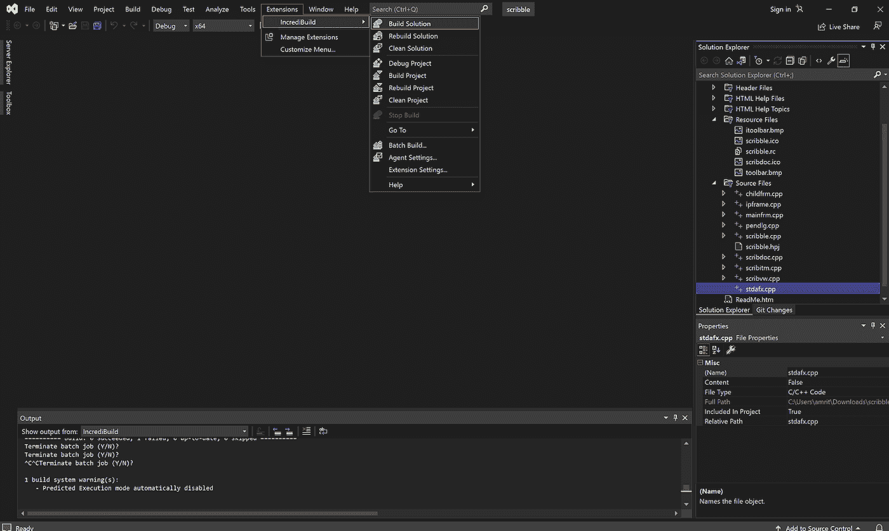

# 将 Incredibuild 用于 CI 构建管道加速

> 原文：<https://levelup.gitconnected.com/using-incredibuild-for-ci-build-pipeline-acceleration-15dffd9b1eb9>

## 如何为您的应用程序构建更快的构建管道

[照片](https://unsplash.com/photos/wvJuYrM5iuw)由[陆](https://unsplash.com/@riku?utm_source=medium&utm_medium=referral)在 Unsplash 上拍摄

大约 12 年前，我认识一个开发动画软件的团队。他们过去常常在晚上运行构建，因为过去构建需要大约 8 个小时。当他们过去讨论(抄袭)长的构建时间时，我能感觉到他们的沮丧。

作为一名开发人员，我一直希望我的构建快如闪电。我知道这样问是不公平的，因为众所周知，大型构建会减慢整个软件开发生命周期。

在项目开始时，编译和构建时间是合理的。随着功能的增加，构建变得越来越大，速度也越来越慢。

如果你以一个失败或糟糕的构建结束，你有一个问题笼罩在你的头上: ***下一个构建什么时候准备好？我目睹了由于构建失败和构建时间过长而导致的发布严重延迟。***

# 为什么在过去几年中构建时间增加了

构建规模和构建时间急剧膨胀。这主要是因为应用构建越来越趋向于开发交互式应用。

新机器、手机和设备的处理和计算能力的增加给了开发者一个机会来提供给用户更多身临其境体验的应用。您的应用程序计算量越大，您需要的处理能力和构建时间就越多。

随着时间的推移，随着您不断向软件添加新功能，构建时间也会增加。随着代码变得越来越复杂，您可能会遇到更多的问题，因此需要创建更多的构建。

# 加快构建速度的方法

开发人员可以采取一些基本措施来缩短编译和构建时间:

**拥有更大的机器来进行构建**

一个简单的解决方案:提高处理能力以减少编译和构建时间。这在一定程度上是有帮助的。结果可能是重大的，但也可能是微不足道的。

**拥有增量构建**

一个非常合理的措施:增量构建更快，因为只编译新的或修改过的代码。

**在云中运行多个构建**

在云中构建代码让你可以自由地雇佣一台高端机器来完成工作，然后离开。此外，您还可以在多台机器上并行运行多个构建。

**使用更快的编译器**

市场上有各种各样的编译器。使用编译时间更快的编译器是减少编译时间的一个好主意。

**编译器缓存**

它有助于加速重新编译。比较输入文件，对于没有变化的文件，使用以前编译的对象。

**加速构建的工具**

有一些工具可以加速构建过程。这些工具使用一个计算机网络来分配负载并更快地生成构建。

**使用有助于加速构建过程的工具**

缩短构建时间的最快和最可靠的方法，因为工具是专门为此任务设计的。在这里，我们将讨论 [Incredibuild](https://www.incredibuild.com/) ，这是一个免费的工具，它使用分布式网络来并行执行负载以进行构建。

# Incredibuild

Incredibuild 是我发现的一种加速构建的软件加速技术。它在分布式系统上并行执行进程，以减少执行时间。

Incredibuild 也适用于您的开发机器。它使用网络中机器的空闲 CPU 周期来帮助构建服务器更好地执行。它被 2000 多个领先品牌使用，如空客、波音、Adobe、高通、英特尔等。

该工具可以在网络上、云上以及混合方式下工作。它与大多数知名的 ide、构建系统、编译器、CI/CD 工具、游戏 SDK、游戏引擎和单元测试框架兼容。在本文中，我将演示如何使用这个免费工具。

# 使用 Incredibuild

我们将使用 Visual Studio 来演示 Incredibuild 的使用。

若要安装 Incredibuild，请打开 Visual Studio，转到“扩展”，然后搜索“Incredibuild”。你会发现一个带有下载按钮的扩展。点击下载。它会将您带到注册页面:

填写表格并提交。这会下载安装程序并将许可证发送到您的电子邮件中。

下载许可证，运行安装程序，并在安装程序要求时上传许可证。

设置时，通过选择选项安装协调器。

这将在您的开发机器上运行协调器。安装完成后，运行“Incredibuild Coordinator”。

在 Visual Studio 中打开一个项目。出于演示的目的，我从 [VCSamples](https://github.com/microsoft/VCSamples) 存储库中提取了一个示例项目。

要构建项目，请转到扩展> IncrediBuild >构建解决方案

这将为您运行构建过程，而无需更改您的代码。运行流程时，您可以在协调器窗口中看到操作。

# 结论

有许多加速构建过程的构建引擎，例如— [BuildXL](https://github.com/microsoft/BuildXL) (微软构建加速器)等。除了加速器，你还可以找到更快的编译器。

几年前我用过 Incredibuild。我对结果非常满意。在本文中，我使用了一个小项目来演示它在 8 核 PC 上的使用。当您有一个大型项目，并且在分布式环境中使用它时，它的好处是显而易见的，在分布式环境中，它可以使用其他机器的空闲 CPU 周期来加速构建。

我也尝试过其他解决方案。我在 AWS 上使用 XXL 实例来加快构建速度——这有它的好处，构建变得更快。缺点是你需要管理基础设施，本地构建仍然很慢。

Incredibuild 通过其简单的安装、与 ide 的集成以及使用本地网络和云环境中未使用的资源来解决这些问题。