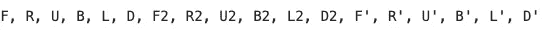
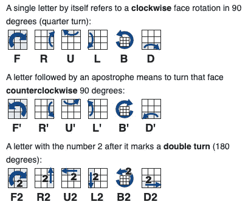
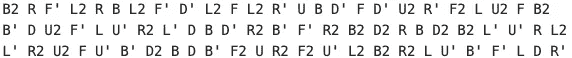

# 使用 JavaScript 打乱一个魔方

> 原文：<https://levelup.gitconnected.com/using-javascript-to-scramble-a-rubiks-cube-306f52908f18>


# 介绍

魔方是一种流行的益智游戏，目标是通过匹配每一面的颜色来解决一个 3x3 的立方体。为了解决立方体，你首先需要扰乱它。如何做到这一点是有规则的，但一般来说，一次争夺包括 20 次按顺序进行的随机移动。在这篇文章中，我将向你展示如何用 JavaScript 实现一个置乱。本教程的代码可以在我的 [GitHub](https://github.com/bjcarlson42/blog-website-code/blob/master/Rubik's%20Cube%20JavaScript%20Scrambler/main.js) 上找到。

# 争夺

一次争夺是在已解决的立方体上进行的 20 次移动的序列。这 20 步棋是从以下一组棋中随机挑选出来的:



上面的每个字母都是立方体的旋转。它们代表:

*   f-正面
*   右右
*   U —上部
*   B —返回
*   D —底部(向下)

一个字母意味着你顺时针旋转立方体的那个面。如果字母后面有一个`'`(单引号)，你逆时针移动那个面。同样，如果字母后面有一个 2，你在立方体上移动那个面两次。

例如， **F2** 表示你顺时针转动立方体的正面 2 次。**B’**表示逆时针旋转立方体背面一次。

这是我在[ruwix.com](https://ruwix.com/the-rubiks-cube/notation/)上找到的一个很棒的视频，可以帮助你更好地理解这一点。



# 加扰示例

这里有一些立方体的例子。这就是我们将要编写 JavaScript 来完成的工作。



# JavaScript 加扰器

现在让我们开始编写 JavaScript 代码来为我们打乱立方体。

首先，我将声明一个名为 makeScramble()的函数。

```
function makeScramble() {
    // function code here
}
```

接下来，我们需要声明 2 个数组。第一个数组将包含我在上面列出的所有选项。这个数组将是我们选择棋步的地方。第二个数组将为空。这就是争夺的方向。

```
var options = ["F", "R", "U", "B", "L", "D", "F2", "R2", "U2", "B2", "L2", "D2", "F'", "R'", "U'", "B'", "L'", "D'"]
var scramble = []
```

让我们退后一步，想想我们要如何进行下一部分。我们需要在第一个数组中随机选择一个元素，放入第二个数组。然后我们需要再重复 19 次，这样我们就有了一个 20 个元素的加扰。

让我们开始第一部分。为了随机选择 firrst 数组中的一个元素，我们需要生成一个从 1 到 18 的随机数，然后将该索引处的任何移动放入新的扰码中。幸运的是，有一个 JavaScript 数学库可以帮助我们做到这一点。

```
function getRandomInt(max) {
    return Math.floor(Math.random() * Math.floor(max));
}
```

上面的代码做了几件事。首先，它声明了一个名为 getRandomInt 的函数。该函数接受最大值。在我们的例子中，这个值将是 18，因为我们想要生成一个从 1 到 18 的随机数。这个函数的内部代码为我们返回了这个随机数。

# 推动和弹出

现在我们有了一种方法来随机获取第一个数组中的元素，我们需要将它放入第二个数组中。JavaScript 和其他语言一样，内置了完成常见任务的方法。其中一种方法叫做`push`。这个方法在数组上工作，允许我们将一个项目推到数组上。在我们的例子中，我们将把一个字符串移动到数组上。

```
scramble.push(options[getRandomInt(18)])
```

上面的代码使用 getRandomInt 方法获得一个从 1 到 18 的随机整数，在 array options 中获得该索引处对应的立方体旋转，并将其推送到新的数组 scramble 上。

如果运行这段代码，新数组中将只有一步棋。要将 20 个移动推入数组，我们可以使用一个`for`循环。

```
for (var i = 0; i < 20; i++) {
  scramble.push(options[getRandomInt(18)])
}
```

如果您运行这段代码，您将看到名为 scramble 的数组中现在有 20 个随机移动。

`pop`与`push`类似，只是它没有向数组中添加元素，而是删除了最后一个元素。我们在这里不使用它，但是我提出来是因为它是 push 的反义词，非常有用。

# 结论

我希望你喜欢这篇文章，并从中学到了一些东西！概括地说，我们回顾了基本的魔方符号和术语，讨论了两个 JavaScript 概念:函数和数组，最后看了数组的内置方法 push 和 pop，并用一个`for`循环实现了 push。如果你喜欢这篇文章，请分享一下，看看我最初发表这篇文章的个人网站。编码快乐！