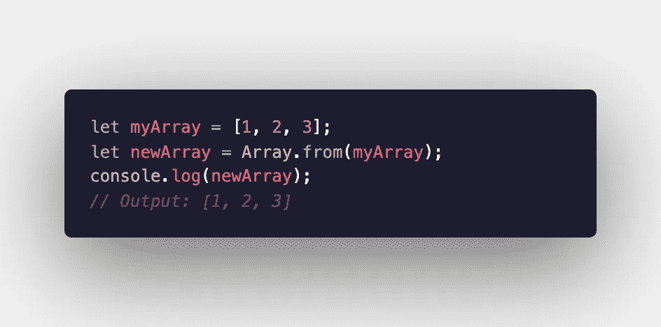
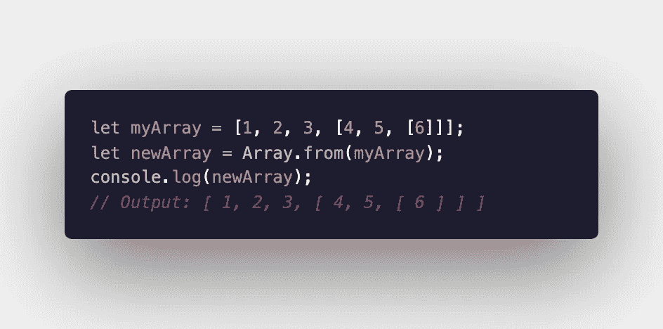
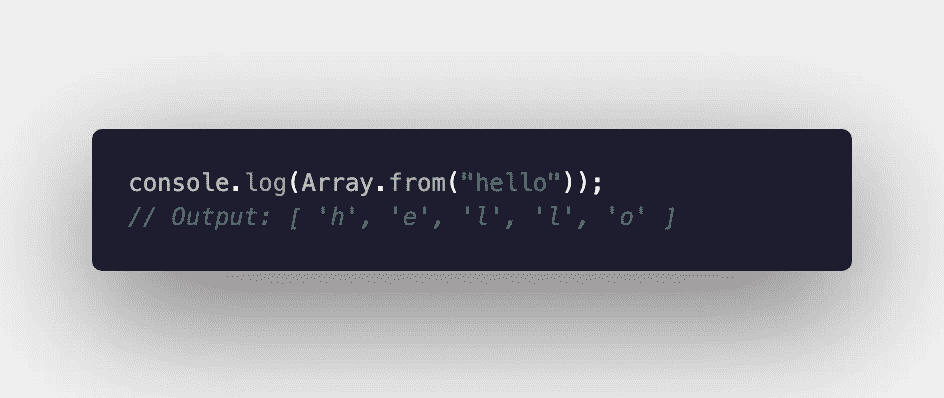
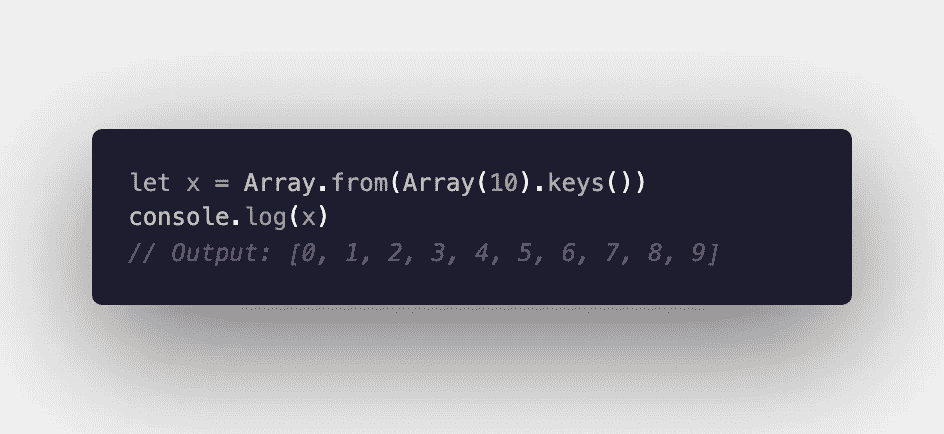
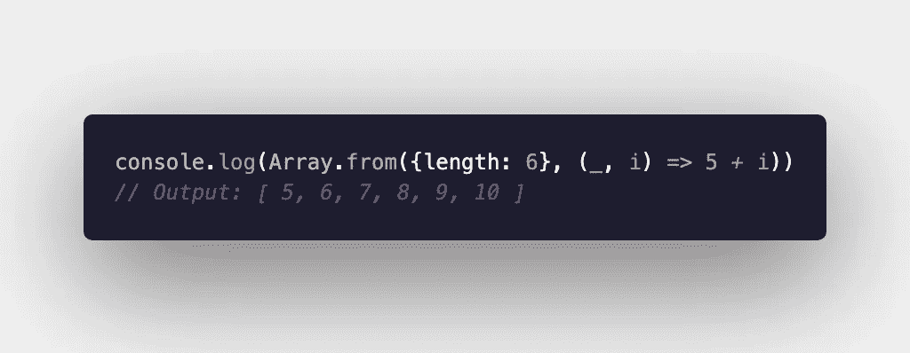
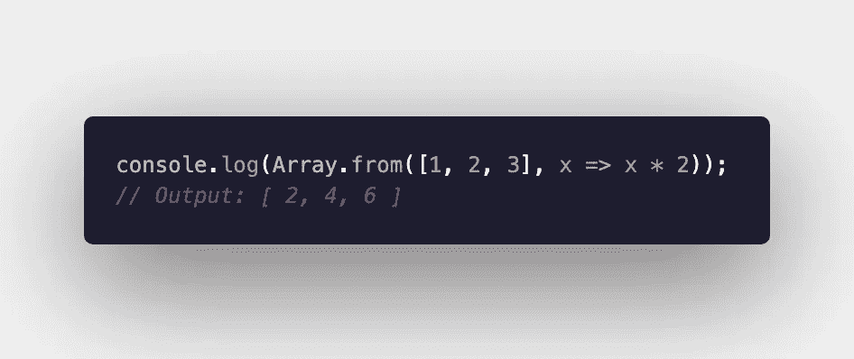
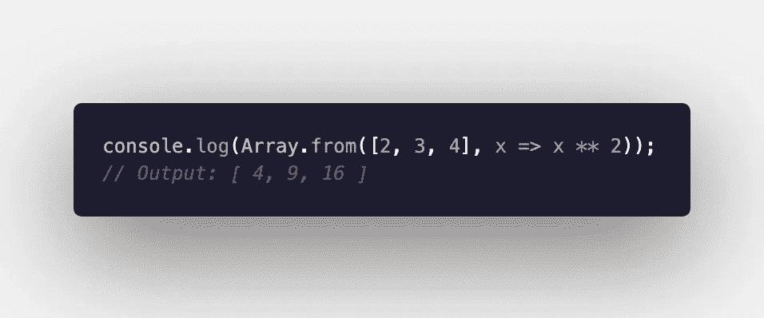
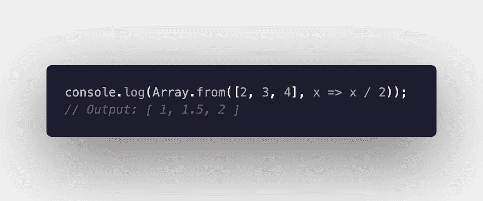

# 使用 JavaScript 的 Array.from()方法

> 原文：<https://levelup.gitconnected.com/using-javascripts-array-from-method-ca9e9fccfd98>

JavaScript 有许多内置的数组方法，可以通过不同的方式使用或组合来对数组执行操作。其中一些非常常用，如 Array.push()，而另一些则不太常用。其中一个数组方法是 Array.from()。

Array.from()从 iterable 或类似数组的对象创建了一个新数组。使用 Array.from()有许多不同的方法。这里有几个例子供你探讨:

# 复制数组

如果您想要制作现有阵列的副本，这将非常有用。它还会复制任何嵌套数组:

# 从字符串创建数组

如果您想要创建一个包含字符串中每个字母的数组，那么您可以使用 Array.from()轻松实现。

# 从一个区域创建数组

如果你需要从一系列整数中创建一个数组，有很多种方法可以实现。使用 Array.from()有一种方法可以做到这一点:

然而，这是有限制的。如果您想要指定范围的起点，您可能想要尝试另一种格式:

# 通过对现有数组中的每个项目执行操作来创建新数组

有许多不同的方法可以使用这个功能。例如，假设您想要将数组中的所有值加倍:

或者平方每个元素:

或者划分:

这些只是使用 Array.from()的几种方法。如果您认为这可能对您有用，请亲自尝试一下，看看您能做些什么！

阿曼达·特劳特勒