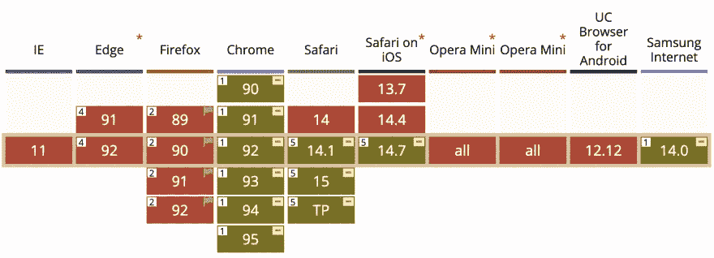
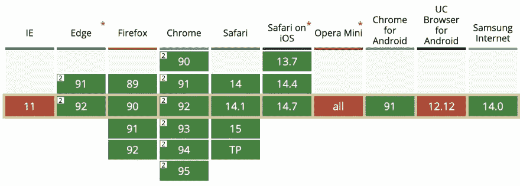

# 利用 JS 语音识别构建虚拟助手

> 原文：<https://levelup.gitconnected.com/using-js-speech-recognition-to-build-a-virtual-assistant-ec1a79396f34>


## 我们如何使用 Web 语音 API 和普通 JavaScript 为西班牙语课创建一个会说话的教师助手

下一学年即将开始，我的妻子(一名高中西班牙语教师)为她的班级出了一个主意。那么，让我向你介绍我们的最新创造:教师助理弗里达。一个会用西班牙语听和回答基本问题的动画角色。


这幅漫画是基于埃尔·克雷塔图的一幅插图

它是使用普通 JavaScript 和内嵌 SVG 构建的**。不幸的是，目前它只能在特定的浏览器中工作，因为它使用了两个实验性的 Web API([语音合成](https://developer.mozilla.org/en-US/docs/Web/API/SpeechSynthesis)和[语音识别](https://developer.mozilla.org/en-US/docs/Web/API/SpeechRecognition))，这两个 API 还没有得到广泛的支持。**

它仍然是一项正在进行的工作，需要打磨，但它看起来很有希望达到我们的要求。毕竟，它是在一个下午内快速开发出来的——包括 SVG——而且 HTML、JS 和 CSS 的代码不到 250 行。

在我们继续之前，这是 Frida 的一个演示(要查看运行的演示，请转到本文的底部):

# 为什么用 JavaScript？为什么是弗里达？

拥有一个分析语音并相应回复的虚拟助手听起来不仅仅需要普通的 JavaScript。即使有可能，也可能有更好的选择来建造这样的东西…但是我们有一些限制。

该助理在一所高中工作，学校 IT 部门有限制条件:

*   我们不能安装任何软件。因此，建立一个应用程序不是一个选项，这大大限制了我们可以使用的技术。
*   我们无法访问某些网站，因为学校防火墙阻止了其中的许多网站(在某些情况下，这个列表有点荒谬。)
*   我们不能将内容导入网站(这与上一点有关。)

我们已经在以前的场合把普通的 JavaScript 插入到学校的网络工具中，所以这看起来是一个不错的选择。此外，这将减少学习曲线，只有网络语音 API。

我们没抱太大期望。毕竟，我们想要简单的东西，但我必须承认，结果比我们预期的要好得多。

为什么是弗里达·卡罗？这个助手是为一个西班牙语班准备的，我们想要一个与西班牙语言和文化相关的可识别的角色。一幅弗里达·卡罗的漫画完美地匹配了这一点……而且画起来很简单。

你可能已经注意到了，我们的大多数决定都有一个模式。他们中的大多数都是基于回答“对此最简单的选择是什么？”一开始没有什么真正的理由让事情变得过于复杂(不管怎样，这是以后的事情。)

# 语音识别 API

语音识别 API 很大，这不是一个深入的探讨。我们将只回顾与我们的虚拟助手相关的代码。有关 API 的更多信息，请访问 [MDN 站点。](https://developer.mozilla.org/en-US/docs/Web/API/Web_Speech_API/Using_the_Web_Speech_API#speech_recognition)

这是语音识别代码的简化版本:

```
// new speech recognition object in Spanish!
var SpeechRecognition = SpeechRecognition || webkitSpeechRecognition;
const recognition = new SpeechRecognition();
recognition.lang = "es";

recognition.onstart = function () {
  // actions to be performed when speech recognition starts
};

recognition.onspeechend = function () {
  // stop speech recognition when the person stops talking
  recognition.stop();
}

recognition.onresult = function (event) {
  // get the results of the speech recognition
  const transcript = event.results[0][0].transcript.toLowerCase();
  const confidence = event.results[0][0].confidence;

  // perform actions based on transcript and level of confidence
}
```

出于安全原因，语音识别代码只能在用户触发事件后执行。有道理。我们不想让一个网站在用户没有意识到的情况下监听他们(尽管他们会被要求提供麦克风)。)

为了解决这个问题，我们添加了一个占据整个屏幕的按钮，单击它将启动语音识别:

```
recognition.start();
```

这使得老师可以在教室里走来走去，用鼠标或指针点击按钮。然后他们可以模拟和助手的对话，或者让学生要求一些东西。

此外，我们可以使用语音识别事件来激活助手，并在它*监听*时做一些事情。例如，弗里达扬起眉毛(这可能是一个错误，因为这会让她看起来好像已经结束了谈话。)

现在，我们来谈谈兼容性和支持。Chromium 和最新版本的 Safari 支持语音识别 API[，但 Firefox 或大多数移动浏览器不支持:](https://caniuse.com/speech-recognition)



由于用户(老师)已经有了，并且会专门使用一个支持该功能的浏览器(Chrome)，这对我们来说不是问题。

# 语音合成 API

> *与语音识别 API 一样，这不是一个深入的探讨，而是演示助手如何使用 API。*

我们助手的下一个任务是回答老师和学生的问题。当然，我们可以录下所有的答案，并在适当的时候播放，但那会很费时间，而且有点痛苦…记住，我们总是在寻找一个简单的选项。

最简单的解决方案是使用[语音合成 API](https://developer.mozilla.org/en-US/docs/Web/API/Web_Speech_API/Using_the_Web_Speech_API#speech_synthesis) :为什么每次我们想要处理一个新特性时都要记录句子和更多的句子呢？如果计算机能读懂我们提供的任何短语，那不是更好吗？

代码比我们预期的更简单。四行代码有我们的帮助说一些句子:

```
let speech = new SpeechSynthesisUtterance();
speech.lang = "es";
speech.text = "This is the text to read.";
window.speechSynthesis.speak(speech);
```

与语音识别 API 类似，在使用语音合成 API 之前，我们需要等待用户交互。幸运的是，我们可以用同一个事件*搭载*的两个动作:一旦按钮被点击，助手就会监听并处理语音；一旦语音被处理并转换成文本，我们就可以让助手说话了。

语音合成 API 比这四行代码更复杂。它允许完全定制语音:速度，音高，甚至声音都可以从列表中选择。

在我们的例子中，默认速度是好的。对于母语为英语的人来说可能有点慢，但对于学生来说没问题。我们主要关心的是声音本身。Frida 是女性，但是默认的声音取决于很多因素(浏览器，语言)，在某些情况下，可能是男性的声音。但是我们可以通过指定`voice`属性来选择它。

再说支持。虽然仍处于试验阶段，但语音合成 API 得到了广泛的支持(它可以在 95%的活跃浏览器中工作！)，所以这根本不是问题:



我们可以使用语音合成器事件给助手添加更多的动画。例如，在计算机阅读文本时让她的嘴唇动起来…虽然这有点痛苦，因为时间不是 100%准确，但我们需要让它与 CSS 动画匹配，以避免奇怪的跳跃。不理想，但还是可行的。

# 不是 AI！只是一堆条件句

网上有一个关于 AI 和`if`语句的笑话:


术语 AI 通常被错误地使用([图像源](https://hackernoon.com/are-you-using-the-term-ai-incorrectly-911ac23ab4f5))

这正是我们的助手。我们不打算假装它是人工智能。它不是真正的 AI，而是一堆连锁的条件句(甚至没有嵌套。)

一旦我们从语音识别中得到结果，我们就有两个值:来自语音的文本和系统在识别中的置信度。我们注意到，当置信度高于 75%时，结果通常是好的。

如果是这种情况，那么我们检查抄本中的子字符串:

```
// default text
let textToSpeak = "Sorry, I didn't understand.";

if (confidence > 0.75) {
  if (transcript.indexOf("time") > -1) {
    const d = new Date();
    const hours = d.getHours();
    let minutes = d.getMinutes();
    if (minutes === 0) minutes = "o'clock";
    textToSpeak = `It is ${hours} ${minutes}`;
  } else if (transcript.indexOf("best teacher") > -1) {
    textToSpeak = "Miss Montoro is the best teacher";
  } else if...
}

// Speech Synthesis code goes here
```

并使用其他 JavaScript APIs 或预定义的句子将它们与自动生成的答案进行匹配:

语音识别 API 允许使用对分类结果有用的语法。虽然我们现在不使用它们(一个`if`声明在当时看起来更简单)，但它可能是第二个版本的一个令人兴奋的增强。

# 工作演示。下一步是什么？

下面是助教弗里达的[演示:](https://codepen.io/alvaromontoro/full/gOWorVj)

> *注意:* ***由于*** `***iframe***` ***安全策略*** *，演示在嵌入时可能无法工作。点击上面的链接或者点击 CodePen 上的 Edit 来看看它是如何工作的。*

作为一个最起码可行的产品，这个类助手还不错，但还远远不够完善。以下是我们认为需要改进的一些方面:

1.  增加更多的句子和问题来理解
2.  向语音识别系统添加语法，这样我们就可以简化代码(并删除难看的条件)
3.  添加自定义/设置，以便其他教师可以在轻微更新后使用它。
4.  使用其他 Web APIs 扩展新功能。我们有一些想法:

*   检测环境噪音，如果它达到一个阈值，让弗里达看起来很生气，并说:“请安静！”
*   根据日期和天气给弗里达穿上不同的衣服。
*   让弗里达更友好一点(在漫画中她总是看起来很生气。)
*   添加一个学生姓名列表，以便 Frida 可以随机呼叫他们进行提问/测试。

*原载于 2021 年 7 月 28 日 https://alvaromontoro.com*[](https://alvaromontoro.com/blog/67980/using-js-speech-recognition-to-build-a-virtual-assistant)**。**