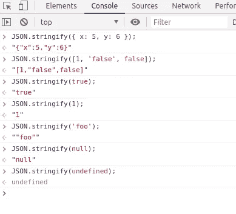
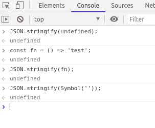
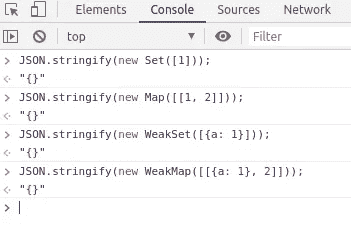
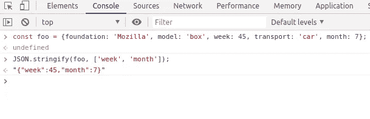
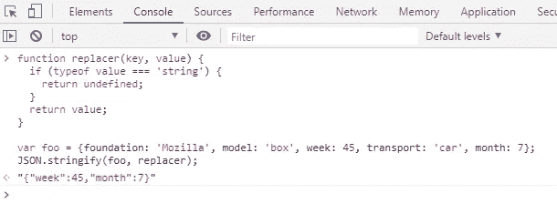

# 使用 JSON.stringify 过滤对象属性

> 原文：<https://levelup.gitconnected.com/using-json-stringify-to-work-with-javascript-object-9416c1e2c7c4>

## Java Script 语言

## 通过使用 replacer 作为数组或函数来过滤 JavaScript 对象属性的简单技术。


由[刘汉宁·内巴霍](https://unsplash.com/@hannynaibaho?utm_source=unsplash&utm_medium=referral&utm_content=creditCopyText)在 [Unsplash](https://unsplash.com/s/photos/coffee?utm_source=unsplash&utm_medium=referral&utm_content=creditCopyText) 上拍摄的照片

在本文中，我将分享关于使用 JSON.stringify()的 replacers。

1.  语法重新介绍
2.  使用 Replacer 参数

# 语法重新介绍

我想我们大多数人都知道第一个论点`**JSON.stringify()**` 。但是，只有一些人知道还有第二种说法，叫做 T21。所以我想再次介绍一下方法语法。

`**JSON.stringify()**`方法将做两件事:

1.  将该值转换为 JSON 字符串。
2.  如果指定了 replacer 函数，则替换值。

```
JSON.stringify(value[, replacer[, space]])
```

有 3 个参数:

1.  **value**要转换成 JSON 字符串的值。
2.  一个改变字符串化过程行为的函数。
3.  **空格
    给输出加上空格。**

该值支持多种数据，如对象、数组和基元。



带有一些基本数据类型的 JSON stringify

一些返回`undefined`的值，如**函数属性**、**符号属性**和`undefined`。



对于某些特定输入，JSON stringify 返回未定义的值

那么`Map`、`Set`、`WeakMap`、`WeakSet`等`Object`实例呢？



带有对象实例的 JSON 字符串

注意:

*   `Infinity`和`NaN`，`null`，都算`null`。
*   **对象属性名**，以及**字符串**，在编码后都用双引号括起来。

# 使用 Replacer 参数

对象被递归地字符串化成 JSON 字符串，在每个属性上调用`replacer`函数。这在 JavaScript 中处理对象时会很有帮助。

有两种类型的**替换器**:

*   排列
*   功能

## replacer，作为数组

当我们需要过滤掉对象属性时，我们可以将 replacer 作为一个数组来应用。

只有我们传递到数组中的这些属性才会被编码。



通过数组替换器排除对象属性

## 作为函数的替换器

在我们不知道确切的属性名或者因为属性太多而无法列出所有属性的情况下，我们可以使用 replacer 作为函数。

因此，我们编写一个函数，通过遵循数据类型或某种模式来过滤属性值。



通过函数替换器排除对象属性

使用 replacer 对于一些简单的情况很有帮助，比如我们想从一个对象中获取某些属性。

*有时，我们在旧项目上工作，我们没有任何超级工具来支持我们从一个大的 JSON 对象中过滤属性。*

我希望这篇文章对你有用！你可以在[媒体](https://medium.com/@transonhoang?source=post_page---------------------------)上关注我。我也在[推特](https://twitter.com/transonhoang)上。欢迎在下面的评论中留下任何问题。我很乐意帮忙！

# 参考

[1]Json Stringify:[https://developer . Mozilla . org/en-US/docs/Web/JavaScript/Reference/Global _ Objects/Json/Stringify](https://developer.mozilla.org/en-US/docs/Web/JavaScript/Reference/Global_Objects/JSON/stringify)