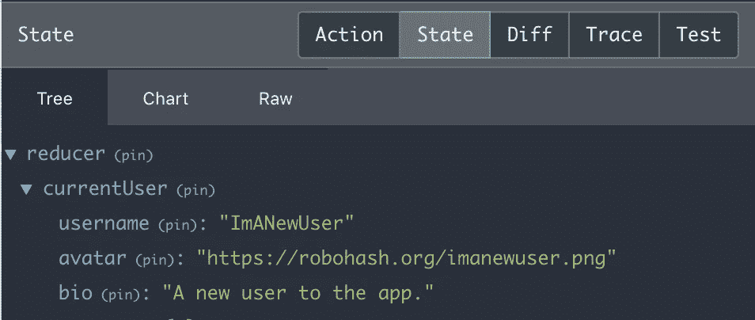

# 在 React+Redux 应用程序中使用 JWT 进行授权

> 原文：<https://levelup.gitconnected.com/using-jwt-in-your-react-redux-app-for-authorization-d31be51a50d2>

## 关于如何在 web 应用前端处理 JWT 和认证的解释和指南


> " Auth 如何与 Redux 和 JWT 一起工作？"

总体思路是，将当前用户的信息保存到 Redux store，以便在整个应用程序中轻松访问。您还将把与用户相关联的 JWT (JSON Web Token)保存到 localStorage，以便他们的登录可以在会话之间持续，除非他们显式注销。

本教程假设您已经设置了以下三个 Rails API 路径:

> 发帖者/用户
> 发帖者/登录者
> 获取/个人资料

这三个途径处理身份验证的三个基本部分——当用户创建帐户时，当用户登录到该帐户时，以及当登录的用户重新访问您的 web 应用程序时。我将按照这个顺序进行，尽管最后一部分(当用户再次访问你的应用时的处理)是 JWT 的用处所在。

我们开始吧！

> 注意:本教程主要面向 Flatiron School 的软件工程训练营的 Mod 5 学生，他们已经对其 Rails API 后端实现了 JWT 认证，但不确定如何让他们的客户端 React+Redux 应用程序处理认证。
> 
> 希望我能帮助你理清 Auth 的工作流程，以及如何将它应用到你的项目中！

[](https://skilled.dev) [## 编写面试问题

### 一个完整的平台，在这里我会教你找到下一份工作所需的一切，以及…

技术开发](https://skilled.dev) 

# 1.用户注册(发布到/用户)

当新用户访问您的应用程序时，您可能希望他们注册一个帐户。您实际上将运行一个标准的 POST 请求；你不需要做什么特别的事情就可以让它运行起来。

如果设置正确，您的后端将创建用户实例，使用 BCrypt 加密密码，然后返回一个带有用户密钥和令牌密钥的对象。该对象是授权的重要部分。您将在本教程的后面看到它，但是我们实际上将获取用户对象并将其保存到 Redux 存储，然后获取与用户相关联的令牌并将其保存到 localStorage。

注册新用户并自动登录的步骤如下。

## 拥有新的用户提交表单

在您的 React 应用程序中，您将需要一个表单，该表单在提交后将在您的`actions.js`文件中运行您的获取。您将在这里使用 Redux 的 thunk，所以请确保您已经安装了它。

创建一个受控组件，该组件是用于创建新用户的表单。例如，它可能是这样的:

您的组件不必看起来完全像这样——重要的部分是 handleSubmit 函数。

注意某个名为`userPostFetch`的未知函数是从`actions.js`导入的，然后使用`mapDispatchToProps`作为道具添加到组件中。您可以在上面看到，这个 prop 是在提交表单时调用的。这将是处理获取本身的函数，以及将用户对象保存到 Redux 存储并将令牌添加到 localStorage。接下来，我们将编写这个函数。

## 具有获取请求的功能

在您的`actions.js`文件中，它看起来像这样:

注意两个独立的功能:`userPostFetch`和`loginUser`。函数`userPostFetch`将用户信息发送到你的后台进行验证。成功后，它期待一个 JSON 对象的响应，如下所示:

```
{
  user: {
    username: "ImANewUser",
    avatar: "https://robohash.org/imanewuser.png",
    bio: "A new user to the app."
  },
  token: "aaaaaaa.bbbbbbbb.ccccccc"
}
```

在`userPostFetch`中，这是我们在第二个‘then’语句中命名的‘data’。

## 将令牌保存到本地存储

使用我们在`userPostFetch`函数中编写的代码，`localStorage.setItem(“token”, data.token)`会将令牌(`“aaaaaaa.bbbbbbbb.ccccccc”`)保存到用户的本地存储中。稍后，当我们在会话之间持久化用户登录时，将会用到它。

要检查令牌是否已成功保存，请在控制台中运行`localStorage.token`或`localStorage.getItem(“token”)`。

## 将用户对象保存到 Redux 存储中

至于用户对象，我们在这里看到`dispatch(loginUser(data.user))`正在运行。假设您的 reducer 将获取用户对象(`{username: “ImANewUser”}`)并将其保存到您的 Redux 存储中。这将使 React 应用程序中的任何组件都很容易知道当前用户是谁。

作为一个例子，这是我的减速器:

这里，用户对象(`action.payload`)被保存到 currentUser 键下的状态。如果您安装了 Redux DevTools，您可以在成功创建您的用户后检查它。您应该会看到用户对象。



你可能会注意到我有一个你可能没有的“reducer”键。这是因为我有多个减速器，并将其中一个命名为“减速器”。

> 注意:你知道有时你在网站上创建一个账户后，它会要求你立即手动登录吗？您的网站也可以这样做，用户创建帐户后，您不必自动登录。
> 
> 如果您决定这样做，只需对用户对象和 JWT 令牌不做任何事情。事实上，您可以从后端编辑逻辑，使它只返回状态消息。

注册新用户到此为止。接下来，我们将了解如何登录现有用户。

# 2.用户登录(发布/登录)

用户登录与注册过程非常相似，只是您只需要将登录凭证发送到后端。后端将处理对用户的验证，然后从注册中发回相同的对象——一个带有用户密钥和令牌密钥的对象。同样，您将把用户对象保存到 Redux 存储，并将令牌保存到 localStorage。

如果你有一个专用于登录的组件，它看起来将与你的注册组件相似，但有一个主要的区别——它将从你的`actions.js`文件导入一个不同的函数。它可能看起来像这样:

请注意，表单本身唯一的变化是删除了头像和简历输入字段。

我们还没有编写`userLoginFetch`函数，但是它的外观类似于处理注册的 fetch。见下文:

请注意，我们重用了`loginUser`动作，以便将用户对象保存到状态中。

令人惊讶的是，这就是用户登录！当用户的对象被保存到状态，并且他们的令牌被保存到 localStorage 时，您可以认为您的用户已经登录。

现在让我们做第三部分，也是最后一部分:在会话之间保持用户的登录。

# 3.用户回访(转到/个人资料)

将令牌保存到 localStorage 的目的是保存登录。当你的用户再次访问你的网站时，你想让他们感觉好像是从以前开始继续他们的会话。

请记住，保存到 localStorage 中的令牌只是一个字符串。它本身并不等同于登录用户。作为开发人员，您必须接受令牌，并将其转换为持久登录。

为此，如果用户在本地存储中保存了令牌，则每次访问应用程序时，您都需要运行 fetch (GET to /profile)。在您的应用程序组件的 componentDidMount 中运行此逻辑是一个不错的选择，因为它肯定会在您的应用程序被访问时运行。

您的应用程序组件看起来不会完全像这样(您可以特别忽略开关和路由部分)，但这里的关键部分是 getProfileFetch 函数，它作为一个 prop 提供给应用程序，然后在 componentDidMount 中调用。

我们正在从`actions.js`导入一个名为`getProfileFetch`的函数，它在应用组件挂载时立即运行。

`getProfileFetch`要做的是运行一个标准的 GET 请求，除了一个带有令牌的授权头，它在`actions.js`文件中处理。您的后端应该设置为接收令牌，对其进行解码，然后返回其相关的用户对象。然后像往常一样将它保存到 Redux 存储中。您已经将令牌保存到了 localStorage，所以您不必担心它。

该函数将类似于以下内容:

函数`getProfileFetch`在尝试持久化登录之前，首先检查是否有令牌保存在 localStorage 中。这样，您就不会运行不必要的获取。

再次注意，我们重用了`loginUser`动作，并且没有重新保存令牌。用户已经在他们的 localStorage 中有了它，所以没有必要再次保存它。

现在你有了——你有了有效的授权！

# ***奖励:注销

当你测试你的应用程序时，你会注意到目前唯一的注销方式是通过在你的控制台中键入`localStorage.removeItem(“token”)`来清除本地存储中的 JWT 令牌，然后点击刷新来清除 Redux 存储。我们应该为您的客户创建一个注销按钮。

在你的应用程序中的某个地方，你需要一个注销按钮来完成上述操作。虽然我不会把它随意放在`App.js`文件中，但这里有一个`App.js`中注销按钮的例子。

您应该注意到一些新的东西:首先，有一个名为`logoutUser`的新动作被导入，我们将很快编写它。我们现在还使用了 mapStateToProps，以便 App 组件接收一个名为 currentUser 的属性。

> 注意:因为我有多个 reducers，所以我必须通过在 mapStateToProps 中键入`state.reducer.currentUser`来访问我的 Redux 存储的当前用户。如果你只有一个缩减器，你可能只需要写`state.currentUser`。

现在还有一个三元运算符，它检查从 Redux store 接收的 currentUser 属性是否有一个用户名键(例如，currentUser 对象是否为空)。如果是这样，它会呈现一个“注销”按钮，单击该按钮将调用`logoutUser`。它还将从本地存储中删除令牌。

`logoutUser`将只是一个简单的动作:

该操作将在 reducer 中执行以下操作，用一个空对象替换当前用户:

现在你知道了！当您登录和注销时，您应该会看到该按钮出现和消失。

# 怎么查？

您可能已经遵循了上述内容，并且正在质疑您的授权是否有效。您可以通过注册、登录、按刷新和注销来测试它。如果一切正常，您应该会看到使用您的 Redux DevTools 将用户对象保存到您的 Redux 存储中，并在控制台中查看保存到您的 localStorage 中的令牌。

# 现在怎么办？

至于下一步该怎么做，您可以在组件中运行检查，如果用户没有登录，就把他们踢出去。您可以使用`react-router-dom`中的`Redirect`或`connected-react-router`中的`push`功能来完成此操作。这些是我更喜欢使用的资源。

如前所述，您现在还可以将 currentUser 对象从 Redux store 传递到应用程序中的任何组件。例如，如果你想让你的导航条显示用户的头像，你可以使用`mapStateToProps`将当前用户对象传递给导航条，然后呈现头像。

这就是现在的全部内容——感谢您的阅读和快乐编码！

[](https://gitconnected.com/learn/react) [## 学习 React -最佳 React 教程(2019) | gitconnected

### 排名前 49 的 React 教程-免费学习 React。课程由开发人员提交并投票，使您能够…

gitconnected.com](https://gitconnected.com/learn/react)