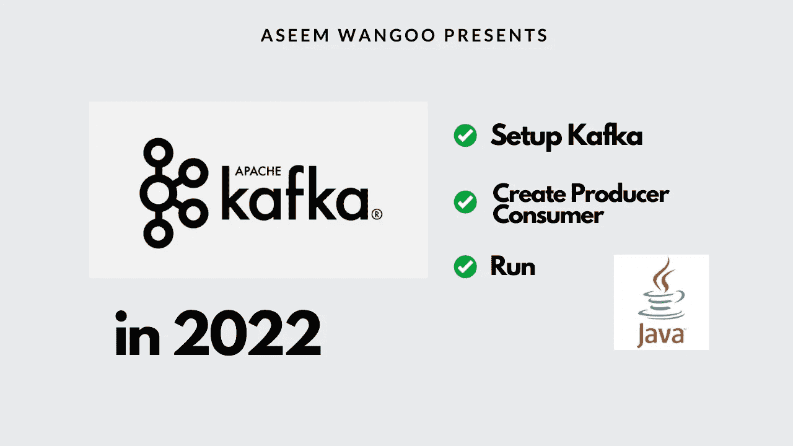
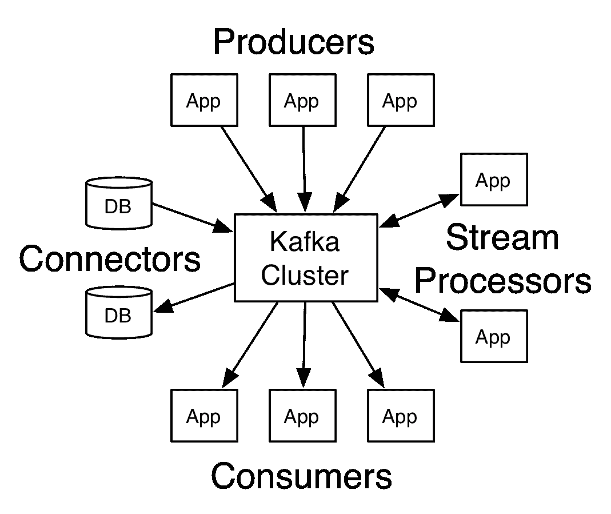
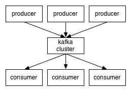
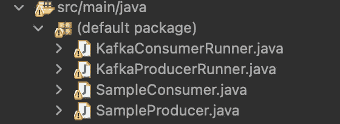
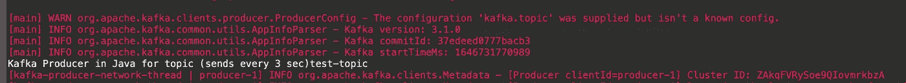
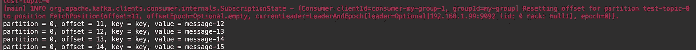

# 在 2022 年使用卡夫卡

> 原文：<https://levelup.gitconnected.com/using-kafka-in-2022-f22602830e09>

*2022 年使用卡夫卡*

*此处:*[*https://flatteredwithflutter.com/using-kafka/*](https://flatteredwithflutter.com/using-kafka/)

2022 年使用卡夫卡|卡夫卡入门

我们将简要介绍:

1.  卡夫卡简介
2.  在机器上设置 Kafka
3.  创建卡夫卡制作人
4.  创造卡夫卡消费者
5.  运行生产者和消费者

> 注意:本文假设读者了解 Java，并且已经在机器上配置了 Java。用户也熟悉卡夫卡的术语。



在 2022 年使用卡夫卡

## 卡夫卡简介

根据[文档](https://kafka.apache.org/intro)，Kafka 是一个事件流平台，可用于收集、处理、存储和分析大规模数据。 **Kafka** 被[数千家公司](https://kafka.apache.org/powered-by)使用，其中包括超过 60%的财富 100 强公司。

Kafka 以其出色的性能、低延迟、容错和高吞吐量而闻名，它能够每秒处理数千条消息。



卡夫卡概述

使用案例:

*   实时处理支付和金融交易，
*   持续捕获和分析来自物联网设备的传感器数据，
*   收集客户互动和订单并立即做出反应，
*   实时跟踪和监控汽车、卡车、车队和货物

## **在机器上设置 Kafka**

这一节将有助于在您的机器上设置 Kafka。

> **注意:我们用的是 mac。**

*   要安装`Kafka`，请按此处的。导航到**最新二进制下载**，到今天为止是 **Scala 2.13，**点击链接。它将打开另一个网页，并单击如下链接:


卡夫卡的下载链接

*   提取文件夹并导航到我们示例中的文件夹(*Downloads/Kafka _ 2.12–3 . 1 . 0*)。

> 注意:在解压 Kafka zip 文件的路径下，遵循下面的终端命令。

**启动动物园管理员**

*   在上面的路径中打开一个终端并键入

```
sh bin/zookeeper-server-start.sh config/zookeeper.properties
```

上述命令启动`Zookeeper`。它主要用于跟踪 Kafka 集群中节点的状态，并维护 Kafka 主题和消息的列表。

> 注:从 v2.8 开始，没有`Zookeeper`也可以运行 Kafka。然而，这个更新还不能用于生产
> 
> 保持上述终端开放

**启动 Kafka broker 服务**

*   在上述路径中打开另一个终端(*Downloads/Kafka _ 2.12–3 . 1 . 0*)并键入

```
sh bin/kafka-server-start.sh config/server.properties
```

这启动了`*Kafka Broker*`。一个*卡夫卡集群*由多个卡夫卡经纪人组成。每个 Kafka 经纪人都有一个唯一的 ID(编号)。Kafka 代理包含主题日志分区。连接到一个代理会将一个客户端引导到整个 Kafka 集群。如果需要，Kafka 集群中可以有 10、100 或 1，000 个代理。

> 保持这个终端开放

**创建话题**

*   在上面的路径中打开一个新的终端，并键入

```
sh bin/kafka-topics.sh --bootstrap-server localhost:9092 --create --topic test-topic
```

卡夫卡在不同的机器上产生事件，这些事件被组织并存储在`topics`中

在上面的命令中，我们说我们的

*   服务器是`localhost:9092`和
*   创建的主题是`test-topic`

**验证题目创建**

*   在上面的路径中打开一个新的终端，并键入

```
sh bin/kafka-topics.sh --bootstrap-server localhost:9092 --list
```

这应该能让你看到`test-topic`。

## 创建卡夫卡制作人

> 注意:Kafka Broker 应该在终端中运行

**安装依赖关系**

我们将使用 [Eclipse IDE](https://www.eclipse.org/downloads/) 来创建我们的 Kafka Producer。



卡夫卡制片人

*   使用 eclipse 创建一个 Maven 项目。
*   转到 pom.xml，输入以下内容，并更新您的 maven 项目

```
<dependencies> 

   <!-- Kafka Client -->
   <dependency>
    <groupId>org.apache.kafka</groupId>
    <artifactId>kafka-clients</artifactId>
    <version>3.1.0</version>
   </dependency>

   <!-- Simple logging -->
   <dependency>
    <groupId>org.slf4j</groupId>
    <artifactId>slf4j-api</artifactId>
    <version>2.0.0-alpha6</version>
   </dependency>
   <dependency>
    <groupId>org.slf4j</groupId>
    <artifactId>slf4j-simple</artifactId>
    <version>2.0.0-alpha6</version>     
   </dependency>
</dependencies>
```

这将为我们的项目增加`Kafka Client`和`slf4j`。

**创造 SampleProducer.java**

*   创建一个名为`SampleProducer.java`的类

```
public class SampleProducer {

 public SampleProducer() throws InterruptedException {
  Properties properties = new Properties();
  properties.put("bootstrap.servers", "localhost:9092");
  properties.put("key.serializer","org.apache.kafka.common.serialization.StringSerializer");
 properties.put("value.serializer","org.apache.kafka.common.serialization.StringSerializer");

  properties.put("kafka.topic", "test-topic");

  KafkaProducer kafkaProducer = new KafkaProducer(properties);
  int i=0;

  try {
   while (true) {
    i++;
    ProducerRecord producerRecord = new ProducerRecord("test-topic","key","message-" +i);

    Thread.sleep(3000);
    kafkaProducer.send(producerRecord);
   }
  } finally {
   kafkaProducer.close();
  }    
    }

}
```

我们用下面的键和值初始化`Properties`

`bootstrap.servers`:您的本地服务器主机和端口

`key.serializer`:用于通过网络发送序列化密钥。

`value.serializer`:用于通过网络发送序列化值。

`kafka.topic`:你的卡夫卡话题

*   接下来，我们用属性创建一个`KafkaProducer`的实例(如上所述)
*   我们需要创建一个`ProducerRecord`来向 Kafka 生产者发送数据。

这个 ProducerRecord 接受要发送的**主题名**、**键**和**值**。

*   我们使用 **kafkaProducer 发送记录。**
*   这段代码放在 while 循环中，每隔 3 秒钟，它向 Kafka 代理发送一条记录。

**创造 KafkaProducerRunner.java**

*   这将是调用上述`SampleProducer`的类

```
public class KafkaProducerRunner { public static void main(String[] args) {
  SampleProducer sampleProducer = new SampleProducer();
 }}
```

## 创造卡夫卡消费者

> 注意:Kafka Broker 应该在终端中运行

*   创建一个名为`SampleConsumer.java`的类

```
public class SampleConsumer {

 public SampleConsumer() {
  Properties properties = new Properties();
  properties.put("bootstrap.servers", "localhost:9092"); 
  properties.put("kafka.topic", "test-topic"); 
  properties.put("key.deserializer","org.apache.kafka.common.serialization.StringDeserializer");
 properties.put("value.deserializer","org.apache.kafka.common.serialization.StringDeserializer");

 properties.put("group.id", "my-group");

  KafkaConsumer consumer = new KafkaConsumer(properties);
  consumer.subscribe(Arrays.asList(properties.getProperty("kafka.topic")));

       while(true) {
        ConsumerRecords<String, String> records = consumer.poll(Duration.ofMillis(100));
          for (ConsumerRecord record : records)  {
           System.out.printf("partition = %s, offset = %d, key = %s, value = %s\n", 
             record.partition(), record.offset(), record.key(), record.value());
          }
       }              

 }  
}
```

我们用下面的键和值初始化`Properties`

`bootstrap.servers`:您的本地服务器主机和端口

`kafka.topic`:你的卡夫卡主题

`key.deserializer`:用于在网络上反序列化密钥。

`value.deserializer`:用于通过网络反序列化值。

`group.id`:指定群组 id，仅在消费端使用。

*   接下来，我们用属性创建一个`KafkaConsumer`的实例(如上所述)。这个 KafkaConsumer 使用 Kafka 集群中的记录。
*   接下来，我们使用`subscribe`订阅主题(在 KafkaProducer 中创建)
*   我们以`ConsumerRecords`的形式获取数据，并在无限循环中每隔 100 毫秒调用`poll`。
*   对于每个消费者记录，我们提取**分区、偏移量、键**和**值**

**创建 KafkaConsumerRunner.java**

*   这将是调用上述`SampleConsumer`的类

```
public class KafkaConsumerRunner { public static void main(String[] args) {
  SampleConsumer sampleConsumer = new SampleConsumer();
 }}
```

## 运行生产者和消费者

如果您正确地遵循了上述步骤，您应该有以下文件



卡夫卡档案

*   让我们先运行 **KafkaProducerRunner，**我们应该会看到类似这样的东西



Kafka 生产者日志

我们的生产者每 3 秒钟产生一次数据。

*   让我们运行 **KafkaConsumerRunner，**我们应该会看到这样的东西



卡夫卡消费者日志

我们的消费者每 3 秒钟接收一次数据，然后我们将它打印到控制台上。

其他文章:

[](https://medium.com/flutter-community/dart-on-aws-lambda-3a46aad38335) [## AWS Lambda 上的 Dart

### AWS Lambda 上的 Dart

AWS Lambdamedium.com 上的 Dart](https://medium.com/flutter-community/dart-on-aws-lambda-3a46aad38335) [](/deploy-react-and-aws-amplify-1db36c625d73) [## 部署 React 和 AWS Amplify

### 部署 React 和 AWS Amplify

部署 React 和 AWS Amplifylevelup.gitconnected.com](/deploy-react-and-aws-amplify-1db36c625d73) [](/deploy-lambda-using-serverless-a44a66f3d603) [## 使用无服务器部署 lambda

### 使用无服务器部署 lambda

使用 serverlesslevelup.gitconnected.com 部署 lambda](/deploy-lambda-using-serverless-a44a66f3d603) [](/show-push-notifications-in-react-449949e98e01) [## 在 React 中显示推送通知

### 在 React 中显示推送通知

在 Reactlevelup.gitconnected.com 显示推送通知](/show-push-notifications-in-react-449949e98e01) 

```
[Source code](https://github.com/AseemWangoo/kafka-example)
```