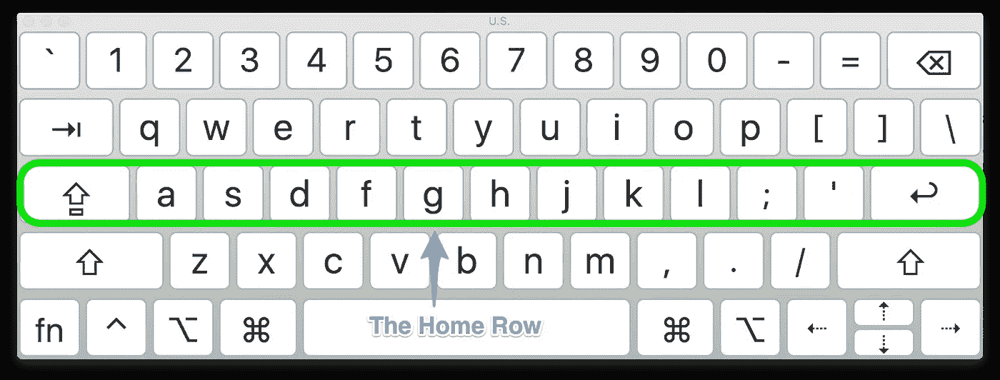

# 像专业人员一样使用键盘快捷键 Mac 上的键盘快捷键让您更有效率

> 原文：<https://levelup.gitconnected.com/using-keyboard-shortcuts-like-a-pro-keyboard-shortcuts-on-mac-to-make-you-more-productive-e0070fa2dc10>

科琳·库兹在 [Unsplash](https://unsplash.com/s/photos/typing?utm_source=unsplash&utm_medium=referral&utm_content=creditCopyText) 上的照片

这篇文章将谈一谈在开始收集一些常用的键盘快捷键之前，如何像一个开发者一样思考。

## **哲学(随意跳过这部分)**

[https://hacker noon . com/efficient-thought-to-screen-process-my-keyboard-optimization-933836628 e8e](https://hackernoon.com/efficient-thought-to-screen-process-my-keyboard-optimization-933836628e8e)

作为开发人员的一部分，总是在寻找优化，让事情变得更有效率的方法。这显然适用于您编写的代码，但同样适用于代码本身的实际编写！键盘快捷键是优化编写代码过程的一种方式。虽然偶尔有些事情需要鼠标，但许多与计算机的微小交互都可以通过使用键盘快捷键来加速。如果你的手指已经在 [home 行](https://hackernoon.com/efficient-thought-to-screen-process-my-keyboard-optimization-933836628e8e)上，你通过移动你的手到你的鼠标来减慢你的速度。我经常问自己，“有没有一种不使用鼠标就能完成这项任务的方法？”

Mac 上键盘快捷键的一大优点是，它们中的许多都是跨应用程序通用的。当然，所有第一方 Mac 应用程序都遵循相同的快捷方式惯例，大多数优秀的第三方应用程序也是如此。因此，如果你发现一个键盘快捷键可以在一个应用中使用，一定要在其他地方尝试。*此外，随着你越来越习惯使用快捷方式，你也越来越擅长* ***猜测*** *快捷方式可能是什么。*最后，如果你不知道快捷方式是什么，就去查吧！这是第一条捷径:

*   **Command+Shift+/**:**打开帮助菜单。现在就试试吧！**

**给我看看快捷方式！**

**首先，我们来谈谈 Mac 上的[修饰键](https://support.apple.com/en-us/HT201236)。熟悉这些按键以及与它们相关的符号，对于从一直使用鼠标(缓慢)过渡到手不离开键盘就能完成工作是非常重要的。确保你知道这个列表，感谢这些符号。**

*   **⌘司令部**
*   **转移⇧**
*   **选项(或备选)⌥**
*   **控制⌃**
*   **大写锁定⇪**
*   **【数学】函数**

****基本 Mac 快捷键:****

*   ****Command-X** : *剪切*选中的项目并复制到剪贴板**
*   ****Command-C** : *将选中的项目*复制到剪贴板。这也适用于 Finder 中的文件**
*   ****Command-V** : *将*剪贴板的内容粘贴到当前文档或 app 中。这也适用于 Finder 中的文件**
*   ****Command-Z** : *撤销*之前的命令。**
*   ****Shift-Command-Z** : *重做*，反转撤销命令。在某些应用程序中，您可以撤销和重做多个命令**
*   ****命令-A** : *选择所有*项**
*   ****Command-F** : *在文档中查找*项或打开查找窗口**

**如果您忘记或想要更改全局 Mac 快捷键，您可以随时打开“系统偏好设置”，点按“键盘”，然后点按“快捷键”。**

****Mac 文本导航/选择快捷键:****

*   ****命令-左箭头**:跳到一行的开头**
*   ****Command-右箭头**:跳到一行的末尾**
*   ****Option-右箭头**:跳转到当前单词的开头**
*   ****Option-右箭头**:跳转到当前单词的末尾**
*   ****Command-向上箭头**:跳到所有文本的开头**
*   ****Command-向下箭头**:跳到所有文本的结尾**

***额外的专业提示* : *将 Shift 添加到上述任何一个命令都可以让你选择文本！***

**这些快捷键对于在代码编辑器中跳转非常有帮助。一些代码编辑器也有快捷键，让您可以在 camelCase 中的单词之间导航。**

****导航应用/标签:****

*   ****命令–选项卡** : 在应用程序之间切换**
*   ****命令-~**:在应用程序的窗口之间切换**
*   ****Command–Shift–】***或***Control–Tab**:通过 Tab 向前移动(在同一窗口中)**
*   ****Command–Shift–[***或***Control–Shift–Tab**:通过 Tab 向后移动(在同一窗口中)**

**IMO，这些是一些最重要的/未被充分利用的省时快捷方式！**

****高级 Mac 快捷键:****

*   ****命令–空格键**:显示或隐藏[聚光灯](https://support.apple.com/kb/HT201744)搜索栏**
*   ****控制–命令–空格键**:显示角色查看器，可以从中选择[表情符号和其他符号](https://support.apple.com/kb/HT201586)**
*   ****Control-Command-F** :全屏使用应用，如果应用支持的话**
*   ****空格键**:使用[快速查看](https://support.apple.com/guide/mac-help/quick-look-files-and-folders-mh14119)预览选中的项目**
*   ****Command-Tab** :切换到您打开的应用程序中下一个最近使用的应用程序**
*   ****Shift-Command-5** :截图或进行屏幕录制。或者使用 Shift-Command-3 或 Shift-Command-4 进行截图。[了解更多截图](https://support.apple.com/kb/HT201361)。**

****资源:****

** [## Mac 键盘快捷键

### 通过按下某些组合键，您可以执行通常需要鼠标、触控板或其他输入设备才能执行的操作。

support.apple.com](https://support.apple.com/en-us/HT201236)  [## 高效的思维到屏幕的过程:我的键盘优化

### 大约 15 年前，我开始意识到计算机是我的职业。在我能想象的未来，我会…

hackernoon.com](https://hackernoon.com/efficient-thought-to-screen-process-my-keyboard-optimization-933836628e8e)  [## 在 Mac 上使用全局键盘快捷键

### 键盘快捷键让您可以通过按键盘上的键来快速执行任务。有关 macOS 键盘的列表…

support.apple.com](https://support.apple.com/guide/mac-help/use-global-keyboard-shortcuts-mchlp2262/mac)  [## Chrome DevTools 键盘快捷键 Web 开发人员工具

### 这个页面是 Chrome DevTools 中键盘快捷键的参考。您也可以在工具提示中找到快捷方式。悬停在…

developers.google.com](https://developers.google.com/web/tools/chrome-devtools/shortcuts)  [## 用于在 Mac OS X 中导航和选择文本的 12 个键盘快捷键

### 经常和文字打交道？通过记住这 12 条，你可以比以前更快地导航、选择和操作文本

osxdaily.com](http://osxdaily.com/2012/02/23/keyboard-shortcuts-to-navigate-select-text-mac-os-x/)**