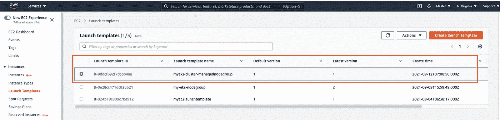

# 使用启动模板创建 AWS EKS 管理的节点组

> 原文：<https://levelup.gitconnected.com/using-launch-templates-to-create-aws-eks-managed-node-groups-9996f9ad18f5>

启动模板提供了实例配置的蓝图。它有 AMI (Amazon 机器映像)id、实例类型、密钥对、安全组等，以启动 AWS EC2(弹性计算云)实例。与对应的启动配置相比，使用启动模板的最佳之处在于，我们可以创建多个版本的启动模板，并将其推送到 GitHub、BitBucket 等远程源代码存储库，还可以与 Jenkins 等 CI/CD 服务器集成，以即时自动配置虚拟机。

我们还可以使用 AWS EKS(弹性 Kubernetes 服务)的启动模板来创建和管理作为托管节点组的工作节点。


带有发布模板的 AWS EKS

**以下是使用 AWS EKS 发布模板的主要优势:-**

(a)节点以启动模板中指定的新配置正常循环

(b)现有单元被优雅地转移到新的节点组

(c)与 Jenkins、Bamboo 等 CI/CD 服务器无缝集成

(d)在性能测试期间，具有较高实例类型的被管理节点组可以被自动供应，而无需基于基准删除整个集群

在本演示中，我们将了解如何创建不同版本的启动模板，然后将其用于我们的 AWS EKS 集群。

# 阶段 1:创建启动模板

1.  **使用 AWS CLI(命令行界面)创建启动模板**

我们将使用以下规格创建一个新的发布模板:-

**(a)实例类型** — t3 .中等

**(b)标签** — *关键字:值*用途:eks-节点

```
aws ec2 create-launch-template \
-launch-template-name myeks-cluster-managednodegroup \
-version-description “launch templated for creating and managing managed node groups” \
-launch-template-data ‘{“InstanceType”: “t3.medium”,”TagSpecifications”:[{“ResourceType”:”instance”,”Tags”:[{“Key”:”purpose”,”Value”:”eks-nodes”}]}] }’
```

**回应:-**

```
{
    "LaunchTemplate": {
        "LaunchTemplateId": "lt-0ddcf692f7cbbb4ae",
        "LaunchTemplateName": "myeks-cluster-managednodegroup",
        "CreateTime": "2021-09-12T07:08:56+00:00",
        "CreatedBy": "arn:aws:iam::195725532069:user/developer",
        "DefaultVersionNumber": 1,
        "LatestVersionNumber": 1
    }
}
```

这将使用**版本 1** 创建一个新的启动模板，如下面的屏幕截图所示:-



启动模板

2.**使用此发布模板的版本 1 创建一个新的 EKS 集群**

集群配置 YAML 文件:-

```
apiVersion: eksctl.io/v1alpha5
kind: ClusterConfig
metadata:
  name: my-eks-cluster-launch-template-demo
  region: us-east-1
  version: '1.21'
managedNodeGroups:
- name: myeks-nodegroup
  desiredCapacity: 2
  labels: { role: worker }
  launchTemplate:
     id: lt-0ddcf692f7cbbb4ae
     version: '1'
```

在终端上执行以下命令来配置集群:-

```
eksctl create cluster -f 000-eks-cluster-mng-t3medium.yaml
```

回应:-

```
~/go/mywork/mydevelopment/k8s-nest/iac/aws/eks/launch-template-demo(eks-nodegroup-launch-template*) » eksctl create cluster -f 000-eks-cluster-mng-t3medium.yaml                                       vinod827@Vinods-MacBook-Pro
2021-09-12 13:41:00 [ℹ]  eksctl version 0.66.0
2021-09-12 13:41:00 [ℹ]  using region us-east-1
2021-09-12 13:41:02 [ℹ]  setting availability zones to [us-east-1b us-east-1a]
2021-09-12 13:41:02 [ℹ]  subnets for us-east-1b - public:192.168.0.0/19 private:192.168.64.0/19
2021-09-12 13:41:02 [ℹ]  subnets for us-east-1a - public:192.168.32.0/19 private:192.168.96.0/19
2021-09-12 13:41:02 [ℹ]  nodegroup "myeks-nodegroup" will use "" [AmazonLinux2/1.21]
2021-09-12 13:41:02 [ℹ]  using Kubernetes version 1.21
2021-09-12 13:41:02 [ℹ]  creating EKS cluster "my-eks-cluster-launch-template-demo" in "us-east-1" region with managed nodes
2021-09-12 13:41:02 [ℹ]  1 nodegroup (myeks-nodegroup) was included (based on the include/exclude rules)
2021-09-12 13:41:02 [ℹ]  will create a CloudFormation stack for cluster itself and 0 nodegroup stack(s)
2021-09-12 13:41:02 [ℹ]  will create a CloudFormation stack for cluster itself and 1 managed nodegroup stack(s)
2021-09-12 13:41:02 [ℹ]  if you encounter any issues, check CloudFormation console or try 'eksctl utils describe-stacks --region=us-east-1 --cluster=my-eks-cluster-launch-template-demo'
2021-09-12 13:41:02 [ℹ]  CloudWatch logging will not be enabled for cluster "my-eks-cluster-launch-template-demo" in "us-east-1"
2021-09-12 13:41:02 [ℹ]  you can enable it with 'eksctl utils update-cluster-logging --enable-types={SPECIFY-YOUR-LOG-TYPES-HERE (e.g. all)} --region=us-east-1 --cluster=my-eks-cluster-launch-template-demo'
2021-09-12 13:41:02 [ℹ]  Kubernetes API endpoint access will use default of {publicAccess=true, privateAccess=false} for cluster "my-eks-cluster-launch-template-demo" in "us-east-1"
2021-09-12 13:41:02 [ℹ]  2 sequential tasks: { create cluster control plane "my-eks-cluster-launch-template-demo", 3 sequential sub-tasks: { wait for control plane to become ready, 1 task: { create addons }, create managed nodegroup "myeks-nodegroup" } }
2021-09-12 13:41:02 [ℹ]  building cluster stack "eksctl-my-eks-cluster-launch-template-demo-cluster"
2021-09-12 13:41:04 [ℹ]  deploying stack "eksctl-my-eks-cluster-launch-template-demo-cluster"
2021-09-12 13:41:34 [ℹ]  waiting for CloudFormation stack "eksctl-my-eks-cluster-launch-template-demo-cluster"
2021-09-12 13:42:06 [ℹ]  waiting for CloudFormation stack "eksctl-my-eks-cluster-launch-template-demo-cluster"
2021-09-12 13:43:07 [ℹ]  waiting for CloudFormation stack "eksctl-my-eks-cluster-launch-template-demo-cluster"
```


AWS EKS 集群现在已经准备好了，受管节点组使用启动模板中指定的配置。


AWS EKS


AWS EKS-工作节点

接下来，在新创建的集群中安排一个测试单元(比如 NGINX)

```
» kubectl create ns dev                                                                            
namespace/dev created
-----------------------------------------------------------------------------------------------------------------------------------------------------------------------------------------------------------------------------------
» kubectl run nginx --image nginx -n dev                                                           pod/nginx created
-----------------------------------------------------------------------------------------------------------------------------------------------------------------------------------------------------------------------------------
» kubectl get po -n dev   

NAME    READY   STATUS    RESTARTS   AGE
nginx   1/1     Running   0          10s
-----------------------------------------------------------------------------------------------------------------------------------------------------------------------------------------------------------------------------------
```

# 阶段 2:使用新版本的启动模板更新受管节点组，并将现有的 pod 适当地转移到新节点

1.  创建现有发布模板的新版本，即**版本 2**

```
aws ec2 create-launch-template-version \
--launch-template-name myeks-cluster-managednodegroup \
--version-description "New template version with the addition of key pair and security group allowing SSH access" \
--source-version 1 \
--launch-template-data '{ "KeyName":"eks-lt-keypair", "SecurityGroupIds":["sg-0e28306934fe7faeb"] }'
```

这里，我将添加一个现有的安全组，它允许使用名为'**eks-lt-key pair**'的新密钥对进行**端口 22 (SSH)** 访问。

回应:-

```
{
    "LaunchTemplateVersion": {
        "LaunchTemplateId": "lt-0ddcf692f7cbbb4ae",
        "LaunchTemplateName": "myeks-cluster-managednodegroup",
        "VersionNumber": 3,
        "VersionDescription": "New template version with the addition of key pair and security group allowing SSH access",
        "CreateTime": "2021-09-12T09:45:42+00:00",
        "CreatedBy": "arn:aws:iam::195725532069:user/developer",
        "DefaultVersion": false,
        "LaunchTemplateData": {
            "InstanceType": "t3.medium",
            "KeyName": "eks-lt-keypair",
            "TagSpecifications": [
                {
                    "ResourceType": "instance",
                    "Tags": [
                        {
                            "Key": "purpose",
                            "Value": "eks-nodes"
                        }
                    ]
                }
            ],
            "SecurityGroupIds": [
                "sg-0e28306934fe7faeb"
            ]
        }
    }
}
```

2.使用此新版本的启动模板更新受管节点组

```
aws eks update-nodegroup-version \
--cluster-name my-eks-cluster-launch-template-demo \
--nodegroup-name myeks-nodegroup \
--launch-template name=myeks-cluster-managednodegroup,version=3
```

回应:-

```
{
    "update": {
        "id": "f02b599f-fb0a-38d2-9ded-2b0c979763d2",
        "status": "InProgress",
        "type": "VersionUpdate",
        "params": [
            {
                "type": "LaunchTemplateName",
                "value": "myeks-cluster-managednodegroup"
            },
            {
                "type": "LaunchTemplateVersion",
                "value": "3"
            }
        ],
        "createdAt": "2021-09-12T15:16:40.102000+05:30",
        "errors": []
    }
}
```

您将看到新的工作节点使用新的配置，然后现有的 pod 自动优雅地转移到新的受管节点组:-


AWS EC2-EKS 工作节点


AWS EKS —受管节点组

在集群中执行下面的 **kubectl** 命令，检查现有 pod 的状态:-

```
» kubectl get po -n dev 

NAME    READY   STATUS    RESTARTS   AGE
nginx   1/1     Running   0          87m
```

令人惊讶的是，我们的 Pod 仍然运行良好，并且运行在新的托管节点组上:)

不仅如此，我们还可以使用新的实例类型创建新版本的启动模板，比如说 **t2.xlarge** ，并且受管节点组使用新的配置优雅地回收工作节点。

在终端上执行以下命令:-

```
aws ec2 create-launch-template-version \
--launch-template-name myeks-cluster-managednodegroup \
--version-description "Changing the instance type to t2.xlarge" \
--source-version 1 \
--launch-template-data '{ "InstanceType":"t2.xlarge" }'
```

回应:-

```
{
    "LaunchTemplateVersion": {
        "LaunchTemplateId": "lt-0ddcf692f7cbbb4ae",
        "LaunchTemplateName": "myeks-cluster-managednodegroup",
        "VersionNumber": 4,
        "VersionDescription": "Changing the instance type to t2.xlarge",
        "CreateTime": "2021-09-12T10:12:58+00:00",
        "CreatedBy": "arn:aws:iam::195725532069:user/developer",
        "DefaultVersion": false,
        "LaunchTemplateData": {
            "InstanceType": "t2.xlarge",
            "TagSpecifications": [
                {
                    "ResourceType": "instance",
                    "Tags": [
                        {
                            "Key": "purpose",
                            "Value": "eks-nodes"
                        }
                    ]
                }
            ]
        }
    }
}
```

运行以下命令更新受管节点组:-

```
aws eks update-nodegroup-version \
--cluster-name my-eks-cluster-launch-template-demo \
--nodegroup-name myeks-nodegroup \
--launch-template name=myeks-cluster-managednodegroup,version=4
```

回应:-

```
{
    "update": {
        "id": "e2eb8e74-f7a1-3c19-a882-65f5f0e1a4bf",
        "status": "InProgress",
        "type": "VersionUpdate",
        "params": [
            {
                "type": "LaunchTemplateName",
                "value": "myeks-cluster-managednodegroup"
            },
            {
                "type": "LaunchTemplateVersion",
                "value": "4"
            }
        ],
        "createdAt": "2021-09-12T15:47:54.168000+05:30",
        "errors": []
    }
}
```

您将看到 t2.xlarge 实例类型的新工作节点:-


AWS EKS-工作节点-T2 . x 大型实例类型

# 摘要:-

在本文中，我们看到了如何利用 AWS EKS 的启动模板来创建和管理受管节点组。每个版本的启动模板都会自动回收工作节点，无需我们手动干预。

像往常一样，您可以在这个 GitHub 资源库链接中找到这个演示的完整源代码

[https://github . com/vinod 827/k8s-nest/blob/main/IAC/AWS/eks/launch-template-demo/000-eks-cluster-mng-T3 medium . YAML](https://github.com/vinod827/k8s-nest/blob/main/iac/aws/eks/launch-template-demo/000-eks-cluster-mng-t3medium.yaml)

请随意为社区贡献更多 IaC(基础设施代码)。