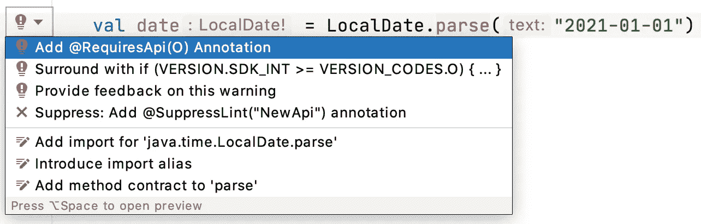

# 在 Android 中使用 Java 8 的本地日期、本地时间、本地日期时间

> 原文：<https://levelup.gitconnected.com/using-localdate-localtime-localdatetime-with-java-8-in-android-6df5097c7393>

在 android 中处理日期和时间，您可能会使用`Date(java.util.Date)`或`Calendar(java.util.Calendar).`现在您有了一个更好的选择:Java 8 中的 LocalDate。

**LocalDate** —没有时区的日期。
**本地时间** —没有时区的时间。
**LocalDateTime** —没有时区的日期时间。
**时区日期时间** —带时区的日期时间。
**持续时间** —基于时间的时间量。
**周期** —基于日期的时间量。

在 android 中写下面的代码，你会得到一个错误:LocalDate 只在 26 级以上可用。

# Java 8+ API 去糖支持

在项目的 build.gradle 中将 gradle 升级到 4.0.0(或更高版本)

在应用程序模块的 build.gradle 中包含以下内容

现在你可以在 Java8 中使用`LocalDateTime`。

# 本地日期

LocalDate —没有时区的日期。

# 本地时间

LocalTime —没有时区的时间。

# 本地日期时间

LocalDateTime 没有时区的日期时间。

还可以使用 LocalDate.parse 来获取日期。

对于指定的日期格式，请使用 DateTimeFormatter。

一旦创建了日期时间实例，您就可以获得年、日…

加上一天，一周，一个月

## 临时调节器

TemporalAdjusters 让你很快找到第一天和最后一天。

其他临时助理:

星期月
第一天月
第一天月
第一天年
第一天年
第一天月
最后一天月
最后一天年
最后一天年
最后一个月

**比较两个本地日期**

## 时期

Period 类使用年、月和日来表示一段时间。

# 持续时间

代表更精确的时间间隔。

## ZonedDateTime

ZonedDateTime 通过使用 ZoneId 提供带 zone 的日期时间。

您还可以获得所有区域 id。

使用 ZonedDateTime，您可以比较不同时区时间。

**参考**:

[https://developer . Android . com/studio/write/Java 8-support # library-de sugaring](https://developer.android.com/studio/write/java8-support#library-desugaring)