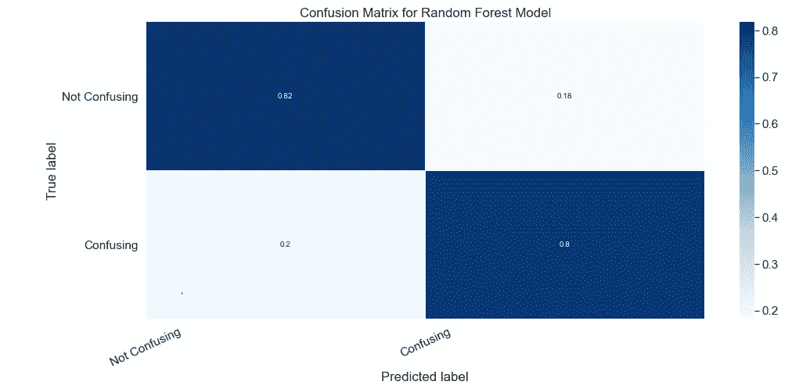

# 使用机器学习为传统法律分析提供信息

> 原文：<https://levelup.gitconnected.com/using-machine-learning-to-inform-traditional-legal-analysis-24c32d4b45b7>

应用机器学习模型来准确预测法律结果并不容易，也不可能 100%准确。没有水晶球。然而，至少在一定程度上，识别可能帮助*预测法律结果的特征是可能的。*

以下是使用机器学习进行商标混淆可能性分析的各种蓝图，以确定任何识别的特征是否可以预测商标审判和上诉委员会(TTAB)是否发现商标混淆。[【1】](#_ftn1)对技术面感兴趣的，可以跟着[这里](https://github.com/jgaetamarsh/TTAB-Classification-Model)。

**商标意见- >注册:基本流程**

我现在已经不做法律了，但是我做代理律师的时候，主要是做商标法。商标法经常涉及清除意见。许可意见是指客户在申请注册商标之前，就提议的商标是否可以使用和/或注册寻求法律建议。可供使用意味着提议的商标可能受到保护，除其他考虑因素外，没有已知的类似商标已经在使用中，可能会使提议的商标的所有者受到商标侵权索赔。可供注册意味着客户可能能够在美国专利商标局注册该商标。

为了给出这种意见，律师可以委托一份报告或以其他方式进行搜索，以找到可能与提议商标相似的商标，然后应用多因素分析，以确定任何特定商标是否可能成为提议商标使用/注册的障碍。然后，通过应用杜邦公司&公司 案 [*中规定的一系列因素，包括商标的相似性、商品/服务的关联性以及在先商标的知名度或独特性，该分析得出是否存在混淆可能性的意见。*](https://casetext.com/case/application-of-ei-dupont-denemours-amp-co)

如果客户继续商标申请，该申请将由美国专利商标局审查律师审查。审查律师将同样[确定](https://tmep.uspto.gov/RDMS/TMEP/current#/current/TMEP-1200d1e5044.html)如果在提议的商标之前有其他类似的商标，是否存在混淆的可能性(以及确定提议的商标是否满足所有注册要求)。在这种情况下，审查律师将最终决定拒绝该商标的注册，或者该商标可以因异议而被公布。

如果注册被拒绝，并且拒绝不能被克服，申请人可以向 TTAB 上诉最终拒绝。如果商标因异议而被公布，另一个商标所有人可以通过在 TTAB 提起异议程序来质疑该商标是否应该注册。即使商标已经注册，另一方当事人随后可以在 TTAB 提起撤销诉讼，要求撤销该商标的注册。

因此，以下寻求使用数据和机器学习来确定聚集的 TTAB 数据是否可用于帮助律师提供关于提议的商标是否可能与另一商标混淆的意见。

**准备数据**

这项工作中最困难和最乏味的部分是准备数据集。总的来说，我查看了来自 [TTAB 阅览室](https://ttab-reading-room.uspto.gov/efoia/efoia-ui/#/search/decisions)的 322 个 TTAB 分数比较(有些决定涉及不止一个分数)，具体如下:

1.216 起对检查律师拒绝注册的上诉；

2.80 人反对；和

3.26 次取消。

这些决定中有 251 个发现了混淆的可能性，约占 78%。对于拒绝注册的上诉，这一比例上升到 86%,然后下降到反对的 64%和取消程序的 54%。虽然这是一个小样本，但在评估新申请和拒绝注册时，只有大约 14%的机会成功证明商标没有混淆，而一旦涉及双方，这种机会就会增加，尤其是在结果是取消注册的情况下。事实上，在我对 TTAB 是否会发现商标令人困惑的分析中，TTAB 诉讼的类型是最具预测性的因素。

现在，这个数据集是一个独特的样本，因为它*只*考虑 TTAB 的决定，而不是顺利通过注册流程的申请。因此，更全面的视图需要创建一个从未到达 TTAB 的标记数据集。然而，即使将这种分析局限于 TTAB 的判决也是有价值的，因为这些判决可能有助于识别混淆和非混淆之间的界限，即更难的判断。因此，通过分析这条线的位置，可能更容易确定远离这条线的更清晰的情况。

**因素/特征**

自白:我没有看意见本身，也没有应用[自然语言处理](https://en.wikipedia.org/wiki/Natural_language_processing)。我想采用一种更简单的方法来对容易复制的混淆因素进行分类。因此，我创建了一个数据集，分析杜邦公司的基本因素，包括商标的相似性、商品、独特性和其他特征，这种分析方式更多的是数学而不是法律。当我考虑这些因素时，我就在确定某样东西的存在与否是否预示着 TTAB 人是否会觉得这个标记令人困惑。这可以从[相关性](https://en.wikipedia.org/wiki/Correlation)的角度来考虑，或者一个特征或因素是否与另一个特征或因素一起移动。

但是，在你被太多的数据谈话吓走之前，我想做的是确定一种简单的方式来看待杜邦因素，因为[特征](https://en.wikipedia.org/wiki/Feature_(machine_learning)#:~:text=In%20machine%20learning%20and%20pattern,pattern%20recognition%2C%20classification%20and%20regression.)使混淆发现的可能性更大或更小，以便更容易确定混淆和非混淆之间的界限在哪里。就是这样。

**标记的相似性:共同的字符**

混淆可能性分析最合理的起点是标记的相似性。为了做到这一点，我首先想看看是否可以通过创建一个具有共同特征的字符百分比，仅通过查看标记的共同字符来评估相似性。

数据集中所有标记共有字符的平均百分比为 62%，未被发现混淆的标记的平均百分比为 60%，而混淆的标记的平均百分比为 66%。这不是一个巨大的差异，但它可能表明，这条“混淆线”似乎正好位于 60%的共同字符处。

然而，仅仅有或多或少的共同特征并不能改变现状。根据相关性，该特征仅与 0.12 的混淆发现相关。因此，当我在我的模型中使用这个特征时，至少在这个数据集上，这个特征与混淆发现没有高度的相关性。

**商标的相似性:视觉、听觉、&含义**

在进行混淆可能性分析时，商标律师可能会确定商标在视觉、听觉和含义上有多相似。[例如，NUME 作为一个商标，可能看起来与 NOOM 不同，但它们很可能发音相似，MUSHROOM 和 SHROOM 可能看起来或听起来不一样，但它们可能表示相同的意思。]

为了从数学上确定这一特征，我比较了这些标记在视觉、声音和意义方面的相似性，从 1 到 3 对每一个标记进行评分，然后将该分数汇总为总体相似性总和。

在整个数据集上，平均“相似性得分”为 6.4，但在标记被确定为不会混淆的情况下，平均得分下降到 5.7，而在标记被确定为不会混淆的情况下，平均得分上升到 6.6。这可能显示了位于 5.7 和 6.6 附近的“混淆线”，其中混淆标记可能在视觉、声音和意义上至少部分相同。至于相关性，该特征的相关系数为 0.27，高于上述共同特征中的特征。

**商品/服务的相似性**

然后，我对商品/服务进行了类似的评分。如果商品/服务是相同的，我给商品打 3 分，相关打 2 分，不相关打 1 分。从这个角度来看，相关性为 0.083，这似乎是一个很弱的混淆可能性预测值。因为太弱了，在模型里没发现有帮助。

这个因素可能很弱，因为该数据集中的商品总体上非常相似。使用我的评分，总平均分数是 2.4，只有在分数不令人困惑的情况下才下降到 2.3。

**存在设计元素、免责声明和考虑独特性**

我考虑的其他特征是是否存在设计元素。虽然这些标记中的大部分是单词标记，但有一个设计元素，与混淆相关-0.13。这意味着，如果它存在，这些标记就不太可能被发现混淆。

与免责声明的存在也有一些微弱的关联。

最后，我评估了独特性，但这似乎没有任何有意义的关联。

**机器学习:应用不同的模型**

该数据集的一个初始问题是混淆性发现比非混淆性发现多得多，这意味着任何结果都可能显示欺骗性的准确性分数。换句话说，我可以简单地通过模型确定所有的标记都是混乱的来得到一个高精度的数字。因此，我运行了一些模型，在这些模型中，我平衡了混淆/非混淆的发现，既删除了一些混淆的例子，也增加了非混淆的例子，使得集合更加平衡。

**K-最近邻**

使用 K-最近邻和具有减少的混淆发现的数据集，使得集合更加平衡，获得的最高总得分是 83%。我运行这个模型，着眼于以下特征:程序的类型，是否有设计元素，相似性总和，以及相似性特征百分比。添加额外的功能会对分数产生负面影响。

**随机森林**

我还应用了一个随机森林模型，既减少了混淆实例的数量，又增加了非混淆的发现，从而使数据集更加平衡。最好的表现是，非混淆的三倍，以更好地平衡设置，再次只使用相同的四个功能。请注意，该模型识别混淆和非混淆的发现分别为 80%和 82%。

**结论**

机器学习本身不太可能提供完整的解决方案。但是，从上述内容来看，似乎确实存在一些预测特征，可以预测 TTAB 人是否会发现令人困惑的标记。也就是说，有办法使用特征来更好地预测法律结果。有鉴于此，我认为法律空间发展到使用这些类型的模型以及更传统的法律分析来解决各种法律问题只是时间问题。

当这种情况发生时，它将有望为客户提供一个更清晰的画面，显示某个结果的可能性是更大还是更小。实施、操作和扩展这样一个模型并不容易，但至少在某种程度上，这是可能的，而且可能已经发生了。与此同时，法律专业人士需要做的是提高他们的数据素养，为可能是一场深刻的实践演变做好准备。

[【1】](#_ftnref1)我不是机器学习工程师。我是一名前知识产权律师。我也不是研究数据的科学家。因此，虽然我只能提供一些分类模型的非常基本的应用程序，但是我可以演示当具有主题专业知识的人理解相关特性时会发生什么。