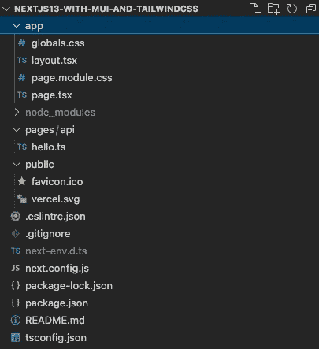
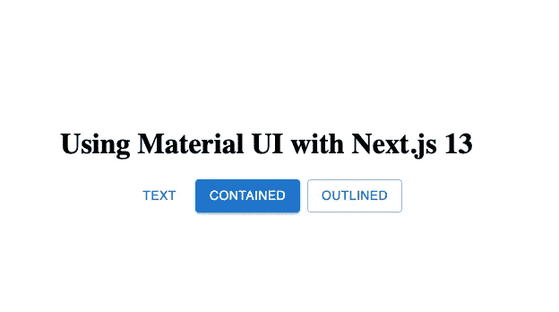
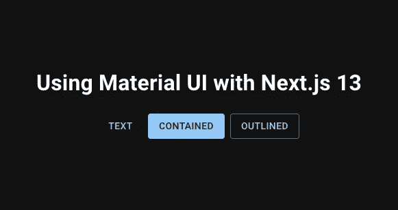
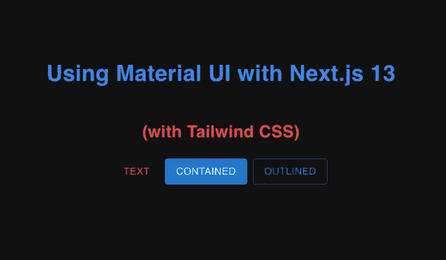

# 在 Next.js 13 和 Tailwind CSS 中使用材质 UI(第 1 部分)

> 原文：<https://levelup.gitconnected.com/using-material-ui-with-next-js-13-and-tailwind-css-41c201855dcf>

Next.js 13 已于 2022 年 10 月 25 日正式对外发布。许多新特性将使编写 Next.js 应用程序变得更加简单。其中之一就是引入了“**app”**文件夹和一种新的路线定义方式。这一变化将影响 Material UI 与 Next.js 的集成。本文将介绍一种将 Material UI 与 Nest.js 13 集成的方法。我将介绍每一步的细节，并将 Tailwind CSS 与 MUI 和 Next.js 集成。

## **先决条件**

为了遵循这里的代码示例，您应该在系统中安装 Node.js 14.6.0 或更高版本。你还应该对 React、Next.js 和 Material UI 有一些基本的工作知识。对 Tailwind CSS 的一些基本理解也会有所帮助。

## **创建 Next.js 应用程序**

我们将使用" **create-next-app"** 命令来创建我们的示例应用程序。

```
npx create-next-app@latest --experimental-app nextjs13-with-mui-and-tailwindcss --typescript
```

使用" **typescript"** 标志是因为我们在示例应用程序中使用了 typescript。

这里使用了" **experimental-app"** 标志，因为" **app"** 文件夹功能目前仍处于试验阶段。该命令为我们的示例应用程序创建一个新的"**nextjs 13-with-mui-and-tailwindcss "**文件夹，其中包含以下文件和文件夹:



## **删除“页面”文件夹**

在我们的示例练习中，我们不会使用“**pages”**文件夹。所以我们就删了。

## **安装材料 UI**

以下命令安装材质 UI 所需的包。“ **@emotion/react** ”和“ **@emotion/styled** ”是材质 UI 的对等依赖。

```
npm install @mui/material @emotion/react @emotion/styled
```

## **删除“globals.css”和“page.module.css”的内容**

生成的" **globals.css** "和" **page.module.css** "文件中的内容对我们的示例应用程序没有用处。所以我们会删除这些文件中的内容。我们将在必要时更新它们。

## **替换“page.tsx”文件的内容**

安装好必要的 Material UI 包，我们就可以在“ **app/page.tsx** ”文件中添加一些 MUI 组件了。在下面的代码中，我们向页面添加了一个**网格、**一个**堆栈、**和 3 个**按钮**。

```
**"use client";****import { Button, Grid, Stack } from "**[**@mui/material**](http://twitter.com/mui/material)**";**export default function Home() {
  return (
    **<Grid container height="100vh" alignItems="center" justifyContent="center" direction="column">
      <h1>Using Material UI with Next.js 13</h1>
      <Stack direction="row" columnGap={1}>
        <Button variant="text">Text</Button>
        <Button variant="contained">Contained</Button>
        <Button variant="outlined">Outlined</Button>
      </Stack>
    </Grid>**
  );
}
```

**注**:代码中的**粗体**文本表示对文件的修改。

除了 MUI 组件，文件中的一个重要行是" **use client"** annotation 语句。需要向 Next.js 13 表明我们希望该组件成为客户端组件，即在浏览器中运行。更多信息，请参考 [Next.js 13 文档](https://beta.nextjs.org/docs/rendering/server-and-client-components)。

## **运行样本代码**

经过上面的修改，我们现在可以开始应用程序的第一次驱动了。下面的命令将启动应用程序并监听 [http://localhost:3000](http://localhost:3000) 。

```
npm run dev
```

当您的浏览器指向上述 URL 时，您应该会看到如下所示的屏幕。



带有材料 UI 按钮的初始屏幕

这个屏幕有一些问题。目光敏锐且熟悉材料设计的读者可能会注意到:

1.  按钮中使用的字体系列不是默认的 Roboto 字体。
2.  标题“**使用 Next.js 13** 的材质 UI”也没有使用正确的字体。

接下来就来纠正这些问题吧！

## **包含机器人字体**

为了在应用程序中包含要使用的特殊字体，我们可以如下更新" **app/globals.css"** :

```
[**@import**](http://twitter.com/import) **url("**[**https://fonts.googleapis.com/css?family=Roboto:300,400,500,700&display=swap**](https://fonts.googleapis.com/css?family=Roboto:300,400,500,700&display=swap)**");**[**@import**](http://twitter.com/import) **url("**[**https://fonts.googleapis.com/icon?family=Material+Icons**](https://fonts.googleapis.com/icon?family=Material+Icons)**");**
```

这些行从 Google 下载 Roboto 字体和材质图标(示例应用程序没有使用)。

## **应用 MUI 主题**

接下来，我们将为示例应用程序创建一个黑色主题。我们将创建一个新的“ **app/theme/themes.ts** ”文件，并将新主题导出为“ **darkTheme** ”。

```
**"use client";****import { createTheme } from "**[**@mui/material**](http://twitter.com/mui/material)**/styles";****export const darkTheme = createTheme({
  palette: {
    mode: "dark",
  },
});**
```

现在我们有了自定义的主题和一个字体正确的 CSS 文件，我们可以将它应用到我们的应用程序中。这可以在“ **app/layout.tsx** ”文件中全局完成。

```
"use client";import "./globals.css";
**import { darkTheme } from "./theme/themes";****import { ThemeProvider, CssBaseline } from "**[**@mui/material**](http://twitter.com/mui/material)**";**export default function RootLayout({ children }: { children: React.ReactNode }) {
  return (
    <html lang="en">
      <head>
        <title>Create Next App</title>
        <meta name="description" content="Generated by create next app" />
        <link rel="icon" href="/favicon.ico" />
      </head>
      **<ThemeProvider theme={darkTheme}>
        <CssBaseline />**
        <body>{children}</body>
      **</ThemeProvider>**
    </html>
  );
}
```

1.  “**使用客户端**”注释告诉 Next.js 13 在浏览器中呈现组件。
2.  “ **import {darkTheme}…** ”语句导入我们在上面定义的自定义主题，用于使用此布局的所有页面。虽然在这个简单的应用程序中我们只有一个。
3.  接下来，我们添加了**"<theme provider/>"**组件，使用布局将自定义主题应用到页面。
4.  “< **CssBaseline / >** ”组件将所有组件和 HTML 的材质 UI 基线样式和字体应用于“子组件”。

正确应用上述更改后，当浏览器访问 [http://localhost:3000](http://localhost:3000) 时，示例应用程序应该会响应以下屏幕。



带有材质 UI 深色主题的屏幕

注意屏幕使用了" **darkTheme** "并且所有元素都使用了 Roboto 字体。

接下来，我们来看看如何将 Tailwind CSS 与 Next.js 和 Material UI 结合使用。

## 与 Tailwind CSS 集成的动机

Material UI 已经为页面布局提供了许多组件，并支持用户使用 Material UI 与应用程序进行交互。但是，我们经常需要对 MUI 组件的外观或布局进行微小的调整。这可以通过使用定制的 CSS 类或内联 CSS 来实现，这可能会变得难以管理。

自定义样式的一个更好的替代方法是使用 Tailwind CSS，因为 Tailwind 类的实用性质使得定义新的 CSS 类和使用内联样式的需求最小化。

## 安装顺风 CSS

以下命令安装将 tailwindcss 与 Next.js 集成所需的 **"tailwindcss** "、 **postcss** 和**" antofixer "**。有关更多信息，请参见[使用 Next.js 安装 Tailwind CSS](https://tailwindcss.com/docs/guides/nextjs)。

```
npm install -D tailwindcss postcss autoprefixer
```

使用以下命令创建" **tailwind.config.js"** 和" **postcss.config.js** "配置文件。

```
npx tailwindcss init -p
```

对于我们的目的，不需要对" **postcss.config.js** "文件进行任何更改。

```
module.exports = {
  plugins: {
    tailwindcss: {},
    autoprefixer: {},
  },
}
```

对于“ **tailwind.config.js** ”文件，我们需要做两处修改:

1.  删除顺风 CSS 的预检样式，以便它可以使用 MUI 的预检(CssBaseline)。
2.  添加“**”。/app/**/*。{js，ts，jsx，tsx，css}** "添加到内容数组，这样 Tailwind css 将在 CSS 编译过程中包含“ **app** ”文件夹中的文件。

```
/** [@type](http://twitter.com/type) {import('tailwindcss').Config} */
module.exports = {
 **corePlugins: {
    preflight: false,
  },**
  **content: ["./app/**/*.{js,ts,jsx,tsx,css}"],**
  theme: {
    extend: {},
  },
  plugins: [],
};
```

在“ **app/globals.css** ”文件中，为每个顺风层添加`@tailwind`指令。

```
[**@tailwind**](http://twitter.com/tailwind) **base;** [**@tailwind**](http://twitter.com/tailwind) **components;** [**@tailwind**](http://twitter.com/tailwind) **utilities**;[@import](http://twitter.com/import) url("[https://fonts.googleapis.com/css?family=Roboto:300,400,500,700&display=swap](https://fonts.googleapis.com/css?family=Roboto:300,400,500,700&display=swap)");[@import](http://twitter.com/import) url("[https://fonts.googleapis.com/icon?family=Material+Icons](https://fonts.googleapis.com/icon?family=Material+Icons)");
```

## **向 h1、h4 和 MUI 按钮添加 Tailwind CSS 类**

最后，我们来更新一下“ **app/page.tsx** ”文件，应用一些 Tailwind CSS 样式做一些样式上的改动，这样我们就可以看到它们的效果了。

```
"use client";import { Button, Grid, Stack } from "[@mui/material](http://twitter.com/mui/material)";export default function Home() {
  return (
    <Grid container height="100vh" alignItems="center" justifyContent="center" direction="column">
      <h1 **className="text-blue-500"**>Using Material UI with Next.js 13</h1>
      **<h4 className="text-red-500">(with Tailwind CSS)</h4>**
      <Stack direction="row" columnGap={1}>
        <Button variant="text" **className="text-red-500"**>
          Text
        </Button>
        <Button variant="contained">Contained</Button>
        <Button variant="outlined">Outlined</Button>
      </Stack>
    </Grid>
  );
}
```

包含顺风 CSS 类的最终屏幕如下所示。标题以选定的蓝色显示。h4 标签中的新文本和 MUI flat 按钮中的文本现在显示为红色。



带有材质 UI 和顺风 CSS 的屏幕

## **一些最终想法**

Next.js 13 中引入的新“ **app** ”文件夹仍在测试中。尽管有些功能尚未最终确定，但许多功能已经可以使用了。这里的示例应用程序集中在一个客户端库(材质 UI)上，需要“**使用客户端**”注释。

Material UI 提供了一种快速构建外观合理且一致的 UI 的方法。有了 Tailwind CSS 的组合，我的经验是对材质 UI 进行微调的任务变得更加容易，因为定义新的 CSS 类和内联样式的需求被最小化了。

如果您想查看本文中描述的代码，您可以从 [Github](https://github.com/tatleung/nextjs13-with-mui-and-tailwindcss) 中克隆它。

*这篇文章中介绍的技术有一个恼人的闪烁问题。* [*第二部分*](https://medium.com/p/72d7e034baa9) *给出了解决方案。*

*我是 Medium 写作新手，想加入“Medium 合作伙伴计划”。要获得资格，我需要 100+的追随者。如果你喜欢读这篇文章，请关注我，并与你的朋友和同事分享这篇文章。*