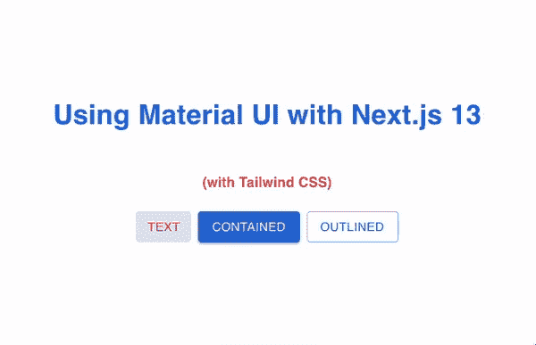

# 在 Next.js 13 和 Tailwind CSS 中使用材质 UI(第 2 部分)

> 原文：<https://levelup.gitconnected.com/using-material-ui-with-next-js-13-and-tailwind-css-part-2-72d7e034baa9>

在我的第 1 部分 [*使用 Next.js 13 和 Tailwind CSS*](/using-material-ui-with-next-js-13-and-tailwind-css-41c201855dcf) 的材质 UI 中，我展示了一个用 Next.js 集成材质 UI 和 Tailwind CSS 的方法，有几个读者问我是否经历过闪烁。答案是肯定的！当使用 Tailwind CSS 改变“文本”按钮的文本颜色时，闪烁不明显。正如下面的动画 GIF 所示，当我改变背景并重新加载页面时，它变得非常明显。

闪烁是应用于按钮的 CSS 序列的结果。当页面最初被加载时，来自 Material UI 的 CSS 被使用，稍后由 Tailwind CSS 更新。

要纠正这个恼人的问题，需要做两个小的改动:

1.  在`tailwind.config.js`文件中，添加一行`important: ‘#__next’`(第 7 行)来告诉浏览器让来自顺风 CSS 的样式优先于来自 Material UI 的样式。

2.在`layout.tsx`文件中，将`id="__next"`添加到主体标签中(第 27 行)

有了这两个小变化，你应该不会再看到文本按钮闪烁了。如果你想看到实际的变化，请在 [GitHub](https://github.com/tatleung/nextjs13-with-mui-and-tailwindcss.git) 上查看这个项目

*我是 Medium 写作新手，想加入“Medium 合作伙伴计划”。要获得资格，我需要 100+的追随者。如果你喜欢读这篇文章，请关注我，并与你的朋友和同事分享这篇文章。*