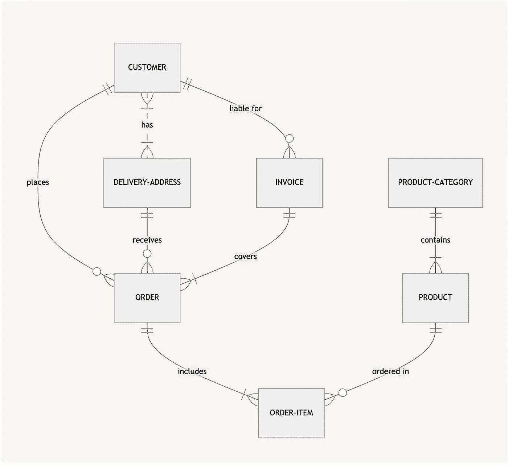
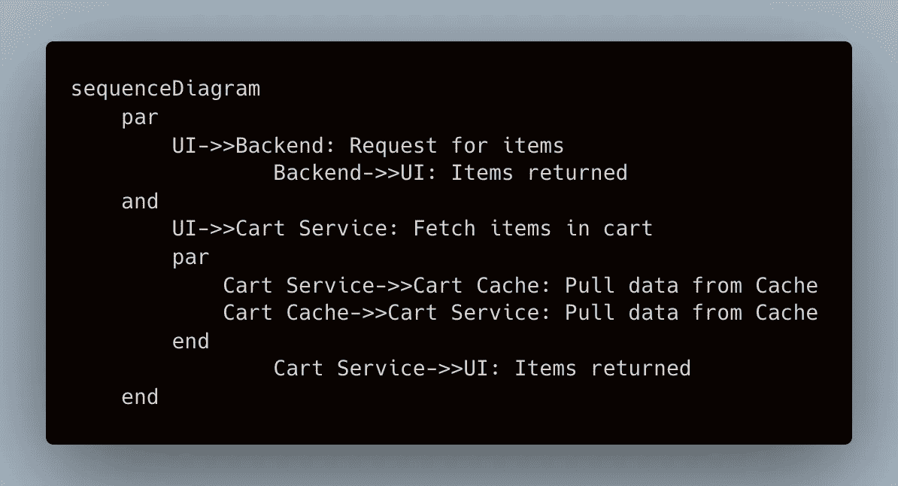
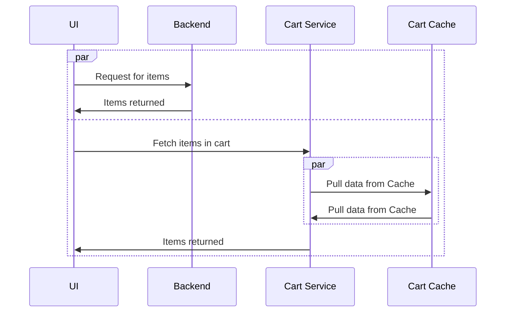
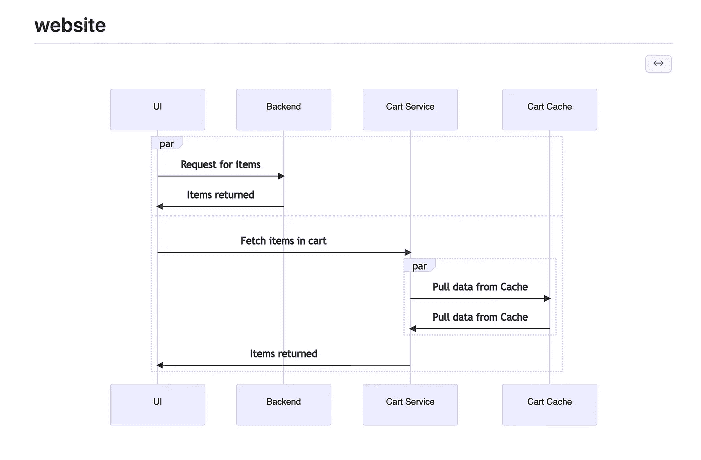
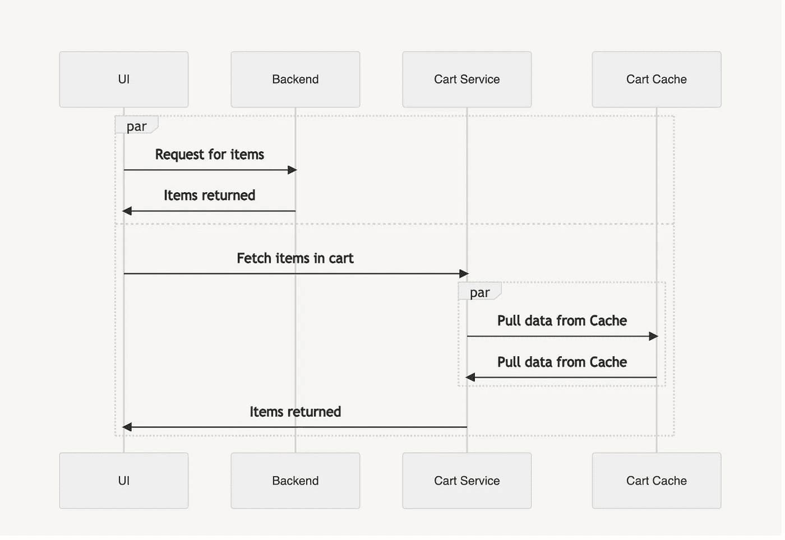

# 在 GitHub 和概念中使用 Mermaid 用于 UML 图

> 原文：<https://levelup.gitconnected.com/using-mermaid-for-uml-diagrams-in-github-and-notion-734e52f64c9b>

有没有想过在 GitHub repo 中添加图表，或者在文档中更好地解释软件是如何工作的？如果你在此之前没有听说过美人鱼，那你一定会大开眼界！我将向您展示如何用代码概述您的序列图或其他 UML，并让它们显示在 GitHub 和 concept 中。



一位同事向我介绍了 GitHub 和 concept 都支持 Mermaid 的事实，你可以在不同的 UML 图中使用它。我们能够用很少的代码引入一个序列图，如下图所示。



下面是这段代码在 GitHub 中的样子。请确保您的代码包含在美人鱼标记中。

```

```



这是代码在概念中的样子



# 结论

这可能是一个强大的工具，并且比在另一个工具中创建然后导出或复制并粘贴一个截图到文档中要容易得多。您的图只是代码，因此您可以像管理代码库中的任何其他代码一样管理它们。如果你想了解更多关于美人鱼语法的知识，请点击这里查看。

如果你喜欢这篇文章，考虑[订阅媒体](https://medium.com/@ascourter/membership)！

如果你或你的公司有兴趣找人进行技术面试，那么请在 Twitter ( [@Exosyphon](http://twitter.com/Exosyphon) )上给我发 DM，或者访问我的[网站](https://andrewcourter.com/)。如果你喜欢这样的话题，那么你可能也会喜欢我的 Youtube 频道。如果你想支持更多这样的内容 [buymeacoffee](https://www.buymeacoffee.com/andrewcourter) 。祝您愉快！

# 分级编码

感谢您成为我们社区的一员！在你离开之前:

*   👏为故事鼓掌，跟着作者走👉
*   📰查看[升级编码出版物](https://levelup.gitconnected.com/?utm_source=pub&utm_medium=post)中的更多内容
*   🔔关注我们:[Twitter](https://twitter.com/gitconnected)|[LinkedIn](https://www.linkedin.com/company/gitconnected)|[时事通讯](https://newsletter.levelup.dev)

🚀👉 [**加入升级人才集体，找到一份神奇的工作**](https://jobs.levelup.dev/talent/welcome?referral=true)