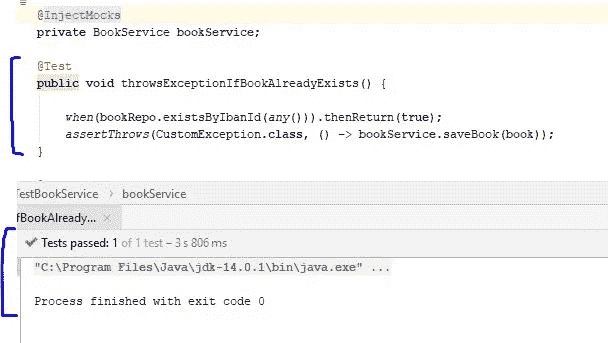
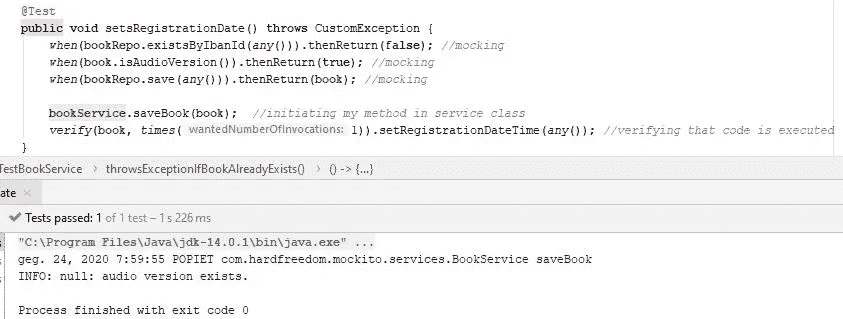
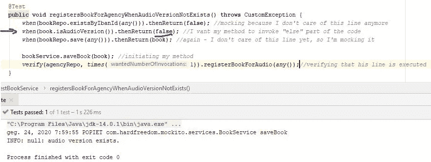
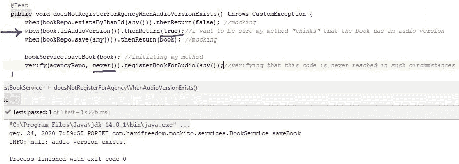
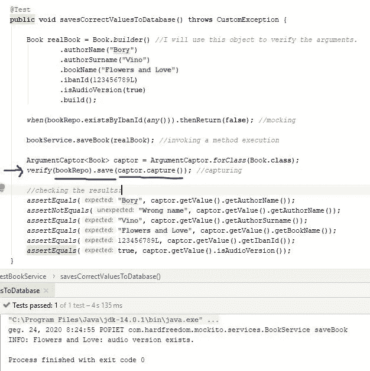

# 使用 Mockito 进行单元测试

> 原文：<https://levelup.gitconnected.com/using-mockito-for-unit-testing-96a74f3ed2a5>

## 新手用例子解释


蒂姆·高在 [Unsplash](https://unsplash.com/s/photos/nerds?utm_source=unsplash&utm_medium=referral&utm_content=creditCopyText) 上拍摄的照片

单元测试是每个在公司工作或编写自己代码的开发人员工作的一部分。在大多数情况下，新的 Java 程序员开始学习编写 JUnit 测试，这是 Java 开发人员的另一个基础知识。但是，仅仅了解 JUnit 是不够的。*模拟*是单元测试的重要组成部分，被许多开发人员广泛使用。

> 最流行的使用 mocks 的 Java 库之一是 Mockito。

我意识到对于初级开发人员来说，理解如何用 Mockito 编码可能有点困难。它是需要额外学习的 Java 库之一。我可以把它与学习一种新的方言相比较——例如，荷兰人有非常多样的方言，其中一些甚至在荷兰的不同地区都很难理解。Mockito 也是一样——它是 Java 的一部分，但是需要额外的努力来学习它。

> 在本文中，我将解释开发人员应该使用 Mockito 的情况。此外，我将提供一些代码示例。

## 为什么模拟是必要的？

**单元**测试的概念是在一个测试类中只测试一个类/单元。然而，在大多数情况下，这个类有一些其他的依赖项。例如，服务类可能依赖于其他类:存储库、助手等。服务类从其他类调用代码，但是我们只想测试 **this-service** 类，而不是所有其他相关的类。在编写单元测试时，我们不应该对其他类中的侧面实现感兴趣。为了避免侧面测试，我们必须使用模拟。如果模拟不能用于类依赖，我们将不得不创建真实的对象，这样的测试将发展成为集成测试，而集成测试不是单元测试的一部分。

依赖性的替换和这种依赖性的虚拟实现被称为模仿。

## 实际例子

对于代码示例，我将 Spring Boot 与 Maven 结合使用。首先要做的是在 pom 文件中添加所需的依赖关系:

```
<**dependency**>
   <**groupId**>org.mockito</**groupId**>
   <**artifactId**>mockito-junit-jupiter</**artifactId**>
   <**version**>3.3.3</**version**>
   <**scope**>test</**scope**>
</**dependency**>
```

我将测试一个 *BookService* 类，它只有一个带有一些依赖项的方法:

```
@Component
**public class** BookService {

    **private static final** Logger ***LOGGER*** = Logger.*getLogger*(**"InfoLoggin"**);@Autowired
    **private** BookRepo **bookRepo**;@Autowired
    **private** VoiceOverAgencyRepository **agencyRepo**;

    **public** Book saveBook(Book book) **throws** CustomException {

        *//1\. Checking if this book already exists in database.* **if** (**bookRepo**.existsByIbanId(book.getIbanId())) {
            **throw new** CustomException();
        }

        *//2\. Setting registration date of a new book.* book.setRegistrationDateTime(LocalDateTime.*now*());

        *//3\. Checking if this book has an audio version.
        //If not, we register it in agency's DB too.* **if** (book.isAudioVersion()) {
            ***LOGGER***.info(book.getBookName() + **": audio version       exists."**);
        } **else** {
            **agencyRepo**.registerBookForAudio(book.getIbanId());
        }
        *//4\. Saving into the database.* **return bookRepo**.save(book);
    }
}
```

该方法接收一个 book 对象并检查:

a)如果这样的书已经存在于数据库中。如果这本书存在，它会抛出一个自定义异常。

b)如果数据库中不存在该书，则它设置注册日期和时间。

c)它检查该书是否有音频版本。如果没有音频版本，它会将这本书注册到一个语音代理的存储库中。

d)最后，它将这本书注册到图书库中。

如您所见，这个类有两个自动连接的对象:*语音代理库*和*图书库*。我们在这个类中调用两个存储库，但是它们将在自己的类中完成它们的工作。我们不想测试其他类的功能，这意味着这两个对象将被嘲笑。

## 让我们一步一步来

1.  我需要创建一个测试类，并添加所有的依赖项。
    a)我的测试类得到一个注释*@ extend with(mockitoextensionc . class)。这个注释初始化了测试类中的所有模拟。
    b)我用注释 *@Mock* 模拟所有的依赖关系，并使用注释 *@InjectMocks* 将这些模拟注入到我想要测试的服务类中:*

```
@ExtendWith(MockitoExtension.**class**)
**public class** TestBookService {

    @Mock
    **private** Book **book**;

    @Mock
    **private** BookRepo **bookRepo**;

    @Mock
    **private** VoiceOverAgencyRepository **agencyRepo**;

    @InjectMocks
    **private** BookService **bookService**;
...
```

正如你所看到的，我已经模拟了在 *BookService* 类中与 *@Autowired* 注释一起使用的所有依赖项。我还模仿了一本我在 *BookService* 类中用作方法参数的书。我将能够随心所欲地操纵这些对象，并且我不需要创建真实的对象。

2.让我们回到 *BookService* 类。

这里只有一种方法，我将一步一步地测试它。这意味着我想创建一些不同的测试方法来检查我的方法的不同行为。

我的方法的前几行验证图书是否已经在图书存储库中。如果确实存在，它会抛出一个自定义异常:

```
**public** Book saveBook(Book book) **throws** CustomException {

        *//1\. Checking if this book already exists in database.* **if** (**bookRepo**.existsByIbanId(book.getIbanId())) {
            **throw new** CustomException();
        }
```

我如何能检查它？我必须对我的测试类说，这本书已经存在于存储库中，所以它将调用异常。我可以用模仿的方法*来做，当…然后 Return…* 我传递一个 Mockito 变量 *any()* 因为它不必是一个真实的对象——我唯一关心的是调用我的异常。因此，我告诉 Mockito: *当*到达一个代码行，上面写着*book repo . existsbyibanid(any())*，*然后返回* *true* 。现在我可以测试我的程序是否真的抛出了异常。看看这个:



3.下面是服务类的第二部分:

```
*//2\. Setting registration date of a new book.* book.setRegistrationDateTime(LocalDateTime.*now*());
```

我的测试应该检查服务类是否真的执行了这一行。我想确保我的代码不会在没有到达的地方结束。

为了做到这一点，我可以使用 Mockito 方法*验证*(发生了一些事情)。

在调用这个方法之前，我必须向测试类给出指令:

a)当我的代码到达第一行时，检查这本书是否已经存在，我必须告诉我的代码这本(被模仿的)书还不存在(否则我的代码将抛出异常)。

b)之后，我的代码将到达我想要测试的行。然而，这还不够。我必须为我的测试方法编写指令，以及当它到达方法的以下行时应该做什么:



4.让我们进入该方法的下一部分:

```
*//3\. Checking if this book has an audio version.
// If not, we register it in agency's DB too.* **if** (book.isAudioVersion()) {
            ***LOGGER***.info(book.getBookName() + **": audio version exists."**);
        } **else** {
            **agencyRepo**.registerBookForAudio(book.getIbanId());
        }
```

如果没有音频版本，我想确保我的代码确实在机构的存储库中注册了一本书。在这种情况下，我会告诉我的嘲笑，这本书没有音频版本。



5.反之亦然:如果音频版本已经存在，我想确保我的代码永远不会为代理注册这本书。我可以告诉我的 *verify* 函数，这一行不应该被调用:



6.最后，最后一部分*图书服务*类:

```
*//4\. Saving into the database.* **return bookRepo**.save(book);
    }
}
```

我想确保它会将正确的对象保存到数据库中。

为此，我将创建一个真正的 book 对象，并捕获我保存在 book 存储库中的数据。

*参数捕获器*允许访问方法调用的参数并检查它们。它与*验证(..)*方法。我可以很容易地启动它:

*ArgumentCaptor<****objectthawanttocapture****>captor = ArgumentCaptor . for class(****objectthawanttocapture . class****)；*

让我们看看:



您现在已经学习了如何使用 Mockito 编写单元测试。我的例子包括您可以在代码中使用的最常用的 Mockito 方法:

*   *何时(某个方法将被调用)。thenReturn(某物)；*
*   *验证(该方法将被调用 x 次)；*
*   *验证(该方法将被调用，永不调用)；*
*   验证(当这个方法被调用时)……(捕获者捕获我想要验证的参数)。

掌握了这些基本的 Mockito 函数后，您将能够更深入地研究它，并确保您的代码质量更好。

关于 Mockito 的更多信息可以在官方文档网站中找到[。](https://site.mockito.org/)