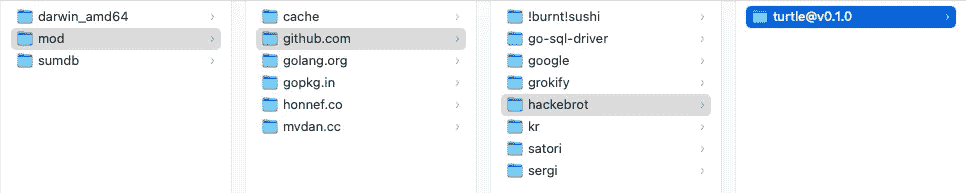
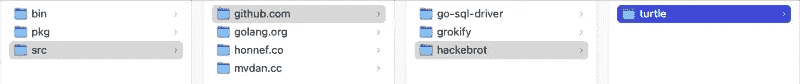
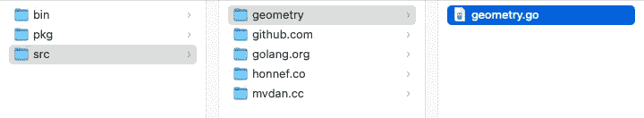
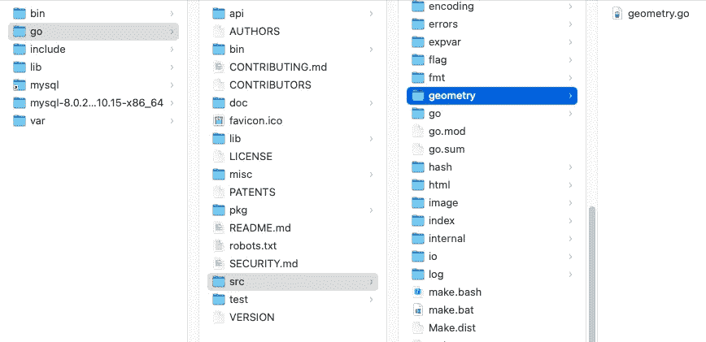
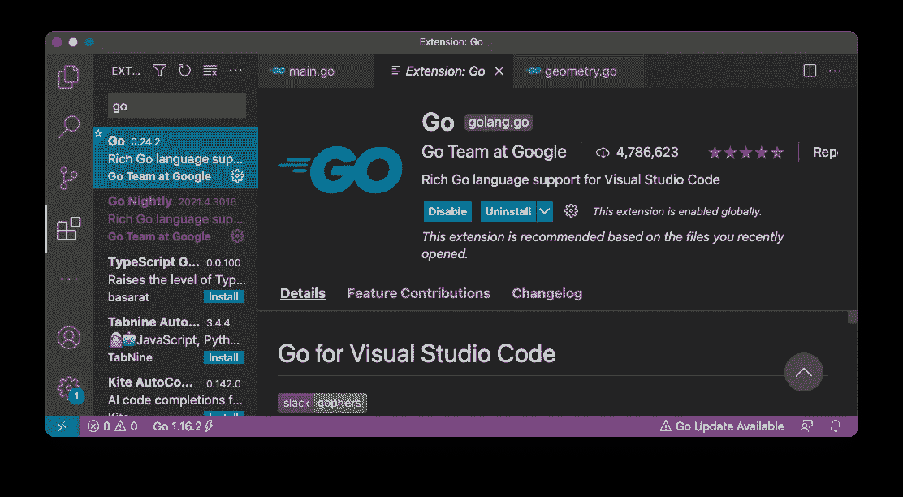

# 在 Go 中使用模块和包

> 原文：<https://levelup.gitconnected.com/using-modules-and-packages-in-go-36a418960556>

## 了解 Go 1.16 中的变化


托比·斯托达特在 [Unsplash](https://unsplash.com?utm_source=medium&utm_medium=referral) 上的照片

如果你使用 Go，你会一直处理包和模块。在围棋中，一个 ***包*** 是一个目录。go 文件和包构成了 Go 程序的基本构件。使用包，您可以将代码组织成可重用的单元。

另一方面，一个 ***模块*** 是一个 Go 包的集合，具有内置的依赖关系和版本控制。模块最初是在 Go 1.11 中引入的，但是直到 Go 1.16，默认情况下 *go* 命令才在模块感知模式下构建包。这给 Go 开发者在使用本地和第三方包时造成了相当大的困惑。本文试图澄清这种情况，我希望本文中的例子会让它变得非常清楚。

# Go 环境变量

在我们深入到包和模块的主题之前，您需要理解 Go 环境变量。Go 使用*环境变量*作为配置库和包路径的机制。要查看 Go 设置的各种环境，使用 **go env** 命令:

```
$ **go env
GO111MODULE="auto"**
GOARCH="amd64"
GOBIN=""
GOCACHE="/Users/weimenglee/Library/Caches/go-build"
GOENV="/Users/weimenglee/Library/Application Support/go/env"
GOEXE=""
GOFLAGS=""
GOHOSTARCH="amd64"
GOHOSTOS="darwin"
GOINSECURE=""
GOMODCACHE="/Users/weimenglee/go/pkg/mod"
GONOPROXY=""
GONOSUMDB=""
GOOS="darwin"
**GOPATH="/Users/weimenglee/go"**
GOPRIVATE=""
GOPROXY="https://proxy.golang.org,direct"
**GOROOT="/usr/local/go"**
GOSUMDB="sum.golang.org"
GOTMPDIR=""
GOTOOLDIR="/usr/local/go/pkg/tool/darwin_amd64"
GOVCS=""
GOVERSION="go1.16.2"
GCCGO="gccgo"
AR="ar"
CC="clang"
CXX="clang++"
CGO_ENABLED="1"
GOMOD=""
CGO_CFLAGS="-g -O2"
CGO_CPPFLAGS=""
CGO_CXXFLAGS="-g -O2"
CGO_FFLAGS="-g -O2"
CGO_LDFLAGS="-g -O2"
PKG_CONFIG="pkg-config"
GOGCCFLAGS="-fPIC -arch x86_64 -m64 -pthread -fno-caret-diagnostics -Qunused-arguments -fmessage-length=0 -fdebug-prefix-map=/var/folders/5z/b_k8j2vs2jg1kcp7yb7rs4vh0000gn/T/go-build3486438553=/tmp/go-build -gno-record-gcc-switches -fno-common"
```

特别是，有三个 Go 环境变量值得一提(如上面的**粗体**所示):

*   GOROOT —指定你的 GO SDK 所在的位置。
*   **GOPATH** —指定工作空间的根(包和依赖项所在的位置)。
*   **GO111MODULE** —指定 GO 如何导入您的包。它可以假设以下三个值:“*开*”、“*关*”或“*自动*”。

# Go 1.11 有什么特别之处？

需要一点背景知识。在 Go 1.11 之前，所有 Go 项目都必须在 **GOPATH** 环境变量指定的目录下创建。这个 **GOPATH** 目录包含源代码和您的代码所依赖的二进制文件。

从 Go 1.11 开始(因此环境变量以它命名— **GO111MODULE** )，您的项目现在可以驻留在 **GOPATH** 目录之外。Go 1.11 引入了**模块**的概念。一个模块是一个包的目录，它的根是一个名为 **go.mod** 的文件。 **go.mod** 文件定义了模块的导入路径，以及它的特定依赖项(您将在本文后面的示例中看到它的用法)。带模块:

*   Go 项目不需要驻留在 GOPATH 中
*   包管理得到了极大的改进

# 了解 go 111 模块

在 Go 1.15 及更早版本中，**Go 111 模块**的默认模式设置为“**自动**”。这意味着如果一个项目目录(或任何父目录)包含一个 **go.mod** 文件，它将被视为一个模块。否则，它将使用传统的 **GOPATH** 模式(我将在下面的小节中提供这方面的例子)。

在 Go 1.16 中，模块感知模式现在默认开启( **GO111MODULE=on** )。那么这对你使用第三方模块或者编写自己的模块有什么影响呢？我将在接下来的小节中说明各种场景。

# go 111 模块=开

既然这是 Go 1.16 中的默认模式，那我们就先从这个场景说起。我将用一个例子说明这一点。假设您有一个名为 **HelloApp** 的文件夹，其中有一个名为 **main.go** 的文件:

```
HelloApp
   |___main.go
```

> 要将**go 111 模块**切换到上的**，可以使用以下命令:**export go 111 module = " on "**(MAC OS)或**set go 111 module = on**(Windows)**

**main.go** 文件包含以下语句:

```
package mainimport (
    "fmt"
    "github.com/hackebrot/turtle"
)func main() {
    emoji, ok := turtle.Emojis["smiley"]
    if !ok {
        fmt.Println("No emoji found.")
    } else {
        fmt.Println(emoji.Char)
    }
}
```

## 使用第三方包

在这个**主**包中，我使用的是第三方包——**github.com/hackebrot/turtle**。所以我需要先安装它:

```
$ **go install github.com/hackebrot/turtle@latest**
```

> 请注意，您需要指定要安装的软件包的版本。如果要用最新版本，用 **@latest。**

一旦安装包，你可以在***GOPATH*/pkg/mod**目录中找到它。比如我的 **GOPATH** 是" */Users/weimenglee/go* "，那么模块会安装在"*/Users/weimenglee/go/pkg/mod*"目录下:



当 GO111MODULE=on 时，第三方包将存储在 GOPATH/pkg/mod/目录中

在 Go 1.16 中，如果你的程序使用了第三方的包，你需要先创建一个 **go.mod** 文件才能运行。所以下一步是使用" **go mod init** "命令:

```
$ **go mod init myapp** go: creating new go.mod: module myapp
go: to add module requirements and sums:
go mod tidy
```

在上面的例子中，我为我的程序使用了 **myapp** 的*模块路径*名称。这个名称将被用作模块的导入名称(当另一个程序试图导入您的模块时)。

> 请注意，如果您打算发布这个包(或模块)，这必须是 Go 工具可以从其中下载您的模块的路径。例如，如果你想让这个包在 Github.com 上可用，那么你应该使用这样的名字:**github.com/yourname/myapp**。

完成这一步后，您现在应该在当前目录中有一个 **go.mod** 文件:

```
HelloApp
   |___main.go
   |___**go.mod**
```

它应该有以下内容:

```
module myappgo 1.16
```

接下来，您需要运行" **go mod tidy** 命令:

```
$ **go mod tidy** go: finding module for package github.com/hackebrot/turtle
go: found github.com/hackebrot/turtle in github.com/hackebrot/turtle v0.1.0
go: finding module for package github.com/google/go-cmp/cmp
go: finding module for package github.com/hackebrot/go-repr/repr
go: found github.com/google/go-cmp/cmp in github.com/google/go-cmp v0.5.5
go: found github.com/hackebrot/go-repr/repr in github.com/hackebrot/go-repr v0.1.0
```

这个命令将检查你在程序中使用的第三方包，并将它们作为依赖项添加到 **go.mod** 文件中。运行上面的命令后，您的 **go.mod** 文件应该看起来像这样:

```
module myappgo 1.16**require (
    github.com/google/go-cmp v0.5.5 // indirect
    github.com/hackebrot/go-repr v0.1.0 // indirect
    github.com/hackebrot/turtle v0.1.0
)**
```

您还应该有另一个名为 **go.sum** 的文件:

```
HelloApp
   |___main.go
   |___go.mod
 **|___go.sum**
```

**go.sum** 的内容是这样的:

```
github.com/google/go-cmp v0.5.5 h1:Khx7svrCpmxxtHBq5j2mp/xVjsi8hQMfNLvJFAlrGgU=github.com/google/go-cmp v0.5.5/go.mod h1:v8dTdLbMG2kIc/vJvl+f65V22dbkXbowE6jgT/gNBxE=github.com/hackebrot/go-repr v0.1.0 h1:28FyOiVx+rHPqEj/nqUbxqs2ocz2hfM9gP01kAeJJoA=github.com/hackebrot/go-repr v0.1.0/go.mod h1:5nbEBC4Y57U1dVAlQGF4lQdqAJZAwu7cszx8HtEq8XM=github.com/hackebrot/turtle v0.1.0 h1:cmS72nZuooIARtgix6IRPvmw8r4u8olEZW02Q3DB8YQ=github.com/hackebrot/turtle v0.1.0/go.mod h1:vDjX4rgnTSlvROhwGbE2GiB43F/l/8V5TXoRJL2cYTs=golang.org/x/xerrors v0.0.0-20191204190536-9bdfabe68543/go.mod h1:I/5z698sn9Ka8TeJc9MKroUUfqBBauWjQqLJ2OPfmY0=
```

**go.sum** 文件包含程序中使用的特定模块版本内容的预期加密校验和。

现在，您终于可以运行您的程序了:

```
$ **go run main.go** 😃
```

## 使用本地包

使用您在本地定义的包怎么样？假设现在在 **HelloApp** 文件夹中有一个名为 **geometry** 的文件夹。在 **geometry** 文件夹中，你有另一个名为 **geometry.go** 的文件:

```
HelloApp
   |___main.go
   |___go.mod
   |___go.sum
 **|___geometry
       |___geometry.go**
```

**geometry.go** 的内容如下:

```
package geometry
import (
    "math"
)type Point struct {
    X float64
    Y float64
}func (p Point) Length() float64 {
    return math.Sqrt(math.Pow(p.X, 2.0) + math.Pow(p.Y, 2.0))
}
```

为了使用**主**包文件中的**几何**包，现在可以通过“ **myapp/geometry** ”导入它(还记得我们之前使用的模块导入路径名为“ **myapp** ”？):

```
package mainimport (
    "fmt"
    **"myapp/geometry"
**    "github.com/hackebrot/turtle"
)func main() {
    emoji, ok := turtle.Emojis["smiley"]
    if !ok {
        fmt.Println("No emoji found.")
    } else {
        fmt.Println(emoji.Char)
    } **pt1 := geometry.Point{X: 2, Y: 3}
    fmt.Println(pt1)
    fmt.Println(pt1.Length())** }
```

现在，您可以使用“ **go run main.go** ”命令简单地运行程序:

```
$ **go run main.go** 😃
**{2 3}
3.605551275463989**
```

# go 111 模块=关闭

我们现在要讨论的下一个场景是当**go 111 模块**关闭**时**。要关闭模块模式，请使用以下命令(对于 macOS):

```
$ **export GO111MODULE="off"**
```

对于 Windows 用户，请使用以下命令:

```
**set GO111MODULE=off**
```

像往常一样，让我们从包含 **main.go** 文件的 **HelloApp** 文件夹开始:

```
HelloApp
   |___main.go
```

**main.go** 的内容如下:

```
package mainimport (
    "fmt"
    "github.com/hackebrot/turtle"
)func main() {
    emoji, ok := turtle.Emojis["smiley"]
    if !ok {
        fmt.Println("No emoji found.")
    } else {
        fmt.Println(emoji.Char)
    }
}
```

## 使用第三方包

当模块模式关闭时，不能使用“ **go install** ”命令；你只能使用 **go get** 命令:

```
$ **go get github.com/hackebrot/turtle**
```

一旦包被下载，你现在可以在 ***GOPATH* /src** 目录中找到它。比如我的 **GOPATH** 是“ */Users/weimenglee/go* ”，那么这个包会被安装在“*/Users/weimenglee/go/src*”目录下:



当 GO111MODULE=off 时，第三方包将存储在 GOPATH/src/目录中

要运行程序，使用" **go run main.go** "命令:

```
$ **go run main.go** 😃
```

## 使用本地包

当模块模式关闭时，您创建的所有本地包必须存储在 **GOROOT** 或**GOPATH/src**目录中。使用与我之前使用的相同的 **geometry** 包，您现在需要在 **GOROOT** 或 ***GOPATH* /src** 文件夹中创建一个名为 **geometry** 的文件夹，并向其中添加一个名为 **geometry.go** 的文件:



当 GO111MODULE=off 时，所有本地包必须存储在 GOROOT 或 GOPATH/src/目录中

要使用**几何体**包，您现在需要在您的 **main.go** 文件中导入"**几何体**"包(包的导入名称基于它在 ***GOPATH* /src/** 文件夹中的文件夹结构):

```
package mainimport (
    "fmt"
 **   "geometry"
**    "github.com/hackebrot/turtle"
)func main() {
    emoji, ok := turtle.Emojis["smiley"]
    if !ok {
        fmt.Println("No emoji found.")
    } else {
        fmt.Println(emoji.Char)
    } **pt1 := geometry.Point{X: 2, Y: 3}
    fmt.Println(pt1)
    fmt.Println(pt1.Length())** }
```

现在，您可以使用“ **go run main.go** ”运行程序:

```
$ **go run main.go**
😃
{2 3}
3.605551275463989
```

# go 111 模块=自动

最后，我们来讨论一下当你将 **GO111MODULE** 设置为 **auto** 时会发生什么。当您设置 **GO111MODULE=auto** 时，您的应用程序如何查找包取决于您的项目文件夹中是否有一个 **go.mod** 文件。

如果您当前的项目文件夹中没有*的* **go.mod** 文件:

```
HelloApp
   |___main.go 
```

您的 **main.go** 包含以下内容:

```
package main
import (
    "fmt"
    "github.com/hackebrot/turtle"
)func main() {
    emoji, ok := turtle.Emojis["smiley"]
    if !ok {
        fmt.Println("No emoji found.")
    } else {
        fmt.Println(emoji.Char) 
    }
}
```

您需要使用“ **go get** ”命令手动下载第三方软件包，例如:

```
$ **go get github.com/hackebrot/turtle**
```

上述命令会将第三方包下载到 ***GOPATH* /src** 目录中。现在，您可以使用“ **go run main.go** ”来运行您的程序。

如果*当前目录下有*一个 **go.mod** 文件:

```
HelloApp
   |___main.go
 **|___go.mod**
```

并且 **go.mod** 文件包含依赖关系:

```
module myappgo 1.16require (
    github.com/google/go-cmp v0.5.5 // indirect 
    github.com/hackebrot/go-repr v0.1.0 // indirect
    github.com/hackebrot/turtle v0.1.0
)
```

当您尝试使用“ **go run main.go** 运行 **main.go** 文件时，go 会自动将所需的包安装到***GOPATH*/pkg/mod**目录中:

```
$ **go run main.go** 😃
```

所以现在你不需要使用“ **go install** ”命令来下载第三方包。第三方包现在将被保存到***GOPATH*/pkg/mod**目录中。

## 使用本地包

如果您的项目目录中没有*或* **go.mod** 文件，您的本地包必须位于当前目录中:

```
HelloApp
   |___main.go
 **|___geometry
       |___geometry.go**
```

以下 **main.go** 文件显示了如何导入和使用**几何图形**包:

```
package mainimport (
    "fmt"
    **"geometry"
**    "github.com/hackebrot/turtle"
)func main() {
    emoji, ok := turtle.Emojis["smiley"]
    if !ok {
        fmt.Println("No emoji found.")
    } else {
        fmt.Println(emoji.Char)
    } **pt1 := geometry.Point{X: 2, Y: 3}
    fmt.Println(pt1)
    fmt.Println(pt1.Length())** }
```

如果在你的项目目录中有一个 **go.mod** 文件，你的本地包必须全部存储在你的 **GOROOT** 或者 **GOPATH/src** 目录中。在我的例子中， **GOROOT** 指向“*/usr/local/go/src***”**文件夹， **GOPATH** 指向“*/Users/weimenglee/go/*”**。**在下面的例子中，我把**几何**文件夹放到了“*/usr/local/go/src***”**文件夹中。



将几何文件夹放入 GOROOT 目录

# Visual Studio 代码

如果你使用 Visual Studio 代码编写你的 Go 程序，你很可能会使用 [VS Code Go 扩展](https://marketplace.visualstudio.com/items?itemName=golang.go)。



使用 VS 代码 Go 扩展

在各种模块感知模式之间切换时，当扩展试图导入您的模块时，很容易造成混乱。如果您在 import 语句中发现扩展标记错误，但您的程序仍然可以运行，您应该禁用 VS Code Go 扩展，重新加载它，然后再次启用它。

想学围棋？在 Amazon.com，看看我最新的一本关于围棋编程的书。


围棋程序设计语言第 1 版(李伟孟)