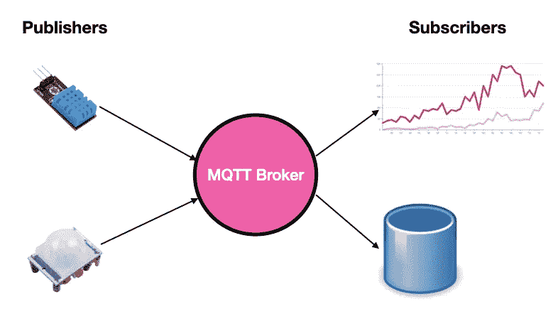

# 使用 MQTT 跨设备推送消息

> 原文：<https://levelup.gitconnected.com/using-mqtt-to-push-messages-across-devices-1465855b36e5>

## 了解如何在 Python 应用程序中使用 MQTT


照片由 [Pat Whelen](https://unsplash.com/@patwhelen?utm_source=medium&utm_medium=referral) 在 [Unsplash](https://unsplash.com?utm_source=medium&utm_medium=referral) 上拍摄

如果你熟悉物联网( **IoT** )，你很可能听说过这个术语叫做 **MQTT** 。MQTT(代表**消息排队遥测传输**)是一个轻量级的发布-订阅网络协议，在设备之间传输消息。它通常用于在低带宽环境中的设备之间传输消息。一个很好的案例研究如下所示:



在物联网环境中，温度传感器或运动检测器等传感器会连续记录读数(如每秒记录温度的温度传感器)或在被触发时记录读数(如运动传感器仅在检测到运动时返回信号)。所有这些数据通常会被传送到设备上进行记录和分析。由于所有这些传感器以不同的速率生成数据，MQTT 非常适合作为将实时信息从一个设备传递到另一个设备的协议。想要将数据转发到另一个设备的传感器可以*将数据发布*到 **MQTT 代理**，这是一个使 MQTT 客户机能够通信的中介实体。想要从传感器接收数据的设备可以*订阅*它。

有这么多的发布者和订阅者，订阅者如何知道选择哪个消息呢？原来 MQTT 用一个非常简单的概念解决了这个问题，这个概念叫做 *topic* 。

一个**主题**是一个 UTF-8 字符串，看起来像你的文件路径。例如，如果您想要发送您房间的温度读数，您可以使用以下主题— `room`。但是，如果您有多个房间，您可以使用不同的主题— `house/room1`、`house/room2`、`house/room3`等。请注意，您使用了`/`字符来将主题进一步分解。您可以使用任意多个`/`，例如`house/room1/toilet`、`house/level1/room1/toilet`等。

要接收来自某个主题的消息，您只需订阅您想要的主题，例如`house/room1`。如果您想订阅所有以`house`开头的主题，您可以使用`#`和`+`通配符:

*   如果您想要所有以 house 开头的主题，请使用**多级通配符** `#`，例如`house/#`。这种情况下会匹配`**house**`、`**house**/room1`、`**house**/room2`、`**house**/room3`、`**house**/room1/toilet`、`**house**/level1/room1/toilet`等主题。
*   如果您想要匹配具有不同级别通配符的主题，请使用单级通配符`+`。这可以通过一个例子更容易地解释。假设你有以下主题— `house/+/toilet`，那么它会匹配以下主题:`**house**/room1/**toilet**`、`**house**/room2/**toilet**`、`**house**/kitchen/**toilet**`。它将*不*匹配以下主题— `house/room1/toilet1` 和`house/basement/room1/toilet`。

# 使用 MQTT 代理

要使用 MQTT，您需要一个 MQTT 代理。出于开发和测试目的，使用公共 MQTT 代理通常更容易。您可以在:[https://github.com/mqtt/mqtt.org/wiki/public_brokers](https://github.com/mqtt/mqtt.org/wiki/public_brokers)找到 MQTT 公共经纪人的列表。

> 请注意，公共 MQTT 代理，顾名思义，是公共的。您发送的所有数据对每个人和任何人都是可见的。因此，请确保不要传输任何敏感数据(除非您对它们进行了加密)。此外，它们没有任何服务保证，因此您不应该在生产环境中使用它们。

## 出版者

如果您是 Python 开发人员，使用 MQTT 非常简单。对于本文，我将使用 **paho-mqtt** 模块，它实现了 mqtt 协议的 5.0、3.1.1 和 3.1 版本:

```
$ **pip install paho-mqtt**
```

先从出版社说起吧。创建一个名为 **publish.py** 的文件，并用以下语句填充它:

```
import paho.mqtt.client as mqtt
import numpy as np
import timeMQTTBROKER = 'test.mosquitto.org'
PORT = 1883
TOPIC = "home/temp/room1/storeroom"mqttc = mqtt.Client()
mqttc.connect(MQTTBROKER, PORT)while True:
    MESSAGE = str(np.random.uniform(20,30))
    mqttc.publish(TOPIC, MESSAGE)
    print("Published to " + MQTTBROKER + ': ' + TOPIC + ':' + 
        MESSAGE)
    time.sleep(3)
```

这里，我使用 Mosquitto 公共 MQTT 代理— `test.mosquitto.org`。我每 3 秒发布一个 20 到 30 之间的随机值。

## 订户

接下来，创建一个名为 **subscribe.py** 的文件，并用以下语句填充它:

```
import paho.mqtt.client as mqttMQTTBROKER = 'test.mosquitto.org'
PORT = 1883def on_connect(client, userdata, flags, rc):
    print("Connected with result code " + str(rc))
    client.subscribe("home/temp/room1/storeroom")def on_disconnect(client, userdata, rc):
    print("Disconnected with result code " + str(rc))def on_message(client, userdata, msg):
    print(MQTTBROKER + ': <' + msg.topic + "> : " +  
        str(msg.payload.decode()))client = mqtt.Client()
client.on_connect = on_connect
client.on_message = on_message
client.on_disconnect = on_disconnectclient.connect(MQTTBROKER, PORT)
client.loop_forever()
```

上面有三个功能:

*   `on_connect()` —当客户端连接到 MQTT 代理时触发。连接后，您可以调用`subscribe()`功能来订阅特定的主题。将`subscribe()`函数放在这里很有用，因为在客户端断开连接并重新连接的情况下，您可以确保您仍然订阅了主题。
*   `on_disconnect()` —当客户端与 MQTT 代理断开连接时触发。
*   `on_message()`—从 MQTT 代理收到消息时触发。

`loop_forever()`函数是一个阻塞调用，让 MQTT 客户机继续接收传入的消息。

> 如果想要非阻塞调用，可以使用`loop_start()`。但是，您必须确保您的程序不会退出。一旦您的程序退出，您将无法再接收传入的消息。

## 测试发布者和订阅者

既然发布者和订阅者已经完成了，是时候测试它们了。在两个单独的终端中键入以下命令:

**端子 1**

```
$ **python publish.py**Published to test.mosquitto.org: home/temp/room1/storeroom:24.17208558860645Published to test.mosquitto.org: home/temp/room1/storeroom:24.14987649016441Published to test.mosquitto.org: home/temp/room1/storeroom:25.5039528899733Published to test.mosquitto.org: home/temp/room1/storeroom:25.177278745815368Published to test.mosquitto.org: home/temp/room1/storeroom:24.355705976717694
```

**端子 2**

```
$ **python subscribe.py** Connected with result code 0
test.mosquitto.org: <home/temp/room1/storeroom> : 24.17208558860645
test.mosquitto.org: <home/temp/room1/storeroom> : 24.14987649016441
test.mosquitto.org: <home/temp/room1/storeroom> : 25.5039528899733
test.mosquitto.org: <home/temp/room1/storeroom> : 25.177278745815368
test.mosquitto.org: <home/temp/room1/storeroom> : 24.355705976717694
```

当发布者向 MQTT 代理发送数据时，订阅者将接收数据。

您还可以在您的 subsciber 中尝试一些我前面提到的通配符:

```
 client.subscribe("**home/temp/+**")   # single-level
    client.subscribe("**home/temp/#**")   # multi-levels
```

除了您可以自己定义的主题之外，MQTT 还支持一些不能用于发布的保留主题*。以`$`开头的主题对 MQTT 代理有特殊的意义(通常用于生成服务器统计数据)。您可以订阅以下一些专题:*

```
client.subscribe(“**$SYS/broker/clients/connected**”)
client.subscribe(“**$SYS/broker/clients/disconnected**”)
client.subscribe(“**$SYS/broker/clients/total**”)
client.subscribe(“**$SYS/broker/messages/sent**”)
client.subscribe(“**$SYS/broker/uptime**”)
```

> 这些主题没有标准化，它们特定于每个 MQTT 代理的实现。

以下是针对上述主题收到的一些示例消息:

```
test.mosquitto.org: <$SYS/broker/clients/connected> : 3596
test.mosquitto.org: <$SYS/broker/clients/disconnected> : 973
test.mosquitto.org: <$SYS/broker/clients/total> : 4569
test.mosquitto.org: <$SYS/broker/messages/sent> : 116282349
test.mosquitto.org: <$SYS/broker/uptime> : 38690 seconds
test.mosquitto.org: <$SYS/broker/clients/total> : 4573
```

# 安装您自己的 MQTT 代理

有些时候(比如出于安全原因或出于私有部署的原因)，您希望设置自己的 MQTT 代理。在这里，我将向您展示如何安装 Eclipse mosquito broker。我将使用 macOS。

> **Eclipse mosquito**是一个开源的(EPL/EDL 许可的)消息代理，它实现了 MQTT 协议版本 5.0、3.1.1 和 3.1。

首先，确保你已经安装了 **brew** 。如果没有，请在终端中使用以下命令安装 brew:

```
$ **/usr/bin/ruby -e "$(curl -fsSL https://raw.githubusercontent.com/Homebrew /install/master/install)"**
```

接下来，安装**mosquito**:

```
$ **brew install mosquitto**
```

> 对于 Windows 用户，请参考[https://mosquitto.org/download/](https://mosquitto.org/download/)获取 Mosquitto 的安装文件。

在安装结束时，您将看到以下输出(注意我用粗体显示的最后一行——这是启动 Mosquitto 代理的命令):

```
...
==> **mosquitto**mosquitto has been installed with a default configuration file.You can make changes to the configuration by editing:/opt/homebrew/etc/mosquitto/mosquitto.confTo restart mosquitto after an upgrade:brew services restart mosquittoOr, if you don't want/need a background service you can just run:**/opt/homebrew/opt/mosquitto/sbin/mosquitto -c /opt/homebrew/etc/mosquitto/mosquitto.conf**
```

要启动 Mosquitto 代理，请在终端中键入以下命令:

```
$ **/opt/homebrew/opt/mosquitto/sbin/mosquitto -c /opt/homebrew/etc/mosquitto/mosquitto.conf**
```

> 请注意，您还可以为 Mosquitto 代理配置身份验证。我将把它留给你去探索。

要使用自己的 MQTT 代理，只需将 **subscribe.py** 和 **publish.py** 中的`MQTTBROKER`变量改为`localhost`(或者托管代理的计算机的 IP 地址):

```
MQTTBROKER = '**localhost**'
```

# 摘要

我希望这篇文章能让您轻松理解什么是 MQTT，以及它如何让您在不编写自己的服务器的情况下将数据从一个设备推送到另一个设备变得非常简单。玩得开心！

[](https://weimenglee.medium.com/membership) [## 加入媒介与我的介绍链接-李伟孟

### 作为一个媒体会员，你的会员费的一部分会给你阅读的作家，你可以完全接触到每一个故事…

weimenglee.medium.com](https://weimenglee.medium.com/membership)