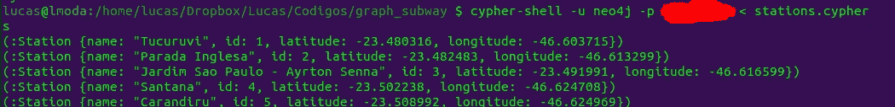

# 使用 Neo4j 和 Cypher 再现圣保罗的地铁系统

> 原文：<https://levelup.gitconnected.com/using-neo4j-and-cypher-to-reproduce-s%C3%A3o-paulos-subway-system-8becec817974>

大家好。今天我将写一篇短文，解释如何使用基于图形的数据库来模拟地铁系统，以及如何将其与 Python 集成。Github 回购可以在这里访问:[https://github.com/lukmoda/graph-subway](https://github.com/lukmoda/graph-subway)

# 介绍

## 图表

首先，快速提醒一下什么是*图*。

图是由实体和连接组成的数据结构。让我们来看一些概念:

*   **节点:**是对象，实体。可以是一个人，一座城市，一种动物；作为学习的*主题*的一切(你可以把节点想成*名词*)。节点也叫*顶点*；
*   **属性:**与 OOP 非常相似，节点可以有属性，用键值对表示。假设你有一个动物节点“狮子”。它可以具有类似{尺寸:1.8 米，重量:150 公斤等}的特性。；
*   **关系**:这表达了节点是如何连接的(你可以把它想成*动词*)。它们定义了节点之间的关系(例如，“节点 A 喜欢节点 B，节点 C 和节点 D 住在一起，等等)。关系也叫*边*；


直接取自 Neo4j 网站的示例。

*   方向、圈和权重:这些是图的“附加”属性，用来对它们进行分类。方向只是告诉关系与哪个节点相关。类似地，连接可以有权重(你可以把它们想成节点间的*距离*)。最后，如果你能在遍历连接后回到一个节点，我们说这个图是循环的。你可能会看到一些像 *DAG(有向无环图)*这样的大词，但它们只是告诉你图是如何表现的。


加权 DAG 的示例:节点(蓝色圆圈)连接有方向，没有循环，边有权重。可以看出，dag 非常类似于另一种数据结构:树。

## Neo4j 和 Cypher

Neo4j 是一个面向图形的数据库。与传统的表或模式不同，实体被建模为具有节点和连接的图形。因为这是一个 NoSQL 数据库，所以使用一种叫做 *Cypher、*的适当的查询语言，这种语言非常简单易懂。我们将在未来进一步使用这些技术，但是你可以在 Neo4j 的网站上了解更多，它有很好的记录([https://neo4j.com/developer/graph-database/](https://neo4j.com/developer/graph-database/))。

**圣保罗地铁系统**

现在我们来谈谈我们研究的对象。在我工作的地方([https://levee.com.br/](https://levee.com.br/))，我们用人工智能和人工智能来匹配合适的候选人和工作。我们的平台上注册了数百万名候选人，进行的研究表明，住得离工作地点越近的人在那个职位上成功的概率*更高*。不过，我们想更进一步，检查这个人必须经过的车站数量是否与模型相关(剧透:是的)。本文的目的不是展示我们的模型，我只是想解释什么是可能的应用。

为了找到穿过的车站数量，我们需要首先模拟地铁系统，这…非常类似于一个图表！然后，因为我们有每个候选人和工作 lat-long，我们可以计算哪个是离每个最近的地铁(即，设置开始和结束节点)，然后找到最短的路径。圣保罗的地铁系统(截至 2020 年初)由 13 条线路(分为 6 条线路的现代地下列车“metro”和 7 条线路的老式地上列车“CPTM”)组成，183 个车站和 371 公里的延长线([https://www . metrocptm . com . br/veja-o-mapa-de-estacoes-do-metro-e-cptm/](https://www.metrocptm.com.br/veja-o-mapa-de-estacoes-do-metro-e-cptm/))。


圣保罗的地铁系统。你能看出它和图表有多相关吗？

# 构建图表

## 收集数据

好吧，如果你想为你的城市建立你的解决方案，这部分可能不是真的必要，但是它真的有助于得到更好的组织。我所做的是逐行创建一个包含每个站点及其纬度的表格。它帮助我不迷路:


文件头。为你系统的每一个站做！

## 启动 Neo4j 服务器

在您的机器上安装了 Neo4j 之后，让我们启动并运行服务器。就这么简单:

```
sudo neo4j start
```

过一会儿，服务器将在 localhost:7474 上可用。您应该会看到这样的屏幕:


Neo4j 本地主机 web 界面。

## 创建节点

接下来，我们将编辑一个 cypher 脚本(常见的扩展有。塞弗和。cql)。在我们开始创建节点之前，我将对 id 进行约束:


在这里， *s* 就像是每个 *Station* 对象的别名，我们设置了 id 必须唯一的约束。

现在，让我们创建我们的站节点，就像常规 SQL 中的一个*插入*:


每个 Cypher 语句都以分号结尾。创建一个节点很简单，我们只需传递关键字 **CREATE** 和括号内的 id 以及它所代表的对象(Neo4j 中称为 *Label* )。关键字 **SET** 用于创建节点的属性，用逗号分隔。

## 创建关系

接下来，我们需要创建关系。在一个地铁系统里，我把这个关系叫做**“连接”**。这个过程分两部分完成:M *atch* 和 *Merge:*


注意只有一个分号，在最后一个语句的末尾。“匹配”阶段就像一个 SQL *SELECT* ，在这里您指出哪些节点(您也可以使用别名，就像在这个例子中一样)将被引用来创建边。然后，“合并”阶段有效地创建了关系。您需要传递括号中的开始节点和结束节点，以及它们之间[:verb]中的连接动词。“-”和“>表示*方向*。这个图是有向的，但是你可以不用“>”合并节点做一个无向图。类似地，如果你在两端都放上箭头，连接是双向的。它简单、富于表现力、优雅。

并且找出两个节点之间的最短路径？Neo4j 已经有了一个方便的功能:


只需传递开始和结束节点，并使用 *shortestPath* 函数。如果你想返回整个路径而不是长度，返回*节点(p)。*" *..50]"是一个约束，如果路径超过 50 个节点，算法将停止遍历。您可以将它设置为任何值或完全禁用它，但如果您的图形非常密集，它会非常有用。

你可以用 Cypher 做更多的事情:


还有很多很多。要获得完整的密码指南，请查看这个备忘单:[https://neo4j.com/docs/cypher-refcard/current/](https://neo4j.com/docs/cypher-refcard/current/)

## 运行脚本

您可以运行一个 Cypher 脚本或打开一个 cypher-shell，直接在那里传递命令。Cypher Shell 看起来是这样的:


您可以像普通的 SQL 客户端 shell 一样使用它，传递 Cypher 语句。

或者您可以直接在终端中运行脚本:



只需在来自 *py2neo* 包的

After you create all the nodes and all relationships (that’s the hard part!), you can see your graph in the web UI:


Zoomed around São Paulo’s Center, with its famous Luz Station highlighted (see its properties in the bottom left corner)

The complete Graph looks like this:


Beautiful, isn’t it?

# Integrating with Python

Now that our subway graph is done, let’s see how we can integrate it with python. Here is the simple script:


Python script to connect with Neo4j and do Cypher queries.

All you need to do is instantiate a *Graph* 对象后传递您的用户名、密码和密码文件，传递服务器、用户和密码作为参数。然后将 Cypher 查询作为字符串传递，并使用 *evaluate* 方法来检索结果。就这么简单！

这是我们运行脚本来查找 Butant(第 4 行-黄色)和 Tatuapé(第 3 行-红色)之间的桩号和路径时得到的结果:


脚本的输出。

图表、连接和查询都准备好了，创建包含求职者和工作之间的站点数量的特征的结构也准备好了！

# 最后的话

我希望这篇文章能帮助那些希望利用图表的力量进行分析的人。在必须构建这个特性之前，我只听说过 Neo4j，并且能够快速学习和开发这个解决方案。这个数据库有很好的文档记录，可扩展，易于使用/学习，并与许多语言(如 Python)集成；塞弗也没什么好害怕的。现在，当您看到一个可以用图形建模的问题时，请强烈考虑使用 Neo4j 和 Cypher 来构建您的解决方案！