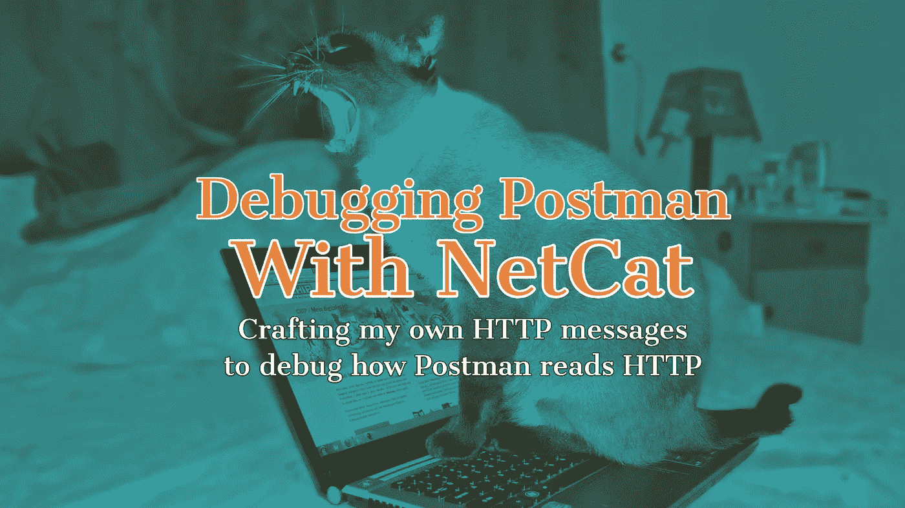
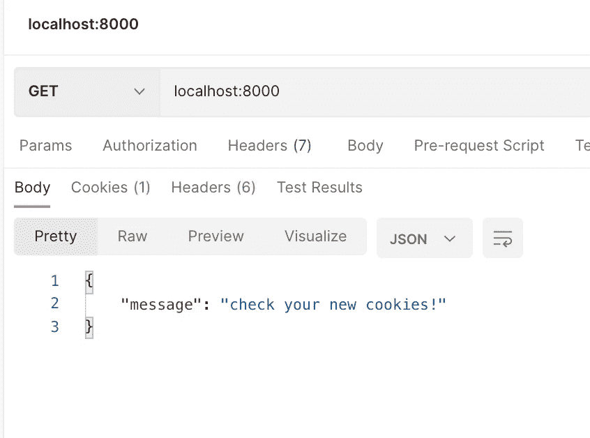
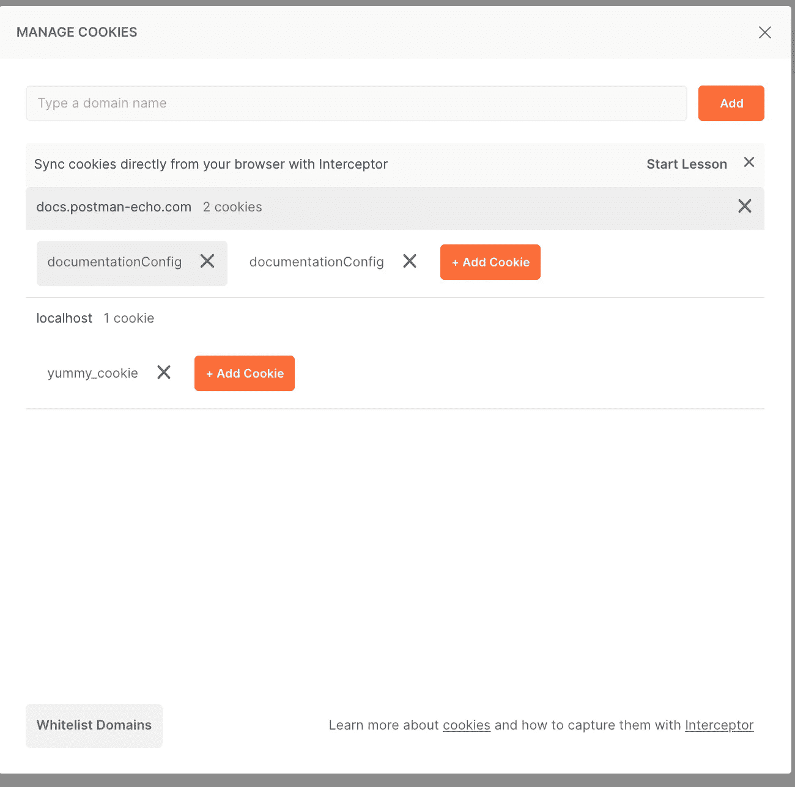

# 使用 NetCat 调试 Postman

> 原文：<https://levelup.gitconnected.com/using-netcat-to-debug-postman-9cb68ee073f0>

使用 NetCat 服务器和自定义 HTTP 消息对 Postman 的 Cookie 管理器进行分类。



一位 Postman 用户来信询问 Postman 应用程序中的一个潜在错误。从他们的角度来看，HTTP 头并不像 HTTP 规范中描述的那样不区分大小写。如果它们的头有小写的 set-cookie,那么在响应返回后，它们在 cookie 管理器中看不到 cookie。这种与预期行为的差异可能是 Postman 本身或其服务器实现的问题。我想设计一个最简单快捷的测试，而不需要创建或建立一个完整的服务器来确定错误来自哪一端。

我决定使用 NetCat 并创建一个定制的原始 HTTP 消息。

[NetCat](http://netcat.sourceforge.net/) 是一个 UDP 和 TCP 消息的美工刀。您可以通过端口监听服务器或将数据发送到服务器。当我说发送数据时，我指的是从键盘发送或在传输层通过管道输入的原始数据。然而，Postman 只能在应用层读取数据，这意味着我们需要为 Postman 创建 HTTP 消息来呈现输出。你可以尝试发送回键盘输入，但你会看到邮递员有问题。

我制作了一个 HTTP 响应消息，标题如下，你可以从这些 [MDN 文档](https://developer.mozilla.org/en-US/docs/Web/HTTP)中找到 HTTP 消息需要什么。如您所见，我有协议、状态代码、设置为 JSON 的内容类型、一些 JSON 数据，以及我正在测试的 Set-Cookie 标题。

```
HTTP/1.1 200 OKServer: netcat!Content-type: application/jsonAccess-Control-Allow-Origin: *Connection: Keep-AliveSet-Cookie: yummy_cookie=choco; HttpOnly{"message": "check your new cookies!"}
```

接下来，我建立了一个 NetCat 监听服务器。

```
while true; do cat cookies.http | nc localhost -lv -p 8000; done
```

上面的 bash 行要求无限循环，并通过管道将 *cookies.http* 的内容发送到端口 8000 上的 NetCat 侦听服务器。当我们向 *localhost:8000* 发送请求时，我们应该在 *cookies.http* 中创建 HTTP 响应消息。

有关上述命令行的更深入解释，请阅读 shell 结果中的[解释。](https://explainshell.com/explain?cmd=while+true%3B+do+cat+cookies.http+%7C+nc+-l+8000%3B+done)

在向我的 *localhost:8000 上的 netcat 发送请求后，*我们可以看到我的 HTTP 主体数据被返回了。



我们的自定义 HTTP 消息从 NetCat 返回

让我们检查一下我们的 cookie 的 cookie 管理器。现在我们可以看到我有大写字母的 set-cookie，它能够存储 cookie。我的下一个测试是简单地将 *Set-Cookie* 变成小写。在这两种情况下，Postman 都能够用适当的 cookie 更新它的 cookie 管理器。



在这里，我们可以看到我们的 cookie 已设置！

这是将微调过的响应返回给应用程序进行测试的好方法。您可以看到您的应用程序是如何处理各种各样的头或损坏的 HTTP 响应的。

继续玩这个吧！这是了解 HTTP 层如何在底层工作的好方法。

# TL；速度三角形定位法(dead reckoning)

*   Postman 用户的 HTTP 头有问题，但无法判断是服务器还是 Postman 应用程序的问题
*   创建了一个 NetCat 服务器，它使用 set-cookie 用我们自己的 HTTP 消息响应一个 HTTP 文件
*   向 Postman 发送了一个对 NetCat 服务器的请求，现在我们可以完全按照自己的意愿控制响应

如果你喜欢你所阅读的内容，请在 Twitter 或 T2 LinkedIn 上关注我