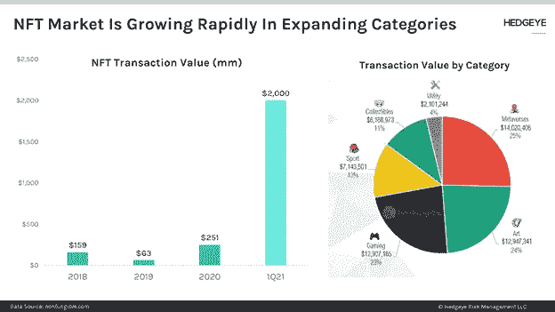

# 使用非功能性交易增加企业的客户参与度

> 原文：<https://levelup.gitconnected.com/using-nfts-to-increase-customer-engagement-for-businesses-293f46f232c9>

不可替代的代币是加密货币领域最热门的趋势之一。它们使用户能够创建他们资产的数字表示，他们可以与其他玩家进行交易，并具有无限的定制选项。

(图片来源:[刺猬](https://app.hedgeye.com/insights/99358-chart-of-the-day-the-nft-market-is-growing-rapidly?type=macro%2Cmarket-insights))

它们通常被称为[数字收藏品或资产](https://realitygaminggroup.com/blog_post/what-are-digital-collectibles/)，但是它们的用途非常广泛；从视频游戏到棋盘游戏，它们几乎被用在所有的东西上！非功能性交易为企业参与区块链产业提供了一种独特的方式，而不必重新发明他们的商业模式。

# 什么是不可替换的令牌？

不可替换代币(NFT)是独一无二的收藏品，因此不能用相同类型的另一个代币替代。它们没有任何可以共享的标准化属性集。

NFT 的主要好处是它们不能被它们的创造者复制或替换，所以没有欺诈或类似的风险。这可以防止当事人之间的纠纷，尤其是那些允许他们使用其资产的人之间的纠纷。还可以轻松地为现有项目创建新的令牌。

如何描述某些属性(如稀有性或资产的大小)的标准化可能是有用的，这样所有用户都可以很容易地理解这些属性，并有一个共同的语言。这将更容易核实资产的来源，我们希望这将使我们所有人享有更大的透明度和信任。

NFT 最好的一点是他们提供了一个[区块链的游戏解决方案](https://www.devteam.space/blog/how-blockchain-could-redefine-the-gaming-industry/#:~:text=Blockchain%20will%20let%20players%20securely%20store%20in%2Dgame%20assets%3A,-Hackers%20love%20centralized&text=Blockchain%20technology%20in%20the%20gaming,once%20again%2C%20and%20scroll%20down.)，这样玩家就不用担心在游戏公司倒闭或类似情况下丢失游戏中的物品。

# 以下是 NFTs 提高企业客户参与度的几种方法:

# 1.使用代表用户帐户的令牌提高保留率和忠诚度

如今，普通玩家在玩 MMORPGS 游戏上花费的时间即使不是数千小时，也有数百小时。随着游戏产业的发展，玩家在游戏角色身上投入的价值和时间也在增加。如果一个玩家的角色在游戏中死亡或被删除，他们就失去了所有投入的时间和资源，这通常被称为“沉没成本”。毫无疑问，这导致了无数玩家因沮丧而放弃游戏。

# 2.将游戏内购买与非功能性食物搭配

商家可以将游戏道具制作成 NFTs，并让用户在 T2 区块链上与其他玩家进行交易。这赋予了游戏中的物品真实世界的价值，因为它们可以在游戏之外进行交易。他们甚至可以通过赋予游戏中一定的权力，将现实生活中的购买与这些相同的物品联系起来。这创造了一个[激励用户从他们的商店买东西](https://core.ac.uk/download/pdf/250169786.pdf)；如果某把剑有特殊的力量，而你是从他们的商店买新鞋得到它的，你更有可能玩提供这种物品的游戏。

# 3.将 NFT 连接到现实生活中的项目

NFTs 可以用来连接游戏中代表现实生活中的商品和服务的物品，反之亦然。这种联系很重要，因为它刺激玩家把钱花在游戏中的物品上，而不是花在游戏中的商品上。

# 4.用代币担保债务

如果用户在游戏中花钱买东西，如果他们没有足够的代币，他们可能无法偿还债务。需要创建一个支付系统，这样人们就可以将他们的游戏资产卖回给他们的贷款人，并付清债务，直到他们完全还清债务。这会刺激用户玩你的游戏，因为他们知道如果他们在游戏中花钱，偿还债务会容易得多。

# 5.创建数字资产市场

用户可以使用自己的令牌在您的市场上买卖数字资产。这使得他们可以轻松跟踪自己的余额，而不必担心处理不同类型的加密货币。它还为你提供了一种简单的方式，开始向玩家提供特殊账户或高级游戏内权力等东西，只需在加密货币交易所购买你的代币，这一点由于移动设备上现在可用的[加密冷钱包](/a-crypto-wallet-is-not-what-it-seems-daf4557ad566)而变得流行，随着 5G 连接的最新发展，加密的采用将变得更加重要。虽然看起来 [5G 对加密的采用没有直接影响，但它实际上是带宽和功耗支持扩展的支柱。](https://www.smartphonechecker.co.uk/phones/5g)

正如你所看到的，NFTs 为有兴趣涉足区块链技术的企业提供了无限的可能性。它们是为您的企业创造真实价值和提高客户参与度的绝佳方式。