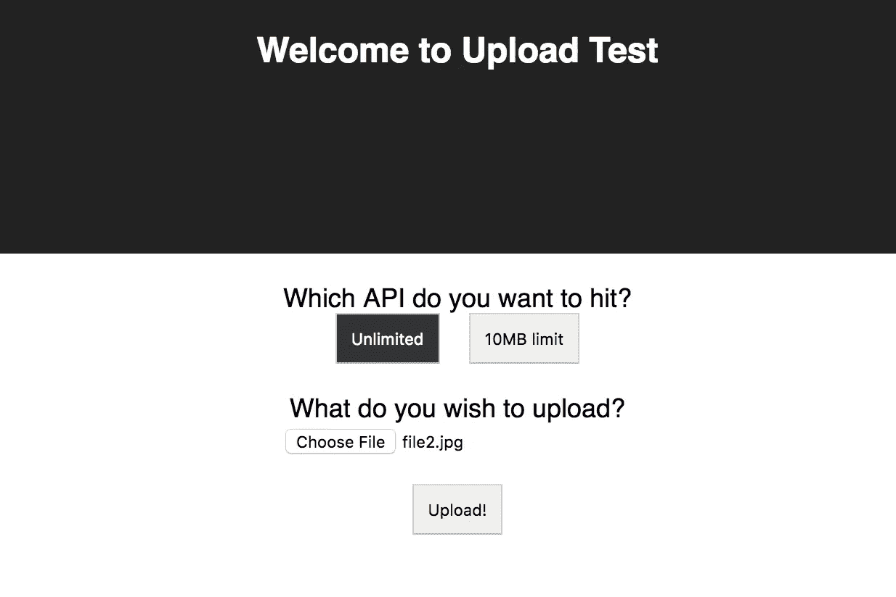
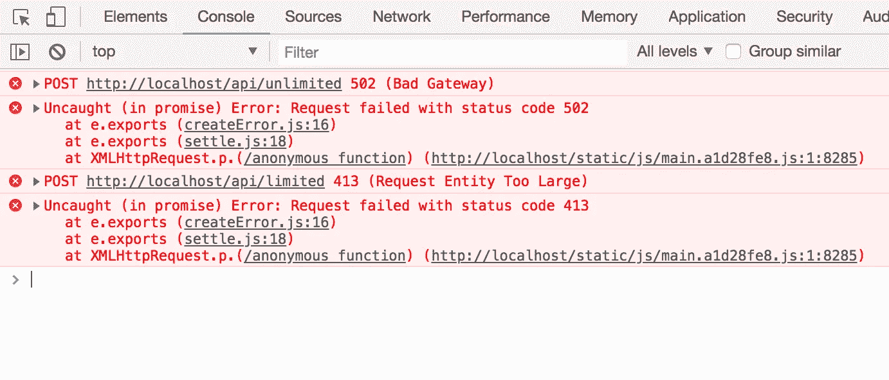

# 使用 Nginx 和 Docker 限制 React 应用程序中的文件上传大小

> 原文：<https://levelup.gitconnected.com/using-nginx-to-limit-file-upload-size-in-react-apps-4b2ce0e444c2>

在部署 dockered React 应用程序时，配置 nginx 以限制每个 API 调用的文件大小


## TL；速度三角形定位法(dead reckoning)

根据 nginx 配置中可用的`location`使用`client_max_body_size`为每个被代理的端点设置自定义限制。

## 问题是

本文的主要目标是解决我们在创建 UI 应用程序时遇到的一个常见挑战。对于这个例子，我选择了 React，但实际上这可以与任何框架一起工作，并且它并不排斥基于 React 的项目。

如果您曾经遇到过这样的情况，您的 UI 应用程序直接与多个具有不同文件大小限制的后端服务进行对话，那么这篇文章就是为您准备的。

## 解决方案

我们将使用 nginx 来匹配路径和路由请求，同时应用我们的自定义配置。

让我们首先用`create-react-app` CLI 工具创建基本的 app，安装`axios`进行 API 调用，并用下面的文件替换`App.js`文件的内容。如果你对它的工作原理感到困惑，不要担心。我们现在不担心这个。

接下来，我们启动应用程序，并注意到下面的屏幕是我们非常基本的 UI 如何呈现文件上传:



在这种情况下，我们假设有两种不同类型的端点，一种允许无限制的文件大小，另一种阻止上传大于 10MB 的文件。

暂时不要尝试点击上传按钮！我们没有添加任何逻辑来限制文件大小，老实说，如果我们现在尝试上传任何东西，我们会看到 404 错误，因为我们的开发服务器不知道这些`/api`端点是什么。

为了测试我们的更改，我们将应用程序与 nginx 基础映像对接，并在其中使用我们的自定义配置。

首先，通过运行 build 命令为 react 应用程序创建`build`文件夹。第二，创建`Dockerfile`，它提取 nginx 图像并将您的`build`文件夹加载到其中。第三，创建 nginx 配置文件，该文件将包含我们希望在代理请求之前检查的路径。

解决方案以`client_max_body_size`参数的形式存在于`nginx.config`文件中。

现在，从上面的代码示例中，我们有一个`/api`端点，它强制执行 10MB 的限制，而`/unlimited`端点将文件大小限制为 200MB。

下一步是构建 docker 映像并运行容器:

```
docker build --rm -f Dockerfile -t nginx-protection:latest .docker run --rm -d -p 80:80 nginx-protection:latest
```

这使我们的集装箱在港口 80 开始。当我们在浏览器上转到`http://localhost`时，我们可以看到页面再次加载了我们的按钮和文本。我们现在准备尝试上传文件。有趣的是，根据上传的 api 和文件大小的组合，你会开始注意到我们的控制台充满了消息。在下面的场景中，我选择了一个 15MB 的图像，并尝试使用无限和有限端点上传它。



从上面我们可以看到，nginx 服务器试图在`/unlimited`端点上转发我们的上传文件，而在`/limited`端点上返回 413 错误。第一个场景中的 502 是因为我们的请求被代理到的服务器，即`[http://backend.com:8080/api/](http://backend.com:8080/api/;)`不是我们可以访问的。

完整的代码库可以在这里找到[。](https://github.com/40x/nginx-protection)

请在下面的评论区留下问题和评论。

*如果你喜欢这个博客，一定要为它鼓掌或关注我的* [*LinkedIn*](https://www.linkedin.com/in/kashyap-mukkamala/)

[](https://levelup.gitconnected.com)[](https://gitconnected.com/learn/nginx) [## 学习 Nginx -最佳 Nginx 教程(2019) | gitconnected

### 6 大 Nginx 教程。课程由开发者提交并投票，让你找到最好的 Nginx…

gitconnected.com](https://gitconnected.com/learn/nginx)