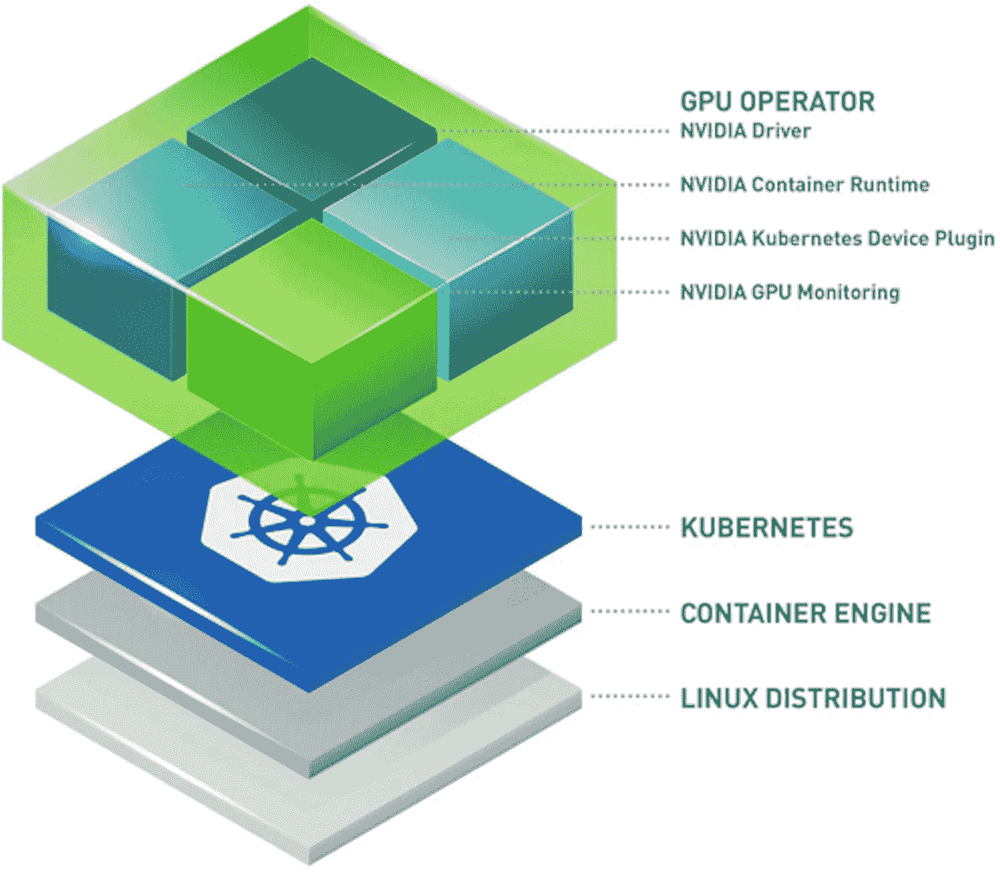
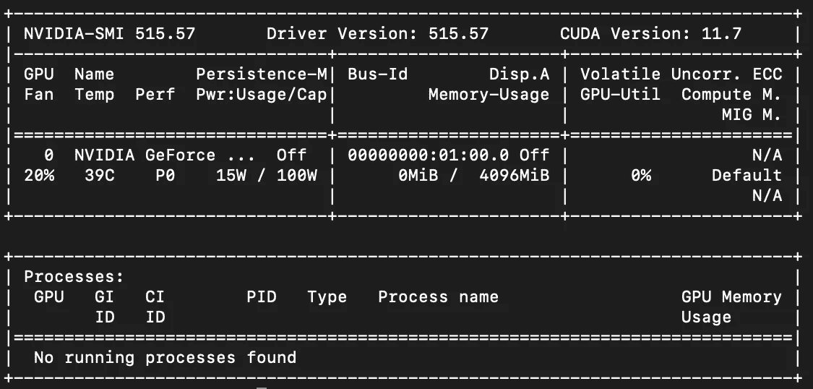

# 将 NVIDIA GPU 与 K3 配合使用

> 原文：<https://levelup.gitconnected.com/using-nvidia-gpus-with-k3-s-76acbc1106ef>



来源:[英伟达开发者](https://developer.nvidia.com/blog/deploying-a-natural-language-processing-service-on-a-kubernetes-cluster-with-helm-charts-from-ngc/)

我希望我不必写一篇关于这个的文章。如果 Nvidia(完全)开源他们的驱动程序，那么他们就可以成为 linux 和 Kubernetes 的一等公民了。然而，目前情况并非如此，所以这里是你将需要采取的旅程，让 Nvidia GPU 与 Linux 一起工作(我特别是在 Ubuntu 22.04)。

# 安装驱动程序

第一步当然是安装合适的驱动程序。我假设你想修补驱动程序。修补驱动程序会移除当前强加给它们的 artificial 2 代码转换限制。我们将建立驱动程序，因为为什么不。

在我们开始之前，我们需要确保新的驱动程序被禁用。我们这样做是因为 Nvidia 驱动程序与我们稍后将使用的 K3 模块兼容。如果你想进一步了解这一步的细节，你可以看看[这篇 linuxconfig.org](https://linuxconfig.org/how-to-disable-blacklist-nouveau-nvidia-driver-on-ubuntu-22-04-jammy-jellyfish-linux)的文章，这些说明就是从那里摘录的。

```
# Add Nouveau to the modprobe blacklist
sudo bash -c "echo blacklist nouveau > /etc/modprobe.d/blacklist-nvidia-nouveau.conf"# If the module is in the kernel, disable it
sudo bash -c "echo options nouveau modeset=0 >> /etc/modprobe.d/blacklist-nvidia-nouveau.conf"# Persist these settings on each boot
sudo update-initramfs -u
```

现在我们可以开始构建和应用驱动程序了。为了使过程更简单，让我们安装 dkms。这将有助于收集构建驱动程序所需的依赖关系。

```
sudo apt install dkms
```

接下来，我们需要下载并安装适当的驱动程序。关于显示驱动程序和支持哪些补丁的更新列表，请查看 [keylase/nvidia-patch](https://github.com/keylase/nvidia-patch) (下面的代码就是从这里提取的)。

```
# Create a driver directory
sudo mkdir /opt/nvidia && cd /opt/nvidia# Download the files (this example uses driver 515.57)
sudo wget https://international.download.nvidia.com/XFree86/Linux-x86_64/515.57/NVIDIA-Linux-x86_64-515.57.run# Make the build script executable 
sudo chmod +x ./NVIDIA-Linux-x86_64-515.57.run# Build the driver
sudo ./NVIDIA-Linux-x86_64-515.57.run
```

安装驱动程序后，我们应该能够用`nvidia-smi`检查它，它应该产生如下输出:



来源:我

# 修补驱动程序

现在，我们可以修补驱动程序，以便解锁代码转换限制。要做到这一点，你需要在你的服务器上安装 Git(sudo apt 安装 Git)。如果你在下面的步骤中遇到问题，你应该检查源 repo:[keylase/NVIDIA-patch](https://github.com/keylase/nvidia-patch)。

```
# Optional if you want to start in your home directory
cd ~# Clone down the patch scripts
git clone [https://github.com/keylase/nvidia-patch.git](https://github.com/keylase/nvidia-patch.git)# Navigate into the repo folder with the patches
cd nvidia-patch# Ensure the patch is executable
sudo chmod +x patch.sh# Execute the patch (needs to be done in a bash shell)
sudo bash ./patch.sh
```

# 安装 Nvidia 容器运行时

Nvidia 的容器运行时现在包含在他们的工具项目中。为此，我们必须将签名密钥添加到我们的系统包管理器(apt)中。

```
# Adding the signing key to apt
curl -s -L https://nvidia.github.io/nvidia-container-runtime/gpgkey | \
  sudo apt-key add -# Create a variable with our distribution string
distribution**=**$(. /etc/os-release;echo $ID$VERSION_ID)# Install the appropriate package list for our distribution
curl -s -L https://nvidia.github.io/nvidia-container-runtime/$distribution/nvidia-container-runtime.list | \
  sudo tee /etc/apt/sources.list.d/nvidia-container-runtime.list
```

现在它已经被添加到我们的 apt 源列表中，我们可以运行下面的命令来安装它。

```
sudo apt-get update **\**
    && sudo apt-get install -y nvidia-container-toolkit
```

安装完成后，您已经成功安装了容器运行时！我们就要到达终点了！到目前为止，我们已经安装了我们的 Nvidia 驱动程序，安装了我们的特殊容器运行时，这将允许我们使用 GPU 的容器。现在我们必须配置 K3 来使用这个容器运行时和 containerd CRI(容器运行时接口)。

# 配置 containerd 以使用 Nvidia-Container-Runtime

最后，让我们的 GPU 与 Kubernetes 协同工作的最后一步。在这里，我们将对 containerd 的 CRI 做一些修改，以便它将使用我们新的 nvidia-contianer-runtime。要查看原始文档，请查看 Nvidia 的指南[这里](https://github.com/NVIDIA/k8s-device-plugin)。

我们将首先在您选择的文本编辑器(如 vi、vim、nano)中打开/etc/containerd/config.toml。打开它后，我们将添加以下块:

此外，如果有一个包含“disabled_plugins = ["cri"]”的 long，我们需要在它前面加上#来注释掉它。现在我们可以重新启动 containerd 服务了，比赛开始了！

```
sudo systemctl restart containerd
```

现在，您应该能够调度节点来请求 GPU 资源了！确保跟随更多的指南，如果你喜欢这种类型的内容，请查看我的 YouTube！

[](https://www.youtube.com/channel/UC3brzz477MWmsEBefKQukcA) [## 大卫·蒂皮特

### 与朋友、家人和全世界分享您的视频

www.youtube.com](https://www.youtube.com/channel/UC3brzz477MWmsEBefKQukcA)