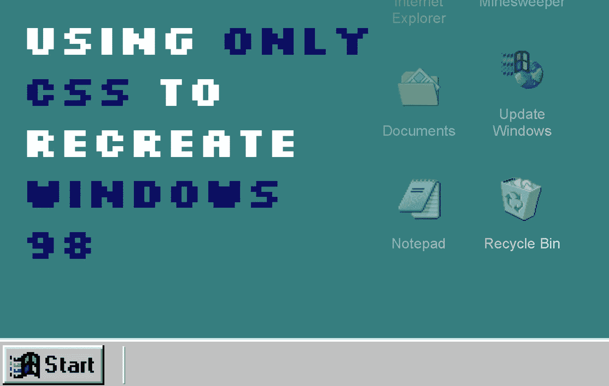
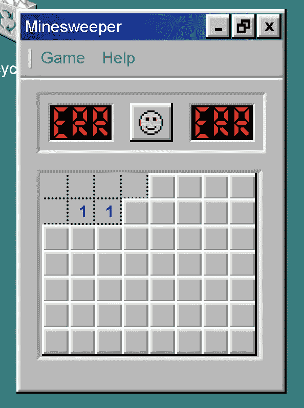

# 仅使用 CSS 重新创建 Windows 98

> 原文：<https://levelup.gitconnected.com/using-only-css-to-recreate-windows-98-958cce4da0ca>



作为我持续工作的一部分，看看我能用 CSS 做多少事情(见其他工作，如 [CSS only《我的世界》鸡](https://fjolt.com/article/css-minecraft-chicken))，我决定尝试重新创建 Windows 98，除了 CSS 和 HTML 之外什么都不用。有人要这个吗？不是真的？尝试看看你只用 CSS 就能完成什么是有趣的吗？是的，算是吧。它很耗时吗？不幸的是是的。

这是演示——快速注释——这是一个桌面 Windows 娱乐，所以它当然是为桌面观看而优化的。然而具有讽刺意味的是，它可能无法在 Windows 98 上运行，因为你必须使用一个非常旧版本的 Internet Explorer 来查看它。

[可以在这里](https://codepen.io/smpnjn/pen/ExLbvdJ)找到演示的链接，因为在全屏模式下观看效果更好。在这个演示中，我认为很酷的东西包括:

*   **扫雷舰**只有 CSS——虽然没有记分。
*   **使用全新的 CSS 父选择器登录**和注销，并记住登录者。
*   动画**更新过程**。
*   **最小化、最大化和关闭窗口**。

然而，值得注意的是，有些事情很难或根本不可能只用 CSS 来完成，例如:

*   拖放——用 CSS 根本不可能。
*   多重条件——例如，很难说一个窗口应该同时最大化和放在最上面。
*   单击任意位置关闭—您必须单击开始按钮来关闭和打开它。你不能只点击其他地方来关闭它。
*   一般来说，多重条件——CSS 实际上没有 AND 运算符。

# 如何用 CSS 构建 Windows 98

所以，关于这个版本的 Windows 98，我想做的第一件事就是外观和感觉。我使用了一些非常酷的 Windows 98 图标(我认为它应该会卷土重来)，以及标准的 Windows 98 配色方案。为了获得缩进和外凹的感觉，我使用了一个非常复杂的盒子阴影，正如你在这里看到的:

```
.windows-box-shadow, .minesweeper .content > label {
    box-shadow: -2px -2px #e0dede, -2px 0 #e0dede, 0 -2px #e0dede, -4px -4px white, -4px 0 white, 0 -4px white, 2px 2px #818181, 0 2px #818181, 2px 0 #818181,  2px -2px #e0dede, -2px 2px #818181, -4px 2px white, -4px 4px black, 4px 4px black, 4px 0 black, 0 4px black, 2px -4px white, 4px -4px black;
}
.inverse-windows-box-shadow, .minesweeper .content > label:active {
    box-shadow: -2px -2px #818181, -2px 0 #818181, 0 -2px #818181, -4px -4px black, -4px 0 black, 0 -4px black, 2px 2px #e0dede, 0 2px #e0dede, 2px 0 #e0dede,  2px -2px #818181, -2px 2px #e0dede, -4px 2px black, -4px 4px white, 4px 4px white, 4px 0 white, 0 4px white, 2px -4px black, 4px -4px white;
}
```

其他一切都相对简单明了。让所有这些工作的关键是复选框和单选按钮。

# 使用复选框和单选按钮作为 CSS 中的信息存储

复选框和单选按钮是在 CSS 中存储信息的唯一方式。然后我们可以用它们来实现样式的改变。复选框，选中时，允许我们启用或禁用一个单一的功能(如显示一个窗口，最大化一个窗口，或点击一个扫雷广场)。对于一次只允许一个选项处于活动状态的情况(例如，哪个窗口应该在最上面)，我们可以使用单选按钮。两者都遵循 CSS 中相同的语法，我们使用了`:checked`选择器:

```
#windows-11:checked ~ .windows-11 .text {
    /* -- CSS here -- */
}
```

在这里，当输入`#windows-11`被检查时，它将影响它的兄弟的孩子`.text`——所以我们可以应用一些自定义 CSS。重要的是，由于我们不能简单地设计一个 HTML 输入，我们使用`label` s 来模拟 Windows 98 的不同特性。例如:

```
<form id="windows">
    <!-- Login and Shutdown -->
    <input type="checkbox" id="login-screen-input" name="login-screen-input" /> <!-- Later on.. -->
    <label for="login-screen-input">Log Off</label>
</form>
```

这里，显示的`label`与复选框`#login-screen-input`相关联。这意味着当你点击标签时，它会选中复选框。这基本上给了我们跟踪用户点击的自由，然后使用复选框`:checked`状态以特定形式显示特定窗口。困难在于你只能让**一个**标签与**一个**输入相关联。

这意味着在一个按钮应该打开窗口并放置在所有其他窗口之上的场景中，您必须使用 Javascript，因为这将需要跟踪窗口的两种状态——窗口的`z-index`,以及它是打开还是关闭。这是实现复杂 ui 的 CSS 版本的主要障碍。

# 使用父选择器跟踪登录的用户

由于我们在`div`中有一个用户注销时的登录屏幕，我们不能使用同级选择器来容易地跟踪谁登录了。我们仍然可以使用`:checked`状态来跟踪这一点，但是输入在我们的 DOM 中太深了，以至于不能影响它们的父节点的 CSS。幸运的是，我们可以使用新的 CSS 父选择器来完成这项任务:

```
#login-screen:has(#login-window .select-box #zark-muckerberg:checked) ~ #start-bar .zark-muckerberg,
#login-screen:has(#login-window .select-box #donald-trump:checked) ~ #start-bar .donald-trump,
#login-screen:has(#login-window .select-box #spiderman:checked) ~ #start-bar .spiderman {
    display: inline;
    padding-left: 0.5rem;
}
```

这里，如果`#login-screen`有一个`:checked` div，我们可以用它在开始栏中显示用户名，尽管这些复选框在 DOM 中很深。这非常简洁，如果你想重新创建一个只有 CSS 版本的 Windows 操作系统，这是一个使用父选择器的有用方法。

# 没有 CSS 和选择器

令我沮丧的是，我无法使用链式复选框创建 CSS `AND`选择器。例如，考虑这种情况，我们基于一个`:checked`状态应用一些 CSS:

```
#minesweeper-box-1-1:checked ~ .content > .minesweeper-box-1-1 {}
```

这很好，但是如果我们想在应用 CSS 之前检查两个相邻的扫雷框是否被选中呢？我认为，从逻辑上讲，选择器只有在两个都被选中的情况下才会继续——所以尝试这样做:

```
#minesweeper-box-1-1:checked + #minesweeper-box-2-1:checked ~ .content > .minesweeper-box-1-1 {}
```

但不幸的是，这不管用。因此，虽然我们有办法跟踪 CSS 中的状态，**但是很难跟踪多条件的复选框状态来创建基于该状态的逻辑语句和样式**。这令人失望，但它并没有对我们的 Windows 98 实现造成太大的限制。

# 实现 Windows 98 文本

Windows 98 文本是**而不是**抗锯齿的。为了消除反走样(至少对某些浏览器而言)，并获得经典、清晰的 Windows 98 效果，我使用了以下 CSS:

```
body {
    -webkit-font-smoothing: none;
    -moz-osx-font-smoothing: grayscale;
}
```

# 再造扫雷舰

所以这个项目中的一个主要任务就是再造扫雷舰。我保持网格相对较小(以保持我的理智)——但我必须用标签制作我自己的扫雷地图。这些标签中的每一个都映射到一个输入，该输入跟踪一个单元格是否被点击。如果一个地雷被点击，它的游戏结束，你不能再与董事会互动。因为有大约 56 个扫雷单元，我们需要相当于大约 56 个扫雷输入。追踪 CSS 中的所有内容需要**大量的 CSS，但是总体结果看起来很酷。**

总的来说，这与前面提到的复选框和单选按钮遵循相同的逻辑——所以从概念上讲，它并不比我们所做的任何事情更复杂。



# 结论

我希望你喜欢这个指南。这样做让我想起了过去的 web 开发，那时事情很难完成，需要大量手工创建 DOM 元素。看到这些年来 CSS 所取得的成就是很有趣的(包括父选择器)。这是创建 web 应用程序的现实方法吗？就速度而言，还没有，就功能而言，但 CSS 做的比我想象的要多得多，我对结果很满意。

如果你喜欢这个，[请考虑在推特上关注我](https://twitter.com/smpnjn)。

# 分级编码

感谢您成为我们社区的一员！在你离开之前:

*   👏为故事鼓掌，跟着作者走👉
*   📰查看[升级编码出版物](https://levelup.gitconnected.com/?utm_source=pub&utm_medium=post)中的更多内容
*   🔔关注我们:[Twitter](https://twitter.com/gitconnected)|[LinkedIn](https://www.linkedin.com/company/gitconnected)|[时事通讯](https://newsletter.levelup.dev)

🚀👉 [**将像你这样的开发人员安置在顶级创业公司和科技公司**](https://jobs.levelup.dev/talent/welcome?referral=true)