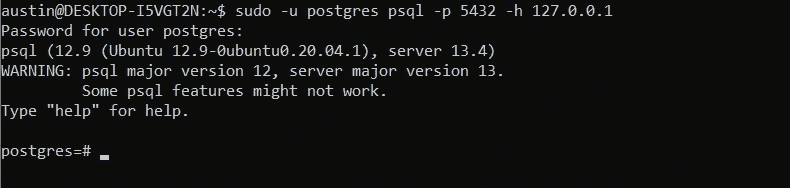
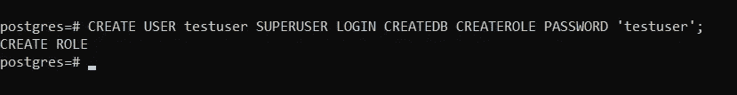
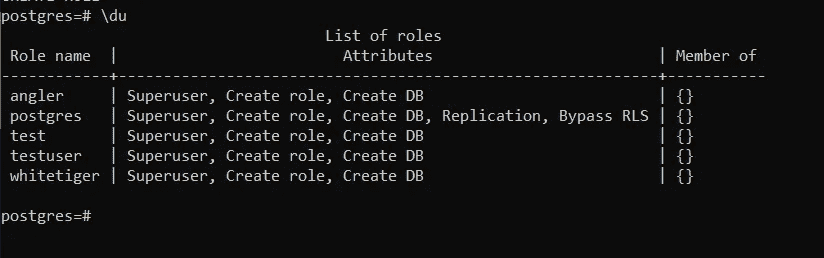
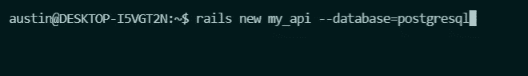
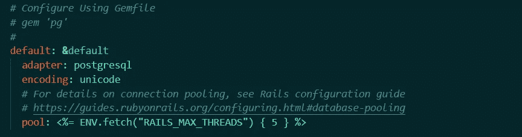
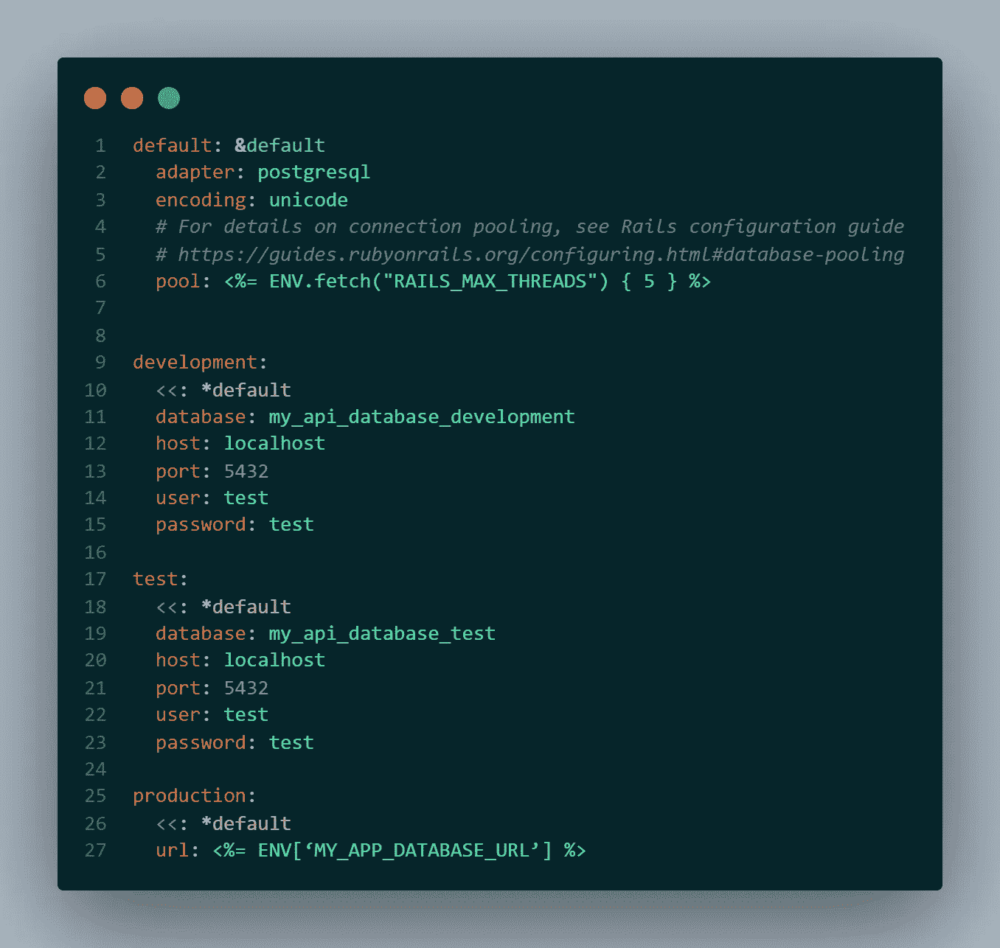
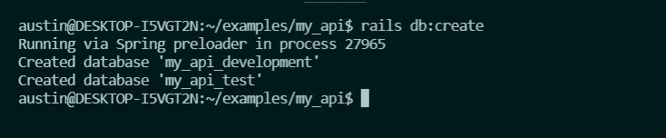

# 在 Rails 中使用 PostgreSQL

> 原文：<https://levelup.gitconnected.com/using-postgresql-in-rails-e85f44e039e1>

在本文中，我们将在 Rails 应用程序中实现 **PostgreSQL** 。最后，您的 rails 应用程序将被配置为使用 PostgreSQL 适配器创建数据库。本文面向任何有 Ruby on Rails 使用经验的人。

我们将完成以下任务:

—在 PostgreSQL shell 中创建 PostgreSQL 用户和密码。

—创建为 PostgreSQL 设置的 Rails 应用程序(或 API)。

—配置将数据库连接到开发、测试和生产环境的连接。

—最后，我们将创建这些数据库。

如果你还没有，你可以按照[这里](https://www.postgresql.org/download/)的指示下载 postgresql。

# **从 SQLite3 到 PostgreSQL**

PostgreSQL 是一个开源的**关系数据库管理系统** (RDBMS)，它使用 **SQL** 以及它自己的语言来管理你的数据库。Rails 的内置数据库管理系统是 **SQLite3。** SQLite3 非常适合在您的本地环境中进行开发，但它不适用于生产环境，因为它一次只允许一个用户写入数据库。使用 PostgreSQL，我们可以构建一个更好的数据库来处理生产。为此，我们首先需要创建一个 PostgreSQL 用户和密码。

## **PostgreSQL 用户和密码**

首先我们进入名为 **psql:** 的 **PostgreSQL** shell

接下来，我们创建一个用户和密码。请注意，密码必须用单引号括起来，命令以分号结尾。

仅此而已。我们可以通过打印出所有用户的列表来确保我们已经创建了一个用户。在 psql shell 运行中:

这就是了。噪音。在这里，您还可以做更多的事情，包括创建和编辑数据库，但是我们将在我们的 rails 应用程序中完成所有这些工作。

# **创建 Rails API**

当第一次创建 rails API 时，我们指定我们的数据库将使用 PostgreSQL 系统构建。我们使用— **数据库**命令选项来完成这项工作。我没有使用— **api** 命令选项，因为这样会遗漏一些我稍后会添加回来的特性。

一旦创建了应用程序，继续检查 **config/database.yml** 文件，确保我们已经正确设置了。在默认情况下，我们应该看到适配器被设置为 postgresql。

厉害！我们准备好了。现在我们只需要稍微修改一下这个文件。

## **将环境连接到数据库**

我们将为每个环境设置主机、端口、用户和密码密钥。这就是我们如何让 Rails 知道如何连接到我们的数据库。

在 Yaml 文件中，我们可以定义默认的键值，并在每个环境中调用它们。然后，如果我们想覆盖一个默认值，我们只需在该环境中用一个新值重新定义该键。

请注意，我们需要一个不同的数据库用于测试和开发，因为测试数据库会在每次运行时自动删除并重新生成。

当然，我们可以将所有这些值作为环境变量存储在您的**中。env** 文件，但是为了简单起见，我只把它们放在这里。

现在我们可以运行 **rake db:create** 或者 **rails db:create** 。

您可以看到开发和测试数据库已经创建。从这里，您可以继续创建一些模型和迁移。如果你决定使用 Heroku 或其他类似 RDS 的服务创建一个生产数据库，并在这个 **config/database.yml** 文件中连接它。