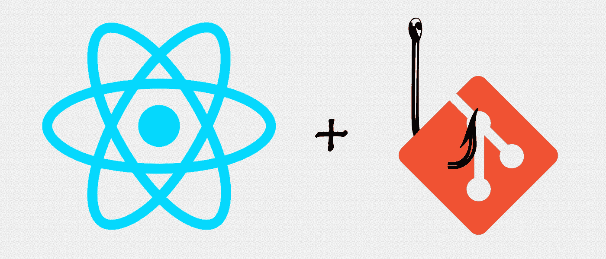

# 在 React 项目中使用预提交和预推送 Git 挂钩

> 原文：<https://levelup.gitconnected.com/using-pre-commit-and-pre-push-git-hooks-in-a-react-project-6c83431ef2bd>



React + Git 挂钩

在我的软件开发生涯中，我越来越感兴趣的一个话题就是质量！也许我被烧伤的次数太多了。唉，我决定使用`**husky**`包测试向 React 项目添加 git 挂钩。我的目标是在提交代码或推送到 git 存储库之前，`**eslint**` linter 和`**jest**`测试套件都必须运行。

注意:这篇文章附带的代码库可以在[这里](https://github.com/nas5w/fun-with-react-and-git-hooks)找到。

如果这篇教程对你有帮助，请考虑为它鼓掌👏(或者 50)！

***

## 通过注册我的免费时事通讯，在您的收件箱中获得快速 JavaScript 技巧！

***

# 从头开始设置

从头开始设置它被证明是相当琐碎的。我一开始是用`**create-react-app**`的 boostapping。

```
create-react-app fun-with-git-hooks
cd fun-with-git-hooks
```

接下来，我安装了 [husky](https://github.com/typicode/husky) ，它号称“git hooks made easy”(准确！).因为它只在开发环境中是必需的，所以只把它作为开发依赖项安装。

```
npm install husky --save-dev
```

我们实际上最终需要一个额外的名为`**cross-env**`的开发依赖项，这将允许我们在我们当前所处的任何环境中配置一个 CI 环境变量。

```
npm install cross-env --save-dev
```

最后，让我们对我们的`**package.json**`文件做一些修改来完成一些事情:

*   将`**jest**`测试重新配置为在持续集成模式下运行(否则，运行`npm test`将会挂起)
*   添加一个林挺命令(我们不必单独安装`**eslint**` ，因为它是用`**create-react-app**`引导的)
*   将我们的`**husky**`挂钩配置为首先去除棉绒，然后进行测试

```
"scripts": {
  "start": "react-scripts start",
  "build": "react-scripts build",
  "test": "cross-env CI=true react-scripts test --env=jsdom",
  "eject": "react-scripts eject",
  "lint": "eslint src"
},
"husky": {
  "hooks": {
    "pre-commit": "npm run lint && npm test",
    "pre-push": "npm run lint && npm test"
  }
}
```

就是这样！现在，每当您尝试提交或推送代码时，如果林挺或测试失败，您将无法这样做。

以质量取胜！

[](https://levelup.gitconnected.com)[](https://gitconnected.com/learn/javascript) [## 学习 JavaScript -最佳 JavaScript 教程(2019) | gitconnected

### 50 大 JavaScript 教程-免费学习 JavaScript。课程由开发人员提交并投票，从而实现…

gitconnected.com](https://gitconnected.com/learn/javascript)