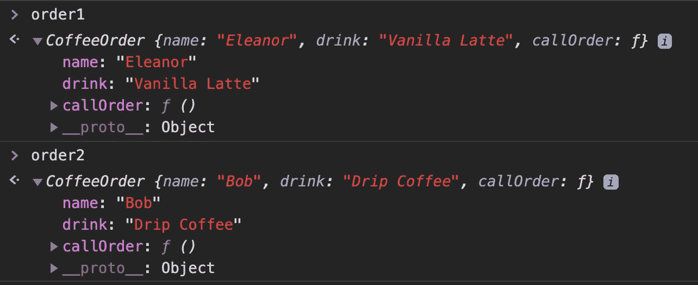
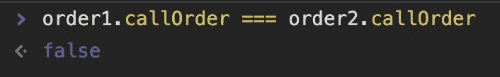
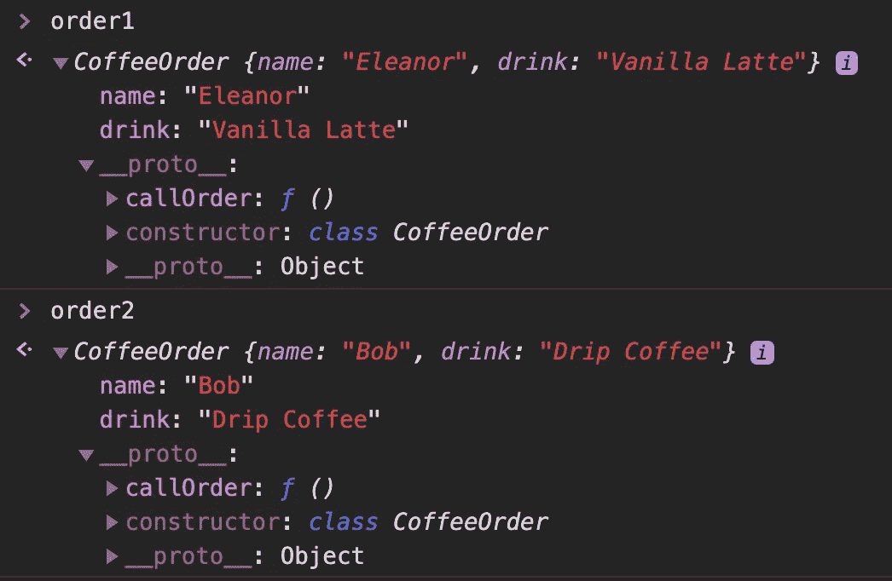
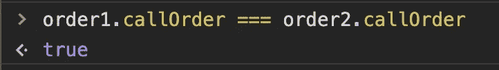

# 在 Javascript 类中使用“prototype”和“this”可以帮助节省内存

> 原文：<https://levelup.gitconnected.com/using-prototype-vs-this-in-a-javascript-class-can-help-save-memory-816636418c3e>

“原型”有助于消除代码冗余，从而提高应用程序的性能。


如果您正在寻求优化应用程序的资源或内存，您应该使用`prototype`。在构造函数中声明`this`会导致对象冗余，尤其是当属性是方法时。想象一下，使用大量带有重复信息的构造函数和对象构建一个复杂的应用程序。让我们探索一下`this` vs `prototype.`的用例

# 在开始之前

值得注意的是，Javascript 是一种面向原型的语言。您使用的每一种数据类型都将来自现有的原型。当我们创建新对象时，它是从一个主构造函数创建的(它有自己的绑定方法)。这将允许新变量和方法之间的访问。这里有一个[链接](https://developer.mozilla.org/en-US/docs/Learn/JavaScript/Objects/Object_prototypes)到 MDN，它提供了更多关于对象原型的背景知识。

# 在构造函数中使用“this”

我们从创建一个对象构造器*开始，不使用‘原型’*。注意我们是如何使用`this`的。让我们创建一个 CoffeeOrder 类，它具有一个调用客户订单的函数:

```
class CoffeeOrder {
  constructor(name, drink) {
    this.name = name;
    this.drink = drink;
    this.callOrder = function() {
     return `I have a ${this.drink} for ${this.name}!`;
    }
  }
}const order1 = new CoffeeOrder('Eleanor', 'Vanilla Latte');
const order2 = new CoffeeOrder('Bob', 'Drip Coffee');
```

如果将属性添加到`CoffeeOrder`类中的`this`，那么`CoffeeOrder` *的所有未来实例都将获得其自己的属性和方法的副本*，这会导致冗余。另一方面，使用`this`对于访问和操作私有变量非常有用。但是让我们假设我们正在处理公共变量。

这是我们调用两个订单时的结果:



order1 和 order2 各自获得自己的 callOrder 方法副本。

**`**CoffeeOrder**`**的每个实例都会收到一个** `**callOrder()**` **方法的副本。**当`callOrder()`方法在每个实例中都重复时，这可能会成为问题，因为它开始影响应用程序的性能和内存。**

**此外，我们可以看到两个`callOrder()`方法是如何分开的，并维护它们自己的副本:**

****

**订单 1 的 callOrder 与订单 2 的 callOrder 不同。每个人都有自己的副本。**

# **原型是解决方案**

**以下是使用原型方法的一些优点:**

1.  **如果你给`callOrder.prototype`添加了一个属性，那么这个属性将**在与类**相关的所有对象中共享，包括所有使用`new CoffeeOrder`创建的未来对象。*共享*属性不同于*复制*。实例可以通过原型链借用这个方法，这将进一步讨论。**
2.  **改变通过原型链继承的方法中的属性值将改变相关对象中的所有值。**
3.  **在大多数情况下，使用`prototype`或`this`是相似的，但是`prototype`允许你节省内存，因为它只有一个实例，而不是每个对象都有自己的实例。**

**让我们使用上面相同的例子，除了修订`this.callOrder`和使用`CoffeeOrder.**prototype**.callOrder`代替:**

```
class CoffeeOrder {
  constructor(name, drink) {
    this.name = name;
    this.drink = drink;
   }
}CoffeeOrder.prototype.callOrder = function() {
 return `I have a ${this.drink} for ${this.name}!`;
}const order1 = new CoffeeOrder("Eleanor", "Vanilla Latte");
const order2 = new CoffeeOrder("Bob", "Drip Coffee");
```

**每个订单都有独特的名称和饮料，这就是为什么在`name`和`drink`上使用`this`是可以接受的。但是所有的命令都以同样的方式发出，那么为什么`callOrder`要一遍又一遍地重复呢？当我们运行我们的函数时，`CoffeeOrder`的每个实例都复制我们的`callOrder()`方法，因为它现在是原型的一部分，不能被复制:**

****

**我们可以在`__proto__`下面看到`callOrder`**

**原型链可以在`__proto__`下找到，它是每个实例中的一个**对象，指向创建它的原型。另一方面，在 JS 中创建的每个函数中都可以找到`prototype`属性。它是类构造函数的**属性。******

**`__proto__: Object`向我们展示了 JavaScript 如何将`order1`和`order2`分配给一个对象构造函数——这允许我们从分配的原型中访问所有方法。因此，两种`callOrder()`方法可以共享:**

****

**callOrder 在 order1 和 order2 中使用的方法，因为我们可以从原型访问相同的方法。**

**我们之前实现了`CoffeeOrder.**prototype**.callOrder`，现在知道了方法是如何共享的。这是它的叫法。同样，所有的咖啡订单都是以同样的方式发出的，所以之前使用`prototype`非常有用并且节省内存:**

```
order1.callOrder();
> "I have a Vanilla Latte for Eleanor!"order2.callOrder();
> "I have a Drip Coffee for Bob!"
```

# **最后的想法**

**在`this`示例中，我们将属性`callOrder`添加到通过该类创建的每个实例中。在`prototype`的例子中，我们与用`CoffeeOrder`类创建的所有实例共享`callOrder`属性。我们现在可以节省内存和性能！如果你对已经运行的测试感兴趣(展示原型如何节省内存)，那么看看这个[stack overflow 线程。](https://stackoverflow.com/a/3493725/12375740)**

**请随时伸出手或分享一个例子，当你使用原型与这一点。感谢阅读！**