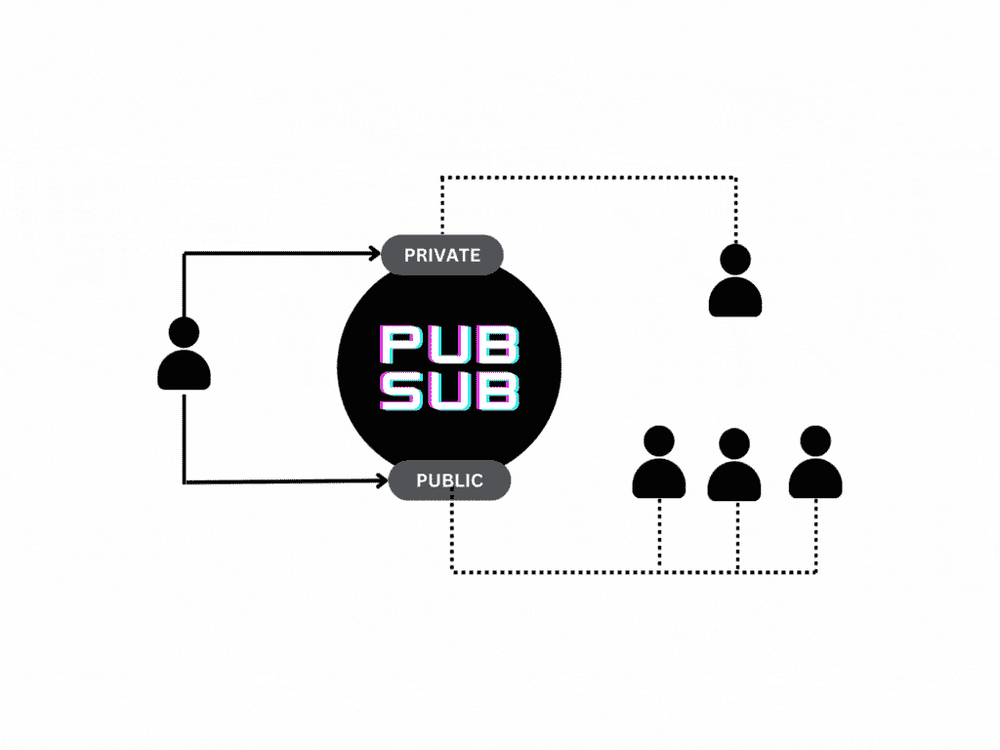
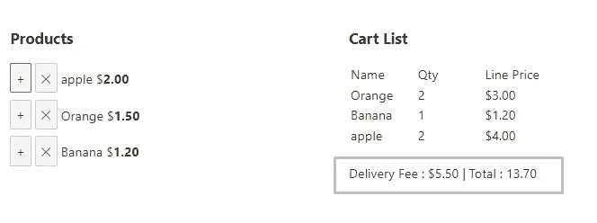
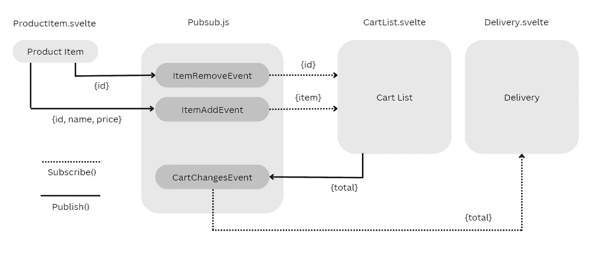
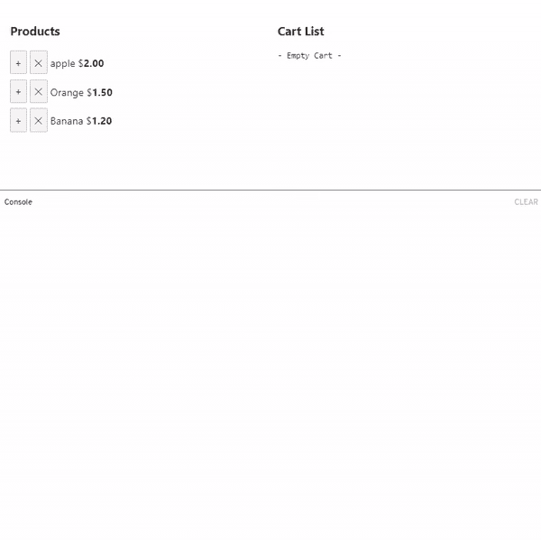

# 在苗条中使用发布-订阅模式

> 原文：<https://levelup.gitconnected.com/using-pub-sub-pattern-in-svelte-f58ce6a0afdd>

## 理解解耦的和可伸缩的组件通信模式。


标题按作者发布订阅图像

在软件架构模式中，当我们的数据需要与多个组件共享时，数据发布者并不关心订阅特定事件的组件。我们需要一个中介来用正确的信息交流每个组件。所以我们称这个中介为发布订阅。

> 问题不在于“问题”，问题在于你对待问题的态度——杰克·斯派洛

发布-订阅被称为发布者和订阅者模式。它也被称为事件驱动编程。当事件在发布服务器上发生时，所有订阅服务器组件都应该侦听该事件，并在有消息或没有消息的情况下被调用。

这种模式的一个例子是聊天应用程序。在聊天 app 中，有不同的渠道`(events)`发送`(publish)`消息。在那些频道上的人`(subscribers)`可以听到信息。



作者的聊天消息插图和动画

让我们来看看代码。在 Svelte 中，我们将使用两个默认方法`publish()`和`subscribe()`创建一个 *pubsub.js* 文件。订阅还返回了`unsubscribe()`方法，将事件从组件中分离出来。

可以使用默认参数在 *project-events.js* 上定义事件。

*project-events.js*

```
export class OnMessageEvent{
 constructor(message){
  this.args = message;
 }
}
```

事件类被用作传递消息的通道，类的名称将被用作两个`publish() and subscribe()`方法中的事件名称。

*pubsub.js*

`subscribe()`通过在基于映射的集合中添加事件名称来附加事件，并存储回调监听器。当`publish()`被调用时，基于事件名执行存储的回调。

*组件级的实现:*

```
<script>
  import {publish, subscribe} from './pubsub'
  import {onMessageEvent} from './project-events'
  import {onMount} from 'svelte'let message = '';//Listen the event onMount and unsubscribe when return.
  onMount(()=>{
    let onMsg = subscribe(onMessageEvent, (msg)=>{
      console.log('Received:', msg); 
    }); return()=>{ onMsg.unsubscribe(); }
  });//Send message using publish event
  const onSend = ()=>{
    publish(new onMessageEvent({message}));
  };
</script><input bind:value={messgae}/>
<button on:click={onSend}> Send </button>
```

上述示例在用于理解实现的同一个组件上发送和接收消息。让我们深入到一个使用同一个 *pubsub.js* 文件的具有多个事件和组件的真实 cart 应用程序中。

## 应用程序



简单的购物车应用程序，左边是产品，右边是购物车列表。具有解耦递送组件的购物车列表，用于计算递送费用。

当添加或删除活动项目时，购物车列表会更新，并且会计算正确的运费。如果购物车总额超过 10 美元，送货费将是免费的。

这个想法是以一种分离的方式制造所有三个组件。通信不是由道具、上下文或存储完成的。所有组件通信都将通过发布-订阅事件发生。

## 设计



作者发布-订阅组件设计图像

每个产品条目将发布两个事件`ItemAddEvent`和`ItemRemoveEvent`。购物车列表将监听(订阅)商品事件，更新购物车并发布`CartChangesEvent`。最后，delivery 将监听(订阅)这个`CartChangesEvent`，并用购物车总额更新运费。

## 演示



添加控制台语句是为了验证每个用户操作背后的事件和数据。

## 密码

我们知道如何创建一个带有参数的事件类。让我们看看下面三个类似`ProductItem, CartList`和`Delivery`的组件的代码。

*ProductItem.svelte*

```
<script>
 import {publish} from './pubsub'
 import {ItemAddEvent, ItemRemoveEvent} from './project-events'
 export let name;
 export let id;
 export let price = '0.0';

 const addCart = () =>{
  publish(new ItemAddEvent({id,name,price}));
 }
 const delCart = () =>{
  publish(new ItemRemoveEvent({id}));
 }
</script>
<button on:click={addCart} title="Add">+</button> 
<button on:click={delCart} title="Remove">✕</button> {name} $<b>{price}</b><br>
```

当`addCart()`和`delCart()`起作用时，产品项目组件发布两个不同的事件。

*CartList.svelte*

购物车列表组件订阅两个产品事件并发布`CartChangesEvent`。它使用 cart 类来管理购物车中的商品，并有意不使用苗条的商店。

*delivery . svelite*

```
<script>
 import {subscribe} from './pubsub';
 import {onMount} from 'svelte';
 import {CartChangesEvent} from './project-events'

 let defaultFee = 5.50;
 let total = 0.0;

 onMount(() => {
  let changer = subscribe(CartChangesEvent, (item) =>{   
   total = item.total;
  }) 

  return () =>{
   changer.unsubscribe();
  }
 });

</script>
{#if total > 0}
 {#if total >= 10}
  <br> Delivery Fee : Free Delivery | Total : {total}
 {:else}
  <br> Delivery Fee : ${defaultFee} | Total : ${total + defaultFee}
 {/if}
{/if}
```

交付组件监听`CartList`发布`CartChangesEvent`。`CartChangesEvent`还发送购物车总数据，用于进一步扩展应用程序。

# 赞成的意见

1.  **松耦合** —发布者不关心订阅者。
2.  **可伸缩性** —允许系统伸缩，无论它在负载上如何弯曲。
3.  **干净的设计** —解耦使得组件交互干净。
4.  **灵活性**——在一份合同下工作具有灵活性。
5.  **测试很简单** —只测试发布或订阅上的数据。

# 骗局

组件松散耦合是最大的优点，也是最大的缺点。发布者不知道订阅者的状态，反之亦然。出版商和订阅者的增加导致不稳定，它在负荷下弯曲。

恶意出版商可以入侵系统并破坏它。消息规范和参与者规则增加了系统的复杂性。

## 苗条的 REPL

完整的代码请查看苗条的 REPL [链接](https://svelte.dev/repl/5f44424999674986b79f02d94efaedf6?version=3.50.1)。尝试使用 REPL 代码，并通过添加其他组件(如优惠券、促销和折扣)来扩展应用程序。

# 结论

Svelte 有许多方式的组件通信技术，如道具，背景，和商店。使用发布-订阅模式有它自己的优点和缺点。没有灵丹妙药，但是发布-订阅是设计松散耦合系统的一种很好的方式。