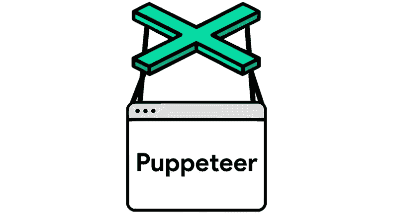

# 在网络上使用木偶师

> 原文：<https://levelup.gitconnected.com/using-puppeteer-on-netlify-e2d3801893c2>

不久前，一个熟人在 Twitter 上推出了丹麦版的“每周一词”。她每周都会在推特上发布一个她认为用得不够多的词。它可能是一个真实的单词或一些古老的俚语。我觉得很好笑，心想“为什么没有一个网站把他们列出来”。长话短说，我开始着手于此，https://ugensord.dk 诞生了(我首先得到了她的许可！).

这个网站非常简单。它使用 Unsplash 来显示背景，然后在中间显示一个简单的黑框，其中包含一个单词及其含义，有时还会有一段引文。自动生成 twitter 图片基本上是完美的。

正如标题所言，整个事情都托管在 Netlify 上，作为我的构建项目的一部分，我使用 Puppeteer 来截取一个渲染模板的截图。

让木偶师在 Netlify 上工作是一件相当麻烦的事情，直到我偶然发现了一个名为`chrome-aws-lambda`的库，它展示了一些获得`executeablePath`等的承诺。

注意:根据您的环境，添加`puppeteer-core`或`puppeteer`作为依赖项是很重要的。我使用 Docker 与`node:14-alpine`和安装`chromium`通过 APK。

代码相当简单。它使用`chrome-aws-lambda`来访问`puppeteer`，而不是直接要求那个包。

注意:我将`headless`强制设为`true`，这样我就不需要设置`AWS_LAMBDA_FUNCTION_NAME`并欺骗包进入无头状态。

奖励:这是我在这个项目中使用的`Dockerfile`。