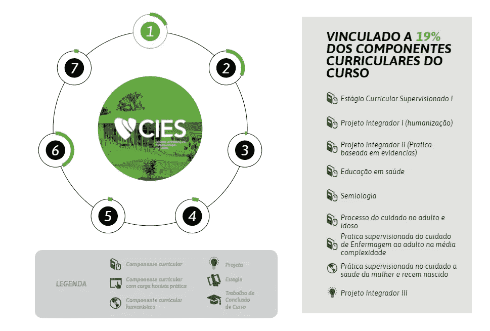

# 使用 Puppeteer Sharp 作为无头静态 HTML 组件生成器

> 原文：<https://levelup.gitconnected.com/using-puppeteer-sharp-as-a-headless-static-html-component-generator-fd17fbef0352>

[puppeter sharp](https://www.puppeteersharp.com/)是[puppeter](https://github.com/puppeteer/puppeteer)库的一个奇妙的 C#端口，用于运行集成到您的解决方案中的 [Chromium](https://www.chromium.org/) web 浏览器。它可以在。NET 框架或者。净核心项目。通过这个工具，您可以提供基于几乎实时数据的静态 HTML 组件作为服务器端呈现的内容。

更快更轻的网络内容是必须的，尤其是在发展中国家。移动和有线互联网速度低，低端智能手机和电脑是市场的最大部分。这是一个关于实施解决方案的故事，该解决方案允许使用 [D3.js](https://d3js.org/) 库基于动态数据和 JS 脚本构建视觉复杂的内容，并将其导出为 HTML、PDF(可缩放矢量)和图像(大比例的 JPG 和 PNG)。这为最终用户提供了一个安全的数据环境和更快的内容加载速度。

该项目在范围内有大约 10 个复杂的信息图表，应该用来自数据源的动态数据呈现，它们应该是:
-具有多种状态的可交互 web 组件；
-可导出为矢量格式，用于 Adobe Illustrator 或其他软件；
-可导出为大分辨率的 JPG 或 PNG 图像，每个状态或交互应导出为单独的图像；
-兼容传统的 ASP.NET 应用程序；

此[页](https://www.feevale.br/graduacao/enfermagem)中的一个组件结构的样本。

**建筑。概述:**

为了符合要求的规范，经过大量的研究和原型制作，解决方案架构可以定义如下:

一般来说，应用程序架构。(图标由[扁平图标](https://www.flaticon.com/)

核心**应用**管理一个**更新例程。**这个例程负责实例化一个**木偶师 Sharp** 进程，通过其入口点文件请求 **web 组件的**文件，并恢复数据以构建静态版本(这允许标准 API 调用或其他 web 请求)。在**puppeter Sharp**加载完数据和您的 **web 组件**的构建逻辑之后，您应该在您的*页面上下文*中静态生成一个组件(您也可以注入一个函数来将[样式解析到 SSR](https://stackoverflow.com/questions/25097566/css-style-to-inline-style-via-javascript) )。然后，您的内容已经被解析并在*页面上下文*中可用，现在您可以为您的**所需输出**定义输出策略，可以是保存一个文件或一系列文件，将其发送到另一个应用程序或您需要它做的任何事情。

**网页组件结构:**

拿着技术文档、布局和组件数据的样本。标准化文件夹中的组件结构，因此您可以轻松地将其加载到 Puppeteer Sharp 中。

每个组件都有自己的标准化结构的文件夹。(图标由[扁平图标](https://www.flaticon.com/)

**拆分组件“构建逻辑”和“交互逻辑”**

允许组件生成过程仅在服务器上运行。构建逻辑(那些用于基于数据构建静态组件的脚本和样式)可以从交互逻辑(通常。js 和。前端的 css 内容)放在单独的文件上。然后，您可以在外部可访问的路径上直接部署交互逻辑。

**从规范中获得的主要经验:**

您可以将数据内容作为一个结构化 JSON 数据字符串(或另一种格式)注入到页面上下文中，这允许一个解耦的数据提供者或不同的查询直接与 web 组件交互。

您还可以在导出组件之前包含要删除的 HTML 标记。在逻辑执行之后，您可以通过注入一个移除函数来移除这些标签(使用 *jQuery* 或普通 javascript):

当从 Puppeteer Sharp 实例化一个**浏览器**时，记得设置临时用户数据目录(用于由 puppeter 创建的会话)，否则，它将被创建在系统的 temp 目录中，并且在使用后可能不会被删除。

**项目的主要经验:
-** 对于多个出口输出，使用战略模式的力量作为解决方案。
**-** 关注 chromium 的生命周期，记得关闭所有标签和实例，否则它们会变成内存猪。
**-** 记住将 chromium 实例的临时数据设置到应用程序中的一个固定文件夹中，否则，它会在你的机器临时存储中创建随机文件夹，并且大多数情况下，不会删除它，几天后你的硬盘就会停转。

**优点:
-** 安全的数据环境，因为它永远不会被用户访问。
**-** 灵活的内容输出，允许根据需要进行不同的输出。
**-** 一种安全构件构造逻辑的方式。在某些情况下，这种逻辑可能成为复杂的商业秘密。
-易于扩展。

**缺点:**
**-** 不实时更新。您可以实时完成这项工作，但是如果您为每个请求实例化一个新的浏览器或者甚至一个页面，那么您将会耗尽您的服务器资源。
**-** 毕竟 Chromium 消耗了大量的内存和资源，所以你将需要一个强大的机器或者对你的更新过程进行良好的管理。

在[https://github.com/gmullernh/puppeteersharpStaticRenderer](https://github.com/gmullernh/puppeteersharpStaticRenderer)有一个示例项目