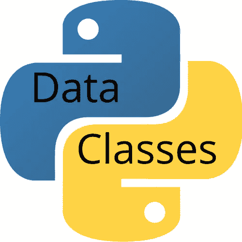

# 使用 Python 类进行数据工程

> 原文：<https://levelup.gitconnected.com/using-python-class-for-data-engineering-5edc4c3c9132>



# 1.更容易收集字段

如果你断然避免使用类，你很容易发现自己处于这样一种情况，你只是使用其他内置的数据结构，如列表或字典，重新发明你自己的“特别类”。

例如，您可能最终会有许多列表或字典共享相同的键来访问与单个逻辑对象相关联的不同类型的数据:

```
car_colors[23] = 'yellow'  # Color of Car 23
car_mileage[23] = 38189.4  # Mileage of Car 23
```

通过切换到类，您可以拥有一个对象列表，每个列表上都有几个命名字段来寻址相关数据:

```
cars[23].color = 'yellow'
cars[23].mileage = 38189.4
```

您可以将所有数据保存在一个屋檐下，而不是使用恰好包含所有数据的列表和字典，这使得访问和传递这些对象更加方便。

您也不再需要在函数之间传递大元组的内容。

# 2.将对象链接在一起并让它们以富有表现力的方式交互的能力

让代码先说话:

## 面向对象的版本

```
if not garage.is_full:
    garage.add(my_car)
    my_car.turn_off()
    garage.close()
```

## 非面向对象/过程化版本

```
if not is_garage_full(garage):
    add_car_to_garage(my_car, garage)
    turn_off_car(my_car)
    close_garage(garage)
```

这是面向对象编程真正闪光的地方——当你正在处理的对象在其上有行为时。比如可以点击的按钮或者可以加速刹车的汽车。

在这种情况下，如果你*通过在你的按钮和汽车类上制作方法来封装*这些行为，那么其他对象可以调用这些方法并改变按钮或汽车的内部状态，而不知道操作是如何实现的，这将会有所帮助。

特别是当你在你的对象上有很多行为的时候，把它们都放在同一个地方，放在对象本身的同一个屋檐下是很有帮助的。通过这种方式，您可以将对象链接在一起，并让它们以一种富有表现力的方式进行交互，这种方式很难用过程化的编码风格来模拟。

# 3.数据类

数据类通常主要包含数据，尽管实际上没有任何限制。它是使用`@dataclass`装饰器创建的，如下所示:

```
from dataclasses import dataclass

@dataclass
class DataClassCard:
    rank: str
    suit: str
```

数据类带有已经实现的基本功能。例如，您可以立即实例化、打印和比较数据类实例:

```
>>> queen_of_hearts = DataClassCard('Q', 'Hearts')
>>> queen_of_hearts.rank
'Q'
>>> queen_of_hearts
DataClassCard(rank='Q', suit='Hearts')
>>> queen_of_hearts == DataClassCard('Q', 'Hearts')
True
```

与普通班级相比。最小的常规类应该是这样的:

```
class RegularCard:
    def __init__(self, rank, suit):
        self.rank = rank
        self.suit = suit
```

虽然这没有更多的代码要写，但您已经可以看到样板文件之痛的迹象:`rank`和`suit`都重复了三次，只是为了初始化一个对象。此外，如果您尝试使用这个普通的类，您会注意到对象的表示不是非常具有描述性，并且由于某种原因，红心皇后与红心皇后不同:

```
>>> queen_of_hearts = RegularCard('Q', 'Hearts')
>>> queen_of_hearts.rank
'Q'
>>> queen_of_hearts
<__main__.RegularCard object at 0x7fb6eee35d30>
>>> queen_of_hearts == RegularCard('Q', 'Hearts')
False
```

希望你能学到一些，并把 python 类添加到你的数据工程武库中。如果您想了解更多关于 ETL(提取、转换、加载)的知识，并使用一些方便的 python 脚本来实现更简单的数据工程，请随意查看我的另一篇文章。数据验证是数据管道检查的首要步骤之一[在这里](https://medium.com/@caopengau/python-data-pipeline-first-and-foremost-step-data-validation-e15017b7ef8d)我与 **pydantic 一起演示。**

**呼吁行动**

如果你觉得这个指南有帮助，请鼓掌并跟我来。通过[链接](https://medium.com/@caopengau/membership)加入 medium，获取我和所有其他优秀作家在 medium 上发表的所有优质文章。