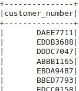
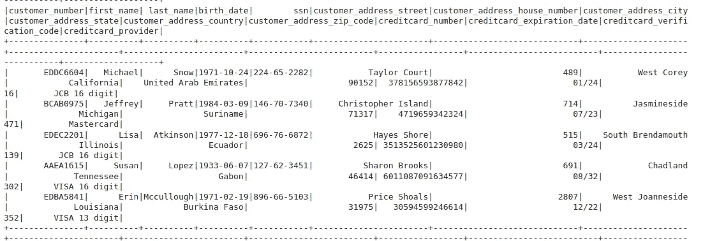

# 使用 Python Faker 库生成虚拟数据

> 原文：<https://levelup.gitconnected.com/using-python-faker-library-to-generate-dummy-data-45106915c716>

# 什么是哑数据？

这种类型的数据通常用于软件开发、单元测试、ML 模型训练、数据分析等，以防止将敏感数据用于上述用例。此外，当生成随机数据时，作为开发人员，您可以确保在测试时交叉检查所有的验证。

手动创建假数据对任何人来说都是一项艰巨的任务，因此有多个库来简化这个过程。所以在这篇博文中，我将解释我们如何使用 Python [Faker](https://faker.readthedocs.io/en/master/index.html) 库来生成一些随机数据。

库中有多个[提供者](https://faker.readthedocs.io/en/master/providers.html)，如个人、地址、公司、电话号码等。您可以使用这些类来调用内置的方法。

# 初始化

首先我们必须初始化 faker 类，然后播种 Faker。我这里所说的播种的意思是，当你在`seed()`方法中传递一个随机数，并在其他地方使用相同的数时，你将得到相同的结果集。

你可以在 Faker 库的`Seeding`部分找到更多细节

```
from faker import Faker

Faker.seed(0)
fake = Faker()
```

# 使用

`bothify()`帮助你生成一个带有特定模式的字符和数字的字符串。例如，如果你看到我下面提到的`text`模式:

？？？？->这将被替换为我在字母范围中提供的随机字母

# # # #-->这将被替换为 0-9 之间的随机数

```
# this returns random customer number 
customer_number = fake.bothify(text='????####', letters='ABCDE')
```

您将会得到与此类似的内容:



客户数量

`date_of_birth`帮助你随机生成出生日期。您还可以传递其他参数，例如您想要的最小或最大年龄限制。这样它将使用自动生成的日期计算当前日期的年龄

```
birth_date = fake.date_of_birth(minimum_age=18)
```

有一些常用的方法可以用来生成`firstname`、`lastname`、`streetname`等。

```
fisrt_name = fake.first_name()
last_name = fake.last_name()
country = fake.country()
```

生成信用卡相关详细信息的方法

```
cc_number = fake.credit_card_number()
cc_expiry_date = fake.credit_card_expire()
cc_security_code = fake.credit_card_security_code()
cc_provider = fake.credit_card_provider()
```



客户和信用卡详细信息

生成随机单词列表

```
fake.words(nb=50, unique=True)
```

在上面的代码中，您还可以传递参数，如`nb`来定义您想要生成的单词数，以及`unique`参数来确保列表只包含唯一的关键字。同样，如果你只想从一个单词列表中生成，你也可以通过使用参数`ext_word_list=['test1', 'test2', 'test3'].`来明确指定

生成随机文件名和路径

```
fake.file_name(category='audio')
```

正如你所看到的，上面的代码行将生成带有音频文件扩展名(`.mp3`)的文件名，同样你也可以给出其他类别。

上面会返回-> audio1.mp3，audio2.mp3

如果您想覆盖生成器提供的文件名，您也可以将`extension`作为参数显式传递。

```
fake.file_name(category='audio', extension='wav')
```

这将给你->音频 1.wav，音频 2.wav

下面你可以看到文件路径是如何在什么深度生成的(换句话说，它应该经过多少个目录才能到达文件)

```
fake.file_path(depth=3)
```

这将返回如下路径:

/目录 1/目录 2/目录 3/文件. txt

对于文件路径，你也可以指定你需要什么样的扩展名或类别。你也可以在方法中显式传递你想要的`absolute`路径还是`relative`路径。

我希望到现在为止，你已经掌握了如何使用 Python 中的`Faker`库的要点。

# 参考资料:

[https://faker.readthedocs.io/en/master/fakerclass.html](https://faker.readthedocs.io/en/master/fakerclass.html)