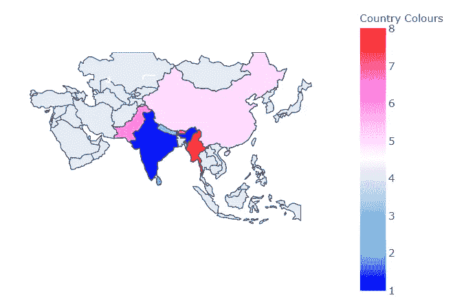
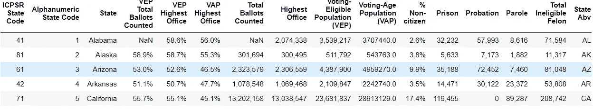
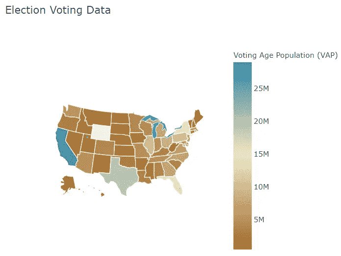
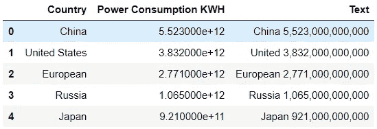
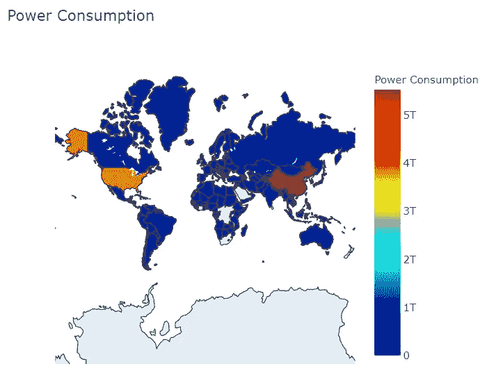

# 使用 Python 进行地理绘图

> 原文：<https://levelup.gitconnected.com/using-python-for-geographical-plotting-d9328fb8cfab>

## 理解和创建用于数据分析的地理图的指南。

# 什么是地理标图？

地理绘图用于世界地图，也用于不同国家。当需要分析基于地图的数据并从中获得深刻见解时，该工具非常有用。它的一个应用领域是货物的可视化输出和输入数据。

# 用什么来创作地理图？

Plotly 将用于绘图。原因是它创造了互动的情节。

> 要详细了解 Plotly，查看我的文章[这里](https://jayashree8.medium.com/interactive-data-visualization-using-plotly-and-cufflinks-228bfbe8773f)。

# 如何导入包？

plotly 包被导入。随着这几个模块从 plotly 离线也被导入，因为我们是在离线模式下使用。Pandas 包是为处理数据帧而导入的。

```
**>>> import** pandas **as** pd
**>>> import** plotly **as** py
**>>> from** plotly.offline **import** download_plotlyjs,init_notebook_mode,plot,iplot
```

然后，为了确保这些图显示在笔记本中，编写下面的代码。

```
>>> init_notebook_mode(connected**=True**)
```

# Choropleth 地图

Choropleth 地图是一种包含彩色多边形的地图。它有助于直观地了解一个变量在一个地理区域内是如何变化的。

为了创建 choropleth 映射，我们需要使用 dict()方法创建一个数据字典。该字典包含类型、位置(本质上是作为数组传递的州或国家)和位置模式。然后定义色标。不同的预定义色阶是:“对”、“灰色”、“绿色”、“蓝红色”、“热”、“野餐”、“波特兰”、“喷气式”、“RdBu”、“黑体”、“地球”、“电力”、“YIOrRd”、“YIGnBu”。然后给出文本值。这些值只是悬停在该位置时出现的名称。然后传递一个数组作为 z 的参数。数组中的值是与颜色对应的数字。最后一个参数是 colorbar，它以一个字典作为值。对于关键字“标题”,我们可以提到颜色条的标题应该是什么。

在这里，亚洲大陆的国家将被认为是阴谋。

```
>>> data **=** dict(type **=** 'choropleth',
locations **=**['india','srilanka','nepal','Bangladesh','china','pakistan','bhutan','myanmar'],
locationmode **=** 'country names',
colorscale**=** 'Picnic',
text**=** ['IND','SLK','NEP','BAN','CHI','PAK','BHU', 'MYN'],
z**=**[1.0,2.0,3.0,4.0,5.0,6.0,7.0,8.0],
colorbar **=** {'title':'Country Colours'})
```

现在创建了一个布局对象。此布局是一个嵌套字典。这里提到了范围。

```
>>> layout **=** dict(geo**=**{'scope':'asia'})
```

现在使用 go 创建了一个对象。Figure()函数，以便可以将它传递给 iplot()方法。为此，必须从 plotly 导入另一个图形对象。导入后，在进行中。Figure()方法，传递数据和布局。它是使用 iplot()方法绘制的。

```
**>>> import** plotly.graph_objs **as** go>>> chmap **=** go.Figure(data**=**[data],layout**=**layout)
>>> iplot(chmap)
```



# 使用真实数据进行国家绘图

选举数据用于理解如何为真实数据创建 choropleth 图。使用的数据是美国的选举数据。

```
df **=** pd.read_csv('election_data.csv')
df.head()
```



现在我们将创建数据字典。这里不写状态名和文本值，而是直接调用 dataframe 列。因此，对于位置，将传递“Sate Abv”列，位置模式将是美国各州，因为数据集只处理美国各州。接下来，z 值将获得投票年龄人口的列，以根据相应的颜色显示这些细节。文本值也将获得数据帧的“状态”列。然后彩条标题作为投票年龄人口给出，因为这就是它所描述的。

增加了一个额外的参数作为标记。它是一个嵌套的字典，定义了标记的形式。颜色和宽度已定义。标记只是定义边界如何连接到不同的位置。

```
>>> data **=** dict(type**=**'choropleth',
colorscale **=** 'Earth',
locations **=** df['State Abv'],
locationmode **=** 'USA-states',
z **=** df['Voting-Age Population (VAP)'],
text **=** df['State'],
marker **=** dict(line **=** dict(color **=** 'rgb(255,255,255)',width **=** 1)),
colorbar **=** {'title':"Voting Age Population (VAP)"})
```

现在创建了布局词典。情节的标题与范围一起传递。范围是“美国”。此外，另一个论点是' showlakes '。它显示了湖泊，也提到了湖的颜色是蓝色的(写为 rgb 值)。

```
>>> layout **=** dict(title **=** 'Election Voting Data',
geo **=** dict(scope**=**'usa',
showlakes **=** **True**,
lakecolor **=** 'rgb(85,173,240)')
)>>> chmap **=** go.Figure(data **=** [data],layout **=** layout)
>>> iplot(chmap)
```



# 使用真实数据进行世界绘图

现在，一个真实的数据集被用于世界电力消耗，以便理解当考虑整个世界时，绘图是如何发生的。

```
>>> df2 **=** pd.read_csv('world_power.csv')
>>> df2.head()
```



如前所述，创建了数据字典和布局字典。在布局中，提到了一个额外的参数投影类型。它决定了这些地点的外观。各种选项可以在官方文档中找到。文章末尾提供了链接。

```
>>> data **=** dict(
type **=** 'choropleth',
colorscale **=** 'Jet',
locations **=** df2['Country'],
locationmode **=** "country names",
z **=** df2['Power Consumption KWH'],
text **=** df2['Country'],
colorbar **=** {'title' : 'Power Consumption'},
)>>> layout **=** dict(title **=** 'Power Consumption',geo **=** dict(showframe **=** **False**,projection **=** {'type':'mercator'})
)>>> chmap **=** go.Figure(data **=** [data],layout **=** layout)
>>> iplot(chmap)
```



> *更多关于 Choropleth 地图的详细信息，查看官方文档* [*这里*](https://plotly.com/python/reference/#choropleth) *。*
> 
> *此处* *代码请参考笔记本。*

> *联系我:* [*领英*](https://www.linkedin.com/in/jayashree-domala8/)
> 
> *查看我的其他作品:* [*GitHub*](https://github.com/jayashree8)