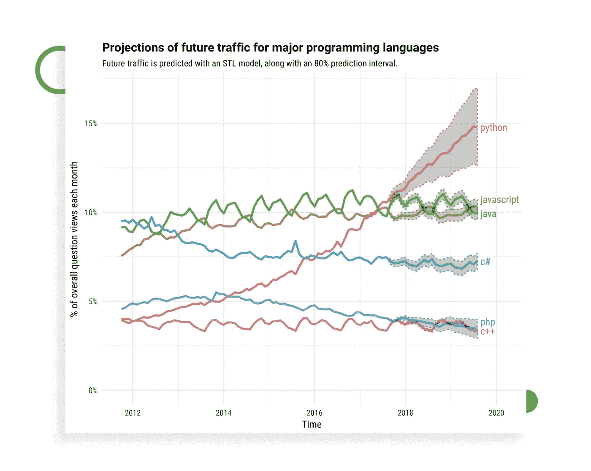
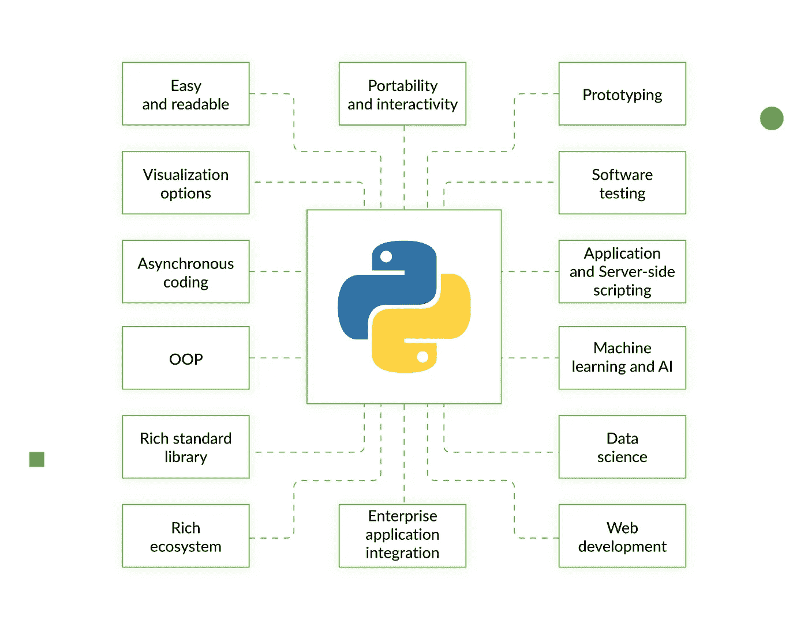
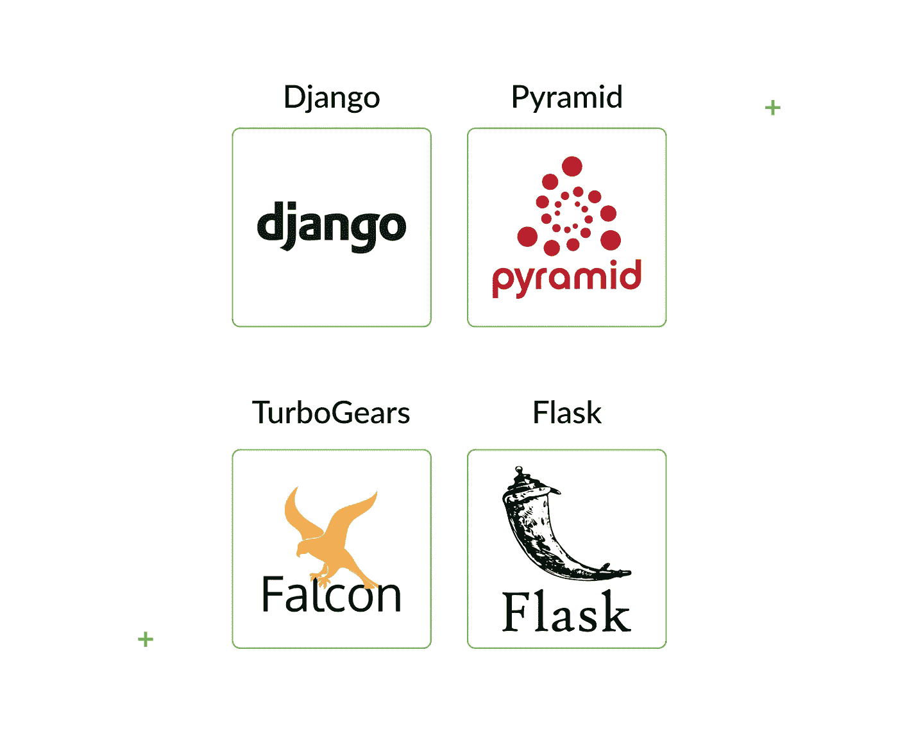
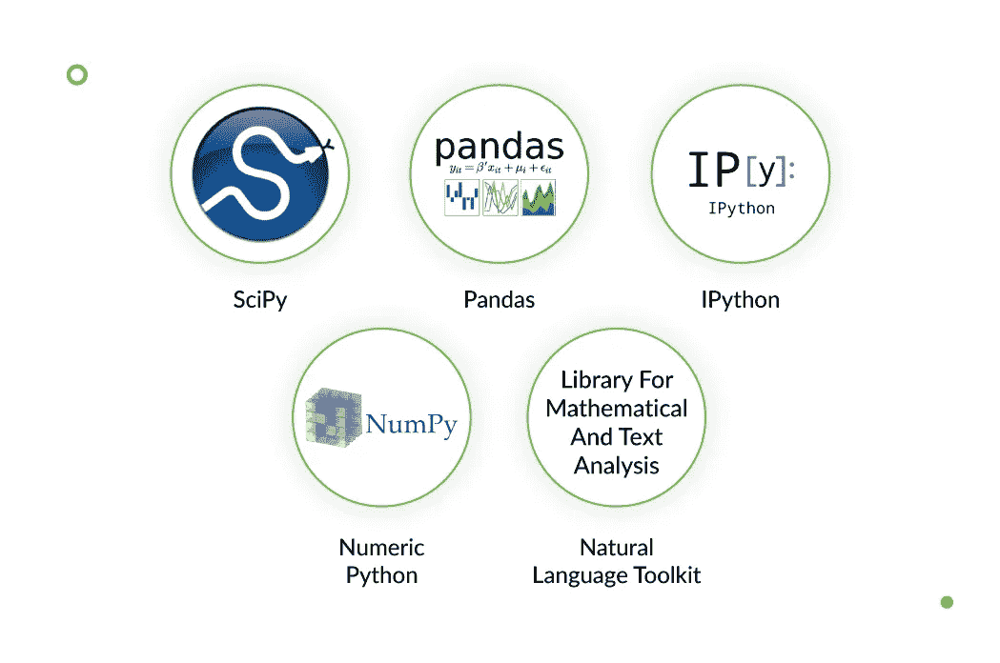
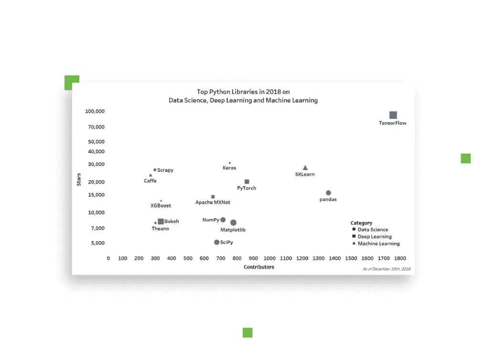
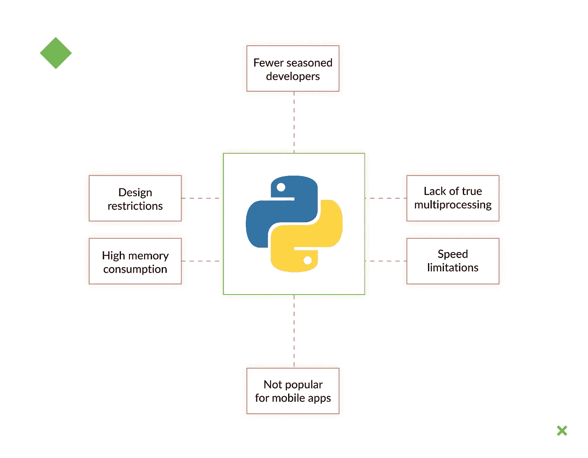

# 使用 Python 进行 Web 开发:16 个最重要的优点和缺点

> 原文：<https://levelup.gitconnected.com/using-python-for-web-development-16-most-important-pros-and-cons-1995094bd27d>

作为世界上[最流行的编码语言之一](https://stackoverflow.blog/2017/09/06/incredible-growth-python/)，受 ABC 和 Modula-3 语言的影响，Python 在 80 年代末首次被概念化。从 1991 年第一次发布到 2.0 版成为一个开源项目，它已经走过了很长的路。今天，它有一个巨大的、专业的社区在不断改进技术。

一些[顶级公司](https://djangostars.com/blog/top-seven-apps-built-python/?utm_source=levelup.gitconnected.com&utm_medium=medium&utm_campaign=16%20python%20pros%20and%20cons&utm_content=top%20companies)在他们的技术栈中使用 Python:

*   [insta gram](https://www.instagram.com/?hl=en)——一个社交媒体平台，依靠 Python 允许其 400 万每日活跃用户在个人数字相册中拍摄、编辑、存储和分享他们的创作。
*   [Spotify](https://www.spotify.com/) —领先的音乐流媒体应用程序，采用数据分析来管理其广播和发现功能。
*   Disqus —一个评论插件，每月处理大约 5000 万条评论，在 19 个国家可用。

Python 的流行是由其提供的好处推动的，比如吸引包括 Dropbox、Google 和 Postmates 在内的大公司的简单和优雅。虽然使用 Python 进行 web 开发有很多优势，但也有一些陷阱。我们去看看。

# 优点:为什么使用 Python 进行 Web 开发

# 易于使用和阅读

有几个因素可以简化 Python 在 web 开发中的使用:

*   **低准入门槛**
    Python 类似于我们日常生活中使用的英语。语法的简单性允许您处理复杂的系统，并确保所有元素之间有一个清晰的关系。得益于此，新的程序员可以更快地学习这种语言并加入编程社区。
*   **使用不同的图和图表可以实现良好的可视化效果**
    。它们是可视化呈现和理解数据的有效方式。网络开发公司利用 Python 库(例如 [Matplotlib](https://matplotlib.org/) )使可视化数据和创建清晰易懂的报告成为可能。

Python 非常容易阅读，所以开发人员理解他们的程序员同事写的代码通常没有问题。这使得从事同一项目的开发人员之间的交流更加有效。

# 异步编码

使用 Python 编写和维护异步代码不需要花费太多精力，因为没有死锁、研究争用或任何其他令人困惑的问题。这种代码的每一个单元都是独立运行的，这使得您可以更快地处理各种情况和问题。

# 较少限制的编程方法

与其他编码语言(如 Java)相比， [Python](https://djangostars.com/services/python-django-development/?utm_source=levelup.gitconnected.com&utm_medium=medium&utm_campaign=16%20python%20pros%20and%20cons&utm_content=Python) 的编程方式限制较少。它有多种范例，可以支持多种编程风格，包括过程式的、面向对象的和函数式的。这使得 Python 成为[初创公司](https://djangostars.com/blog/python-best-programming-language-for-startup/?utm_source=levelup.gitconnected.com&utm_medium=medium&utm_campaign=16%20python%20pros%20and%20cons&utm_content=startups)的绝佳语言，因为你可能需要随时改变你的方法。

这是它给你的东西:

*   **快速发展。Python 不仅是发展最快的编码语言之一，也是一种允许快速原型化和迭代的语言。这使得开发人员的工作变得更加容易，效率也更高。**
*   OOP 变得更容易。
    面向对象编程(Object-oriented programming)又称 OOP，是一种将不同的行为和属性组织成若干个对象和类的范式。这些类中的每一个都有一个函数，所以如果代码的某一部分出错，其他部分不会受到影响。在 Python 中，OOP 的操作被大大简化了，这使得开发成本更低，耗时更少。
*   **丰富的标准库和生态系统。**
    Python 的库以大量预写代码为特色。因此，开发人员不需要浪费时间来创建基本的项目。这些库还允许程序员处理和转换机器学习(ML)中连续数据处理所需的数据。

# 企业应用集成

Python 是企业软件应用程序的流行选择，这在很大程度上要归功于它与企业开发中传统使用的其他语言的平滑集成，如 Java、PHP 和. NET。

Python 直接调用 Java、C++或 C 代码，允许大量的过程控制和最常见协议和数据格式的实现。

除此之外，它还可以应用于组装基础设施的新旧片段，这是复杂移动应用程序中的典型情况。

# 使用 Python 框架进行 Web 开发

Python 的另一个好处是它有许多简化开发过程的框架。根据您正在做的事情，您可能需要不同的框架。

让我们来看看最知名的 Python 框架。

*   这个框架非常适合成熟的 web 应用程序和中档可扩展项目。它具有内置特性，允许代码重用，对代码的不同组件进行一致的修改，以及其他功能[简化了 web 开发](https://djangostars.com/blog/top-14-pros-using-django-web-development/?utm_source=levelup.gitconnected.com&utm_medium=medium&utm_campaign=16%20python%20pros%20and%20cons&utm_content=simplifies%20web%20development)。Django 可以很好地与 Oracle SQL、PostgreSQL、MySQL 和其他知名数据库配合使用。
*   有了这个框架，您可以从小规模开始，然后根据需要进行扩展。Pyramid 可以用于各种数据库和应用程序，或者通过插件进行扩展——开发人员可以添加他们需要的任何功能。当您需要在一个任务中实现不同的解决方案时，这很方便。
*   [TurboGears](https://www.turbogears.org/) TurboGears 由 Repoze、WebOb、石根等几个组件组成，基于 MVC 架构。它有利于快速高效的 web 应用程序开发，并且更易于维护。有了这个框架，您可以分别使用最小堆栈模式或全堆栈模式来编写小型或复杂的应用程序。
*   该框架的理念是提供一个简单且易于管理的解决方案，可以轻松地进行定制。Flask 将自己定义为一个微框架，并且最常用于主要优先考虑精益功能的小型解决方案。该框架也用于创建原型。

# 它在科学和数字应用中的用途

有各种各样的软件包和库可用于开发科学和数字应用程序，以及工具包(例如，VTK 3D 和 MayaVi)，一个单独的图像库和许多其他工具。最常用的有:

# 用于机器学习和人工智能

机器学习(ML)和人工智能(AI)技术正获得越来越多的关注，因此更多的开发人员试图将它们融入各种项目。如果你使用正确的语言，这是可能的。

根据 IBM 机器学习部门代表 Jean Francois Puget 的说法，Python 是 ML 和 AI 项目的顶级语言，很多开发者都认同这一点。Python 拥有高效的 ML 包、可视化结果的工具，并且超越了数据分析和其他特性，这些特性[有益于这个应用领域](https://djangostars.com/blog/why-python-is-good-for-artificial-intelligence-and-machine-learning/?utm_source=levelup.gitconnected.com&utm_medium=medium&utm_campaign=16%20python%20pros%20and%20cons&utm_content=benefit%20this%20area%20of%20application)。

# 应用程序脚本和软件测试

得益于它与 C、C++和 Java 的强大集成，Python 可以方便地用于应用程序脚本。从一开始就被设计成可嵌入的，这对于定制大型应用程序和为其进行扩展非常有用。

Python 用于测试自动化。许多 QA 自动化专家选择 Python 是因为它简单的学习曲线——对于那些技术背景有限的人来说也很好——强大的社区、清晰的语法和可读性。Python 甚至有一个易于使用的单元测试框架(例如，你可以用它为移动应用程序执行[地理位置测试](https://djangostars.com/blog/mobile-geolocation-testing/))。

# 在原型制作中使用

用 Python 创建原型已经被证明是一个快速而简单的过程。编程语言的灵活性允许简单的代码重构和从初始原型到最终产品的快速开发。

# 开源的好处

Python 有一个开源许可，使得用户可以很容易地访问它，并且便于再分发和无限制的修改。开发人员可以自由地使用这种语言，并为其改进做出贡献。

# 服务器端脚本

如上所述，使用 Python 进行服务器端脚本编写的优点之一是其简单的语法，这大大加快了进程。代码由功能模块和它们之间的连接组成，允许你根据用户动作执行程序算法。Python 还支持 web 开发中所需的图形用户界面。

# 便携性和交互性

Python 具有良好的动态语义和快速原型能力，这得益于它的交互性和可移植性。它可以很容易地嵌入到各种各样的应用程序中，甚至是使用不同编码语言的应用程序。因此，您可以毫不费力地修复新模块并扩展 Python 的核心词汇。它可以连接不同的组件。难怪它有时被称为“胶水语言”。

# 将 Python 用于 Web 应用程序的缺点

尽管 Python 有很多优点，但是如果你考虑在你的项目中使用这种语言，你也应该记住它的缺点。

# 经验丰富的开发人员较少

当你需要一个为你创建的应用程序时，你当然希望最有经验的开发者来做这项工作。然而，使用 Python 就没那么简单了，因为没有多少专业程序员在使用这种语言，尤其是当你将它与 Java 相比较时。

# 缺乏真正的多处理器支持

多重处理是编写应用程序的重要部分。Python 确实支持多处理，尽管它可能不像其他语言那样灵活或方便。这可能会在您编写代码时造成某些限制。

# 速度限制

Python 经常因其速度而受到批评。它是一种解释脚本语言，由于它使用不同的方法来翻译代码，这使得它比许多编译过的语言(如 C/C++或 Java)相对要慢。然而，一些 Python 基准测试比 C 和 C++的工作速度更快。

也就是说，Python 并不是唯一一个存在潜在速度问题的。Ruby，Perl，甚至 JavaScript 也在天平的末端[。](https://attractivechaos.github.io/plb/)

一些与速度相关的问题已经得到解决和优化，因此 Python 仍然是[软件开发团队](https://djangostars.com/company/team/?utm_source=levelup.gitconnected.com&utm_medium=medium&utm_campaign=16%20python%20pros%20and%20cons&utm_content=software%20development%20teams)的首选之一。

# 不是移动应用程序开发的首选语言

对于移动开发来说，这是一种不错的语言。只是很少有公司将它用于那个目的，更喜欢 iOS 和 Android 的[原生开发或者 React 原生开发](https://djangostars.com/services/mobile-app-development/?utm_source=levelup.gitconnected.com&utm_medium=medium&utm_campaign=16%20python%20pros%20and%20cons&utm_content=native%20development%20for%20iOS%20and%20Android%20or%20React%20Native%20development)。出于同样的原因，你可能也很难招聘到有 Python 移动开发经验的开发人员。它只是不像这个领域的其他技术那样受欢迎。

# 不适合内存密集型任务

Python 是一种以其数据类型的灵活性而闻名的语言。这会导致相当高的内存消耗，并且不便于用于内存密集型任务。

# 设计限制

Python 是动态类型的，这意味着它在应用程序运行时执行某些任务，否则这些任务将由静态类型的语言完成。这给设计带来了一些限制。如果您的设计加载了元素，它可能会使程序停止运行并妨碍顺利运行。

在为您的项目考虑 Python 时，您应该知道的另一件事是，并发性和并行性并不适合在 Python 中优雅地使用。正因为如此，设计可能看起来不像你想要的那么复杂。

# 结束语

Python 允许你开发清晰简单的应用程序，从一个小项目到一个成熟复杂的应用程序都很容易。无论你是一个学习如何编程的程序员新手，还是你的企业所有者，Python 对于许多类型的项目来说都是一个好的选择。

它被认为是初创公司最好的编程语言之一——当你对比 Python 的优势和初创公司的情况时，很容易明白为什么。初创公司不断寻求确定性和降低风险，他们的资源有限，需要增长空间。另一方面，Python 灵活且易于扩展，不需要很大的团队，可以用来构建原型和 MVP。

Django Stars，一家 [Python web 开发公司](https://djangostars.com/services/web-development/?utm_source=levelup.gitconnected.com&utm_medium=medium&utm_campaign=16%20python%20pros%20and%20cons&utm_content=Python%20web%20development%20company)，已经使用这种语言很多年了。我们已经完成了各种复杂的项目，并在电子商务、房地产和金融等领域有许多成功的例子。其中包括:

*   [Sindeo](https://djangostars.com/case-studies/sindeo/?utm_source=levelup.gitconnected.com&utm_medium=medium&utm_campaign=16%20python%20pros%20and%20cons&utm_content=Sindeo)——一个提供贷款和抵押信息的房地产平台。
*   MoneyPark —一家瑞士公司，提供保险和抵押贷款方面的个性化财务建议。

因此，无论您在哪个领域工作，Python 都值得您关注。它提供简单的解决方案，没有不必要的细节，节省时间，并确保高度的安全性。

许多知名公司都在使用和信任 Python。一些最大最受信任的全球性公司使用 Python 和 Django 平台作为他们的主要编码语言。Instagram、Pinterest、Bitbucket 和 Dropbox 是一些选择 Python web 开发服务的公司。

> *这篇关于**[***Python for web 开发***](https://djangostars.com/blog/python-web-development/?utm_source=levelup.gitconnected.com&utm_medium=medium&utm_campaign=16%20python%20pros%20and%20cons&utm_content=originally%20posted) *的文章最初发表于 2019 年 9 月 17 日* ***Django Stars 博客*** *。**

*** [## 学习 Python -最佳 Python 教程(2019) | gitconnected

### Python 是一种动态的通用编程语言，在许多领域都有应用，包括 web 开发、数据科学…

gitconnected.com](https://gitconnected.com/learn/python)*