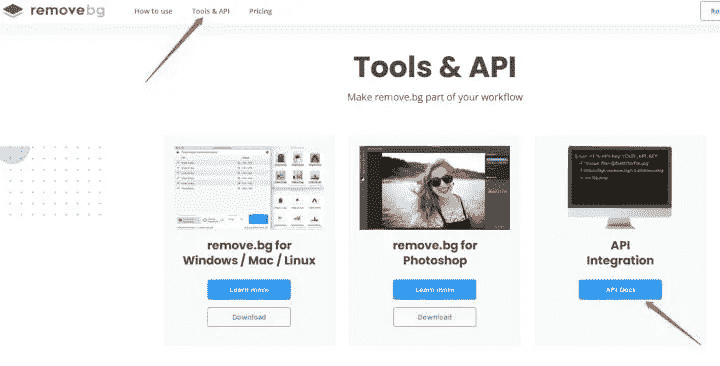
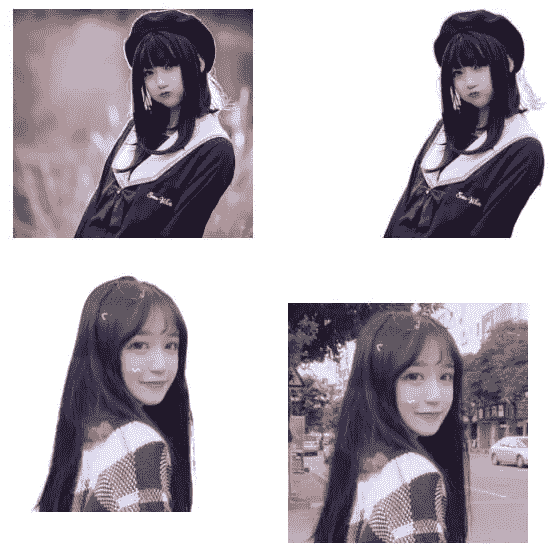

# 使用 Python/Nodejs 去除图像背景

> 原文：<https://levelup.gitconnected.com/using-python-nodejs-to-remove-background-from-image-3953504082c6>

每天都有很多来自各种来源的照片在各种网站上传播。有些时候，你想只提取照片的主要部分。本文旨在指导您如何使用和不使用简单的 python 编程来修剪背景表单图像。

这是一张漂亮女孩的照片。除了背景模糊之外，一切看起来都很好！


经过潜水和挖掘，我终于在这里得到了一个干净纯粹的版本


# 首先，没有代码的方式

这个网站可以帮你 [**去除背景**](https://www.remove.bg/)

它看起来像下面


正如它所描述的，它可以(接近)100%自动和免费(在一定条件下)去除图像背景，能够识别人与背景，产品与背景。据称，这一切都在不到 5 秒的时间内完成。

它也有 Python，Ruby 和深度学习工具的服务，用 API 实现从图像中修剪背景。

# 然后，编程方式

首先，我们需要在这个网站注册一个帐户。这很简单，只需要你自己的邮箱。

在开始的时候，有了 API 访问，你每个月只能处理 50 张图片。如果使用 website，使用次数没有限制。

预备步骤:抓取你的样本图像并知道它的路径

## **第一章**

登录后，

*   第 1 步“工具和 API”
*   步骤 2 'API 文档'
*   步骤 3“获取 API 密钥”:
*   第四步“展示”



**第二章 Python**

2.1 准备好您的环境并构建 python 控制台应用程序。

依赖:`requests`，`removebg`

```
pip install -i requests removebg
```

## 2.2.1 带 web api 的 Python 代码

```
# Requires "requests" to be installed (see python-requests.org)
import requests

response = requests.post(
    'https://api.remove.bg/v1.0/removebg',
    files={'image_file': open('/path/to/file.jpg', 'rb')},
    data={'size': 'auto'},
    headers={'X-Api-Key': 'INSERT_YOUR_API_KEY_HERE'},
)
if response.status_code == requests.codes.ok:
    with open('no-bg.png', 'wb') as out:
        out.write(response.content)
else:
    print("Error:", response.status_code, response.text)
```

## 2.2.2 带库的 Python 代码

2.2.1 准备好您的环境并构建一个简单的节点控制台应用程序。

```
from removebg import RemoveBg

rmbg = RemoveBg("YOUR-API-KEY", "error.log")
rmbg.remove_background_from_img_file("joker.jpg")
```

## 第三章节点

3.1 准备好您的环境并构建一个 python 控制台应用程序。

依赖:`axios`、`form-data`、`remove.bg`

```
npm i axios form-data remove.bg
```

3.2.1 通过 web API 的节点代码

```
// Requires "axios" and "form-data" to be installed (see https://www.npmjs.com/package/axios and https://www.npmjs.com/package/form-data)
const axios = require('axios');
const FormData = require('form-data');
const fs = require('fs');
const path = require('path');

const inputPath = '/path/to/file.jpg';
const formData = new FormData();
formData.append('size', 'auto');
formData.append('image_file', fs.createReadStream(inputPath), path.basename(inputPath));

axios({
  method: 'post',
  url: 'https://api.remove.bg/v1.0/removebg',
  data: formData,
  responseType: 'arraybuffer',
  headers: {
    ...formData.getHeaders(),
    'X-Api-Key': 'INSERT_YOUR_API_KEY_HERE',
  },
  encoding: null
})
.then((response) => {
  if(response.status != 200) return console.error('Error:', response.status, response.statusText);
  fs.writeFileSync("no-bg.png", response.data);
})
.catch((error) => {
    return console.error('Request failed:', error);
}); 
```

3.2.2 带库的节点代码

```
import { RemoveBgResult, RemoveBgError, removeBackgroundFromImageFile } from "remove.bg";

const localFile = "./local/file/name.jpg";
const outputFile = `${__dirname}/out/img-removed-from-file.png`;

removeBackgroundFromImageFile({
  path: localFile,
  apiKey: "YOUR-API-KEY",
  size: "regular",
  type: "auto",
  scale: "50%",
  outputFile 
}).then((result: RemoveBgResult) => {
 console.log(`File saved to ${outputFile}`);
  const base64img = result.base64img;
}).catch((errors: Array<RemoveBgError>) => {
 console.log(JSON.stringify(errors));
});
```



感谢您通读。如果你想建造一个电报机器人，并开始向人们收费，赚取被动收入，请随意查看我的[分步指南](https://medium.com/@caopengau/a-step-by-step-guide-on-building-a-passive-income-stream-from-telegram-bot-69f3e85e14f7)

**行动呼吁**

如果你觉得这个指南有帮助，请鼓掌并跟我来。通过[链接](https://medium.com/@caopengau/membership)加入 medium，获取我和所有其他优秀作家在 medium 上发表的所有优质文章。