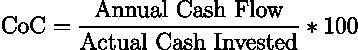
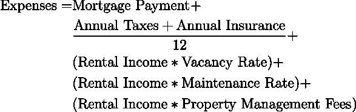
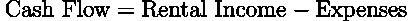
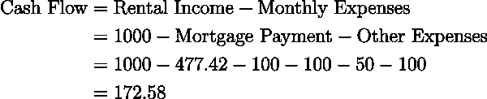
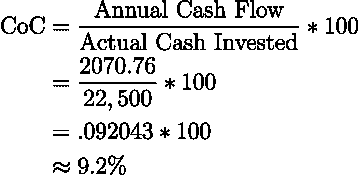
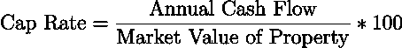
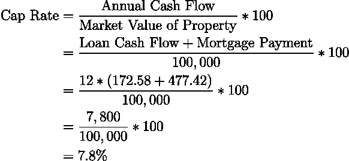
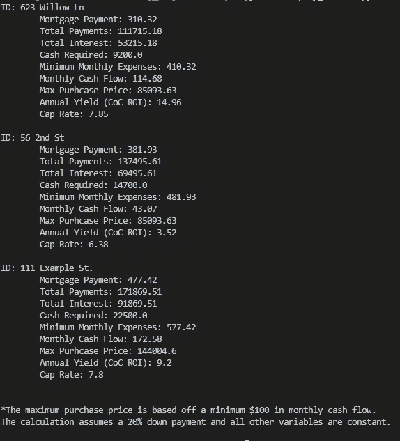

# 使用 Python 分析房地产投资

> 原文：<https://levelup.gitconnected.com/using-python-to-analyze-real-estate-investments-a2ec2a5c2be2>

> 房地产是不朽的资产，不断增值。这是人类智慧设计出的最坚固的安全措施。它是所有安全的基础，也是唯一坚不可摧的安全。
> 
> —罗素·塞奇

在 [Unsplash](https://unsplash.com?utm_source=medium&utm_medium=referral) 上由 [Sieuwert Otterloo](https://unsplash.com/@sieuwert?utm_source=medium&utm_medium=referral) 拍摄的照片

购买和持有房地产投资可以非常令人满意，而且往往非常有利可图。在他的书《华尔街上的 T4》(One Up on Wall Street)中，即使是传奇的选股人彼得·林奇也建议在选择股票市场上的个股之前先买一套房子，因为它具有投资潜力(尽管他的一些信息听起来有点讽刺)。与股票和债券不同，购买房地产允许您使用大量的杠杆，大多数投资需要 20-25%的首付(这是完成交易所需的大部分现金，小部分是成交成本)。使用 20%的首付可以让你购买价值是实际花费 5 倍的资产，因此房屋价值增加 2%会使你投资的现金获得 10%的回报(在理想情况下)。此外，与股票和债券的杠杆作用不同，如果你的房地产价格因市场条件而波动，你的抵押贷款服务商不会打电话给你，要求更多的现金。我不是说要避开股票和债券，因为我自己也是一个狂热的投资者，但我认为房地产投资肯定值得一看。

房地产投资成功的一个关键(与任何类型的投资一样)是学会如何从一个坏交易中决定一个好交易。对于房地产来说，房产的状况、位置和其他质量因素在很大程度上影响着房产的潜在收入。为了准确地确定这些因素，通常需要特定市场的知识和经验。然而，一些方面是在新手和有经验的房地产投资者的控制下，同样涉及到数字。使用计算器可以很容易地确定定量因素，如确定为一项财产支付的最高金额、潜在的现金流和投资的现金回报。在本文中，Python 将用于分析房地产交易，以帮助从糟糕的交易中剔除好的交易。

# 房地产回报指标

**现金对现金退货**

确定一处房产是否值得投资的两个常用指标是现金对现金(CoC)回报率和资本化率。CoC 回报率是一个回报率，它将从物业中赚取的现金(扣除费用后)与投资的现金总额进行比较。通常，投资的现金是首付款和成交成本的总和；从本质上讲，这是完成交易所需的所有预付现金，如果需要额外的资金来使房产“准备出租”，这些也应该包括在内。CoC 返回的公式如下

CoC 回报是假设每年不需要额外现金的情况下，拥有该物业的年收益。

例如，假设以 100，000 美元的 30 年期 4%利率抵押贷款购买了一处房产，首付为 20%(相当于 20，000 美元)，支付了 2，500 美元的成交成本。我们还假设空置率为 10%，维护费(占租金的百分比)为 5%，你支付给物业管理团队的费用为 10%，每年的税费和保险费为 1200 美元(合计)，你每月可以产生 1000 美元的租金收入。在这种情况下，一个月的典型开支是

房产的现金流就是租金收入减去任何费用，即

因此，在此示例中，属性将生成

每月的现金流。乘以 12 得到年现金流为 2，070.96 美元。由于购买该房产需要 22，500 美元(成交成本加上首付款)，因此 CoC 回报计算为

**资本化率**

分析房地产回报时使用的第二个流行指标是资本化率(或上限率)。上限利率代表的是假设房产是用现金而不是贷款购买的情况下，房产一年的收益率。或者，另一种思考方式是，它是财产的回报，一旦还清。因此，上限利率使用与上述相同的现金流公式，但加入了按揭付款，并将该数字除以房产的市场价值，即

对于上述示例，上限费率为

**使用 Python 脚本的好处**

如此处所示，当您必须手工计算时，这些计算可能会变得很繁琐(尤其是在您评估多个交易的情况下)。幸运的是，有许多在线计算器可以帮你做到这一点。然而，这些计算器的一个主要缺点是，你需要手动输入每个潜在的房地产交易，执行计算，并试图将结果保存在某个地方，以便与其他交易进行比较。

在下面的 Python 脚本中，使用 CSV 文件作为输入来完成此过程，该文件包含要评估的属性的所有详细信息。保存结果，并提供第二个 Python 脚本，以可读性更好的格式显示结果。如果使用 API 来收集可用于生成该输入 CSV 文件的房地产数据，则该实现特别有用。当分析这些定量因素时，这将消除许多手工工作。此外，Python 脚本的输出还包括其他重要数据，如完成交易所需的现金、抵押贷款支付额、每月最低支出和最高购买价格(基于每月现金流至少为 100 美元)。

# 用 Python 分析房地产收益

**分析公式**

首先，上面的公式需要转换成 Python 代码，幸运的是，由于这些是相对简单的公式，使用下面的函数很容易做到这一点。

**获取数据**

有了这些函数，我们现在需要一种方法来获取 Python 逻辑的数据。在这个特定的实现中，我提供了两种不同的方法来完成这个任务:提示用户输入和通过上面提到的 CSV 文件。CSV 文件处理是用 [*熊猫*](https://pandas.pydata.org/) Python 库处理的。为了提示输入数据，使用了以下函数

系统会提示用户输入执行分析所需的所有数据。然后以 pandas 数据帧的形式返回，这样在 CSV 和脚本的提示运行之间就不需要特殊的处理。需要注意的一点是，上面显示的字典键(*数据*字典对象)是程序读取 CSV 文件所需的头(它们可以是任何顺序)。

**参数**

该脚本有两个可选参数，用于确定是使用 CSV 文件进行输入，还是提示输入数据和输出文件名。这些参数是

下面提供了脚本运行的两个示例。

CSV 文件需要有以下标题:“ID”、“购买价格”、“租金收入”、“结算成本”、“贷款金额”、“利率”、“空置率”、“贷款期限”、“维护费用”、“物业管理费”、“年度财产税”和“年度财产保险”。例如，下面的 CSV 文件用于本文中的示例运行

通过选择上面要点右下角的“查看原始数据”,可以保存该文件，并将其用作执行 Python 脚本的模板。

**分析**

在通过 CSV 或命令提示符将数据提供给脚本之后，通过计算上述公式以及一些其他有用的数据来创建结果

这些计算是非常基本的，并且通过代码中的注释进行了解释，所以我将在这里排除一个解释，以防止帖子变得太长。

使用上面显示的示例 CSV 文件运行此分析将生成下面的*结果. csv* 文件

由于这在表格格式中有点难以阅读，下面的脚本是为了更容易看到结果而创建的。

如果在分析中使用自定义输出文件名，也需要通过*文件名*参数提供该文件名:

对上表中的结果运行这个显示脚本会产生以下输出

此外，由于分析产生的结果最初是 CSV 格式的，因此可以用流行的编程语言(如 Python)或电子表格软件(如 Microsoft Excel 或 OpenOffice Calc)对其进行进一步分析，以帮助筛选出不具备投资者所期望的潜力的投资。

需要注意的一点是，这种分析可以针对同一属性反复运行。相同的属性可能在输入 CSV 文件中多次列出，但利率、首期付款、维护费等参数略有不同。这将允许投资者在不同的假设下分析投资资产的潜力。

# 结论

在这篇文章中，提供了两个分析房地产投资的流行指标。如上所述，计算这些指标很快会变成一项单调乏味的任务。使用 Python，这项单调乏味的任务被转化为简单地为潜在的房地产投资聚集数据，并运行一些脚本来生成结果。该功能有可能为房地产投资者每年节省大量的投资分析时间。

为了使这种分析更加方便，可以使用房地产 API 以编程方式收集您所投资地区的待售房地产数据。这些数据可用于生成用于分析的输入 CSV 文件，这或多或少会使投资流程的这一部分完全自动化。该项目的完整代码如下。

# 完整代码

**analysis.py**

**display_results.py**