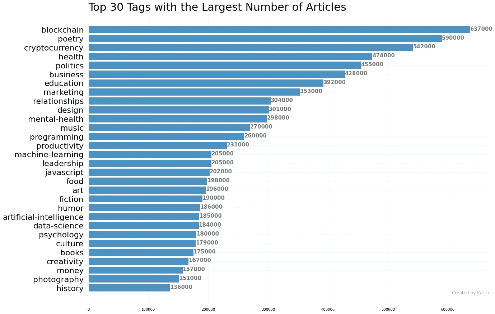
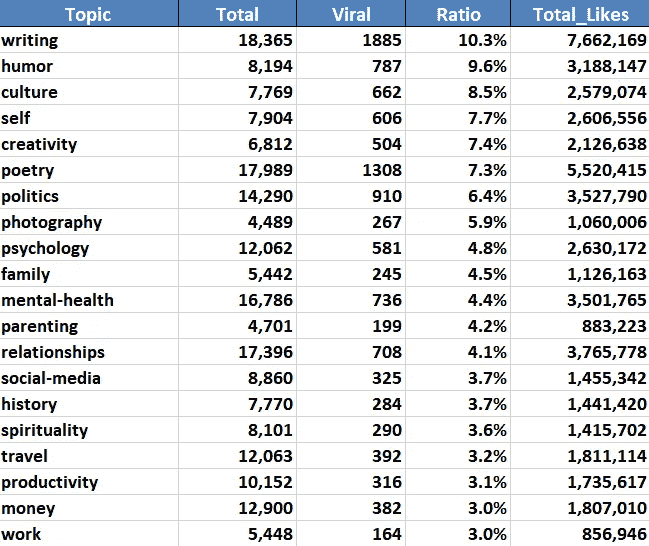
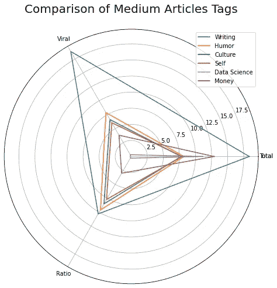

# 使用 Python 确定哪些媒体主题获得 1000+赞

> 原文：<https://levelup.gitconnected.com/using-python-to-determine-which-medium-topics-are-likely-to-get-1000-likes-1580626e3802>

大数据揭示了最受欢迎的媒体标签/主题

感觉被媒体上大量的主题和可能性淹没了吗？

作为一个品牌故事平台，Medium 使用**标签**来策划和推广文章。使用相关标签将有助于将你的文章展示给更广泛的受众，在那里你的文章可能会得到成百上千的额外关注。

然而，搜索流行标签可能具有挑战性，因为 Medium 尚未发布任何官方统计数据来说明哪些标签更有可能获得关注。这就是分析派上用场的地方！使用从网络废弃中提取的数据，这篇文章将为你提供关于媒体主题/标签的见解。

## 发表文章数量最多的顶级媒体标签

没有简单的方法来提取介质上标签的元数据。如果手动操作，您需要输入每个标签的 URL，例如[https://medium.com/tag/art](https://medium.com/tag/art)，然后收集故事和作者的数量，在本例中，标签`***Art***`分别为 196K 和 74K。

作者创建的图像

利用 Python 包*{*[*beautiful soup*](https://www.crummy.com/software/BeautifulSoup/bs4/doc/)*}*和*{*[*Selenium*](https://selenium-python.readthedocs.io/)*}*，我能够以编程方式扫描数百个标签，并提取与每个标签相关联的故事和作者的数量，

这里显示了我们的前 30 个标签，按照文章数量从大到小排序，

作者创建的图像

截至 2022 年 10 月，当我的分析完成时，标签`***Blockchain***` 以 63.7 万篇文章的总量高居榜首，其次是`***Poetry***` ，59 万篇。像`***Cryptocurrency***`、`***Machine Learning***`、`***Artificial Intelligence***`这样的流行语也在热门标签之列。

如果你想知道前 70 个标签的完整列表，以及它们的故事和作者数量，请随意在这里查看。

******🎥加入我们的 YouTube 数据科学社区*** [***【数据与 Kat 对话】***](https://www.youtube.com/channel/UCbGx9Om38Ywlqi0x8RljNdw) ***😄***

**具有最高“病毒式传播”率的最受欢迎标签**

现在，你可能想知道——嗯，这些是拥有最多文章的顶级标签，但是这些数据没有提供关于这些文章的**受欢迎程度的信息。例如，即使超过 60 万篇文章被标记为`***Blockchain***` ，如果这些文章的浏览量或点赞数为零或最低，那么`***Blockchain***`仍然没有资格获得**热门**标签！**

因此，我们接下来的探索应该集中在 ***每个标签下有多少浏览量和点赞文章获得*** 。出于分析的目的，让我们将**“病毒式文章”**定义为获得 **1000+赞**的文章，并让我们看看哪些标签更有可能拥有已被病毒式传播的文章！

图片来源: [Pixabay](https://www.pexels.com/photo/advertising-alphabet-business-communication-270637/)

为了提取最近的数据，我废弃了 2022 年 6 月、7 月和 8 月发表的所有文章(在每个标签下)。一个考虑是，截至 2022 年 10 月，在这 3 个月内发表的文章将有足够的时间获得牵引力，并获得可靠的浏览量/点赞量数据。

总结所有文章，我们有下表，其中

*   **Total** 表示文章总数
*   **病毒式的**指的是迅速传播的文章数量(超过 1000 个赞)
*   **比率**表示病毒文章的比率=病毒/总数
*   **总点赞数**给出了所有文章的总点赞数

前 20 个最受欢迎的媒体标签

我们可以看到，标签`***Writing***`*`***Humor***`*`***Culture***` 的“病毒率”最高，分别为 10.3%、9.6%、8.5%！**

**还要注意的是，*文章总数*和*病毒率*之间没有必然的关联。例如，在这个图表中，`***Data Science***`(紫色三角形)和`***Money***` (棕色三角形)都有大量的文章，但它们的病毒比率却明显较低。**

****

**雷达图**

**同样，如果你感兴趣，可以在这里找到最流行标签的完整列表。**

## **外卖食品**

**收集关于流行标签的知识并不能保证在媒体上取得成功。你仍然需要花费时间和精力来坚持写作。然而，使用这些标签可能会增加你的文章被广泛阅读的可能性。**

****最后一个注意事项**:**

*   **我在本文中放弃的中型标签/主题的列表绝不是详尽的。我会在以后的工作中不断补充。**
*   **本博客中呈现的所有数字和统计数据都是截至 2022 年 10 月的数据。这些数字会随着时间而变化。我可以定期发布最新数据的博客，如果你对评论区感兴趣，请告诉我。😊**

*****想要更多数据科学和编程技巧？使用*** [***我的链接***](https://yilistats.medium.com/membership) ***注册 Medium，获得我所有内容的全部访问权限。*****

****其他你可能也会感兴趣的博客，****

** [## 每个数据科学家都应该知道的 6 个 SQL 技巧

### 提高分析效率的 SQL 技巧

towardsdatascience.com](https://towardsdatascience.com/6-sql-tricks-every-data-scientist-should-know-f84be499aea5)  [## 使用 5 个鲜为人知的 Python 库解决复杂的 NLP 任务

### 一口大小的 Python 代码块

towardsdatascience.com](https://towardsdatascience.com/solving-complex-nlp-tasks-with-5-simple-python-snippets-libraries-7d4dfab131e8)  [## 两全其美:来自 Python 的自动化和动态 SQL 查询

### 通过 SQL 和 Python 集成将自动化带到新的高度

towardsdatascience.com](https://towardsdatascience.com/best-of-both-worlds-automated-and-dynamic-sql-queries-from-python-5b74a24501b0)**