# 在 Power BI 桌面上使用 R 编程

> 原文：<https://levelup.gitconnected.com/using-r-programming-on-power-bi-desktop-9db9492d7aad>

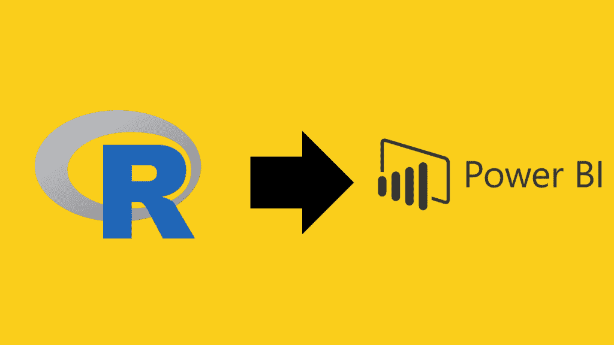

Power BI 和 R 是数据领域的两大巨头，但使用案例不同。

Power BI 用于商业智能领域来构建报告和交互式仪表盘，而 R 是一种用于统计分析和数据科学的编程语言。

在这篇文章中，我将向您展示如何通过在 Power BI 中运行 R 脚本来两全其美。

在继续之前，请确保您的 PC 上安装了 [Power BI Desktop](https://powerbi.microsoft.com/en-au/desktop/) 和 [R](https://www.r-project.org/) 。

**导入数据**

首先，您需要启动并运行 Power BI Desktop，并确保以管理员身份运行 Power BI。

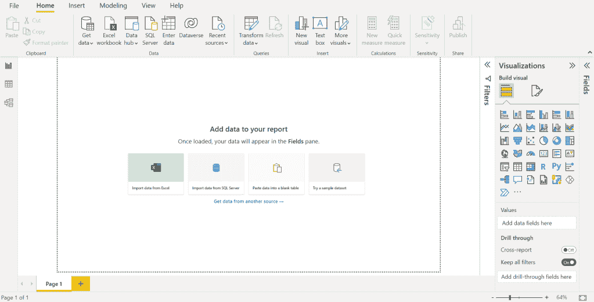

您将会看到一个如上图所示的屏幕。

我将使用摩托车销售数据进行演示，您可以在这里下载。

或者您可以随意导入自己的数据集。

点击**从另一来源获取数据- >文本/CSV - >连接。**

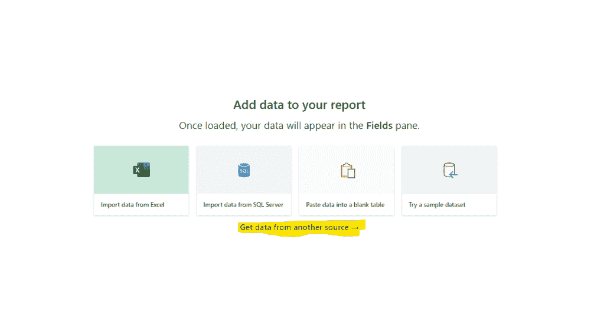

你应该有这样的东西

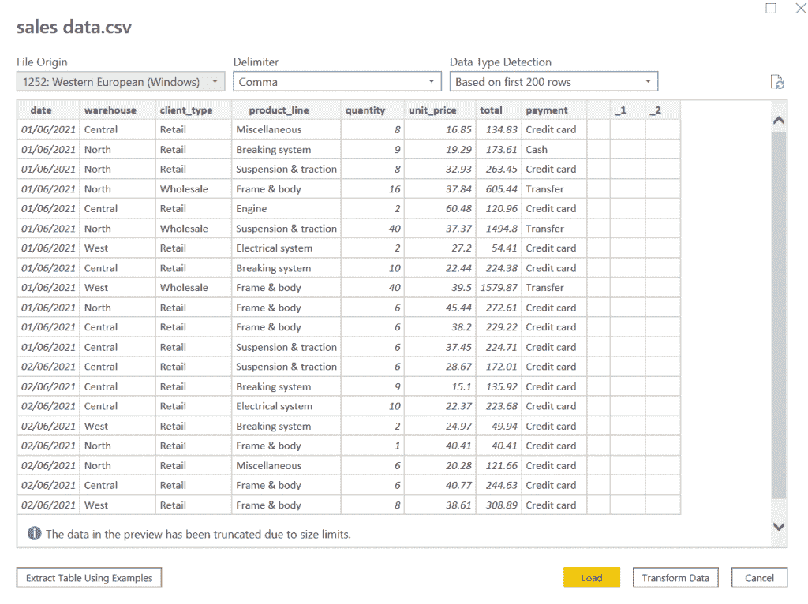

让我们通过点击**转换数据**来转换数据。

这将打开**电源查询编辑器**。

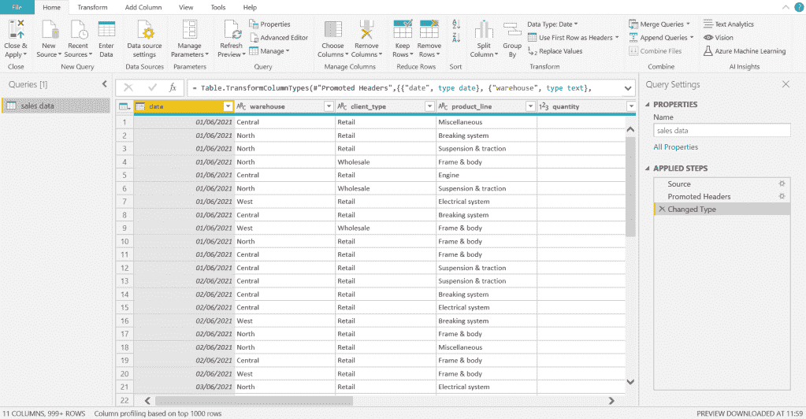

这就是 Power BI 清理杂乱数据的地方，就像你在晨练后洗澡一样，以避免整个办公室变得臭气熏天，就像刚从与僵尸的战争中回来一样。

**在超级查询编辑器中运行 R 脚本**

在这个窗口中，你有两个选择，要么像妈妈的孩子一样清理你的数据，要么像真正的男人那样做。

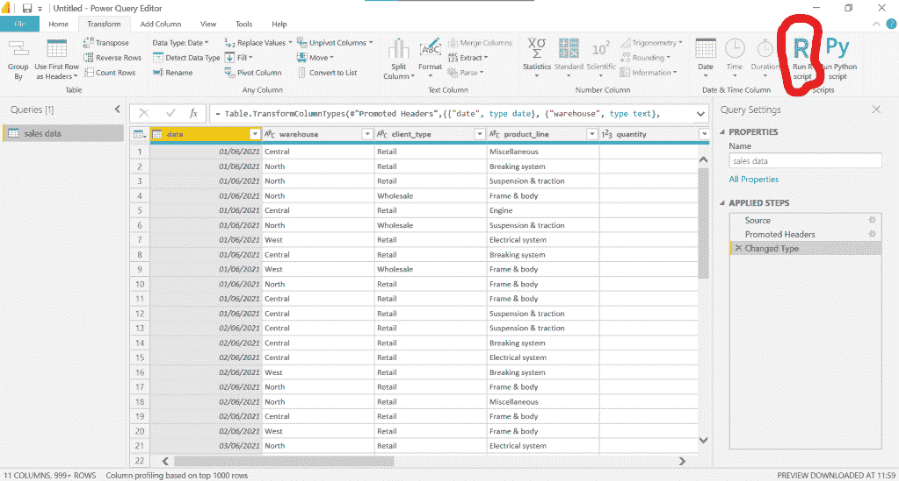

我将选择后者，转到功能区上的转换选项卡，单击选项**运行 R 脚本**

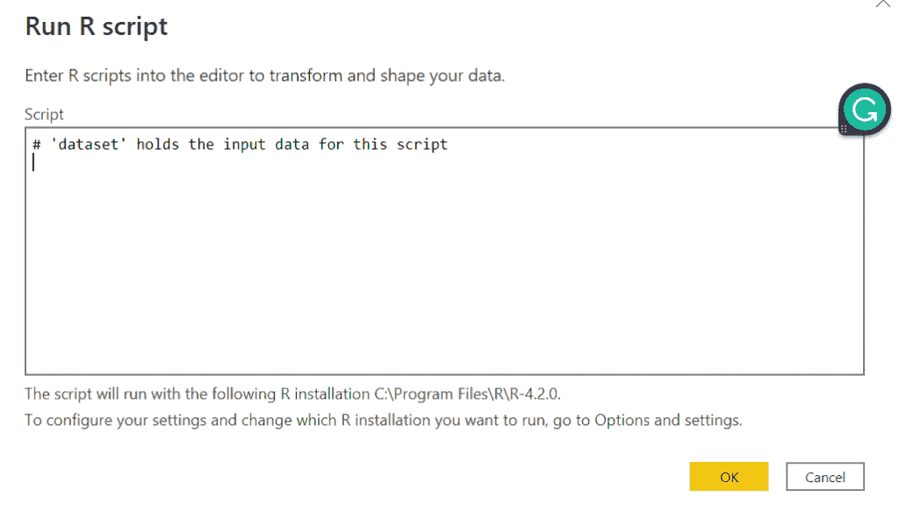

点击后，你将会看到一个写 R 脚本的空间

我将运行下面的 R 脚本，它导入数据集并只过滤零售客户。

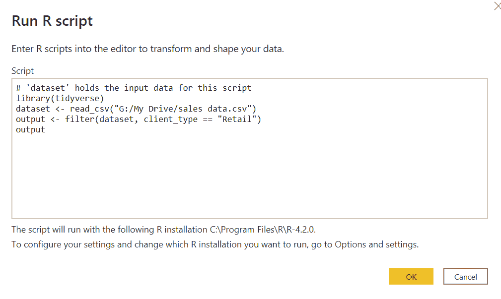

***这里的要点是:***

点击“确定”后，您将得到信息，说明*您的数据隐私*需要您的信息。

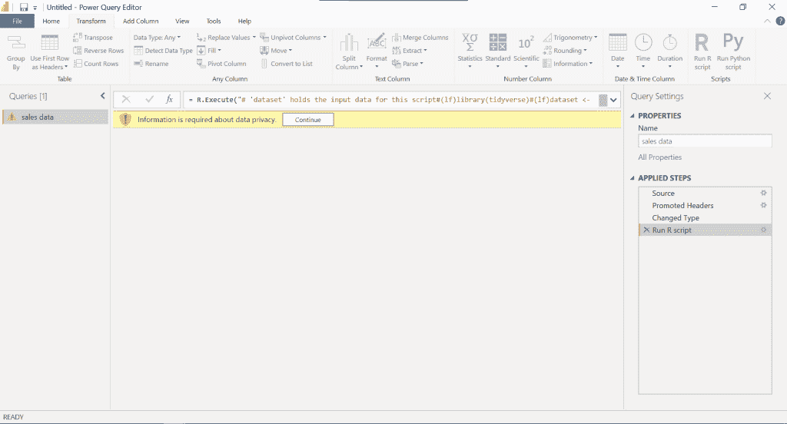

单击继续，选中忽略隐私级别，然后保存。

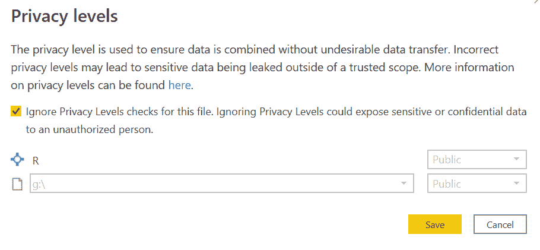

作者图片

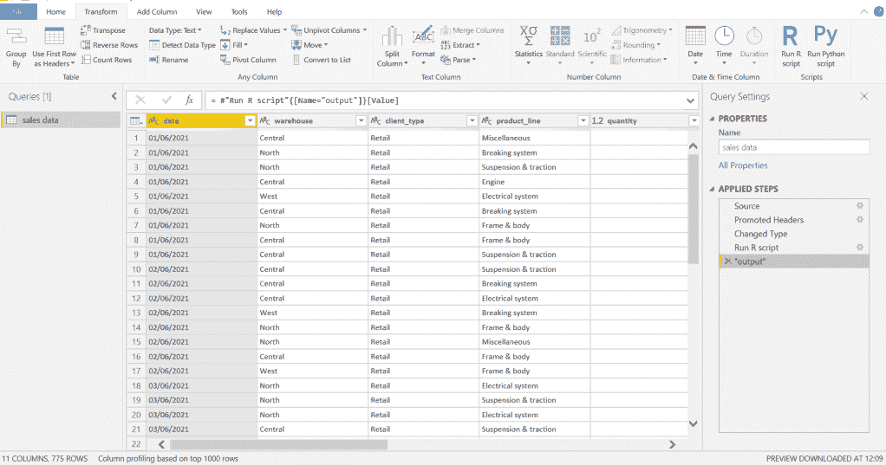

作者图片

关闭并应用此转换，以便在 Power BI 中可视化数据

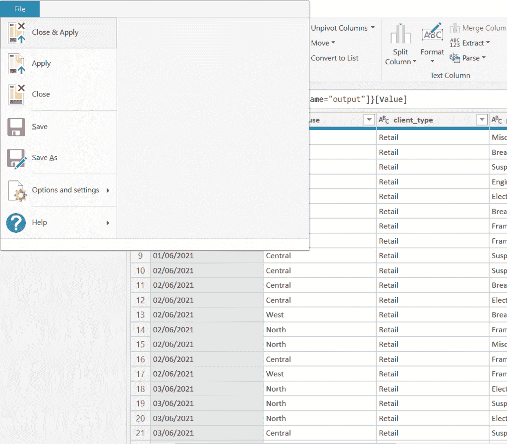

作者图片

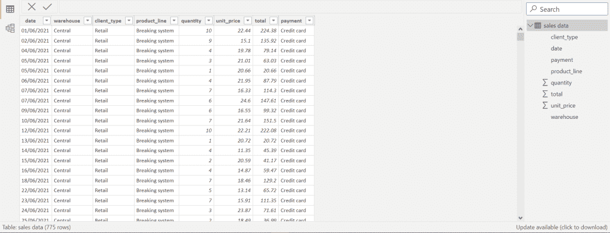

作者图片

**运行 R 脚本进行数据可视化**

要使用 R 脚本创建可视化，请在可视化窗格上单击 R 脚本可视化。


将要求您将可视化中需要的字段拖到值区域

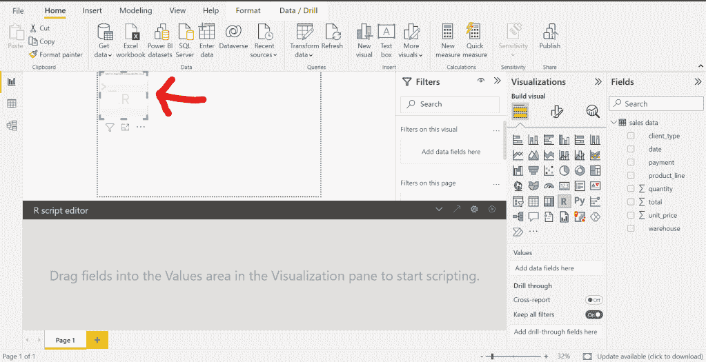

我想看看每个仓库的总产量。我将拖动*仓库*和*总计*列。

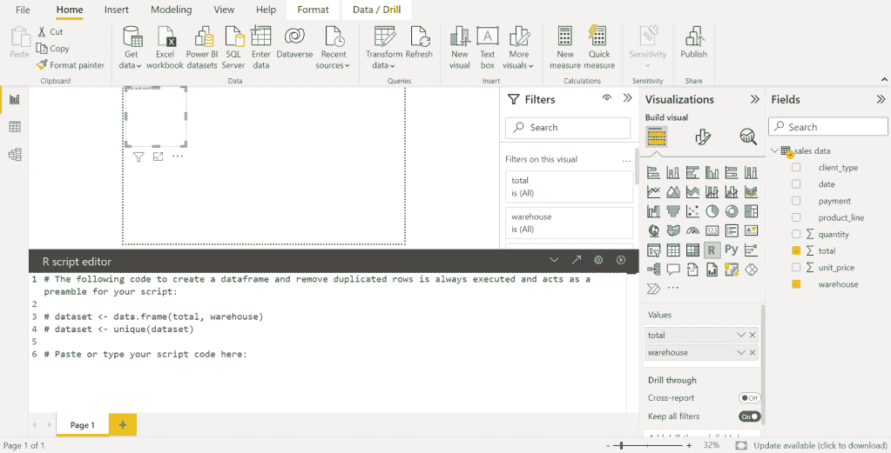

Power BI 已经将您的数据创建为数据集，您只需提供将您的数据可视化的脚本。

运行下面的脚本，

```
library(tidyverse) 
dataset %>% 
   group_by(warehouse) %>% 
   summarize(total = sum(total)) %>% 
   ggplot(aes(x = warehouse, y = total, fill = warehouse)) + 
   geom_col()
```

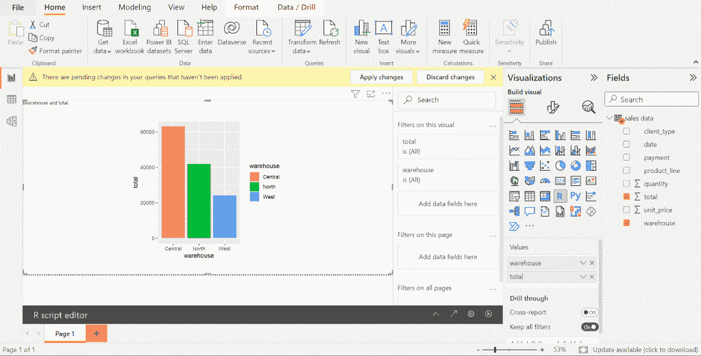

您可以在不运行任何 DAX 查询的情况下创建更多可视化效果和报表。

**结论**

有时您可能想要创建复杂的可视化，这在 r 上更容易做到。

这种集成为您提供了构建这种可视化的空间。

感谢阅读，希望你能发现这篇文章的深刻见解。

*原载于 2022 年 10 月 8 日 http://rblogopedia.wordpress.com**[*。*](https://rblogopedia.wordpress.com/2022/10/08/using-r-programming-on-power-bi-desktop/)*

# *分级编码*

*感谢您成为我们社区的一员！在你离开之前:*

*   *👏为故事鼓掌，跟着作者走👉*
*   *📰查看[升级编码出版物](https://levelup.gitconnected.com/?utm_source=pub&utm_medium=post)中的更多内容*
*   *🔔关注我们:[Twitter](https://twitter.com/gitconnected)|[LinkedIn](https://www.linkedin.com/company/gitconnected)|[时事通讯](https://newsletter.levelup.dev)*

*🚀👉 [**加入升级人才集体，找到一份惊艳的工作**](https://jobs.levelup.dev/talent/welcome?referral=true)*